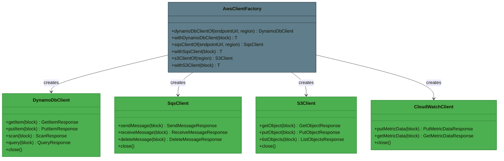
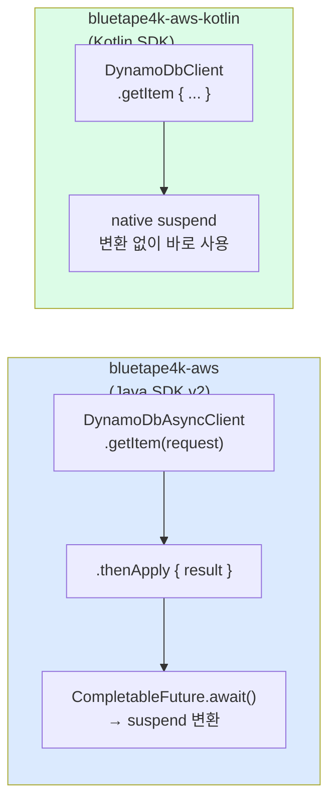
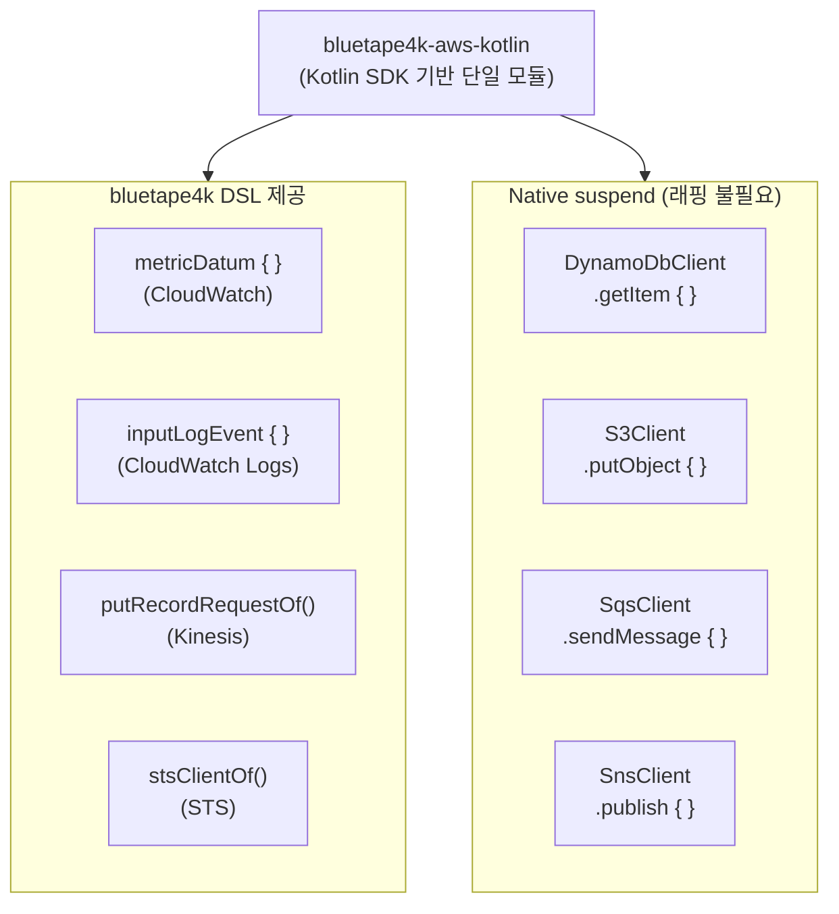

# Module bluetape4k-aws-kotlin

AWS Kotlin SDK 기반 단일 통합 모듈입니다. native `suspend` 함수를 기본 제공하여 `.await()` 변환 없이 Coroutines 환경에서 바로 사용할 수 있습니다.

> AWS Java SDK v2 기반 모듈은 `bluetape4k-aws`를 사용하세요.

## 제공 서비스

| 서비스 | 주요 기능 |
|--------|----------|
| **DynamoDB** | 테이블 CRUD, 스캔/쿼리, DSL 빌더 |
| **S3** | 객체 업로드/다운로드, 멀티파트, 버킷 관리 |
| **SES / SESv2** | 이메일 발송, 템플릿 메일 |
| **SNS** | 토픽 발행, SMS, 구독 관리 |
| **SQS** | 메시지 발송/수신/삭제, FIFO 큐 |
| **KMS** | 암호화 키 관리, 데이터 키 생성 |
| **CloudWatch** | 메트릭 발행/조회, DSL(`metricDatum {}`) |
| **CloudWatch Logs** | 로그 이벤트 전송, DSL(`inputLogEvent {}`) |
| **Kinesis** | 스트림 레코드 전송, DSL(`putRecordRequestOf {}`) |
| **STS** | AssumeRole, CallerIdentity, DSL(`stsClientOf {}`) |

## Java SDK v2 vs Kotlin SDK 비교

| 항목 | `bluetape4k-aws` (Java SDK) | `bluetape4k-aws-kotlin` (Kotlin SDK) |
|------|----------------------------|--------------------------------------|
| Coroutines | `.await()` 변환 필요 | native `suspend` 기본 제공 |
| DSL 지원 | 제한적 | 풍부한 DSL 빌더 |
| 성능 | CRT/Netty NIO 선택 | CRT / OkHttp 선택 |

## 설치

AWS Kotlin SDK 서비스는 `compileOnly`로 선언되어 있으므로, 사용할 서비스 SDK를 런타임 의존성으로 추가해야 합니다.

```kotlin
dependencies {
    implementation("io.github.bluetape4k:bluetape4k-aws-kotlin:${bluetape4kVersion}")

    // 사용할 서비스만 선택적으로 추가
    implementation("aws.sdk.kotlin:dynamodb:${awsKotlinSdkVersion}")
    implementation("aws.sdk.kotlin:s3:${awsKotlinSdkVersion}")
    implementation("aws.sdk.kotlin:sqs:${awsKotlinSdkVersion}")
    // ... 필요한 서비스 추가
}
```

## 클라이언트 생성 패턴

각 서비스는 두 가지 팩토리 함수를 제공합니다.

### `xxxClientOf` — 클라이언트 직접 생성

장기 보유(long-lived) 클라이언트가 필요할 때 사용합니다. **반드시 `close()`를 호출**해야 합니다.

```kotlin
val client = sqsClientOf(
    endpointUrl = Url.parse("http://localhost:4566"),
    region = "us-east-1",
    credentialsProvider = credentialsProvider
)

try {
    client.sendMessage(queueUrl, "Hello!")
} finally {
    client.close()   // 또는 useSafe { } 활용
}
```

### `withXxxClient` — 단발성 사용 (권장)

내부적으로 `useSafe { }` 를 사용하여 코루틴 취소·예외 상황에서도 리소스를 안전하게 해제합니다.

```kotlin
withSqsClient(endpointUrl, region, credentialsProvider) { client ->
    client.sendMessage(queueUrl, "Hello!")
}   // close() 자동 호출
```

> **[!NOTE]**
> AWS Kotlin SDK 클라이언트는 내부 HTTP 커넥션 풀·스레드를 보유하므로, 사용 후 반드시 `close()`를 호출해야 합니다.
> `withXxxClient { }` 블록을 사용하면 코루틴 취소·예외 상황에서도 자동으로 리소스가 해제됩니다.
> 장기 보유 클라이언트를 직접 생성한 경우에는 애플리케이션 종료 시점에 `close()`를 명시적으로 호출하세요.

## 사용 예시

### DynamoDB (native suspend)

```kotlin
import aws.sdk.kotlin.services.dynamodb.DynamoDbClient
import io.bluetape4k.aws.kotlin.dynamodb.*

// 단발성: withDynamoDbClient 사용 (close 자동)
suspend fun getItem(tableName: String, key: Map<String, AttributeValue>) =
    withDynamoDbClient(region = "ap-northeast-2") { client ->
        client.getItem {
            this.tableName = tableName
            this.key = key
        }
    }
```

### CloudWatch 메트릭 (DSL)

```kotlin
import io.bluetape4k.aws.kotlin.cloudwatch.*
import aws.sdk.kotlin.services.cloudwatch.CloudWatchClient

val cw = CloudWatchClient { region = "ap-northeast-2" }

suspend fun publishMetric(namespace: String, value: Double) {
    cw.putMetricData {
        this.namespace = namespace
        metricData = listOf(
            metricDatum {           // bluetape4k DSL
                metricName = "RequestCount"
                this.value = value
                unit = StandardUnit.Count
            }
        )
    }
}
```

### CloudWatch Logs (DSL)

```kotlin
import io.bluetape4k.aws.kotlin.cloudwatchlogs.*

suspend fun sendLog(client: CloudWatchLogsClient, logGroup: String, logStream: String, message: String) {
    client.putLogEvents {
        logGroupName = logGroup
        logStreamName = logStream
        logEvents = listOf(
            inputLogEvent {         // bluetape4k DSL
                timestamp = System.currentTimeMillis()
                this.message = message
            }
        )
    }
}
```

### STS (DSL)

```kotlin
import io.bluetape4k.aws.kotlin.sts.*

// bluetape4k DSL로 StsClient 생성
val stsClient = stsClientOf(region = "ap-northeast-2")

suspend fun getCallerIdentity() = stsClient.getCallerIdentity {}
```

### Kinesis (DSL)

```kotlin
import io.bluetape4k.aws.kotlin.kinesis.*

suspend fun putRecord(client: KinesisClient, streamName: String, data: ByteArray) {
    client.putRecord(
        putRecordRequestOf(streamName, data, partitionKey = "default")
    )
}
```

## 클라이언트 패턴 클래스 다이어그램



## Java SDK v2 vs Kotlin SDK 비교 다이어그램



## DSL 지원 서비스



## 테스트 환경

LocalStack을 사용한 통합 테스트를 지원합니다:

```kotlin
@Testcontainers
class SqsTest {
    companion object {
        @Container
        val localstack = LocalStackContainer(DockerImageName.parse("localstack/localstack"))
            .withServices(LocalStackContainer.Service.SQS)
    }
}
```
