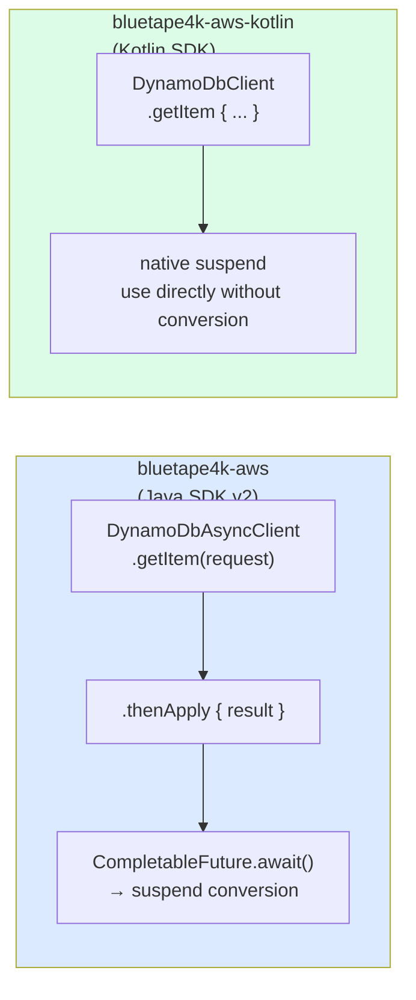
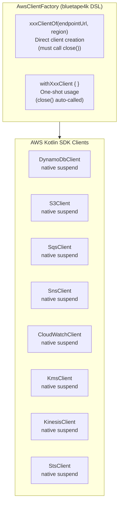
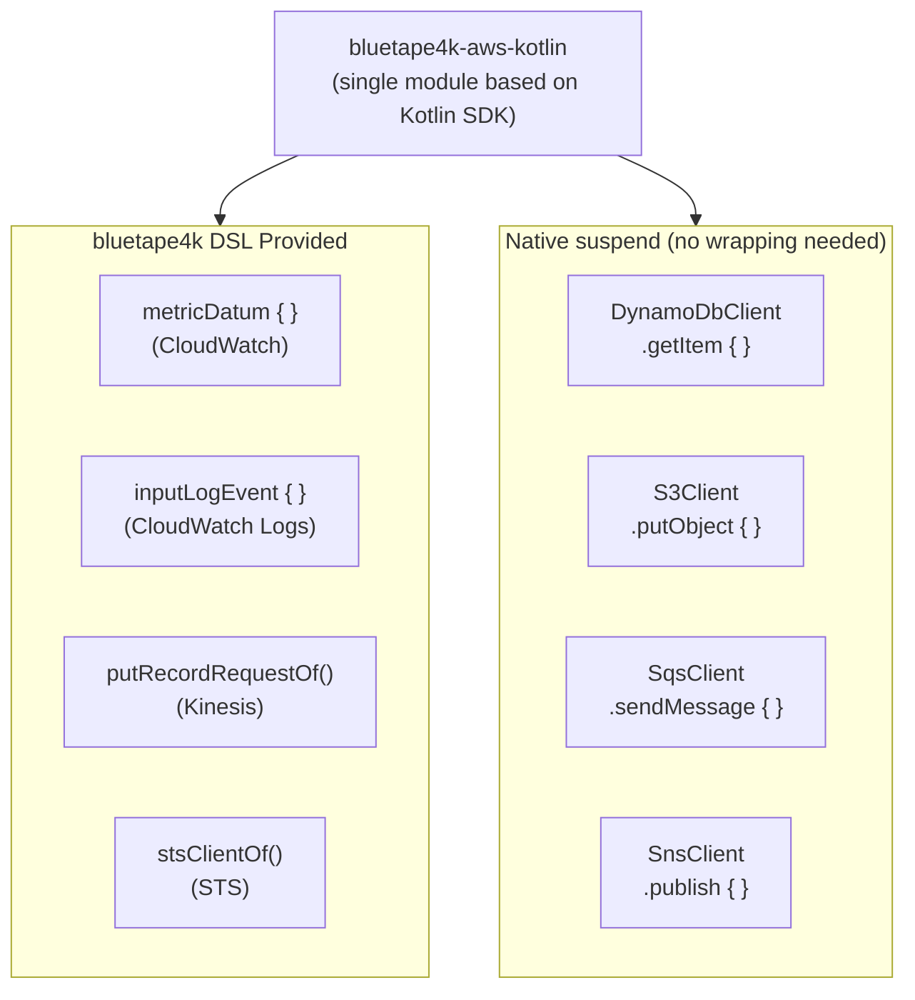
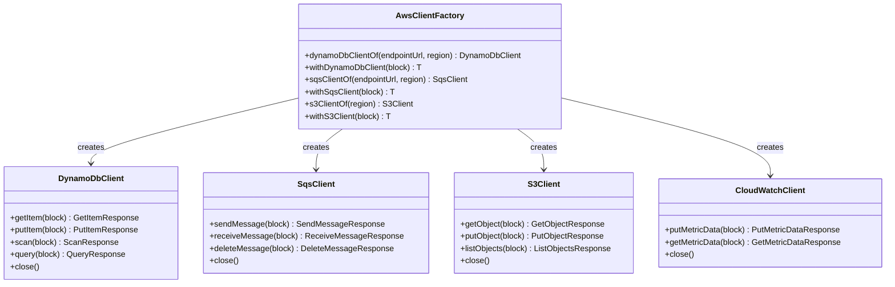

# Module bluetape4k-aws-kotlin

English | [한국어](./README.ko.md)

A unified integration module built on the AWS Kotlin SDK. Provides native `suspend` functions out of the box, so you can use it directly in coroutine environments without any `.await()` conversion.

> For the AWS Java SDK v2 based module, use `bluetape4k-aws`.

## Architecture

### Java SDK v2 vs Kotlin SDK Comparison



### Client Creation Pattern



### DSL-Supported Services



### Client Pattern Class Diagram



## Supported Services

| Service | Key Features |
|---------|-------------|
| **DynamoDB** | Table CRUD, scan/query, DSL builders |
| **S3** | Object upload/download, multipart, bucket management |
| **SES / SESv2** | Email sending, templated email |
| **SNS** | Topic publishing, SMS, subscription management |
| **SQS** | Message send/receive/delete, FIFO queues |
| **KMS** | Encryption key management, data key generation |
| **CloudWatch** | Metric publishing/querying, DSL (`metricDatum {}`) |
| **CloudWatch Logs** | Log event publishing, DSL (`inputLogEvent {}`) |
| **Kinesis** | Stream record publishing, DSL (`putRecordRequestOf {}`) |
| **STS** | AssumeRole, CallerIdentity, DSL (`stsClientOf {}`) |

## Java SDK v2 vs Kotlin SDK Comparison

| Aspect | `bluetape4k-aws` (Java SDK) | `bluetape4k-aws-kotlin` (Kotlin SDK) |
|--------|-----------------------------|--------------------------------------|
| Coroutines | requires `.await()` conversion | native `suspend` built in |
| DSL support | limited | rich DSL builders |
| Performance | CRT/Netty NIO choice | CRT / OkHttp choice |

## Client Creation Patterns

Each service provides two factory functions.

### `xxxClientOf` — Direct Client Creation

Use this for long-lived clients. **You must call `close()`** when done.

```kotlin
val client = sqsClientOf(
    endpointUrl = Url.parse("http://localhost:4566"),
    region = "us-east-1",
    credentialsProvider = credentialsProvider
)

try {
    client.sendMessage(queueUrl, "Hello!")
} finally {
    client.close()   // or use useSafe { }
}
```

### `withXxxClient` — One-Shot Usage (Recommended)

Uses `useSafe { }` internally to release resources safely even on coroutine cancellation or exceptions.

```kotlin
withSqsClient(endpointUrl, region, credentialsProvider) { client ->
    client.sendMessage(queueUrl, "Hello!")
}   // close() called automatically
```

> **[!NOTE]**
> AWS Kotlin SDK clients hold internal HTTP connection pools and threads, so `close()` must always be called after use.
> The `withXxxClient { }` block ensures resources are released automatically even on coroutine cancellation or exceptions.
> If you create a long-lived client directly, call `close()` explicitly when the application shuts down.

## Usage Examples

### DynamoDB (native suspend)

```kotlin
import aws.sdk.kotlin.services.dynamodb.DynamoDbClient
import io.bluetape4k.aws.kotlin.dynamodb.*

// One-shot: use withDynamoDbClient (auto-close)
suspend fun getItem(tableName: String, key: Map<String, AttributeValue>) =
    withDynamoDbClient(region = "ap-northeast-2") { client ->
        client.getItem {
            this.tableName = tableName
            this.key = key
        }
    }
```

### CloudWatch Metrics (DSL)

```kotlin
import io.bluetape4k.aws.kotlin.cloudwatch.*
import aws.sdk.kotlin.services.cloudwatch.CloudWatchClient

val cw = CloudWatchClient { region = "ap-northeast-2" }

suspend fun publishMetric(namespace: String, value: Double) {
    cw.putMetricData {
        this.namespace = namespace
        metricData = listOf(
            metricDatum {           // bluetape4k DSL
                metricName = "RequestCount"
                this.value = value
                unit = StandardUnit.Count
            }
        )
    }
}
```

### CloudWatch Logs (DSL)

```kotlin
import io.bluetape4k.aws.kotlin.cloudwatchlogs.*

suspend fun sendLog(client: CloudWatchLogsClient, logGroup: String, logStream: String, message: String) {
    client.putLogEvents {
        logGroupName = logGroup
        logStreamName = logStream
        logEvents = listOf(
            inputLogEvent {         // bluetape4k DSL
                timestamp = System.currentTimeMillis()
                this.message = message
            }
        )
    }
}
```

### STS (DSL)

```kotlin
import io.bluetape4k.aws.kotlin.sts.*

// Create StsClient using bluetape4k DSL
val stsClient = stsClientOf(region = "ap-northeast-2")

suspend fun getCallerIdentity() = stsClient.getCallerIdentity {}
```

### Kinesis (DSL)

```kotlin
import io.bluetape4k.aws.kotlin.kinesis.*

suspend fun putRecord(client: KinesisClient, streamName: String, data: ByteArray) {
    client.putRecord(
        putRecordRequestOf(streamName, data, partitionKey = "default")
    )
}
```

## Test Environment

Integration testing with LocalStack is supported:

```kotlin
@Testcontainers
class SqsTest {
    companion object {
        @Container
        val localstack = LocalStackContainer(DockerImageName.parse("localstack/localstack"))
            .withServices(LocalStackContainer.Service.SQS)
    }
}
```

## Adding the Dependency

AWS Kotlin SDK services are declared as
`compileOnly` dependencies, so you need to add the runtime dependencies for the services you use.

```kotlin
dependencies {
    implementation("io.github.bluetape4k:bluetape4k-aws-kotlin:${bluetape4kVersion}")

    // Add only the services you need
    implementation("aws.sdk.kotlin:dynamodb:${awsKotlinSdkVersion}")
    implementation("aws.sdk.kotlin:s3:${awsKotlinSdkVersion}")
    implementation("aws.sdk.kotlin:sqs:${awsKotlinSdkVersion}")
    implementation("aws.sdk.kotlin:sns:${awsKotlinSdkVersion}")
    implementation("aws.sdk.kotlin:kms:${awsKotlinSdkVersion}")
    implementation("aws.sdk.kotlin:cloudwatch:${awsKotlinSdkVersion}")
    implementation("aws.sdk.kotlin:cloudwatchlogs:${awsKotlinSdkVersion}")
    implementation("aws.sdk.kotlin:kinesis:${awsKotlinSdkVersion}")
    implementation("aws.sdk.kotlin:sts:${awsKotlinSdkVersion}")
    // ... add other services as needed
}
```
