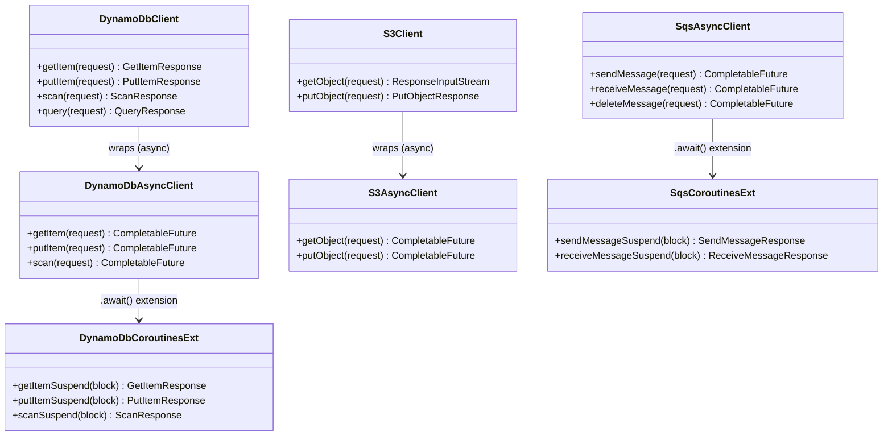
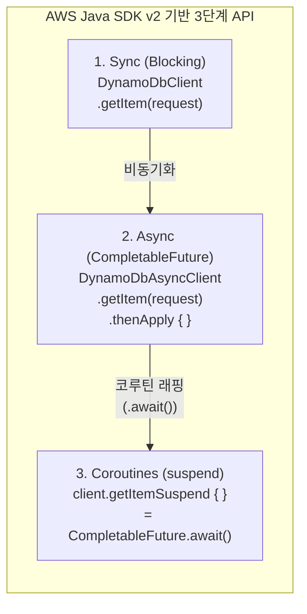
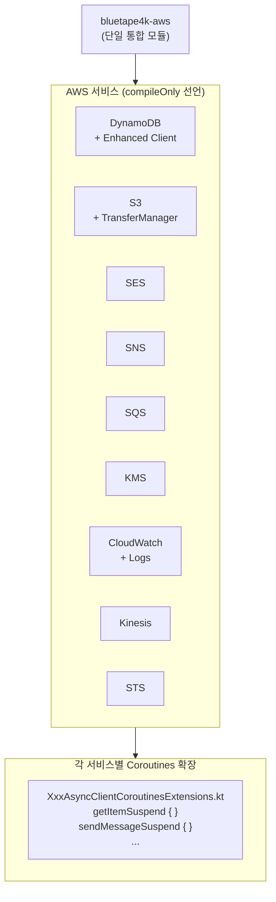

# Module bluetape4k-aws

[English](./README.md) | 한국어

AWS Java SDK v2 기반 단일 통합 모듈입니다. DynamoDB, S3, SES, SNS, SQS, KMS, CloudWatch, Kinesis, STS 등 주요 AWS 서비스를 Async/Non-Blocking 방식 및 Kotlin Coroutines로 사용할 수 있도록 지원합니다.

## 제공 서비스

| 서비스 | 주요 기능 |
|--------|----------|
| **DynamoDB** | 테이블 CRUD, Enhanced Client, Coroutines 확장 |
| **S3** | 객체 업로드/다운로드, TransferManager(대용량), Coroutines 확장 |
| **SES** | 이메일 발송, Coroutines 확장 |
| **SNS** | 토픽 발행, SMS, 푸시 알림, Coroutines 확장 |
| **SQS** | 메시지 발송/수신/삭제, Coroutines 확장 |
| **KMS** | 암호화 키 관리, 데이터 암호화/복호화, Coroutines 확장 |
| **CloudWatch** | 메트릭 발행/조회, Coroutines 확장 |
| **CloudWatch Logs** | 로그 그룹/스트림 관리, 이벤트 전송, Coroutines 확장 |
| **Kinesis** | 스트림 레코드 전송/조회, Coroutines 확장 |
| **STS** | AssumeRole, CallerIdentity, SessionToken, Coroutines 확장 |

## 3단계 API 패턴

각 서비스는 3단계 API를 제공합니다:

```
sync (blocking) → async (CompletableFuture) → coroutines (suspend)
```

## 설치

AWS SDK 서비스는 `compileOnly`로 선언되어 있으므로, 사용할 서비스 SDK를 런타임 의존성으로 추가해야 합니다.

```kotlin
dependencies {
    implementation("io.github.bluetape4k:bluetape4k-aws:${bluetape4kVersion}")

    // 사용할 서비스만 선택적으로 추가
    implementation(platform("software.amazon.awssdk:bom:${awsSdkVersion}"))
    implementation("software.amazon.awssdk:dynamodb-enhanced")
    implementation("software.amazon.awssdk:s3")
    implementation("software.amazon.awssdk:s3-transfer-manager")
    implementation("software.amazon.awssdk:sqs")
    // ... 필요한 서비스 추가
}
```

## 사용 예시

### DynamoDB (Coroutines)

```kotlin
import io.bluetape4k.aws.dynamodb.coroutines.*
import software.amazon.awssdk.services.dynamodb.DynamoDbAsyncClient

val client: DynamoDbAsyncClient = DynamoDbAsyncClient.create()

// suspend 함수로 DynamoDB 조회
suspend fun getItem(tableName: String, key: Map<String, AttributeValue>) =
    client.getItemSuspend {
        it.tableName(tableName).key(key)
    }
```

### S3 TransferManager (대용량 파일)

```kotlin
import software.amazon.awssdk.transfer.s3.S3TransferManager
import software.amazon.awssdk.transfer.s3.model.UploadFileRequest

val transferManager = S3TransferManager.create()

suspend fun uploadLargeFile(bucket: String, key: String, file: Path) {
    val upload = transferManager.uploadFile(
        UploadFileRequest.builder()
            .putObjectRequest { it.bucket(bucket).key(key) }
            .source(file)
            .build()
    )
    upload.completionFuture().await()
}
```

### SQS (Coroutines)

```kotlin
import io.bluetape4k.aws.sqs.coroutines.*

suspend fun sendMessage(client: SqsAsyncClient, queueUrl: String, body: String) =
    client.sendMessageSuspend {
        it.queueUrl(queueUrl).messageBody(body)
    }

suspend fun receiveMessages(client: SqsAsyncClient, queueUrl: String) =
    client.receiveMessageSuspend {
        it.queueUrl(queueUrl).maxNumberOfMessages(10)
    }.messages()
```

## 3단계 API 패턴 클래스 다이어그램



## 3단계 API 패턴 다이어그램



## 서비스별 지원 현황



## 테스트 환경

LocalStack을 사용한 통합 테스트를 지원합니다:

```kotlin
@Testcontainers
class DynamoDbTest {
    companion object {
        @Container
        val localstack = LocalStackContainer(DockerImageName.parse("localstack/localstack"))
            .withServices(LocalStackContainer.Service.DYNAMODB)
    }
}
```
