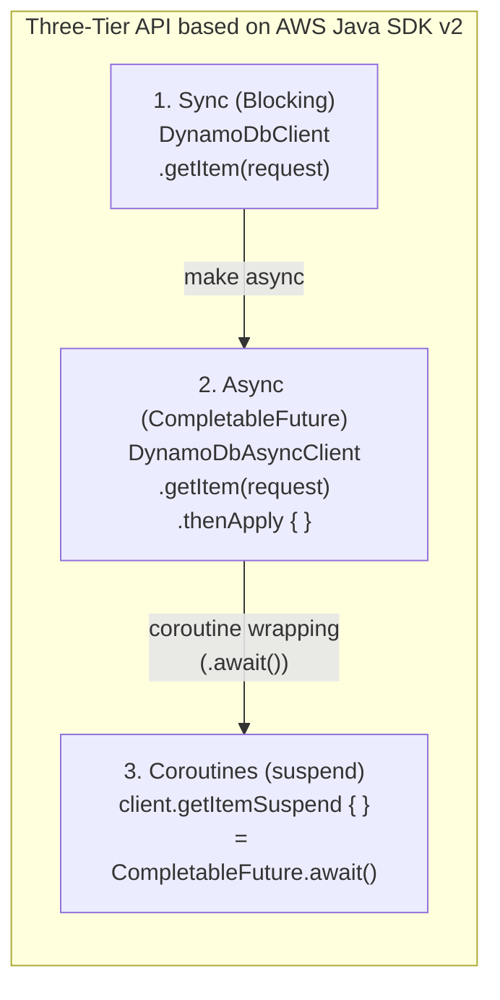
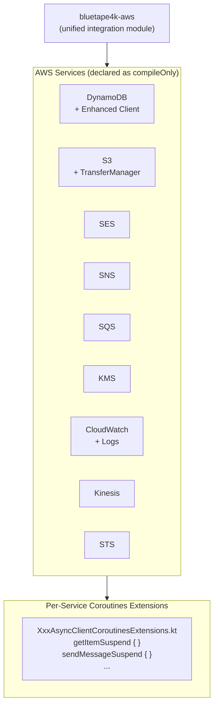
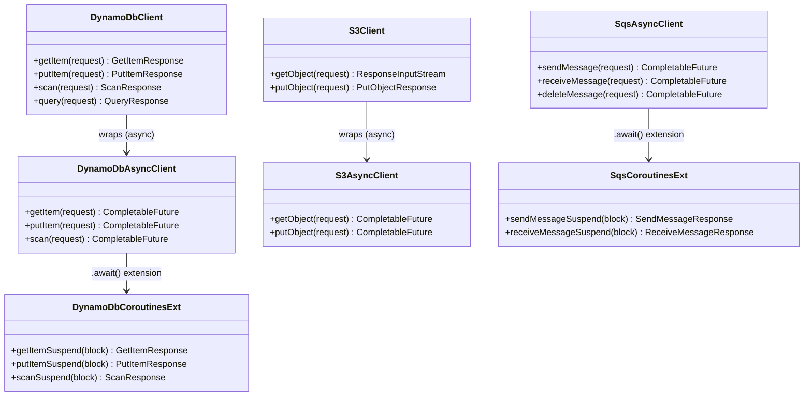

# Module bluetape4k-aws

English | [한국어](./README.ko.md)

A unified integration module built on AWS Java SDK v2. Provides async/non-blocking and Kotlin Coroutines support for major AWS services including DynamoDB, S3, SES, SNS, SQS, KMS, CloudWatch, Kinesis, and STS.

## Architecture

### Three-Tier API Flow



### Service Support Overview



### Three-Tier API Class Diagram



## Supported Services

| Service             | Key Features                                                                 |
|---------------------|------------------------------------------------------------------------------|
| **DynamoDB**        | Table CRUD, Enhanced Client, Coroutines extensions                           |
| **S3**              | Object upload/download, TransferManager (large files), Coroutines extensions |
| **SES**             | Email sending, Coroutines extensions                                         |
| **SNS**             | Topic publishing, SMS, push notifications, Coroutines extensions             |
| **SQS**             | Message send/receive/delete, Coroutines extensions                           |
| **KMS**             | Encryption key management, data encryption/decryption, Coroutines extensions |
| **CloudWatch**      | Metric publishing/querying, Coroutines extensions                            |
| **CloudWatch Logs** | Log group/stream management, event publishing, Coroutines extensions         |
| **Kinesis**         | Stream record send/receive, Coroutines extensions                            |
| **STS**             | AssumeRole, CallerIdentity, SessionToken, Coroutines extensions              |

## Three-Tier API Pattern

Each service provides three tiers of API:

```
sync (blocking) → async (CompletableFuture) → coroutines (suspend)
```

The coroutines tier wraps `CompletableFuture` with
`.await()` extension functions, so no thread blocking occurs in coroutine contexts.

## Usage Examples

### DynamoDB (Coroutines)

```kotlin
import io.bluetape4k.aws.dynamodb.coroutines.*
import software.amazon.awssdk.services.dynamodb.DynamoDbAsyncClient

val client: DynamoDbAsyncClient = DynamoDbAsyncClient.create()

suspend fun getItem(tableName: String, key: Map<String, AttributeValue>) =
    client.getItemSuspend {
        it.tableName(tableName).key(key)
    }
```

### S3 TransferManager (Large Files)

```kotlin
import software.amazon.awssdk.transfer.s3.S3TransferManager
import software.amazon.awssdk.transfer.s3.model.UploadFileRequest

val transferManager = S3TransferManager.create()

suspend fun uploadLargeFile(bucket: String, key: String, file: Path) {
    val upload = transferManager.uploadFile(
        UploadFileRequest.builder()
            .putObjectRequest { it.bucket(bucket).key(key) }
            .source(file)
            .build()
    )
    upload.completionFuture().await()
}
```

### SQS (Coroutines)

```kotlin
import io.bluetape4k.aws.sqs.coroutines.*

suspend fun sendMessage(client: SqsAsyncClient, queueUrl: String, body: String) =
    client.sendMessageSuspend {
        it.queueUrl(queueUrl).messageBody(body)
    }

suspend fun receiveMessages(client: SqsAsyncClient, queueUrl: String) =
    client.receiveMessageSuspend {
        it.queueUrl(queueUrl).maxNumberOfMessages(10)
    }.messages()
```

### SNS (Coroutines)

```kotlin
import io.bluetape4k.aws.sns.coroutines.*

suspend fun publishMessage(client: SnsAsyncClient, topicArn: String, message: String) =
    client.publishSuspend {
        it.topicArn(topicArn).message(message)
    }
```

### KMS (Coroutines)

```kotlin
import io.bluetape4k.aws.kms.coroutines.*

suspend fun encryptData(client: KmsAsyncClient, keyId: String, plaintext: ByteArray) =
    client.encryptSuspend {
        it.keyId(keyId).plaintext(SdkBytes.fromByteArray(plaintext))
    }.ciphertextBlob().asByteArray()
```

### CloudWatch (Coroutines)

```kotlin
import io.bluetape4k.aws.cloudwatch.coroutines.*

suspend fun publishMetric(client: CloudWatchAsyncClient, namespace: String, value: Double) =
    client.putMetricDataSuspend {
        it.namespace(namespace)
            .metricData(
                MetricDatum.builder()
                    .metricName("RequestCount")
                    .value(value)
                    .unit(StandardUnit.COUNT)
                    .build()
            )
    }
```

### Kinesis (Coroutines)

```kotlin
import io.bluetape4k.aws.kinesis.coroutines.*

suspend fun putRecord(client: KinesisAsyncClient, streamName: String, data: ByteArray) =
    client.putRecordSuspend {
        it.streamName(streamName)
            .data(SdkBytes.fromByteArray(data))
            .partitionKey("default")
    }
```

## Test Environment

Integration testing with LocalStack is supported:

```kotlin
@Testcontainers
class DynamoDbTest {
    companion object {
        @Container
        val localstack = LocalStackContainer(DockerImageName.parse("localstack/localstack"))
            .withServices(LocalStackContainer.Service.DYNAMODB)
    }
}
```

## Adding the Dependency

AWS SDK services are declared as
`compileOnly` dependencies, so you need to add the runtime dependencies for the services you use.

```kotlin
dependencies {
    implementation("io.github.bluetape4k:bluetape4k-aws:${bluetape4kVersion}")

    // Add only the services you need
    implementation(platform("software.amazon.awssdk:bom:${awsSdkVersion}"))
    implementation("software.amazon.awssdk:dynamodb-enhanced")
    implementation("software.amazon.awssdk:s3")
    implementation("software.amazon.awssdk:s3-transfer-manager")
    implementation("software.amazon.awssdk:sqs")
    implementation("software.amazon.awssdk:sns")
    implementation("software.amazon.awssdk:kms")
    implementation("software.amazon.awssdk:cloudwatch")
    implementation("software.amazon.awssdk:kinesis")
    implementation("software.amazon.awssdk:sts")
    // ... add other services as needed
}
```
