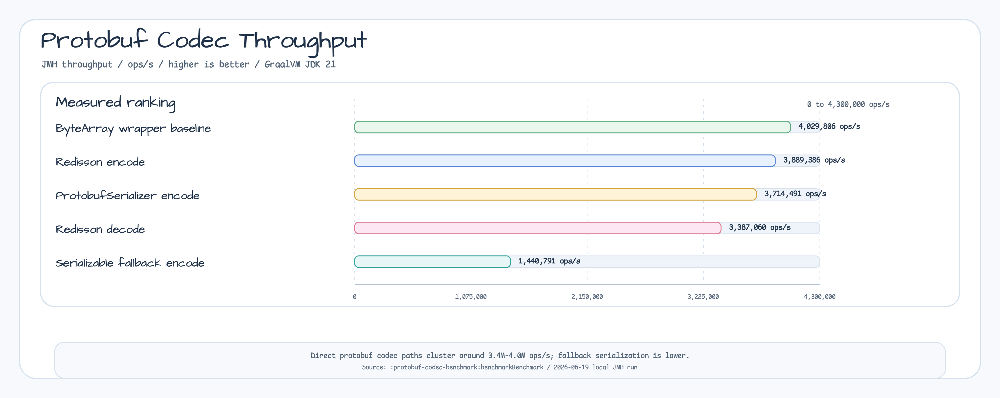

# Protobuf Codec Benchmark

This module measures the protobuf codec paths used by bluetape4k serialization
and Redisson integration code. The benchmark is intentionally narrow: it keeps a
single deterministic protobuf payload in memory and compares encode/decode
throughput for the codec implementations that are used by the library modules.



## What It Measures

The benchmark class is
`io.bluetape4k.protobuf.benchmark.ProtobufCodecBenchmark`.

It runs JMH throughput benchmarks with two warmup iterations and three measured
iterations, each one second long. The measured payload is a `BenchmarkMessage`
with a stable `id`, `name`, and repeated string payload. The fallback benchmark
uses a serializable Kotlin data object to measure the non-protobuf serialization
path.

| Benchmark | Purpose |
|---|---|
| `redissonProtobufEncode` | Encode a protobuf message through `RedissonProtobufCodec`. |
| `redissonProtobufEncodeByteArrayWrappedBaseline` | Encode an already wrapped protobuf byte array through the Redisson codec path. |
| `redissonProtobufDecode` | Decode the Redisson protobuf payload back into the protobuf message type. |
| `protobufSerializerEncode` | Encode the protobuf message through `ProtobufSerializer`. |
| `protobufSerializerFallbackEncode` | Encode a non-protobuf serializable object through the serializer fallback path. |

## Latest Local Result

Run date: 2026-06-19. Runtime: GraalVM JDK 21.0.11. Mode: JMH throughput,
single thread, one fork, `ops/s`.

| Benchmark | Score | Error |
|---|---:|---:|
| `redissonProtobufEncodeByteArrayWrappedBaseline` | 4,029,806 ops/s | ±137,575 |
| `redissonProtobufEncode` | 3,889,386 ops/s | ±624,283 |
| `protobufSerializerEncode` | 3,714,491 ops/s | ±6,802,622 |
| `redissonProtobufDecode` | 3,387,060 ops/s | ±479,845 |
| `protobufSerializerFallbackEncode` | 1,440,791 ops/s | ±370,311 |

The short local run is useful for comparing the relative shape of codec paths,
not for publishing an absolute performance guarantee. The large error range on
`protobufSerializerEncode` means the result should be refreshed with longer
measurement windows before using it as release evidence.

## Run

```bash
./gradlew :protobuf-codec-benchmark:benchmarkBenchmark
```

The raw JMH JSON report is written under
`benchmark/protobuf-codec-benchmark/build/reports/benchmarks/main/`.
