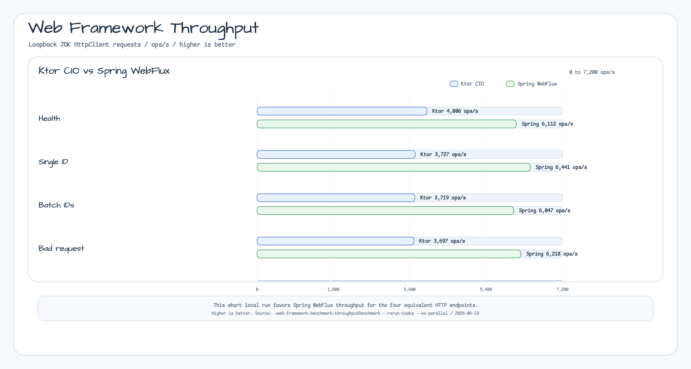
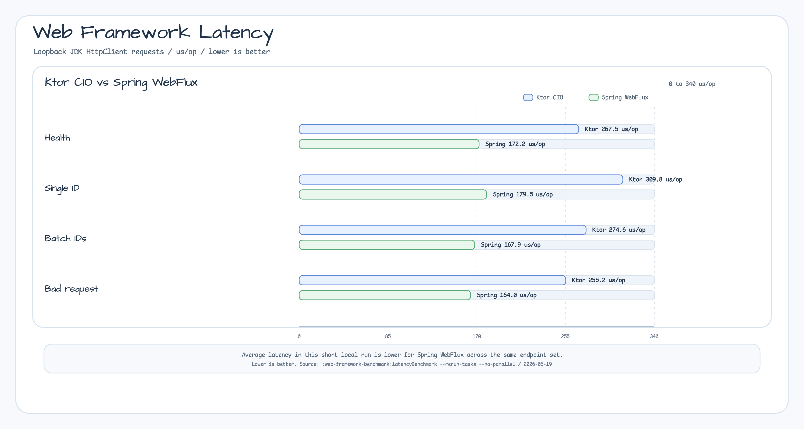
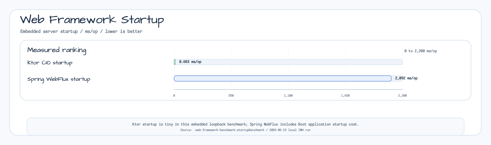

# Web Framework Benchmark

This module compares equivalent embedded HTTP workloads implemented with Ktor
CIO and Spring WebFlux. The benchmark uses JDK `HttpClient` against local
loopback servers so the comparison includes framework routing, JSON response
serialization, request handling, and minimal server lifecycle cost.







## What It Measures

The benchmark source is
`io.bluetape4k.benchmark.webframework.WebFrameworkBenchmark`.

Both frameworks expose the same logical endpoints:

| Endpoint | Purpose |
|---|---|
| `/health` | Small JSON health response. |
| `/idgen/uuid-v7` | Generate one UUIDv7 identifier through the shared generator registry. |
| `/idgen/uuid-v7/batch?size=10` | Generate a small batch of UUIDv7 identifiers. |
| `/idgen/unknown` | Exercise the bad-request path for an unknown generator. |

The generator registry also wires UUIDv4, UUIDv7, ULID, KSUID, Snowflake, and
Flake generators so the HTTP layer uses the same ID-generation surface that the
library modules expose.

## Latest Local Results

Run date: 2026-06-19. Runtime: GraalVM JDK 21.0.11. Each benchmark uses one
fork, two warmup iterations, and three measured iterations unless the Gradle
configuration says otherwise.

### Throughput

Command:

```bash
./gradlew :web-framework-benchmark:throughputBenchmark --rerun-tasks --no-parallel
```

Mode: JMH throughput, `ops/s`, higher is better.

| Endpoint | Ktor CIO | Spring WebFlux |
|---|---:|---:|
| Health | 4,006 ops/s | 6,112 ops/s |
| Single ID | 3,727 ops/s | 6,441 ops/s |
| Batch IDs | 3,719 ops/s | 6,047 ops/s |
| Bad request | 3,697 ops/s | 6,218 ops/s |

### Latency

Command:

```bash
./gradlew :web-framework-benchmark:latencyBenchmark --rerun-tasks --no-parallel
```

Mode: JMH average time, `us/op`, lower is better.

| Endpoint | Ktor CIO | Spring WebFlux |
|---|---:|---:|
| Health | 267.492 us/op | 172.170 us/op |
| Single ID | 309.815 us/op | 179.457 us/op |
| Batch IDs | 274.638 us/op | 167.923 us/op |
| Bad request | 255.166 us/op | 164.028 us/op |

### Startup

Command:

```bash
./gradlew :web-framework-benchmark:startupBenchmark
```

Mode: JMH average time, `ms/op`, lower is better.

| Framework | Score | Error |
|---|---:|---:|
| Ktor CIO | 0.683 ms/op | ±0.770 |
| Spring WebFlux | 2,091.794 ms/op | ±146.877 |

These numbers are local comparison snapshots, not release guarantees. The
throughput and latency runs use short one-second measurement windows, so use
longer JMH runs before making a product-level performance claim.

## Run

```bash
./gradlew :web-framework-benchmark:throughputBenchmark
./gradlew :web-framework-benchmark:latencyBenchmark
./gradlew :web-framework-benchmark:startupBenchmark
```

The raw JMH JSON reports are written under
`benchmark/web-framework-benchmark/build/reports/benchmarks/`.
