# bluetape4k-bom

한국어 | [English](./README.md)

`bluetape4k-projects` 가 게시하는 전체 `io.github.bluetape4k:*` 모듈 집합의 **루트 Maven BOM**.
bluetape4k 생태계의 토대 계층이며, `bluetape4k/*`, `data/*`, `infra/*`, `io/*`, `spring-boot3/*`,
`spring-boot4/*`, `testing/*`, `utils/*`, `virtualthread/*` 의 약 80개 모듈 버전을 중앙 관리한다.

## Architecture

```mermaid
graph TB
    Consumer[소비 프로젝트]
    AggBom[bluetape4k-dependencies<br/>aggregator BOM]
    BOM[bluetape4k-bom<br/>java-platform]

    subgraph "Foundation (bluetape4k/*)"
      Core[core]
      Coro[coroutines]
      Logging[logging]
    end

    subgraph "data/*"
      Jdbc[jdbc]
      R2dbc[r2dbc]
      Hib[hibernate / hibernate-reactive]
      Mongo[mongodb]
      Cass[cassandra]
    end

    subgraph "infra/*"
      Cache[cache / cache-lettuce / cache-redisson / cache-hazelcast]
      Bucket[bucket4j]
      Es[elasticsearch]
      Kafka[kafka-logback]
      More1[+ ~13 more]
    end

    subgraph "io/*"
      Json[jackson2 / fastjson2]
      Avro[avro / csv]
      Rpc[grpc / feign / http]
      More2[+ ~10 more]
    end

    subgraph "Spring Boot 3 / 4"
      SB3[spring-boot3/* — 8개]
      SB4[spring-boot4/* — 8개]
    end

    subgraph "testing/*"
      Assert[assertions]
      Ju5[junit5]
      Mws[mock-web-server / mock-webflux-server]
      Tc[testcontainers]
    end

    subgraph "utils/*"
      Jwt[jwt]
      Money[money]
      Time[javatimes]
      More3[+ ~10 more]
    end

    subgraph "virtualthread/*"
      VtApi[api]
      Vt21[jdk21]
      Vt25[jdk25]
    end

    Consumer -->|platform import| AggBom
    AggBom -->|api platform| BOM
    BOM -.-> Core
    BOM -.-> Jdbc
    BOM -.-> Cache
    BOM -.-> Json
    BOM -.-> SB3
    BOM -.-> Assert
    BOM -.-> Jwt
    BOM -.-> VtApi
```



BOM 은 Gradle `java-platform` 으로 `<dependencyManagement>` constraint 만 게시하며 런타임 클래스는 포함하지 않는다.
`rootProject.subprojects` 를 동적으로 끌어오며 자기 자신, `*-demo`, `examples/*`, `workshop/*` 만 제외한다.

## 핵심 기능

- `bluetape4k-projects` 의 약 80개 `bluetape4k-*` 모듈 버전 중앙 관리
- 모든 sub-BOM (`bluetape4k-aws-bom`, `bluetape4k-image-bom`, `bluetape4k-text-bom`, `bluetape4k-javers-bom`, `bluetape4k-graph-bom`, `bluetape4k-leader-bom`, `bluetape4k-exposed-bom`) 의 토대 BOM
- `bluetape4k-dependencies` 가 상위에서 통합 — 단일 BOM 선언만으로 전체 생태계 사용 가능

## 관리 모듈

| 그룹 | 모듈 수 | 주요 모듈 |
|------|--------|----------|
| `bluetape4k/*` | 3 | `bluetape4k-core`, `bluetape4k-coroutines`, `bluetape4k-logging` |
| `data/*` | 7 | `bluetape4k-jdbc`, `bluetape4k-r2dbc`, `bluetape4k-hibernate`, `bluetape4k-hibernate-reactive`, `bluetape4k-hibernate-cache-lettuce`, `bluetape4k-mongodb`, `bluetape4k-cassandra` |
| `infra/*` | 18 | 캐시 (`cache`, `cache-core`, `cache-lettuce`, `cache-redisson`, `cache-hazelcast`), `bucket4j`, `elasticsearch`, `kafka-logback` 등 |
| `io/*` | 16 | `jackson2`, `fastjson2`, `avro`, `csv`, `grpc`, `feign`, `http`, `io` |
| `spring-boot3/*` | 8 | `spring-boot3-core`, `spring-boot3-r2dbc`, `spring-boot3-mongodb`, `spring-boot3-cassandra`, `spring-boot3-redis`, `spring-boot3-hibernate-lettuce` 등 |
| `spring-boot4/*` | 8 | spring-boot3 와 동일 모듈의 Spring Boot 4 버전 |
| `testing/*` | 5 | `bluetape4k-assertions`, `bluetape4k-junit5`, `bluetape4k-mock-web-server`, `bluetape4k-mock-webflux-server`, `bluetape4k-testcontainers` |
| `utils/*` | 13 | `jwt`, `money`, `javatimes`, `geo`, `idgenerators`, `math`, `measured`, `mutiny` 등 |
| `virtualthread/*` | 3 | `virtualthread-api`, `virtualthread-jdk21`, `virtualthread-jdk25` |

> constraint 에서 제외: `*-demo`, `examples/*`, `workshop/*`.

## 사용 예제

### 권장: aggregator BOM 으로 import

```kotlin
plugins {
    id("io.spring.dependency-management") version "1.1.x"
}

dependencyManagement {
    imports {
        mavenBom("io.github.bluetape4k:bluetape4k-dependencies:<version>")
    }
}

dependencies {
    implementation("io.github.bluetape4k:bluetape4k-core")
    implementation("io.github.bluetape4k:bluetape4k-coroutines")
    testImplementation("io.github.bluetape4k:bluetape4k-junit5")
}
```

### bluetape4k-bom 직접 import

```kotlin
dependencyManagement {
    imports {
        mavenBom("io.github.bluetape4k:bluetape4k-bom:<version>")
    }
}
```

### 순수 Gradle (Spring 미사용)

```kotlin
dependencies {
    implementation(platform("io.github.bluetape4k:bluetape4k-bom:<version>"))
    implementation("io.github.bluetape4k:bluetape4k-core")
}
```

### Maven

```xml
<dependencyManagement>
    <dependencies>
        <dependency>
            <groupId>io.github.bluetape4k</groupId>
            <artifactId>bluetape4k-bom</artifactId>
            <version>${bluetape4k.version}</version>
            <type>pom</type>
            <scope>import</scope>
        </dependency>
    </dependencies>
</dependencyManagement>
```

## 설정 옵션

BOM 자체는 별도 설정이 없다. SNAPSHOT 사용 시 Sonatype Central Snapshots 저장소 추가:

```kotlin
repositories {
    mavenCentral()
    maven {
        name = "central-snapshots"
        url = uri("https://central.sonatype.com/repository/maven-snapshots/")
    }
}
```

## 의존성

이 BOM 은 `bluetape4k-dependencies` 가 import 하는 토대 BOM. 대부분의 소비자는 aggregator
(`io.github.bluetape4k:bluetape4k-dependencies`) import 권장 — `bluetape4k-bom` 과
모든 sub-BOM (aws / image / text / javers / graph / leader / exposed) 을 함께 가져와
단일 선언으로 전체 bluetape4k 생태계를 커버한다.
