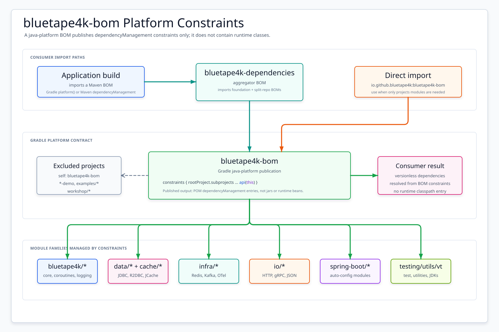

# bluetape4k-bom

[한국어](./README.ko.md) | English

The **root Maven BOM** for the entire `io.github.bluetape4k:*` module set published from
`bluetape4k-projects` — the foundational layer of the bluetape4k ecosystem. Manages versions of
~70 modules across `bluetape4k/*`, `data/*`, `infra/*`, `io/*`, `spring-boot/*`,
`testing/*`, `utils/*`, and `virtualthread/*`.

## Architecture



The BOM is a Gradle `java-platform` that publishes only `<dependencyManagement>` constraints — no runtime classes. It dynamically pulls in all `rootProject.subprojects` except itself, `*-demo` modules, `examples/*`, and `workshop/*`.

## Core Features

- Centralized version management for ~70 `bluetape4k-*` modules in `bluetape4k-projects`
- Foundation BOM that all sub-BOMs (`bluetape4k-aws-bom`, `bluetape4k-image-bom`, `bluetape4k-text-bom`, `bluetape4k-javers-bom`, `bluetape4k-graph-bom`, `bluetape4k-leader-bom`, `bluetape4k-exposed-bom`) depend on
- Aggregated by `bluetape4k-dependencies` so a consumer can import a single BOM and pick up the entire ecosystem

## Modules Managed

| Group | Approximate count | Highlights |
|-------|-------------------|-----------|
| `bluetape4k/*` | 3 | `bluetape4k-core`, `bluetape4k-coroutines`, `bluetape4k-logging` |
| `data/*` | 7 | `bluetape4k-jdbc`, `bluetape4k-r2dbc`, `bluetape4k-hibernate`, `bluetape4k-hibernate-reactive`, `bluetape4k-hibernate-cache-lettuce`, `bluetape4k-mongodb`, `bluetape4k-cassandra` |
| `infra/*` | 18 | cache (`cache`, `cache-core`, `cache-lettuce`, `cache-redisson`, `cache-hazelcast`), `bucket4j`, `elasticsearch`, `kafka-logback`, etc. |
| `io/*` | 16 | `jackson2`, `fastjson2`, `avro`, `csv`, `grpc`, `feign`, `http`, `io` |
| `spring-boot/*` | 8 | `spring-boot-core`, `spring-boot-r2dbc`, `spring-boot-mongodb`, `spring-boot-cassandra`, `spring-boot-redis`, `spring-boot-hibernate-lettuce`, ... |
| `testing/*` | 5 | `bluetape4k-assertions`, `bluetape4k-junit5`, `bluetape4k-mock-web-server`, `bluetape4k-mock-webflux-server`, `bluetape4k-testcontainers` |
| `utils/*` | 13 | `jwt`, `money`, `javatimes`, `geo`, `idgenerators`, `math`, `measured`, `mutiny`, ... |
| `virtualthread/*` | 3 | `virtualthread-api`, `virtualthread-jdk21`, `virtualthread-jdk25` |

> Excluded from constraints: `*-demo`, `examples/*`, `workshop/*`.

## Usage Examples

### Recommended: import via aggregator BOM

```kotlin
plugins {
    id("io.spring.dependency-management") version "1.1.x"
}

dependencyManagement {
    imports {
        mavenBom("io.github.bluetape4k:bluetape4k-dependencies:<version>")
    }
}

dependencies {
    implementation("io.github.bluetape4k:bluetape4k-core")
    implementation("io.github.bluetape4k:bluetape4k-coroutines")
    testImplementation("io.github.bluetape4k:bluetape4k-junit5")
}
```

### Direct import of bluetape4k-bom

```kotlin
dependencyManagement {
    imports {
        mavenBom("io.github.bluetape4k:bluetape4k-bom:<version>")
    }
}
```

### Plain Gradle (no Spring)

```kotlin
dependencies {
    implementation(platform("io.github.bluetape4k:bluetape4k-bom:<version>"))
    implementation("io.github.bluetape4k:bluetape4k-core")
}
```

### Maven

```xml
<dependencyManagement>
    <dependencies>
        <dependency>
            <groupId>io.github.bluetape4k</groupId>
            <artifactId>bluetape4k-bom</artifactId>
            <version>${bluetape4k.version}</version>
            <type>pom</type>
            <scope>import</scope>
        </dependency>
    </dependencies>
</dependencyManagement>
```

## Configuration Options

The BOM itself has no configuration. For SNAPSHOT builds, add the Sonatype Central Snapshots repository:

```kotlin
repositories {
    mavenCentral()
    maven {
        name = "central-snapshots"
        url = uri("https://central.sonatype.com/repository/maven-snapshots/")
    }
}
```

## Dependency

This BOM is the foundation imported by `bluetape4k-dependencies`. For most consumers, import the
aggregator (`io.github.bluetape4k:bluetape4k-dependencies`) instead — it transitively imports
`bluetape4k-bom` plus all sub-BOMs (aws / image / text / javers / graph / leader / exposed) so a
single declaration covers the entire bluetape4k ecosystem.
