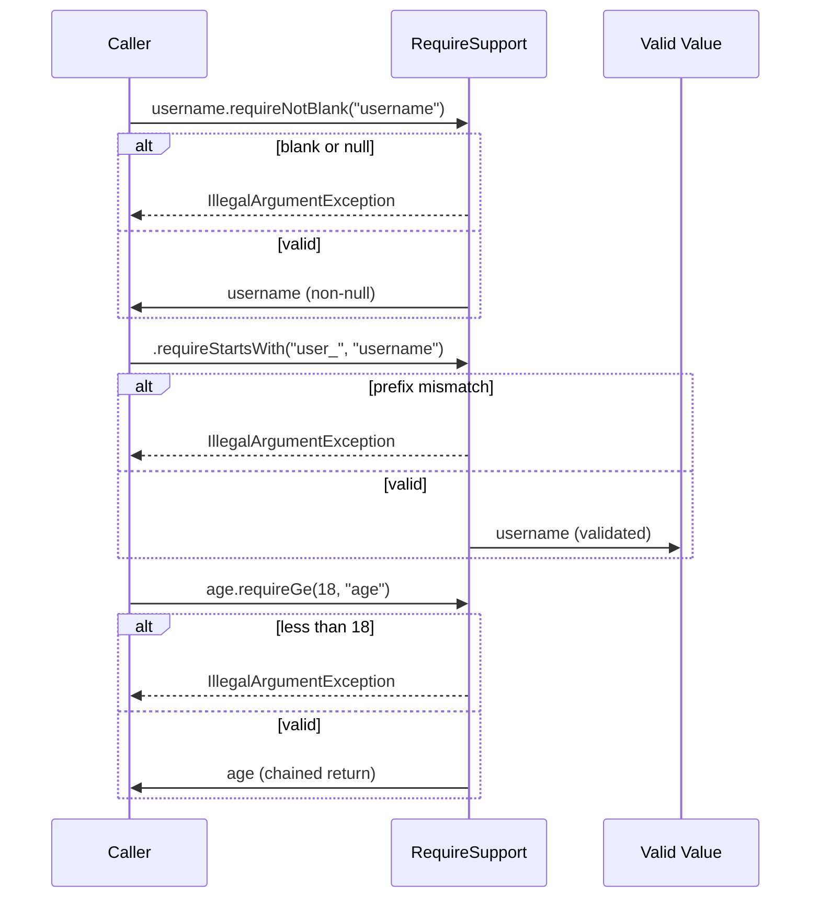

# Module bluetape4k-core

English | [한국어](./README.ko.md)

A foundational utility library for Kotlin backend development. It provides the core building blocks that every module in the Bluetape4k project depends on.

## Architecture

### Module Overview

```mermaid
flowchart TD
    Core["bluetape4k-core"]:::coreStyle
    Validation["RequireSupport<br/>Validation"]:::serviceStyle
    Codec["Codec<br/>Base58/Base62/Hex/Url62"]:::serviceStyle
    Extensions["Type Extensions"]:::utilStyle
    Ranges["Ranges<br/>ClosedClosed/ClosedOpen<br/>OpenClosed/OpenOpen"]:::utilStyle
    Collections["Collections<br/>BoundedStack/RingBuffer<br/>PaginatedList/Permutation"]:::utilStyle
    Concurrent["Concurrent Utils<br/>VirtualThread/CompletableFuture"]:::asyncStyle
    Functional["Functional Utils<br/>Currying/Decorator"]:::utilStyle
    Time["Java Time DSL<br/>Duration/Period/Quarter"]:::serviceStyle
    ValueObject["ValueObject<br/>AbstractValueObject"]:::coreStyle

    Core --> Validation
    Core --> Codec
    Core --> Extensions
    Core --> Ranges
    Core --> Collections
    Core --> Concurrent
    Core --> Functional
    Core --> Time
    Core --> ValueObject

```



---

### Class Diagram

```mermaid
classDiagram
    class ValueObject {
        <<interface>>
        +Serializable
    }

    class AbstractValueObject {
        <<abstract>>
        +equals(other) Boolean
        +hashCode() Int
        +equalProperties(other)* Boolean
    }

    class Range {
        <<interface>>
        +first: T
        +last: T
        +isStartInclusive: Boolean
        +isEndInclusive: Boolean
        +contains(value: T) Boolean
        +isEmpty() Boolean
    }

    class ClosedClosedRange {
        +isStartInclusive = true
        +isEndInclusive = true
    }

    class ClosedOpenRange {
        +isStartInclusive = true
        +isEndInclusive = false
    }

    class OpenClosedRange {
        +isStartInclusive = false
        +isEndInclusive = true
    }

    class OpenOpenRange {
        +isStartInclusive = false
        +isEndInclusive = false
    }

    class StringEncoder {
        <<interface>>
        +encode(bytes: ByteArray) String
        +decode(encoded: String) ByteArray
    }

    class Base64StringEncoder {
        +encode(bytes) String
        +decode(encoded) ByteArray
    }

    class HexStringEncoder {
        +encode(bytes) String
        +decode(encoded) ByteArray
    }

    class Base58 {
        <<object>>
        +encode(data: ByteArray) String
        +decode(encoded: String) ByteArray
    }

    class Base62 {
        <<object>>
        +encode(number: Long) String
        +decode(encoded: String) Long
    }

    class RequireSupport {
        <<extensionFunctions>>
        +requireNotNull(name)
        +requireNotEmpty(name)
        +requireNotBlank(name)
        +requireGt(value, name)
        +requireGe(value, name)
        +requireLt(value, name)
        +requireLe(value, name)
    }

    ValueObject <|.. AbstractValueObject
    Range <|.. ClosedClosedRange
    Range <|.. ClosedOpenRange
    Range <|.. OpenClosedRange
    Range <|.. OpenOpenRange
    StringEncoder <|.. Base64StringEncoder
    StringEncoder <|.. HexStringEncoder

```



---

### Validation Chaining Flow



## Features

- **Validation (RequireSupport)**: Contract-based parameter validation functions
- **Encoding/Decoding (Codec)**: Multiple encoding schemes — Base58, Base62, Hex, URL62
- **Type Extensions**: Kotlin-style extension functions for all primitive types
- **Ranges**: Various range types (OpenOpen, ClosedOpen, OpenClosed, ClosedClosed)
- **Collections**: Collection utilities — BoundedStack, RingBuffer, PaginatedList, lazy Permutation sequences
- **Concurrent**: Concurrency utilities
- **Utils**: Wildcard pattern matching, XXHasher high-speed hashing
- **Functional**: Functional programming support
- **Java Time DSL**: Extension functions for `java.time` (Duration/Period DSL, Temporal utilities, Quarter support)

## Installation

### Gradle (Kotlin DSL)

```kotlin
dependencies {
    implementation("io.github.bluetape4k:bluetape4k-core:${version}")
}
```

## Feature Details

### 1. Validation (RequireSupport)

Parameter validation functions that leverage Kotlin Contracts to guarantee type safety.

#### Null Checks

```kotlin
import io.bluetape4k.support.requireNotNull
import io.bluetape4k.support.requireNull

fun processUser(user: User?) {
    val validUser = user.requireNotNull("user")
    // validUser is smart-cast to non-null
    println(validUser.name)
}

fun ensureNoValue(value: String?) {
    value.requireNull("value")
    // throws IllegalArgumentException if value is not null
}
```

#### String Validation

```kotlin
import io.bluetape4k.support.requireNotEmpty
import io.bluetape4k.support.requireNotBlank
import io.bluetape4k.support.requireContains
import io.bluetape4k.support.requireStartsWith
import io.bluetape4k.support.requireEndsWith

fun createUser(username: String?, email: String?) {
    val validUsername = username.requireNotEmpty("username")
    // throws if username is null or empty

    val validEmail = email
        .requireNotBlank("email")
        .requireContains("@", "email")
        .requireEndsWith(".com", "email")
}
```

#### Numeric Comparison Validation

```kotlin
import io.bluetape4k.support.requireGt
import io.bluetape4k.support.requireGe
import io.bluetape4k.support.requireLt
import io.bluetape4k.support.requireLe
import io.bluetape4k.support.requireEquals

fun setAge(age: Int) {
    age.requireGe(0, "age")
        .requireLt(150, "age")
}

fun setQuantity(quantity: Int) {
    quantity.requireGt(0, "quantity")  // must be greater than 0
}

fun validateScore(score: Double) {
    score.requireGe(0.0, "score")
        .requireLe(100.0, "score")
}
```

**Highlights:**

- Smart casting support via Kotlin Contracts
- Chainable (fluent API)
- Automatically generates clear error messages

### 2. Encoding/Decoding (Codec)

A unified interface for a variety of encoding schemes.

#### Base64 Encoding

```kotlin
import io.bluetape4k.codec.encodeBase64String
import io.bluetape4k.codec.decodeBase64

val text = "Hello, World!"
val encoded = text.encodeBase64String()  // "SGVsbG8sIFdvcmxkIQ=="
val decoded = encoded.decodeBase64().decodeToString()  // "Hello, World!"

// URL-safe Base64
val urlSafe = text.encodeBase64UrlSafeString()
```

#### Base58 Encoding (Bitcoin-style)

```kotlin
import io.bluetape4k.codec.Base58

val data = "Hello".toByteArray()
val encoded = Base58.encode(data)  // "9Ajdvzr"
val decoded = Base58.decode(encoded).decodeToString()  // "Hello"
```

**Use cases:**

- Bitcoin addresses
- Short ID generation
- URL-safe identifiers

#### Base62 Encoding

```kotlin
import io.bluetape4k.codec.Base62

val number = 123456789L
val encoded = Base62.encode(number)  // "8M0kX"
val decoded = Base62.decode(encoded)  // 123456789
```

**Use cases:**

- Short URLs
- ID obfuscation
- Filename generation

#### Hex Encoding

```kotlin
import io.bluetape4k.codec.encodeHexString
import io.bluetape4k.codec.decodeHex

val data = byteArrayOf(0x48, 0x65, 0x6C, 0x6C, 0x6F)
val hex = data.encodeHexString()  // "48656c6c6f"
val decoded = hex.decodeHex()  // [72, 101, 108, 108, 111]
```

#### URL62 Encoding

```kotlin
import io.bluetape4k.codec.Url62

val url = "https://example.com/path?query=value"
val encoded = Url62.encode(url)  // URL-safe string
val decoded = Url62.decode(encoded)  // original URL
```

### 3. Type Extensions (Support)

Useful extension functions for all primitive types.

#### Any Extensions

```kotlin
import io.bluetape4k.support.hashOf
import io.bluetape4k.support.toUtf8Bytes
import io.bluetape4k.support.toUtf8String

// Compute hashCode from multiple objects
val hash = hashOf(obj1, obj2, obj3)

// String <-> ByteArray conversion
val bytes = "Hello".toUtf8Bytes()
val str = bytes.toUtf8String()
```

#### Boolean Extensions

```kotlin
import io.bluetape4k.support.ifTrue
import io.bluetape4k.support.ifFalse
import io.bluetape4k.support.not

val isAdmin = true
isAdmin.ifTrue { println("Admin access granted") }

val isGuest = false
isGuest.ifFalse { println("Not a guest") }
```

#### Number Extensions

```kotlin
import io.bluetape4k.support.coerceIn
import io.bluetape4k.support.isEven
import io.bluetape4k.support.isOdd

val age = 25
age.isOdd()  // true
age.isEven()  // false

val value = 150
val bounded = value.coerceIn(0, 100)  // 100
```

#### String Extensions

```kotlin
import io.bluetape4k.support.between
import io.bluetape4k.support.firstLine
import io.bluetape4k.support.isWhitespace
import io.bluetape4k.support.prefixIfAbsent
import io.bluetape4k.support.trimWhitespace

val text = "  Hello  "
text.isWhitespace()  // false

val trimmed = text.trimWhitespace()  // "Hello"
val heading = "title\nbody".firstLine()  // "title"
val token = "Bearer abc.def".between("Bearer ", ".")  // "abc"
val namespaced = "version".prefixIfAbsent("bluetape4k.")  // "bluetape4k.version"
```

#### Array Extensions

```kotlin
import io.bluetape4k.support.toHexString
import io.bluetape4k.support.isNullOrEmpty

val array = byteArrayOf(1, 2, 3, 4)
val hex = array.toHexString()  // "01020304"

val empty = emptyArray<String>()
empty.isNullOrEmpty()  // true
```

### 4. Ranges

While Java/Kotlin's built-in Range only supports closed ranges, this module provides a full set of range types.

```kotlin
import io.bluetape4k.ranges.*

// Closed-Closed Range: [1, 10] (both endpoints included)
val closedClosed = 1 rangeTo 10
closedClosed.contains(1)   // true
closedClosed.contains(10)  // true

// Open-Open Range: (1, 10) (both endpoints excluded)
val openOpen = 1 rangeOpen 10
openOpen.contains(1)   // false
openOpen.contains(10)  // false

// Closed-Open Range: [1, 10) (start included, end excluded)
val closedOpen = 1 rangeUntil 10
closedOpen.contains(1)   // true
closedOpen.contains(10)  // false

// Open-Closed Range: (1, 10] (start excluded, end included)
val openClosed = 1 openRangeTo 10
openClosed.contains(1)   // false
openClosed.contains(10)  // true
```

**Use cases:**

- Mathematical interval representation
- Validation boundary specification
- Date/time range handling

### 5. Collections

A variety of utilities for collection processing.

```kotlin
import io.bluetape4k.collections.*

// Immutable Empty Collections
val emptyList = emptyList<String>()
val emptySet = emptySet<Int>()
val emptyMap = emptyMap<String, Int>()

// Safe operations
val list = listOf(1, 2, 3)
val first = list.firstOrNull()  // 1
val last = list.lastOrNull()    // 3

// Chunking
val chunked = (1..10).toList().chunked(3)
// [[1,2,3], [4,5,6], [7,8,9], [10]]

// Partitioning
val (even, odd) = (1..10).toList().partition { it % 2 == 0 }
// even = [2,4,6,8,10], odd = [1,3,5,7,9]
```

#### BoundedStack (Capacity-Limited Stack)

A fixed-size LIFO stack. When the maximum size is exceeded, the oldest element is automatically removed. Thread-safe (`ReentrantLock`).

```kotlin
import io.bluetape4k.collections.BoundedStack

val stack = BoundedStack<String>(maxSize = 3)
stack.push("a")
stack.push("b")
stack.push("c")
stack.push("d")  // "a" is automatically removed

stack.peek()  // "d"
stack.pop()   // "d"
stack.size    // 2
```

#### RingBuffer (Circular Buffer)

A fixed-capacity circular buffer. When capacity is exceeded, the oldest element is overwritten. Thread-safe (`ReentrantLock`).

```kotlin
import io.bluetape4k.collections.RingBuffer

val buffer = RingBuffer<Int>(capacity = 3)
buffer.add(1)
buffer.add(2)
buffer.add(3)
buffer.add(4)  // overwrites 1

buffer.next()  // 2 (oldest element)
buffer.toList()  // [3, 4]
buffer.removeIf { it > 3 }  // removes 4
```

#### PaginatedList (Pagination)

An interface for representing paginated data.

```kotlin
import io.bluetape4k.collections.PaginatedList
import io.bluetape4k.collections.SimplePaginatedList

val page = SimplePaginatedList(
    contents = listOf("a", "b", "c"),
    pageNo = 0,
    pageSize = 10,
    totalItemCount = 25L
)
page.totalPageCount  // 3
page.contents        // ["a", "b", "c"]
```

#### Permutation (Lazy Evaluation Sequences)

A functional lazy-evaluation sequence. Handles infinite sequences with memory efficiency and provides rich operators: `map`, `filter`, `flatMap`, `take`, `drop`, `zip`, `scan`, `distinct`, `sorted`, and more. Thread-safe (`ReentrantLock` + DCL pattern on `Cons` tail evaluation).

```kotlin
import io.bluetape4k.collections.permutations.*

// Basic construction
val nums = permutationOf(1, 2, 3, 4, 5)
val mapped = nums.map { it * 2 }  // [2, 4, 6, 8, 10]
val filtered = nums.filter { it % 2 == 0 }  // [2, 4]

// Infinite sequence
val naturals = numbers(1)  // 1, 2, 3, 4, ...
val firstTen = naturals.take(10)  // [1..10]

// Lazy cons cells
val fibonacci = cons(0) {
    cons(1) {
        iterate(0 to 1) { (a, b) -> b to (a + b) }
            .map { it.second }
    }
}

// Java Stream interop
val stream = nums.toStream()
stream.filter { it > 2 }.count()  // 3
```

### 6. Lazy Initialization

Thread-safe lazy initialization patterns.

```kotlin
import io.bluetape4k.support.lazy

// Thread-safe lazy
val expensive by lazy {
    println("Computing expensive value...")
    computeExpensiveValue()
}

// Computed only when first accessed
println(expensive)  // prints "Computing expensive value..." then returns value
println(expensive)  // returns cached value (no recomputation)
```

### 7. Value Objects

A base class for easily creating immutable value objects.

```kotlin
import io.bluetape4k.ValueObject
import io.bluetape4k.AbstractValueObject

data class Money(
    val amount: BigDecimal,
    val currency: String
): AbstractValueObject() {
    override fun equalProperties(other: Any): Boolean {
        return other is Money &&
                amount == other.amount &&
                currency == other.currency
    }
}

val money1 = Money(100.toBigDecimal(), "USD")
val money2 = Money(100.toBigDecimal(), "USD")

money1 == money2  // true
money1.hashCode() == money2.hashCode()  // true
```

### 8. AutoCloseable Support

Java's `try-with-resources` in idiomatic Kotlin style.

```kotlin
import io.bluetape4k.support.closeSafe
import io.bluetape4k.support.use

// Auto-close (exceptions suppressed)
resource.closeSafe()

// use block (auto-close)
FileInputStream("file.txt").use { stream ->
    stream.read()
}

// Multiple resources
use(resource1, resource2) { r1, r2 ->
    // both are closed automatically
}
```

## Complete Example

```kotlin
import io.bluetape4k.support.*
import io.bluetape4k.codec.*
import io.bluetape4k.ranges.*

class UserService {
    fun createUser(
        username: String?,
        email: String?,
        age: Int,
        bio: String?
    ): User {
        // Validation
        val validUsername = username
            .requireNotBlank("username")
            .requireStartsWith("user_", "username")

        val validEmail = email
            .requireNotBlank("email")
            .requireContains("@", "email")

        age.requireGe(18, "age")
            .requireLt(100, "age")

        bio?.requireLe(500, "bio length") { it.length }

        // Generate ID using Base62 encoding
        val userId = Base62.encode(System.currentTimeMillis())

        return User(
            id = userId,
            username = validUsername,
            email = validEmail,
            age = age,
            bio = bio
        )
    }

    fun validateAge(age: Int): Boolean {
        val adultRange = 18 rangeUntil 65  // [18, 65)
        return age in adultRange
    }
}

// Usage
val service = UserService()
val user = service.createUser(
    username = "user_john",
    email = "john@example.com",
    age = 25,
    bio = "Software developer"
)
```

## Best Practices

### 1. Consistent Validation

```kotlin
// ✅ Good: validate everything at the start of the method
fun processOrder(orderId: String?, items: List<Item>?) {
    val validOrderId = orderId.requireNotBlank("orderId")
    val validItems = items.requireNotNull("items")
    validItems.requireNotEmpty("items")

    // business logic
}

// ❌ Bad: validation scattered throughout
fun processOrder(orderId: String?, items: List<Item>?) {
    val id = orderId!!  // dangerous!
    // ... some code
    if (items == null) throw Exception()  // inconsistent
}
```

### 2. Choosing an Encoding

```kotlin
// Base64: binary data transfer
val imageData = image.encodeBase64String()

// Base58: Bitcoin addresses, human-readable IDs
val shortId = Base58.encode(uuid.toByteArray())

// Base62: URL shortening, numeric ID encoding
val shortUrl = Base62.encode(urlId)

// Hex: debugging, log output
val debug = data.toHexString()
```

### 3. Using Ranges

```kotlin
// Date range validation
fun isWithinPeriod(date: LocalDate, start: LocalDate, end: LocalDate): Boolean {
    val period = start rangeTo end
    return date in period
}

// Score range
val passingScore = 60 rangeUntil 100  // [60, 100)
val score = 75
if (score in passingScore) {
    println("Passed!")
}
```

## Performance Considerations

### Validation Overhead

```kotlin
// require-family functions are inlined — minimal overhead
val name = username.requireNotBlank("username")  // ✅ fast

// For expensive validations, consider lazy evaluation
val valid = data.validate {
    expensiveValidation()
}
```

### Encoding Performance

- **Base64**: fastest
- **Hex**: fast
- **Base58/Base62**: moderate (BigInteger arithmetic)

### 9. Java Time DSL (javatimes)

Provides foundational extension functions for the `java.time` API in idiomatic Kotlin style. For advanced features (Interval, Period Framework, Temporal Range), see the `bluetape4k-javatimes` module.

#### Duration/Period DSL

Intuitive Duration/Period construction via extension functions on numeric types (Int, Long).

```kotlin
import io.bluetape4k.javatimes.*

// Duration construction
val duration = 5.days() + 3.hours() + 30.minutes() + 45.seconds()
// Millisecond/nanosecond Duration
val shortDuration = 100.millis() + 500.nanos()
val weekDuration = 2.weeks()

// Period construction
val period = 2.yearPeriod() + 6.monthPeriod() + 15.dayPeriod()
val quarterPeriod = 2.quarterPeriod()  // 6 months

// Arithmetic
val doubled = 2 * 3.days()      // 6 days
val halved = 6.days() / 2       // 3 days
```

#### Duration Utilities

```kotlin
// Construct Duration from multiple units
val d1 = durationOfDay(1, 2, 3, 4, 5)  // 1 day 2 hours 3 minutes 4 seconds 5 nanos
val d2 = durationOfHour(2, 30, 15)     // 2 hours 30 minutes 15 seconds
val d3 = durationOfMinute(5, 30)       // 5 minutes 30 seconds
val d4 = durationOfSecond(10, 500)     // 10 seconds 500 nanos

// Formatting
duration.formatHMS()   // "26:03:04.000"
duration.formatISO()   // "P0Y0M1DT2H3M4.000S"

// Properties
duration.isNotPositive  // true if <= zero
duration.isNotNegative  // true if >= zero
duration.inMillis()     // convert to milliseconds
duration.inNanos()      // convert to nanoseconds
```

#### Temporal Extensions

Extension functions for all `Temporal` types (Instant, LocalDate, LocalDateTime, ZonedDateTime, etc.).

```kotlin
val now = nowZonedDateTime()

// Arithmetic
now.add(3.days())               // 3 days later
now.subtract(1.monthPeriod())   // 1 month earlier

// Start-of-period accessors
now.startOfYear()       // start of year
now.startOfMonth()      // start of month
now.startOfWeek()       // start of week (Monday)
now.startOfDay()        // midnight
now.startOfHour()       // top of hour
now.startOfMinute()     // start of minute
now.startOfSecond()     // start of second

// Temporal Adjusters
now.firstOfMonth        // first day of month
now.lastOfMonth         // last day of month
now.firstOfYear         // first day of year
now.lastOfYear          // last day of year
now.next(DayOfWeek.FRIDAY)           // next Friday
now.previous(DayOfWeek.MONDAY)       // previous Monday

// Comparison
val earlier = now.minus(1.days())
val later = now.plus(1.days())
val minTime = earlier min later  // the earlier instant
val maxTime = earlier max later  // the later instant

// Epoch conversion
now.toEpochMillis()     // epoch milliseconds
now.toEpochDay()        // epoch days
```

#### Current Time Constructors

```kotlin
// Current time
val instant = nowInstant()
val localTime = nowLocalTime()
val localDate = nowLocalDate()
val localDateTime = nowLocalDateTime()
val offsetDateTime = nowOffsetDateTime()
val zonedDateTime = nowZonedDateTime()

// UTC-based
val utcInstant = nowInstantUtc()
val utcDateTime = nowLocalDateTimeUtc()

// Today (midnight)
val todayInstant = todayInstant()
val todayLocalDate = todayLocalDate()
val todayLocalDateTime = todayLocalDateTime()
```

#### Specific Time Constructors

```kotlin
// LocalDate
val date = localDateOf(2024, 10, 14)
val dateDefault = localDateOf(2024)  // 2024-01-01

// LocalDateTime
val dateTime = localDateTimeOf(2024, 10, 14, 15, 30, 45)
val dateTimeDefault = localDateTimeOf(2024, 10)  // 2024-10-01T00:00:00

// LocalTime
val time = localTimeOf(15, 30, 45)  // 15:30:45

// YearMonth, MonthDay
val yearMonth = yearMonthOf(2024, Month.OCTOBER)
val monthDay = monthDayOf(10, 14)
```

#### Time Constants (TimeSpec)

```kotlin
// Time unit conversion constants
MillisPerSecond    // 1000
MillisPerMinute    // 60,000
MillisPerHour      // 3,600,000
MillisPerDay       // 86,400,000

NanosPerSecond     // 1,000,000,000
NanosPerMinute     // 60,000,000,000
NanosPerHour       // 3,600,000,000,000
NanosPerDay        // 86,400,000,000,000

// Calendar constants
MonthsPerYear      // 12
QuartersPerYear    // 4
MonthsPerQuarter   // 3
DaysPerWeek        // 7
HoursPerDay        // 24

// Day-of-week groups
Weekdays           // [MONDAY, TUESDAY, WEDNESDAY, THURSDAY, FRIDAY]
Weekends           // [SATURDAY, SUNDAY]
FirstDayOfWeek     // MONDAY

// Duration constants
EmptyDuration      // Duration.ZERO
MinDuration        // 0 nanos
MaxDuration        // Long.MAX_VALUE seconds
```

#### Quarter Support

```kotlin
val q1 = Quarter.Q1
val q2 = Quarter.of(2)
val q3 = Quarter.ofMonth(7)  // July -> Q3

// Quarter arithmetic
q1.increment(2)   // Q1 + 2 = Q3
q1.decrement(1)   // Q1 - 1 = Q4
q1 + q2           // Quarter addition

// Quarter info
q1.months         // [1, 2, 3]
q1.startMonth     // 1
q1.endMonth       // 3

// YearQuarter (year + quarter)
val yq = YearQuarter(2024, Quarter.Q1)
yq.addQuarters(2)  // 2024-Q3
yq.quarter         // Q1
yq.year            // 2024
```

### 10. Utilities

#### Wildcard (Pattern Matching)

Wildcard pattern matching for file paths and strings. Supports `?` (single character), `*` (multiple characters), `**` (directory tree), and `\` (escape).

```kotlin
import io.bluetape4k.utils.Wildcard

// Simple pattern matching
Wildcard.match("hello.kt", "*.kt")          // true
Wildcard.match("test", "te?t")              // true

// Path pattern matching (** supported)
Wildcard.matchPath("src/main/kotlin/Foo.kt", "**/kotlin/*.kt")  // true

// Match against multiple patterns (any match wins)
Wildcard.matchOne("hello.kt", "*.java", "*.kt")  // true
Wildcard.matchPathOne("src/test/Foo.kt", "**/main/**", "**/test/**")  // true
```

#### XXHasher (High-Speed Hashing)

High-speed hash computation using the XXHash algorithm from lz4-java. Thread-safe (`ThreadLocal`).

```kotlin
import io.bluetape4k.utils.XXHasher

// Hash values of various types
val hash1 = XXHasher.hash("hello", 42, 3.14)
val hash2 = XXHasher.hash(listOf(1, 2, 3))

// null-safe
val hash3 = XXHasher.hash(null, "world")

// Deterministic: same input always produces same hash
XXHasher.hash("test") == XXHasher.hash("test")  // true
```

## KDoc Example Coverage

> As of: 2026-04-04

| Status | File Count |
|--------|------------|
| Has examples | 119 / 157 (76%) |
| No examples | 38 |

**Pilot completed (2026-04-04)**: `RingBuffer`, `BoundedStack`, `StringEncoder`, `PaginatedList`, `KotlinDelegates`, `Wildcard`, `Range` — 7 files, 56 `kotlin` code blocks added.

### KDoc Example Guidelines

- Code blocks: ` ```kotlin ` language tag required
- Omit imports (focus on usage)
- Show results as comments: `// "result"`, `// [a, b, c]`
- Classes/interfaces: a comprehensive example combining construction and key method calls
- Methods: a single call with return value comment

## References

- [Kotlin Contracts](https://kotlinlang.org/docs/whatsnew13.html#contracts)
- [Kotlin Ranges](https://kotlinlang.org/docs/ranges.html)
- [Apache Commons Codec](https://commons.apache.org/proper/commons-codec/)
- [Java Time API](https://docs.oracle.com/en/java/javase/21/docs/api/java.base/java/time/package-summary.html)
