# Module `bluetape4k-coroutines`

[English](./README.md) | 한국어

`bluetape4k-coroutines`는 Bluetape4k 전체 모듈에서 사용되는 고수준 코루틴 유틸리티를 제공합니다.

주요 기능:

- `DeferredValue` 등 비동기 값 래퍼
- `Deferred` 조합 헬퍼
- `Flow` 확장 연산자
- 재사용 가능한 `CoroutineScope` 구현체
- 선택적 Reactor 컨텍스트 조회 헬퍼

## 아키텍처

### 모듈 구성 개요

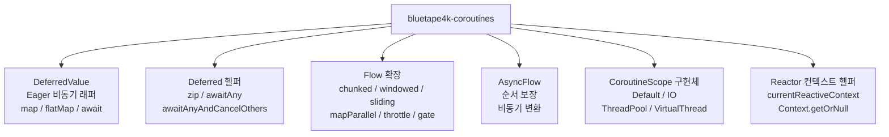
```mermaid
flowchart TD
    Coroutines["bluetape4k-coroutines"]

    DeferredValue["DeferredValue<br/>Eager 비동기 래퍼<br/>map / flatMap / await"]
    DeferredHelpers["Deferred 헬퍼<br/>zip / awaitAny<br/>awaitAnyAndCancelOthers"]
    FlowExt["Flow 확장<br/>chunked / windowed / sliding<br/>mapParallel / throttle / gate"]
    AsyncFlow["AsyncFlow<br/>순서 보장<br/>비동기 변환"]
    Scopes["CoroutineScope 구현체<br/>Default / IO<br/>ThreadPool / VirtualThread"]
    Reactor["Reactor 컨텍스트 헬퍼<br/>currentReactiveContext<br/>Context.getOrNull"]

    Coroutines --> DeferredValue
    Coroutines --> DeferredHelpers
    Coroutines --> FlowExt
    Coroutines --> AsyncFlow
    Coroutines --> Scopes
    Coroutines --> Reactor
```

---

### 클래스 다이어그램

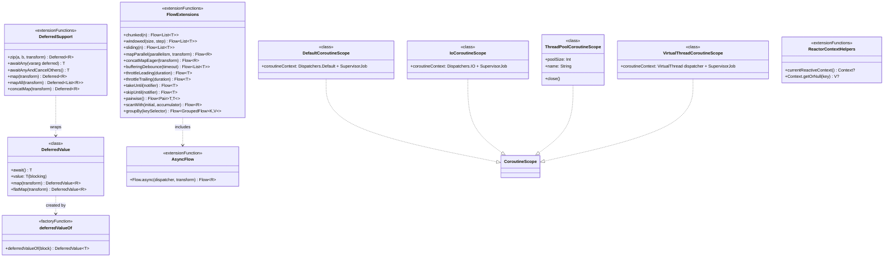
```mermaid
classDiagram
    class DeferredValue {
        <<class>>
        +await() T
        +value: T  (blocking)
        +map(transform) DeferredValue~R~
        +flatMap(transform) DeferredValue~R~
    }

    class deferredValueOf {
        <<factoryFunction>>
        +deferredValueOf(block) DeferredValue~T~
    }

    class DeferredSupport {
        <<extensionFunctions>>
        +zip(a, b, transform) Deferred~R~
        +awaitAny(vararg deferred) T
        +awaitAnyAndCancelOthers() T
        +map(transform) Deferred~R~
        +mapAll(transform) Deferred~List~R~~
        +concatMap(transform) Deferred~R~
    }

    class DefaultCoroutineScope {
        <<class>>
        +coroutineContext: Dispatchers.Default + SupervisorJob
    }

    class IoCoroutineScope {
        <<class>>
        +coroutineContext: Dispatchers.IO + SupervisorJob
    }

    class ThreadPoolCoroutineScope {
        <<class>>
        +poolSize: Int
        +name: String
        +close()
    }

    class VirtualThreadCoroutineScope {
        <<class>>
        +coroutineContext: VirtualThread dispatcher + SupervisorJob
    }

    class FlowExtensions {
        <<extensionFunctions>>
        +chunked(n) Flow~List~T~~
        +windowed(size, step) Flow~List~T~~
        +sliding(n) Flow~List~T~~
        +mapParallel(parallelism, transform) Flow~R~
        +concatMapEager(transform) Flow~R~
        +bufferingDebounce(timeout) Flow~List~T~~
        +throttleLeading(duration) Flow~T~
        +throttleTrailing(duration) Flow~T~
        +takeUntil(notifier) Flow~T~
        +skipUntil(notifier) Flow~T~
        +pairwise() Flow~Pair~T,T~~
        +scanWith(initial, accumulator) Flow~R~
        +groupBy(keySelector) Flow~GroupedFlow~K,V~~
    }

    class AsyncFlow {
        <<extensionFunction>>
        +Flow.async(dispatcher, transform) Flow~R~
    }

    class ReactorContextHelpers {
        <<extensionFunctions>>
        +currentReactiveContext() Context?
        +Context.getOrNull(key) V?
    }

    DeferredValue ..> deferredValueOf : created by
    DeferredSupport ..> DeferredValue : wraps
    DefaultCoroutineScope ..|> CoroutineScope
    IoCoroutineScope ..|> CoroutineScope
    ThreadPoolCoroutineScope ..|> CoroutineScope
    VirtualThreadCoroutineScope ..|> CoroutineScope
    FlowExtensions ..> AsyncFlow : includes

```

---

### DeferredValue 사용 흐름

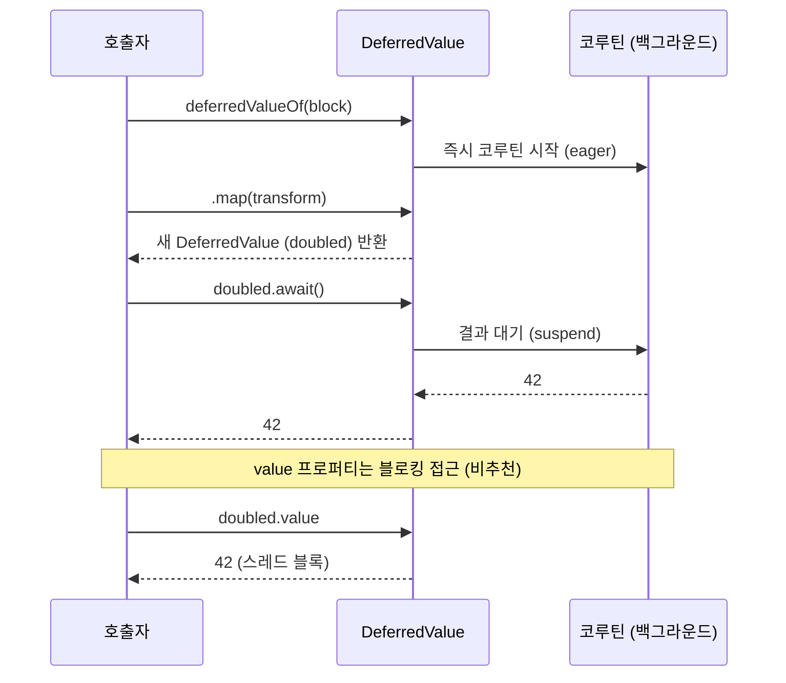
```mermaid
sequenceDiagram
    participant C as 호출자
    participant DV as DeferredValue
    participant Co as 코루틴 (백그라운드)

    C->>DV: deferredValueOf(block)
    DV->>Co: 즉시 코루틴 시작 (eager)

    C->>DV: .map(transform)
    DV-->>C: 새 DeferredValue (doubled) 반환

    C->>DV: doubled.await()
    DV->>Co: 결과 대기 (suspend)
    Co-->>DV: 42
    DV-->>C: 42

    Note over C,Co: value 프로퍼티는 블로킹 접근 (비추천)
    C->>DV: doubled.value
    DV-->>C: 42 (스레드 블록)
```

---

## 주요 기능

- **DeferredValue**: Eager 비동기 연산 래퍼, suspend(`await()`)와 블로킹(`value`) 접근 모두 지원
- **Deferred 헬퍼**: `zip`, `awaitAny`, `awaitAnyAndCancelOthers`로 여러 `Deferred` 값 조합
- **Flow 확장**: 배치 처리, 윈도잉, 병렬 매핑, 스로틀링, 게이트 제어, 병합 등 풍부한 연산자
- **AsyncFlow**: `Deferred`를 내부적으로 활용한 순서 보장 비동기 변환
- **CoroutineScope 구현체**: Default, IO, ThreadPool, VirtualThread 디스패처용 즉시 사용 가능한 스코프
- **Reactor 컨텍스트 헬퍼**: 코루틴 내부에서 Reactor `Context` 값 읽기

## 사용 예시

### DeferredValue

하나의 eager 비동기 연산에 블로킹/suspend 양쪽 접근 경로가 필요할 때 `DeferredValue`를 사용합니다.

```kotlin
import io.bluetape4k.coroutines.deferredValueOf
import io.bluetape4k.coroutines.flatMap
import io.bluetape4k.coroutines.map
import kotlinx.coroutines.delay

val source = deferredValueOf {
    delay(100)
    21
}

val doubled = source.map { it * 2 }
val tripled = source.flatMap { deferredValueOf { it * 3 } }
```

동작 특성:

- `await()`는 코루틴 내부에서 권장되는 API
- `value`는 완료될 때까지 호출 스레드를 블록
- `map` / `flatMap`은 새 `DeferredValue` 인스턴스를 생성하며 소스를 변경하지 않음

### Deferred 헬퍼

일반 `Deferred`용 헬퍼는 `io.bluetape4k.coroutines.support`에 있습니다.

```kotlin
import io.bluetape4k.coroutines.support.awaitAny
import io.bluetape4k.coroutines.support.awaitAnyAndCancelOthers
import io.bluetape4k.coroutines.support.zip
import kotlinx.coroutines.async
import kotlinx.coroutines.coroutineScope
import kotlinx.coroutines.delay

suspend fun deferredExample() = coroutineScope {
    val user = async { delay(20); "john" }
    val age = async { delay(10); 30 }

    val combined = zip(user, age) { name, years -> "$name:$years" }.await()
    val firstFinished = awaitAny(user, age)
    val winner = listOf(user, age).awaitAnyAndCancelOthers()

    Triple(combined, firstFinished, winner)
}
```

동작 특성:

- `awaitAny(...)`는 가장 먼저 완료된 결과를 반환하거나 예외를 다시 던짐
- `awaitAnyAndCancelOthers()`는 승자가 실패 또는 취소될 때 나머지도 취소
- `map`, `mapAll`, `concatMap`은 기존 `Deferred`로부터 새로운 `Deferred` 값을 파생

### Flow 확장

Flow 연산자는 `io.bluetape4k.coroutines.flow.extensions`에 있습니다.

업스트림 순서를 유지하면서 비동기 처리가 필요한 경우 `io.bluetape4k.coroutines.flow.async`를 사용합니다.

```kotlin
import io.bluetape4k.coroutines.flow.async
import kotlinx.coroutines.Dispatchers
import kotlinx.coroutines.flow.asFlow
import kotlinx.coroutines.flow.toList

suspend fun orderedAsync() =
    (1..4).asFlow()
        .async(Dispatchers.IO) { it * 100 }
        .toList()
```

```kotlin
import io.bluetape4k.coroutines.flow.extensions.chunked
import io.bluetape4k.coroutines.flow.extensions.mapParallel
import io.bluetape4k.coroutines.flow.extensions.windowed
import kotlinx.coroutines.flow.asFlow
import kotlinx.coroutines.flow.toList

suspend fun flowExample() {
    val chunks = (1..9).asFlow().chunked(3).toList()
    val windows = (1..5).asFlow().windowed(size = 3, step = 1).toList()
    val mapped = (1..4).asFlow().mapParallel(parallelism = 2) { it * 10 }.toList()
}
```

주요 진입점:

- `chunked`, `windowed`, `sliding`
- `mapParallel`
- `bufferUntilChanged`
- `takeUntil`, `skipUntil`
- `amb`, `race`, `withLatestFrom`
- `groupBy`, `publish`, `replay`

### CoroutineScope 구현체

```kotlin
import io.bluetape4k.coroutines.DefaultCoroutineScope
import io.bluetape4k.coroutines.IoCoroutineScope
import io.bluetape4k.coroutines.ThreadPoolCoroutineScope
import io.bluetape4k.coroutines.VirtualThreadCoroutineScope

val defaultScope = DefaultCoroutineScope()
val ioScope = IoCoroutineScope()
val poolScope = ThreadPoolCoroutineScope(poolSize = 4, name = "worker")
val vtScope = VirtualThreadCoroutineScope()
```

- `DefaultCoroutineScope`: `Dispatchers.Default + SupervisorJob`
- `IoCoroutineScope`: `Dispatchers.IO + SupervisorJob`
- `ThreadPoolCoroutineScope`: 고정 크기 풀, 명시적 `close()` 필요
- `VirtualThreadCoroutineScope`: 가상 스레드 디스패처 기반 스코프

### Reactor 컨텍스트 헬퍼

Reactor 전용 헬퍼는 `io.bluetape4k.coroutines.reactor`에 있습니다.

```kotlin
import io.bluetape4k.coroutines.reactor.currentReactiveContext
import io.bluetape4k.coroutines.reactor.getOrNull

suspend fun traceId(): String? =
    currentReactiveContext()?.getOrNull("traceId")
```

이 API들은 Reactor `Context`를 읽습니다. Reactor 퍼블리셔를 생성하거나 `Flow`/`Mono`/`Flux`를 브릿지하지 않습니다.

## Flow 연산자 다이어그램

### 1. Flow 확장 함수 카테고리 개요


```mermaid
flowchart TD
    FlowExt["Flow Extensions<br/>io.bluetape4k.coroutines.flow.extensions"]
    FlowExt --> Batch["배치 / 윈도우"]
    FlowExt --> Parallel["병렬 처리"]
    FlowExt --> Temporal["시간 기반 제어"]
    FlowExt --> Gate["게이트 / 필터"]
    FlowExt --> Combine["결합 / 병합"]
    FlowExt --> Accumulate["누적 / 변환"]
    FlowExt --> Async["AsyncFlow"]
    Batch --> chunked["chunked(n)"]
    Batch --> windowed["windowed(size, step)"]
    Batch --> sliding["sliding(n)"]
    Batch --> bufferedSliding["bufferedSliding(n)"]
    Batch --> bufferingDebounce["bufferingDebounce(timeout)"]
    Parallel --> mapParallel["mapParallel(parallelism)"]
    Parallel --> concatMapEager["concatMapEager { }"]
    Temporal --> throttleLeading["throttleLeading(duration)"]
    Temporal --> throttleTrailing["throttleTrailing(duration)"]
    Temporal --> throttleBoth["throttleBoth(duration)"]
    Gate --> takeUntil["takeUntil(notifier)"]
    Gate --> skipUntil["skipUntil(notifier) / dropUntil"]
    Combine --> merge["merge(flows)"]
    Combine --> amb["amb / race"]
    Combine --> withLatestFrom["withLatestFrom"]
    Combine --> zipWithNext["zipWithNext()"]
    Accumulate --> scanWith["scanWith(initial) { }"]
    Accumulate --> pairwise["pairwise()"]
    Accumulate --> groupBy["groupBy { }"]
    Async --> asyncFlow["Flow.async { }"]
```

---

### 2. `chunked(n)` — 고정 크기 청크

입력 요소를 `n`개씩 묶어 `List`로 방출합니다. 마지막 불완전 청크도 방출(`partialWindow=true` 기본값).

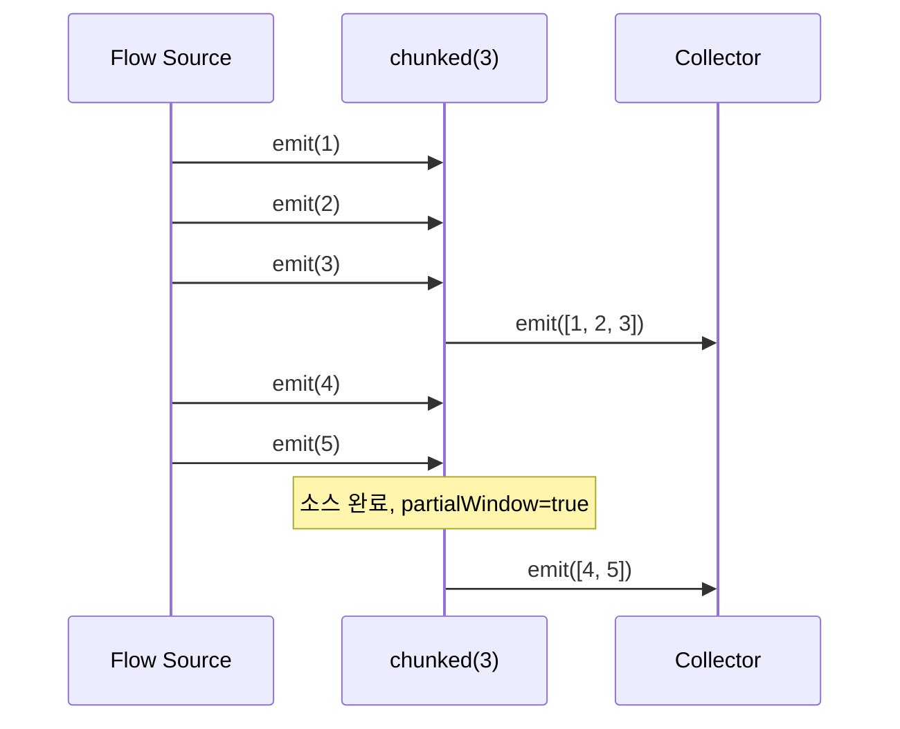
```mermaid
sequenceDiagram
    participant S as Flow Source
    participant C as chunked(3)
    participant R as Collector
    S ->> C: emit(1)
    S ->> C: emit(2)
    S ->> C: emit(3)
    C ->> R: emit([1, 2, 3])
    S ->> C: emit(4)
    S ->> C: emit(5)
    Note over C: 소스 완료, partialWindow=true
    C ->> R: emit([4, 5])
```

---

### 3. `windowed(size, step)` — 슬라이딩 윈도우

`size` 크기 윈도우를 `step`씩 이동하며 방출합니다.

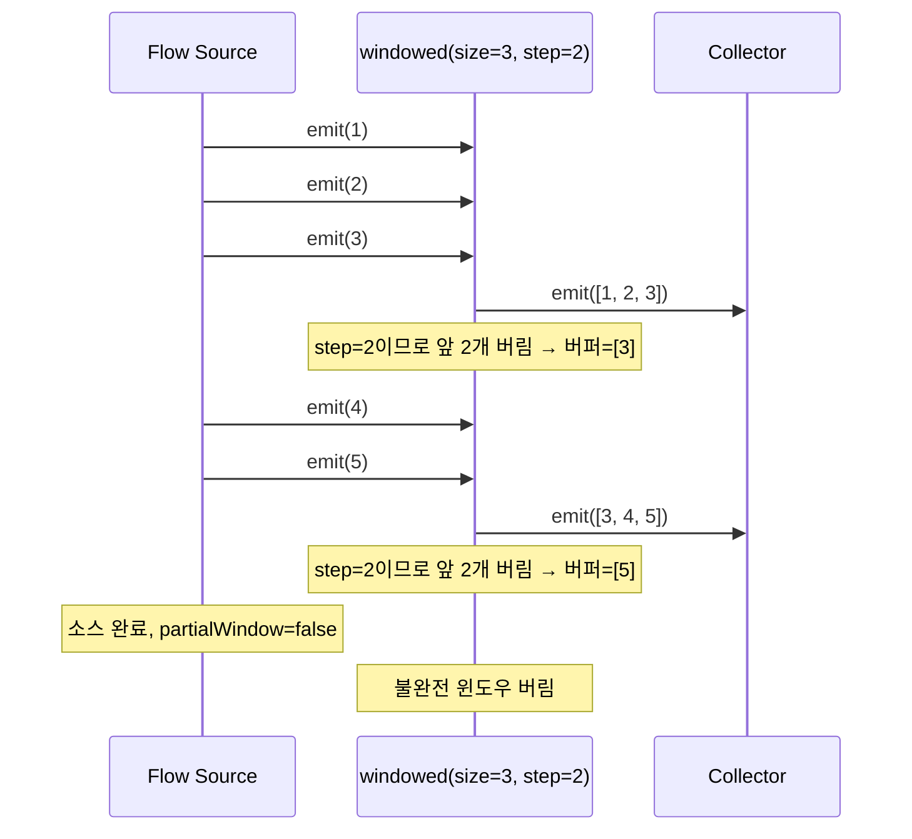
```mermaid
sequenceDiagram
    participant S as Flow Source
    participant W as windowed(size=3, step=2)
    participant R as Collector
    S ->> W: emit(1)
    S ->> W: emit(2)
    S ->> W: emit(3)
    W ->> R: emit([1, 2, 3])
    Note over W: step=2이므로 앞 2개 버림 → 버퍼=[3]
    S ->> W: emit(4)
    S ->> W: emit(5)
    W ->> R: emit([3, 4, 5])
    Note over W: step=2이므로 앞 2개 버림 → 버퍼=[5]
    Note over S: 소스 완료, partialWindow=false
    Note over W: 불완전 윈도우 버림
```

---

### 4. `sliding(n)` / `bufferedSliding(n)` — 1칸씩 이동하는 윈도우

`sliding`은 `windowed(size, step=1)`과 동일합니다. `bufferedSliding`은 버퍼를 유지하며 매 요소마다 스냅샷을 방출합니다.

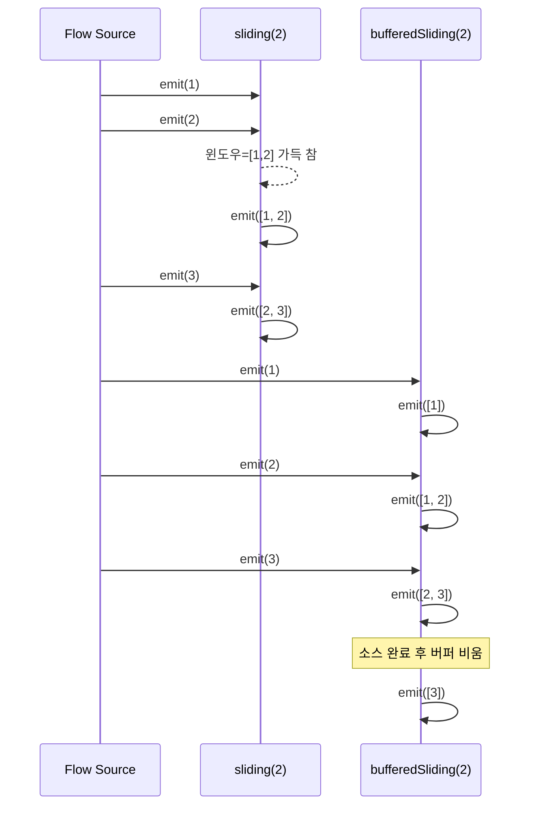
```mermaid
sequenceDiagram
    participant S as Flow Source
    participant SL as sliding(2)
    participant BS as bufferedSliding(2)
    S ->> SL: emit(1)
    S ->> SL: emit(2)
    SL -->> SL: 윈도우=[1,2] 가득 참
    SL ->> SL: emit([1, 2])
    S ->> SL: emit(3)
    SL ->> SL: emit([2, 3])
    S ->> BS: emit(1)
    BS ->> BS: emit([1])
    S ->> BS: emit(2)
    BS ->> BS: emit([1, 2])
    S ->> BS: emit(3)
    BS ->> BS: emit([2, 3])
    Note over BS: 소스 완료 후 버퍼 비움
    BS ->> BS: emit([3])
```

---

### 5. `mapParallel(parallelism)` — 병렬 변환

`parallelism` 수만큼 동시에 변환 함수를 실행합니다. 결과 순서는 보장되지 않습니다.

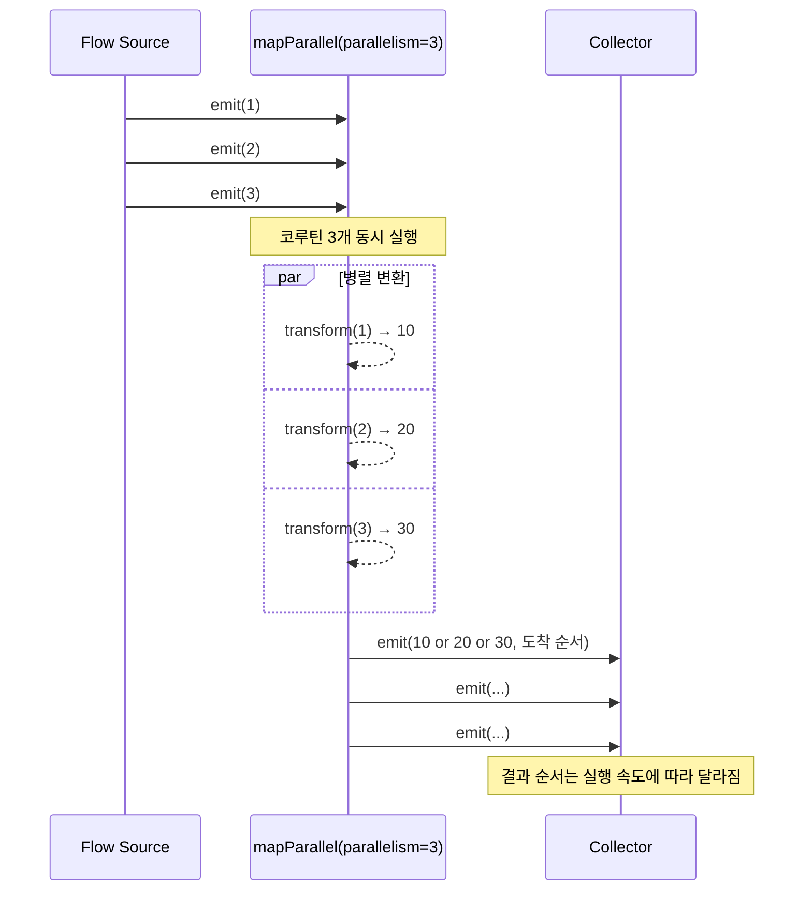
```mermaid
sequenceDiagram
    participant S as Flow Source
    participant MP as mapParallel(parallelism=3)
    participant R as Collector
    S ->> MP: emit(1)
    S ->> MP: emit(2)
    S ->> MP: emit(3)
    Note over MP: 코루틴 3개 동시 실행
    par 병렬 변환
        MP -->> MP: transform(1) → 10
    and
        MP -->> MP: transform(2) → 20
    and
        MP -->> MP: transform(3) → 30
    end
    MP ->> R: emit(10 or 20 or 30, 도착 순서)
    MP ->> R: emit(...)
    MP ->> R: emit(...)
    Note over R: 결과 순서는 실행 속도에 따라 달라짐
```

---

### 6. `concatMapEager { }` — 순서 보장 eager 병렬 수집

inner Flow를 즉시(eager) 동시 실행하되, **출력은 source 순서**를 유지합니다.

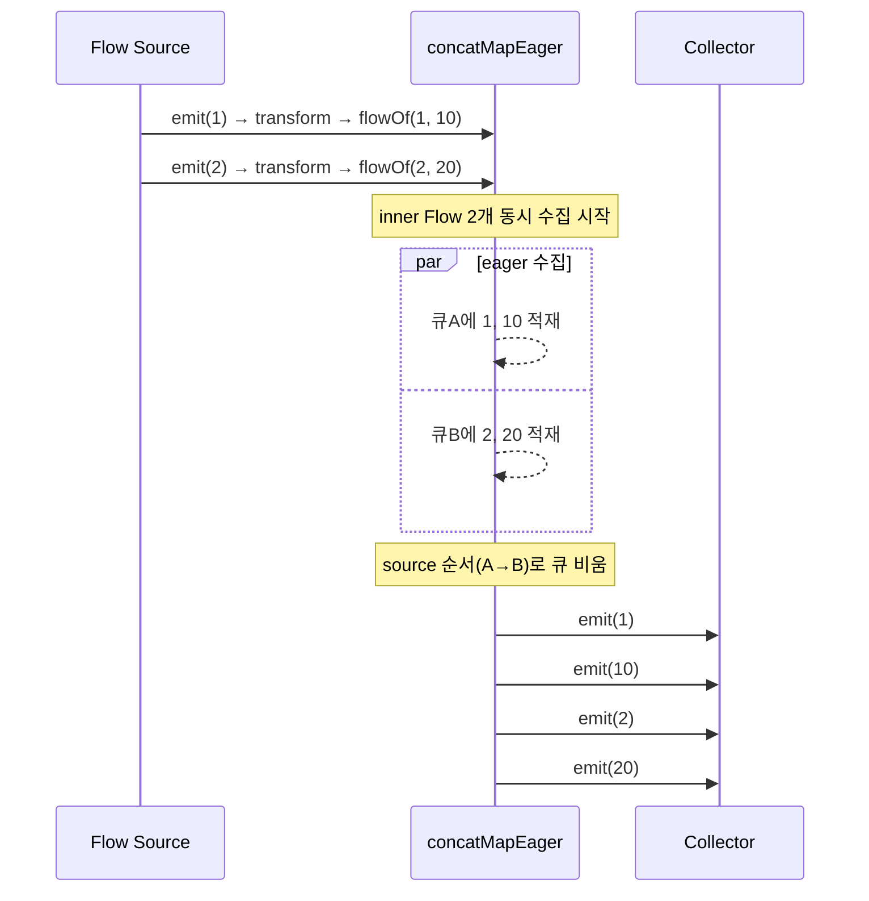
```mermaid
sequenceDiagram
    participant S as Flow Source
    participant CM as concatMapEager
    participant R as Collector
    S ->> CM: emit(1) → transform → flowOf(1, 10)
    S ->> CM: emit(2) → transform → flowOf(2, 20)
    Note over CM: inner Flow 2개 동시 수집 시작
    par eager 수집
        CM -->> CM: 큐A에 1, 10 적재
    and
        CM -->> CM: 큐B에 2, 20 적재
    end
    Note over CM: source 순서(A→B)로 큐 비움
    CM ->> R: emit(1)
    CM ->> R: emit(10)
    CM ->> R: emit(2)
    CM ->> R: emit(20)
```

---

### 7. `bufferingDebounce(timeout)` — 디바운스 배치

`timeout` 동안 들어온 값을 버퍼링해 한 번에 `List`로 방출합니다. 연속 입력이 오면 타임아웃을 갱신합니다.

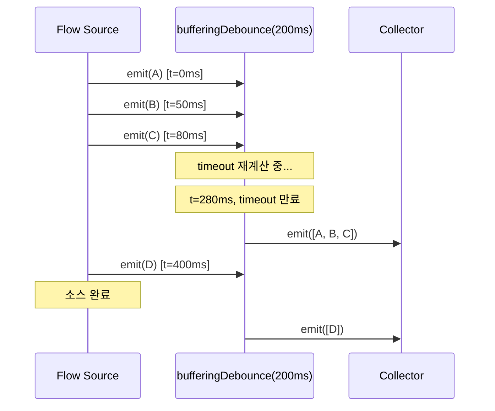
```mermaid
sequenceDiagram
    participant S as Flow Source
    participant BD as bufferingDebounce(200ms)
    participant R as Collector
    S ->> BD: emit(A) [t=0ms]
    S ->> BD: emit(B) [t=50ms]
    S ->> BD: emit(C) [t=80ms]
    Note over BD: timeout 재계산 중...
    Note over BD: t=280ms, timeout 만료
    BD ->> R: emit([A, B, C])
    S ->> BD: emit(D) [t=400ms]
    Note over S: 소스 완료
    BD ->> R: emit([D])
```

---

### 8. `throttleLeading` / `throttleTrailing` / `throttleBoth` — Throttle

고정 윈도우 내에서 첫 요소(leading), 마지막 요소(trailing), 또는 둘 다(both)를 방출합니다.

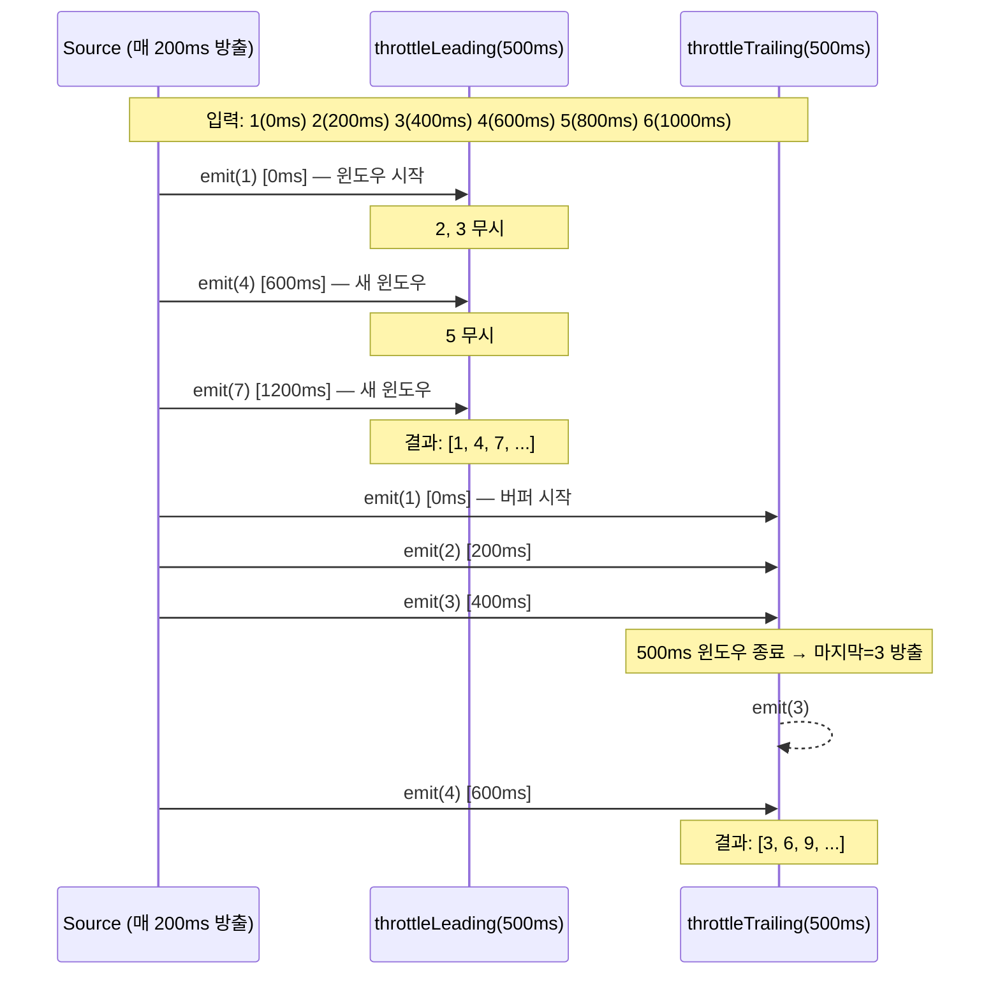
```mermaid
sequenceDiagram
    participant S as Source (매 200ms 방출)
    participant TL as throttleLeading(500ms)
    participant TT as throttleTrailing(500ms)
    Note over S, TT: 입력: 1(0ms) 2(200ms) 3(400ms) 4(600ms) 5(800ms) 6(1000ms)
    S ->> TL: emit(1) [0ms] — 윈도우 시작
    Note over TL: 2, 3 무시
    S ->> TL: emit(4) [600ms] — 새 윈도우
    Note over TL: 5 무시
    S ->> TL: emit(7) [1200ms] — 새 윈도우
    Note over TL: 결과: [1, 4, 7, ...]
    S ->> TT: emit(1) [0ms] — 버퍼 시작
    S ->> TT: emit(2) [200ms]
    S ->> TT: emit(3) [400ms]
    Note over TT: 500ms 윈도우 종료 → 마지막=3 방출
    TT -->> TT: emit(3)
    S ->> TT: emit(4) [600ms]
    Note over TT: 결과: [3, 6, 9, ...]
```

---

### 9. `takeUntil(notifier)` / `skipUntil(notifier)` — 게이트 제어

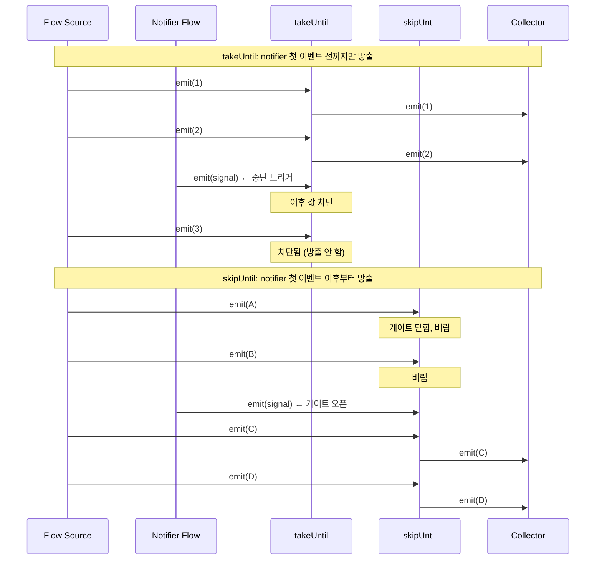
```mermaid
sequenceDiagram
    participant S as Flow Source
    participant N as Notifier Flow
    participant TU as takeUntil
    participant SU as skipUntil
    participant R as Collector
    Note over S, R: takeUntil: notifier 첫 이벤트 전까지만 방출
    S ->> TU: emit(1)
    TU ->> R: emit(1)
    S ->> TU: emit(2)
    TU ->> R: emit(2)
    N ->> TU: emit(signal) ← 중단 트리거
    Note over TU: 이후 값 차단
    S ->> TU: emit(3)
    Note over TU: 차단됨 (방출 안 함)
    Note over S, R: skipUntil: notifier 첫 이벤트 이후부터 방출
    S ->> SU: emit(A)
    Note over SU: 게이트 닫힘, 버림
    S ->> SU: emit(B)
    Note over SU: 버림
    N ->> SU: emit(signal) ← 게이트 오픈
    S ->> SU: emit(C)
    SU ->> R: emit(C)
    S ->> SU: emit(D)
    SU ->> R: emit(D)
```

---

### 10. `merge(flows)` — 비순서 병합

여러 Flow를 동시 수집해 도착 순서대로 방출합니다.

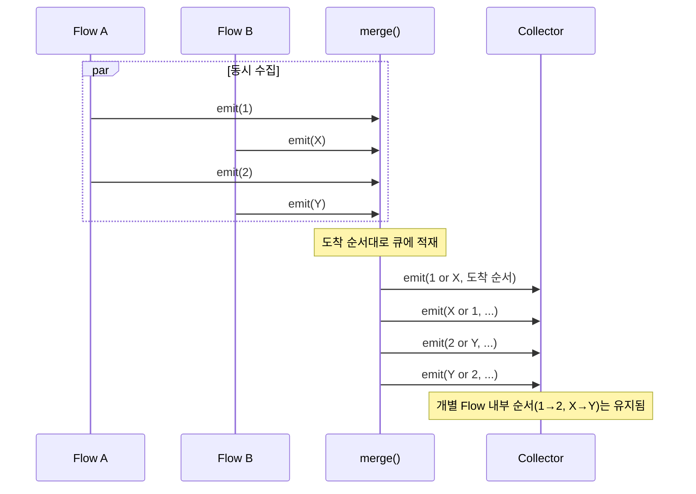
```mermaid
sequenceDiagram
    participant F1 as Flow A
    participant F2 as Flow B
    participant M as merge()
    participant R as Collector

    par 동시 수집
        F1 ->> M: emit(1)
        F2 ->> M: emit(X)
        F1 ->> M: emit(2)
        F2 ->> M: emit(Y)
    end
    Note over M: 도착 순서대로 큐에 적재
    M ->> R: emit(1 or X, 도착 순서)
    M ->> R: emit(X or 1, ...)
    M ->> R: emit(2 or Y, ...)
    M ->> R: emit(Y or 2, ...)
    Note over R: 개별 Flow 내부 순서(1→2, X→Y)는 유지됨
```

---

### 11. `pairwise()` / `zipWithNext()` — 인접 쌍

인접한 두 요소를 `Pair`로 묶거나 변환 함수를 적용합니다. `zipWithNext`는 `pairwise`의 별칭입니다.

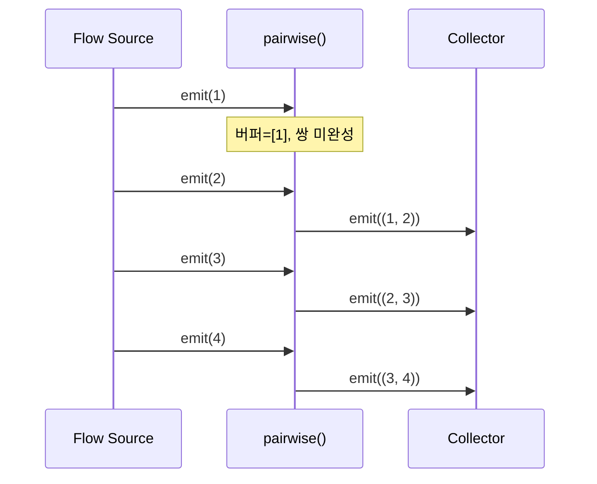
```mermaid
sequenceDiagram
    participant S as Flow Source
    participant P as pairwise()
    participant R as Collector
    S ->> P: emit(1)
    Note over P: 버퍼=[1], 쌍 미완성
    S ->> P: emit(2)
    P ->> R: emit((1, 2))
    S ->> P: emit(3)
    P ->> R: emit((2, 3))
    S ->> P: emit(4)
    P ->> R: emit((3, 4))
```

---

### 12. `scanWith(initial) { }` — 지연 초기값 누적

collect 시점에 `initialSupplier`를 호출해 초기값을 생성한 뒤 누적 결과를 방출합니다.

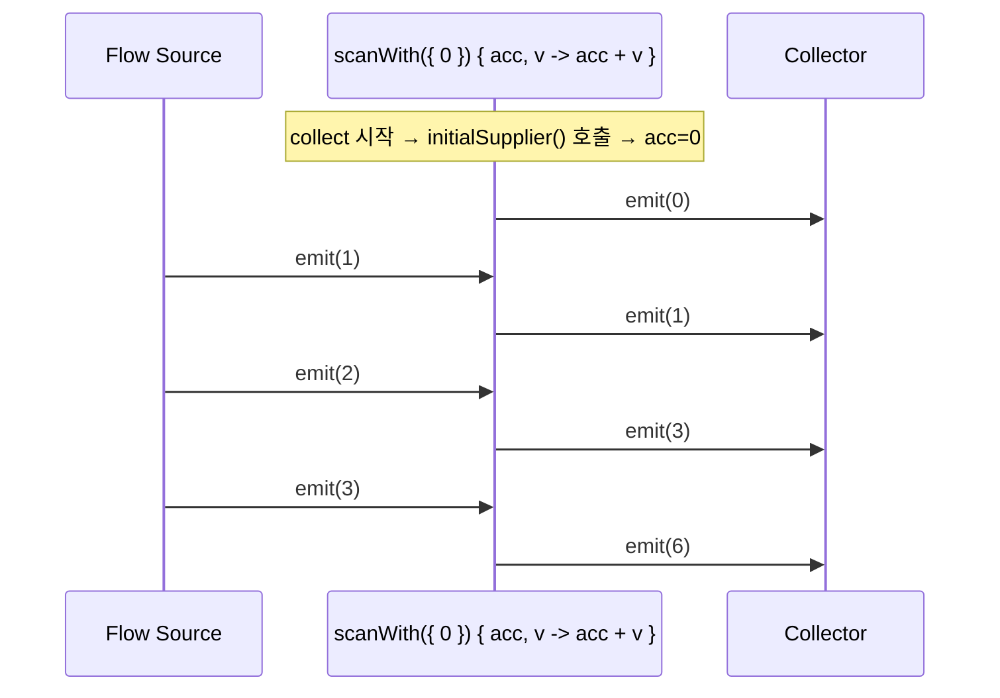
```mermaid
sequenceDiagram
    participant S as Flow Source
    participant SW as scanWith({ 0 }) { acc, v -> acc + v }
    participant R as Collector
    Note over SW: collect 시작 → initialSupplier() 호출 → acc=0
    SW ->> R: emit(0)
    S ->> SW: emit(1)
    SW ->> R: emit(1)
    S ->> SW: emit(2)
    SW ->> R: emit(3)
    S ->> SW: emit(3)
    SW ->> R: emit(6)
```

---

### 13. `AsyncFlow` — 순서 보장 비동기 변환

각 요소를 `Deferred`로 비동기 시작하지만, **결과 방출 순서는 입력 순서를 유지**합니다. `mapParallel`과 달리 순서가 보장됩니다.

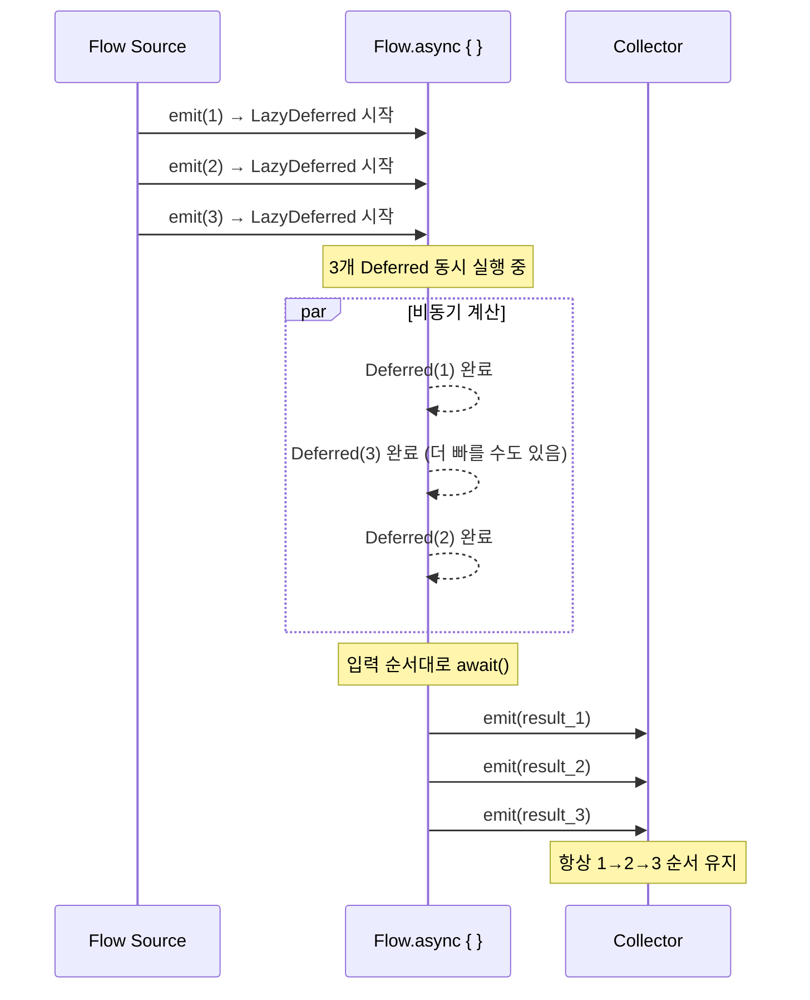
```mermaid
sequenceDiagram
    participant S as Flow Source
    participant AF as Flow.async { }
    participant R as Collector
    S ->> AF: emit(1) → LazyDeferred 시작
    S ->> AF: emit(2) → LazyDeferred 시작
    S ->> AF: emit(3) → LazyDeferred 시작
    Note over AF: 3개 Deferred 동시 실행 중
    par 비동기 계산
        AF -->> AF: Deferred(1) 완료
        AF -->> AF: Deferred(3) 완료 (더 빠를 수도 있음)
        AF -->> AF: Deferred(2) 완료
    end
    Note over AF: 입력 순서대로 await()
    AF ->> R: emit(result_1)
    AF ->> R: emit(result_2)
    AF ->> R: emit(result_3)
    Note over R: 항상 1→2→3 순서 유지
```

---

## 대표 테스트

- `src/test/kotlin/io/bluetape4k/coroutines/DeferredValueTest.kt`
- `src/test/kotlin/io/bluetape4k/coroutines/support/DeferredSupportTest.kt`
- `src/test/kotlin/io/bluetape4k/coroutines/flow/extensions/MapParallelTest.kt`

모듈 테스트 실행:

```bash
./gradlew :bluetape4k-coroutines:test
```

## 설치

```kotlin
dependencies {
    implementation("io.github.bluetape4k:bluetape4k-coroutines:${version}")
}
```

선택적 통합:

- Reactor 헬퍼는 `reactor-core`와 `kotlinx-coroutines-reactor` 필요
- 가상 스레드 스코프는 가상 스레드를 지원하는 런타임 필요
