# Module `bluetape4k-coroutines`

[English](./README.md) | 한국어

`bluetape4k-coroutines`는 Bluetape4k 전체 모듈에서 사용되는 고수준 코루틴 유틸리티를 제공합니다.

주요 기능:

- `DeferredValue` 등 비동기 값 래퍼
- `Deferred` 조합 헬퍼
- `Flow` 확장 연산자
- 재사용 가능한 `CoroutineScope` 구현체
- 선택적 Reactor 컨텍스트 조회 헬퍼

## 아키텍처

### 모듈 구성 개요

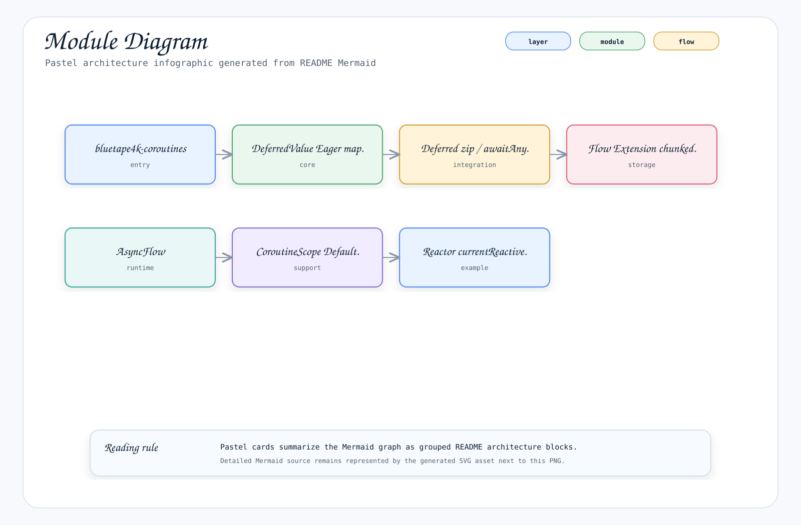

---

### 클래스 다이어그램

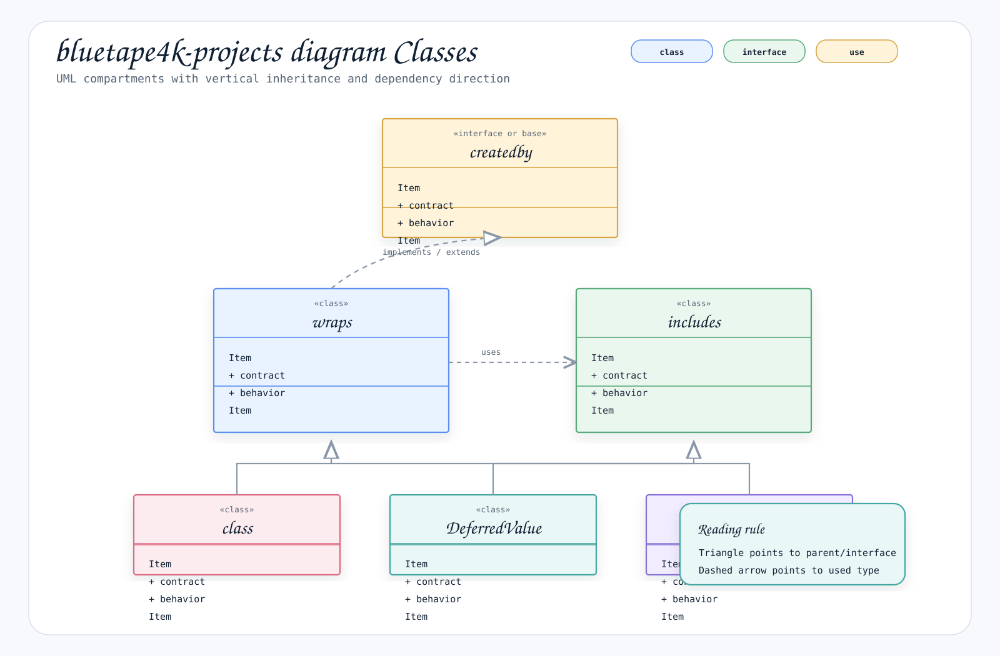

---

### DeferredValue 사용 흐름

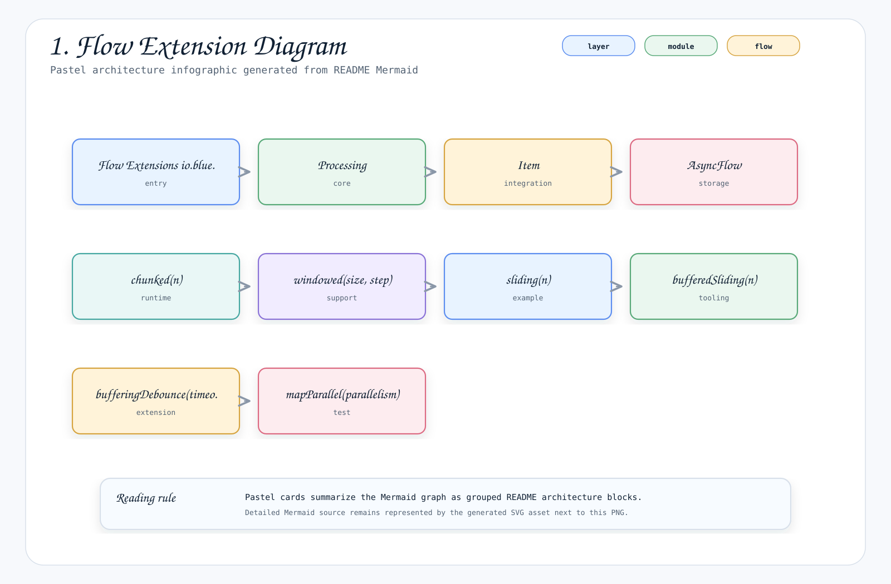

---

## 주요 기능

- **DeferredValue**: Eager 비동기 연산 래퍼, suspend(`await()`)와 블로킹(`value`) 접근 모두 지원
- **Deferred 헬퍼**: `zip`, `awaitAny`, `awaitAnyAndCancelOthers`로 여러 `Deferred` 값 조합
- **Flow 확장**: 배치 처리, 윈도잉, 병렬 매핑, 스로틀링, 게이트 제어, 병합 등 풍부한 연산자
- **AsyncFlow**: `Deferred`를 내부적으로 활용한 순서 보장 비동기 변환
- **CoroutineScope 구현체**: Default, IO, ThreadPool, VirtualThread 디스패처용 즉시 사용 가능한 스코프
- **Reactor 컨텍스트 헬퍼**: 코루틴 내부에서 Reactor `Context` 값 읽기

## 사용 예시

### DeferredValue

하나의 eager 비동기 연산에 블로킹/suspend 양쪽 접근 경로가 필요할 때 `DeferredValue`를 사용합니다.

```kotlin
import io.bluetape4k.coroutines.deferredValueOf
import io.bluetape4k.coroutines.flatMap
import io.bluetape4k.coroutines.map
import kotlinx.coroutines.delay

val source = deferredValueOf {
    delay(100)
    21
}

val doubled = source.map { it * 2 }
val tripled = source.flatMap { deferredValueOf { it * 3 } }
```

동작 특성:

- `await()`는 코루틴 내부에서 권장되는 API
- `value`는 완료될 때까지 호출 스레드를 블록
- `map` / `flatMap`은 새 `DeferredValue` 인스턴스를 생성하며 소스를 변경하지 않음

### Deferred 헬퍼

일반 `Deferred`용 헬퍼는 `io.bluetape4k.coroutines.support`에 있습니다.

```kotlin
import io.bluetape4k.coroutines.support.awaitAny
import io.bluetape4k.coroutines.support.awaitAnyAndCancelOthers
import io.bluetape4k.coroutines.support.zip
import kotlinx.coroutines.async
import kotlinx.coroutines.coroutineScope
import kotlinx.coroutines.delay

suspend fun deferredExample() = coroutineScope {
    val user = async { delay(20); "john" }
    val age = async { delay(10); 30 }

    val combined = zip(user, age) { name, years -> "$name:$years" }.await()
    val firstFinished = awaitAny(user, age)
    val winner = listOf(user, age).awaitAnyAndCancelOthers()

    Triple(combined, firstFinished, winner)
}
```

동작 특성:

- `awaitAny(...)`는 가장 먼저 완료된 결과를 반환하거나 예외를 다시 던짐
- `awaitAnyAndCancelOthers()`는 승자가 실패 또는 취소될 때 나머지도 취소
- 부모 coroutine 취소는 즉시 다시 던지며, child `Deferred` 자체 취소만 승자 결과로 취급
- `map`, `mapAll`, `concatMap`은 기존 `Deferred`로부터 새로운 `Deferred` 값을 파생

### Flow 확장

Flow 연산자는 `io.bluetape4k.coroutines.flow.extensions`에 있습니다.

업스트림 순서를 유지하면서 비동기 처리가 필요한 경우 `io.bluetape4k.coroutines.flow.async`를 사용합니다.

```kotlin
import io.bluetape4k.coroutines.flow.async
import kotlinx.coroutines.Dispatchers
import kotlinx.coroutines.flow.asFlow
import kotlinx.coroutines.flow.toList

suspend fun orderedAsync() =
    (1..4).asFlow()
        .async(Dispatchers.IO) { it * 100 }
        .toList()
```

```kotlin
import io.bluetape4k.coroutines.flow.extensions.chunked
import io.bluetape4k.coroutines.flow.extensions.mapParallel
import io.bluetape4k.coroutines.flow.extensions.windowed
import kotlinx.coroutines.flow.asFlow
import kotlinx.coroutines.flow.toList

suspend fun flowExample() {
    val chunks = (1..9).asFlow().chunked(3).toList()
    val windows = (1..5).asFlow().windowed(size = 3, step = 1).toList()
    val mapped = (1..4).asFlow().mapParallel(parallelism = 2) { it * 10 }.toList()
}
```

주요 진입점:

- `chunked`, `windowed`, `sliding`
- `mapParallel`
- `bufferUntilChanged`
- `takeUntil`, `skipUntil`
- `amb`, `race`, `withLatestFrom`
- `groupBy`, `publish`, `replay`

### Subject

Subject 구현체는 producer와 collector를 연결하는 hot `Flow` 브릿지입니다.

```kotlin
import io.bluetape4k.coroutines.flow.extensions.subject.BehaviorSubject
import io.bluetape4k.coroutines.flow.extensions.subject.PublishSubject
import io.bluetape4k.coroutines.flow.extensions.subject.awaitCollector
import kotlinx.coroutines.coroutineScope
import kotlinx.coroutines.flow.take
import kotlinx.coroutines.flow.toList
import kotlinx.coroutines.launch

suspend fun subjectExample() = coroutineScope {
    val latest = BehaviorSubject(0)
    latest.emit(1)
    latest.complete()

    val events = PublishSubject<Int>()
    val collected = mutableListOf<Int>()
    val job = launch { events.take(2).toList(collected) }
    events.awaitCollector()
    events.emit(10)
    events.emit(20)
    job.join()
}
```

동작 특성:

- `BehaviorSubject`는 최신 값을 저장하고 새 collector에게 재생
- `PublishSubject`는 과거 값을 재생하지 않고 현재 collector에게만 전달
- `emit`, `emitError`, `complete`는 이미 제거된 collector의 취소는 무시하되 caller coroutine 취소는 보존

### CoroutineScope 구현체

```kotlin
import io.bluetape4k.coroutines.DefaultCoroutineScope
import io.bluetape4k.coroutines.IoCoroutineScope
import io.bluetape4k.coroutines.ThreadPoolCoroutineScope
import io.bluetape4k.coroutines.VirtualThreadCoroutineScope

val defaultScope = DefaultCoroutineScope()
val ioScope = IoCoroutineScope()
val poolScope = ThreadPoolCoroutineScope(poolSize = 4, name = "worker")
val vtScope = VirtualThreadCoroutineScope()
```

- `DefaultCoroutineScope`: `Dispatchers.Default + SupervisorJob`
- `IoCoroutineScope`: `Dispatchers.IO + SupervisorJob`
- `ThreadPoolCoroutineScope`: 고정 크기 풀, 명시적 `close()` 필요
- `VirtualThreadCoroutineScope`: 가상 스레드 디스패처 기반 스코프

### 구조화된 동시성 — StructuredTaskScope 브릿지

`StructuredConcurrency.kt`는 JDK `StructuredTaskScope`(가상 스레드 구조화된 동시성)와 Kotlin Coroutines를 연결하며, `Dispatchers.VT`에서 실행되는 DSL 스타일 suspend 함수를 제공합니다.

#### suspend 진입점

| 함수 | 동작 | 내부 구현 |
|---|---|---|
| `taskScope { }` | Fail-fast: 첫 실패 시 나머지 subtask 즉시 중단 | `StructuredTaskScopes.failFast` |
| `failFastTaskScope { }` | `taskScope`의 의도 명확 별칭 | `StructuredTaskScopes.failFast` |
| `firstSuccessTaskScope<T> { }` | First-success: 가장 빠른 성공 결과 반환, 나머지 취소 | `StructuredTaskScopes.firstSuccess` |
| `supervisedTaskScope<T, R> { }` | Supervised: 모든 subtask 실행, 부분 실패 허용 | `StructuredTaskScopes.supervised` |

#### async(비동기) 진입점

| 함수 | 반환값 | 용도 |
|---|---|---|
| `CoroutineScope.asyncTaskScope { }` | `Deferred<T>` | `awaitAll`로 병렬 fail-fast scope |
| `CoroutineScope.asyncSupervisedTaskScope<T, R> { }` | `Deferred<R>` | `awaitAll`로 병렬 supervised scope |

블록 내부에서 `this`가 scope이므로 `fork { }`, `join()`, `throwIfFailed()`, `results()` 등을 직접 호출합니다.

```kotlin
import io.bluetape4k.coroutines.taskScope
import io.bluetape4k.coroutines.firstSuccessTaskScope
import io.bluetape4k.coroutines.supervisedTaskScope
import io.bluetape4k.coroutines.asyncTaskScope

// Fail-fast: 모든 subtask 성공 필요
val sum = taskScope {
    val a = fork { fetchA() }
    val b = fork { fetchB() }
    join().throwIfFailed()
    a.get() + b.get()
}

// First-success: 가장 빠른 소스 선택
val result = firstSuccessTaskScope<String> {
    fork { fetchFromPrimary() }
    fork { fetchFromFallback() }
    join().result { IllegalStateException("모든 소스 실패") }
}

// Supervised: 부분 실패 허용
val allResults = supervisedTaskScope<Int, List<Result<Int>>> {
    fork { 1 }
    fork { throw RuntimeException("subtask 실패") }
    fork { 3 }
    join()
    results()
}
// allResults.filter { it.isSuccess }.map { it.getOrThrow() } == [1, 3]

// Async: 병렬 fail-fast scope
val d1 = asyncTaskScope { val t = fork { fetchA() }; join().throwIfFailed(); t.get() }
val d2 = asyncTaskScope { val t = fork { fetchB() }; join().throwIfFailed(); t.get() }
val (r1, r2) = awaitAll(d1, d2)
```

동작 특성:

- 모든 suspend 변형은 `withContext(Dispatchers.VT)` 내에서 실행 — blocking `join()`이 가상 스레드로 오프로드됨
- `async` 변형은 즉시 `Deferred<T>`를 반환하며 백그라운드에서 실행; 실패를 테스트할 때는 `supervisorScope { }`로 격리 필요
- `joinUntil(deadline)` 데드라인 초과 시 `TimeoutException` 발생

### Reactor 컨텍스트 헬퍼

Reactor 전용 헬퍼는 `io.bluetape4k.coroutines.reactor`에 있습니다.

```kotlin
import io.bluetape4k.coroutines.reactor.currentReactiveContext
import io.bluetape4k.coroutines.reactor.getOrNull

suspend fun traceId(): String? =
    currentReactiveContext()?.getOrNull("traceId")
```

이 API들은 Reactor `Context`를 읽습니다. Reactor 퍼블리셔를 생성하거나 `Flow`/`Mono`/`Flux`를 브릿지하지 않습니다.

## Flow 연산자 다이어그램

### 1. Flow 확장 함수 카테고리 개요


---

### 2. `chunked(n)` — 고정 크기 청크

입력 요소를 `n`개씩 묶어 `List`로 방출합니다. 마지막 불완전 청크도 방출(`partialWindow=true` 기본값).

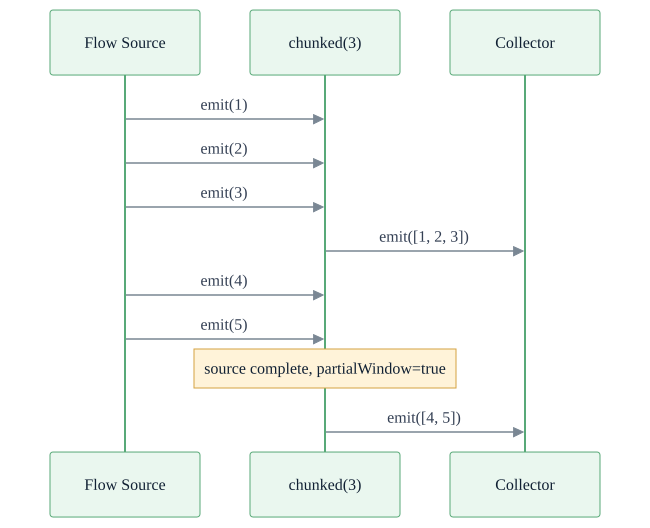

---

### 3. `windowed(size, step)` — 슬라이딩 윈도우

`size` 크기 윈도우를 `step`씩 이동하며 방출합니다.

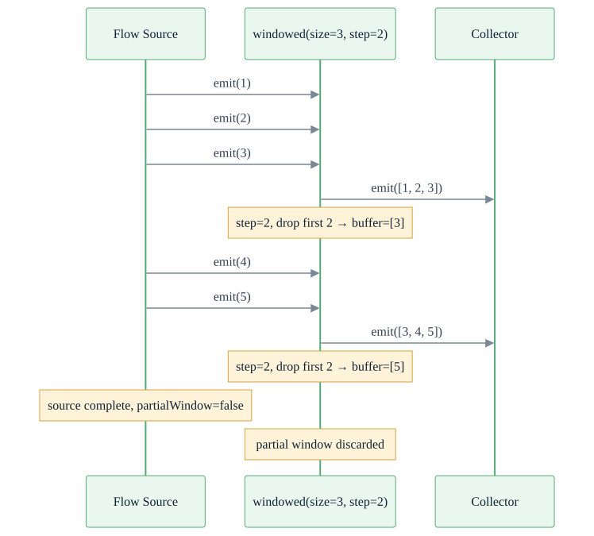

---

### 4. `sliding(n)` / `bufferedSliding(n)` — 1칸씩 이동하는 윈도우

`sliding`은 `windowed(size, step=1)`과 동일합니다. `bufferedSliding`은 버퍼를 유지하며 매 요소마다 스냅샷을 방출합니다.

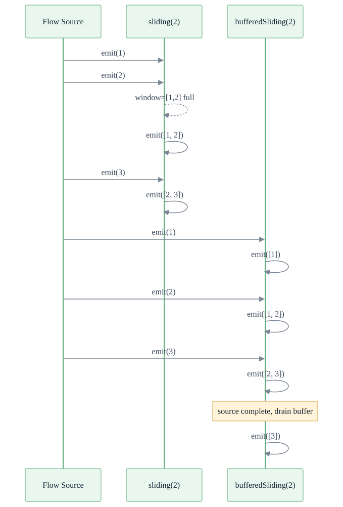

---

### 5. `mapParallel(parallelism)` — 병렬 변환

`parallelism` 수만큼 동시에 변환 함수를 실행합니다. 결과 순서는 보장되지 않습니다.

> **성능 개선 (2026-04-21)**: `FlowParallel`과 `FlowSequential`을 레일별 `Channel` 버퍼와 `select` 기반 fan-in으로 재설계했습니다. 벤치마크 결과 전체 병렬 연산자 처리량이 **geomean +32.7%** 향상되었으며, `mapParallel`은 최대 **+506%** 성능이 개선되었습니다. `AsyncFlow`도 `LazyDeferred` 원자 래퍼 제거로 성능이 향상되었습니다.

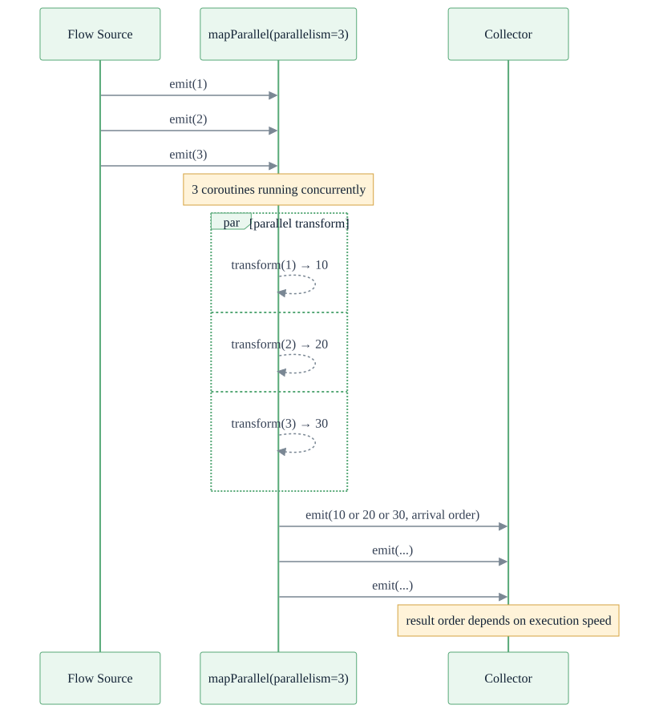

---

### 6. `concatMapEager { }` — 순서 보장 eager 병렬 수집

inner Flow를 즉시(eager) 동시 실행하되, **출력은 source 순서**를 유지합니다.

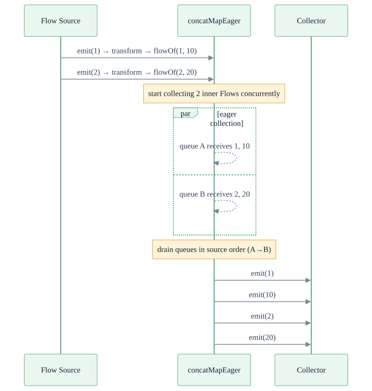

---

### 7. `bufferingDebounce(timeout)` — 디바운스 배치

`timeout` 동안 들어온 값을 버퍼링해 한 번에 `List`로 방출합니다. 연속 입력이 오면 타임아웃을 갱신합니다.

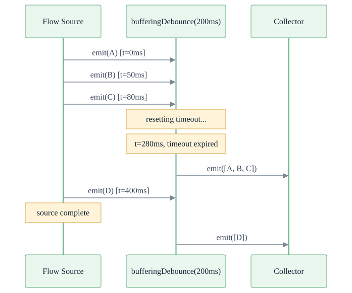

---

### 8. `throttleLeading` / `throttleTrailing` / `throttleBoth` — Throttle

고정 윈도우 내에서 첫 요소(leading), 마지막 요소(trailing), 또는 둘 다(both)를 방출합니다.

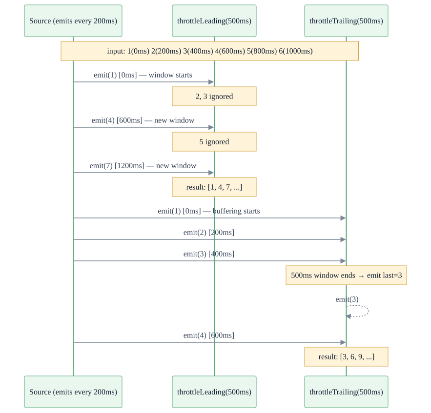

---

### 9. `takeUntil(notifier)` / `skipUntil(notifier)` — 게이트 제어

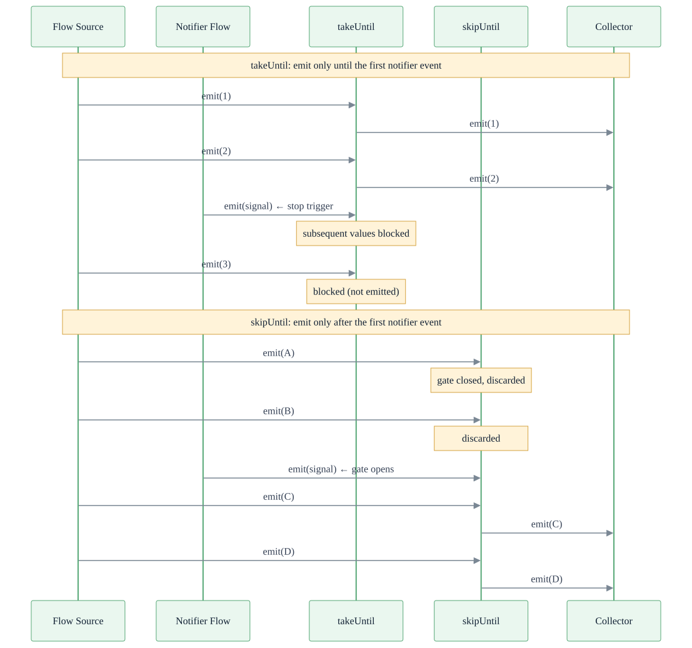

---

### 10. `merge(flows)` — 비순서 병합

여러 Flow를 동시 수집해 도착 순서대로 방출합니다.

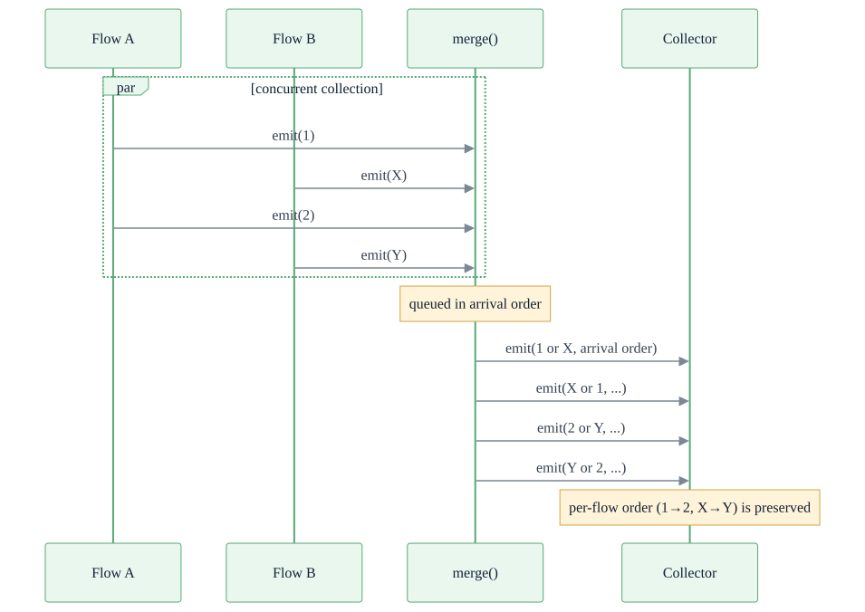

---

### 11. `pairwise()` / `zipWithNext()` — 인접 쌍

인접한 두 요소를 `Pair`로 묶거나 변환 함수를 적용합니다. `zipWithNext`는 `pairwise`의 별칭입니다.

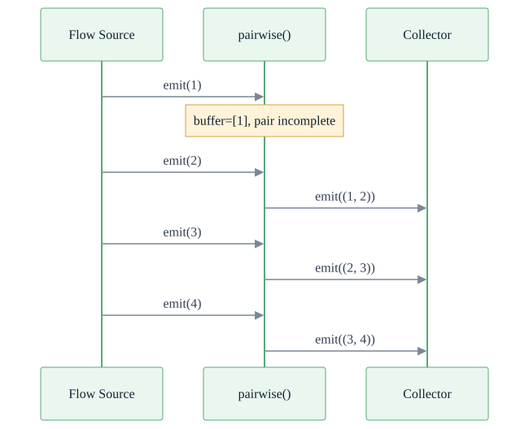

---

### 12. `scanWith(initial) { }` — 지연 초기값 누적

collect 시점에 `initialSupplier`를 호출해 초기값을 생성한 뒤 누적 결과를 방출합니다.

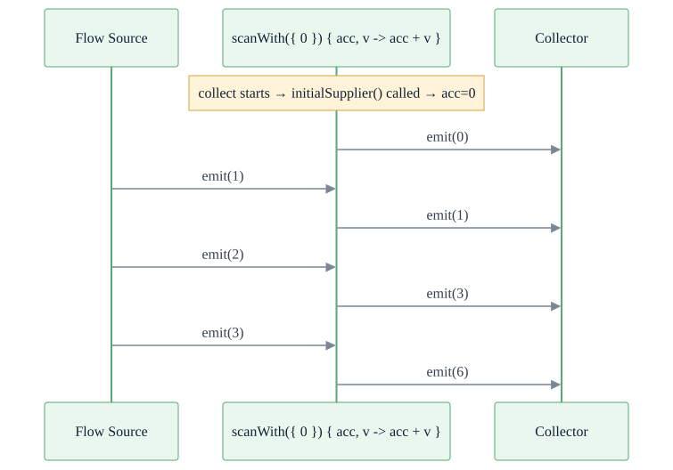

---

### 13. `AsyncFlow` — 순서 보장 비동기 변환

각 요소를 `Deferred`로 비동기 시작하지만, **결과 방출 순서는 입력 순서를 유지**합니다. `mapParallel`과 달리 순서가 보장됩니다.

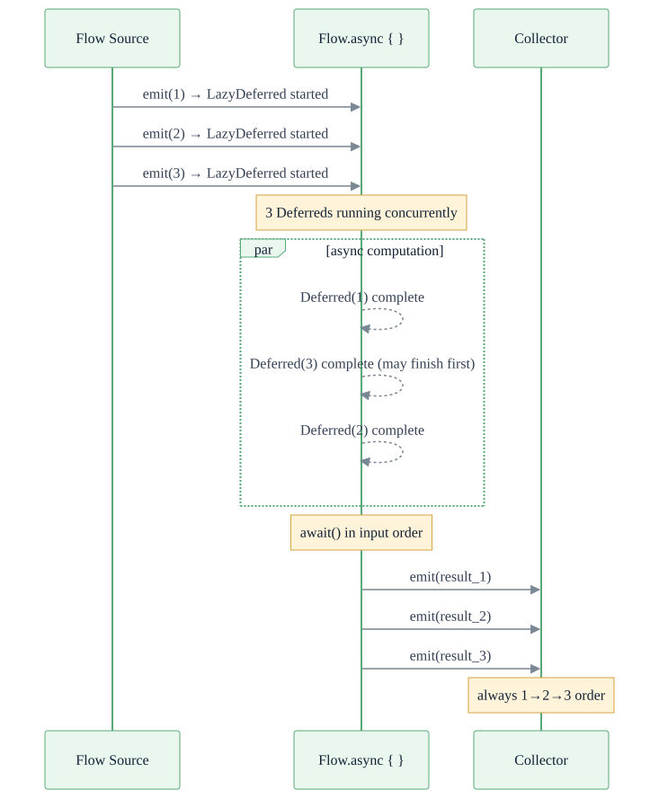

---

## 대표 테스트

- `src/test/kotlin/io/bluetape4k/coroutines/DeferredValueTest.kt`
- `src/test/kotlin/io/bluetape4k/coroutines/support/DeferredSupportTest.kt`
- `src/test/kotlin/io/bluetape4k/coroutines/flow/extensions/MapParallelTest.kt`

모듈 테스트 실행:

```bash
./gradlew :bluetape4k-coroutines:test
```

## 설치

```kotlin
dependencies {
    implementation("io.github.bluetape4k:bluetape4k-coroutines:${version}")
}
```

선택적 통합:

- Reactor 헬퍼는 `reactor-core`와 `kotlinx-coroutines-reactor` 필요
- 가상 스레드 스코프는 가상 스레드를 지원하는 런타임 필요
