# Module `bluetape4k-coroutines`

English | [한국어](./README.ko.md)

`bluetape4k-coroutines` provides higher-level coroutine utilities used across the Bluetape4k modules.

It focuses on:

- async value wrappers such as `DeferredValue`
- `Deferred` coordination helpers
- `Flow` extension operators
- reusable `CoroutineScope` implementations
- optional Reactor context lookup helpers

## Architecture

### Module Overview

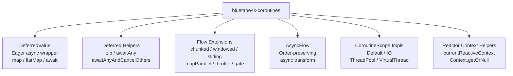
```mermaid
flowchart TD
    Coroutines["bluetape4k-coroutines"]

    DeferredValue["DeferredValue<br/>Eager async wrapper<br/>map / flatMap / await"]
    DeferredHelpers["Deferred Helpers<br/>zip / awaitAny<br/>awaitAnyAndCancelOthers"]
    FlowExt["Flow Extensions<br/>chunked / windowed / sliding<br/>mapParallel / throttle / gate"]
    AsyncFlow["AsyncFlow<br/>Order-preserving<br/>async transform"]
    Scopes["CoroutineScope Impls<br/>Default / IO<br/>ThreadPool / VirtualThread"]
    Reactor["Reactor Context Helpers<br/>currentReactiveContext<br/>Context.getOrNull"]

    Coroutines --> DeferredValue
    Coroutines --> DeferredHelpers
    Coroutines --> FlowExt
    Coroutines --> AsyncFlow
    Coroutines --> Scopes
    Coroutines --> Reactor
```

---

### Class Diagram

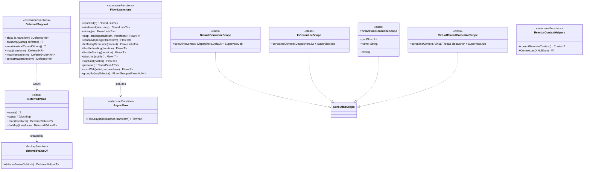
```mermaid
classDiagram
    class DeferredValue {
        <<class>>
        +await() T
        +value: T  (blocking)
        +map(transform) DeferredValue~R~
        +flatMap(transform) DeferredValue~R~
    }

    class deferredValueOf {
        <<factoryFunction>>
        +deferredValueOf(block) DeferredValue~T~
    }

    class DeferredSupport {
        <<extensionFunctions>>
        +zip(a, b, transform) Deferred~R~
        +awaitAny(vararg deferred) T
        +awaitAnyAndCancelOthers() T
        +map(transform) Deferred~R~
        +mapAll(transform) Deferred~List~R~~
        +concatMap(transform) Deferred~R~
    }

    class DefaultCoroutineScope {
        <<class>>
        +coroutineContext: Dispatchers.Default + SupervisorJob
    }

    class IoCoroutineScope {
        <<class>>
        +coroutineContext: Dispatchers.IO + SupervisorJob
    }

    class ThreadPoolCoroutineScope {
        <<class>>
        +poolSize: Int
        +name: String
        +close()
    }

    class VirtualThreadCoroutineScope {
        <<class>>
        +coroutineContext: VirtualThread dispatcher + SupervisorJob
    }

    class FlowExtensions {
        <<extensionFunctions>>
        +chunked(n) Flow~List~T~~
        +windowed(size, step) Flow~List~T~~
        +sliding(n) Flow~List~T~~
        +mapParallel(parallelism, transform) Flow~R~
        +concatMapEager(transform) Flow~R~
        +bufferingDebounce(timeout) Flow~List~T~~
        +throttleLeading(duration) Flow~T~
        +throttleTrailing(duration) Flow~T~
        +takeUntil(notifier) Flow~T~
        +skipUntil(notifier) Flow~T~
        +pairwise() Flow~Pair~T,T~~
        +scanWith(initial, accumulator) Flow~R~
        +groupBy(keySelector) Flow~GroupedFlow~K,V~~
    }

    class AsyncFlow {
        <<extensionFunction>>
        +Flow.async(dispatcher, transform) Flow~R~
    }

    class ReactorContextHelpers {
        <<extensionFunctions>>
        +currentReactiveContext() Context?
        +Context.getOrNull(key) V?
    }

    DeferredValue ..> deferredValueOf : created by
    DeferredSupport ..> DeferredValue : wraps
    DefaultCoroutineScope ..|> CoroutineScope
    IoCoroutineScope ..|> CoroutineScope
    ThreadPoolCoroutineScope ..|> CoroutineScope
    VirtualThreadCoroutineScope ..|> CoroutineScope
    FlowExtensions ..> AsyncFlow : includes

```

---

### DeferredValue Usage Flow

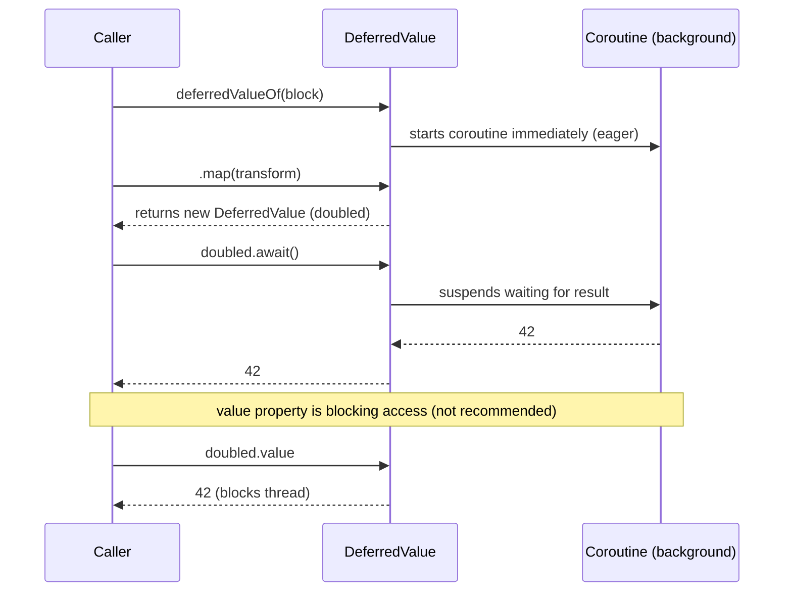
```mermaid
sequenceDiagram
    participant C as Caller
    participant DV as DeferredValue
    participant Co as Coroutine (background)

    C->>DV: deferredValueOf(block)
    DV->>Co: starts coroutine immediately (eager)

    C->>DV: .map(transform)
    DV-->>C: returns new DeferredValue (doubled)

    C->>DV: doubled.await()
    DV->>Co: suspends waiting for result
    Co-->>DV: 42
    DV-->>C: 42

    Note over C,Co: value property is blocking access (not recommended)
    C->>DV: doubled.value
    DV-->>C: 42 (blocks thread)
```

---

## Key Features

- **DeferredValue**: Eager async computation wrapper with both suspend (`await()`) and blocking (`value`) access
- **Deferred Helpers**: `zip`, `awaitAny`, `awaitAnyAndCancelOthers` for coordinating multiple `Deferred` values
- **Flow Extensions**: Rich set of operators — batching, windowing, parallel mapping, throttling, gate control, merging
- **AsyncFlow**: Order-preserving async transformation using `Deferred` internally
- **CoroutineScope Implementations**: Ready-to-use scopes for Default, IO, ThreadPool, and Virtual Thread dispatchers
- **Reactor Context Helpers**: Read Reactor `Context` values from within coroutines

## Usage Examples

### DeferredValue

Use `DeferredValue` when you want one eager async computation with both blocking and suspending access paths.

```kotlin
import io.bluetape4k.coroutines.deferredValueOf
import io.bluetape4k.coroutines.flatMap
import io.bluetape4k.coroutines.map
import kotlinx.coroutines.delay

val source = deferredValueOf {
    delay(100)
    21
}

val doubled = source.map { it * 2 }
val tripled = source.flatMap { deferredValueOf { it * 3 } }
```

Behavior notes:

- `await()` is the preferred API inside coroutines
- `value` blocks the calling thread until completion
- `map` / `flatMap` create new `DeferredValue` instances and do not mutate the source

### Deferred Helpers

Helpers for plain `Deferred` live in `io.bluetape4k.coroutines.support`.

```kotlin
import io.bluetape4k.coroutines.support.awaitAny
import io.bluetape4k.coroutines.support.awaitAnyAndCancelOthers
import io.bluetape4k.coroutines.support.zip
import kotlinx.coroutines.async
import kotlinx.coroutines.coroutineScope
import kotlinx.coroutines.delay

suspend fun deferredExample() = coroutineScope {
    val user = async { delay(20); "john" }
    val age = async { delay(10); 30 }

    val combined = zip(user, age) { name, years -> "$name:$years" }.await()
    val firstFinished = awaitAny(user, age)
    val winner = listOf(user, age).awaitAnyAndCancelOthers()

    Triple(combined, firstFinished, winner)
}
```

Behavior notes:

- `awaitAny(...)` returns or rethrows the earliest completed result
- `awaitAnyAndCancelOthers()` also cancels losers when the winner finishes with failure or cancellation
- `map`, `mapAll`, and `concatMap` derive new `Deferred` values from an existing one

### Flow Extensions

Flow operators live in `io.bluetape4k.coroutines.flow.extensions`.

If you need asynchronous processing while preserving upstream order, use `io.bluetape4k.coroutines.flow.async`.

```kotlin
import io.bluetape4k.coroutines.flow.async
import kotlinx.coroutines.Dispatchers
import kotlinx.coroutines.flow.asFlow
import kotlinx.coroutines.flow.toList

suspend fun orderedAsync() =
    (1..4).asFlow()
        .async(Dispatchers.IO) { it * 100 }
        .toList()
```

```kotlin
import io.bluetape4k.coroutines.flow.extensions.chunked
import io.bluetape4k.coroutines.flow.extensions.mapParallel
import io.bluetape4k.coroutines.flow.extensions.windowed
import kotlinx.coroutines.flow.asFlow
import kotlinx.coroutines.flow.toList

suspend fun flowExample() {
    val chunks = (1..9).asFlow().chunked(3).toList()
    val windows = (1..5).asFlow().windowed(size = 3, step = 1).toList()
    val mapped = (1..4).asFlow().mapParallel(parallelism = 2) { it * 10 }.toList()
}
```

Useful entry points:

- `chunked`, `windowed`, `sliding`
- `mapParallel`
- `bufferUntilChanged`
- `takeUntil`, `skipUntil`
- `amb`, `race`, `withLatestFrom`
- `groupBy`, `publish`, `replay`

### CoroutineScope Implementations

```kotlin
import io.bluetape4k.coroutines.DefaultCoroutineScope
import io.bluetape4k.coroutines.IoCoroutineScope
import io.bluetape4k.coroutines.ThreadPoolCoroutineScope
import io.bluetape4k.coroutines.VirtualThreadCoroutineScope

val defaultScope = DefaultCoroutineScope()
val ioScope = IoCoroutineScope()
val poolScope = ThreadPoolCoroutineScope(poolSize = 4, name = "worker")
val vtScope = VirtualThreadCoroutineScope()
```

- `DefaultCoroutineScope`: `Dispatchers.Default + SupervisorJob`
- `IoCoroutineScope`: `Dispatchers.IO + SupervisorJob`
- `ThreadPoolCoroutineScope`: fixed-size pool with explicit `close()`
- `VirtualThreadCoroutineScope`: virtual-thread dispatcher backed scope

### Reactor Context Helpers

Reactor-specific helpers live in `io.bluetape4k.coroutines.reactor`.

```kotlin
import io.bluetape4k.coroutines.reactor.currentReactiveContext
import io.bluetape4k.coroutines.reactor.getOrNull

suspend fun traceId(): String? =
    currentReactiveContext()?.getOrNull("traceId")
```

These APIs read Reactor `Context`. They do not create Reactor publishers or bridge `Flow`/`Mono`/`Flux`.

## Flow Operator Diagrams

### 1. Flow Extension Categories


```mermaid
flowchart TD
    FlowExt["Flow Extensions<br/>io.bluetape4k.coroutines.flow.extensions"]
    FlowExt --> Batch["Batch / Window"]
    FlowExt --> Parallel["Parallel Processing"]
    FlowExt --> Temporal["Time-Based Control"]
    FlowExt --> Gate["Gate / Filter"]
    FlowExt --> Combine["Combine / Merge"]
    FlowExt --> Accumulate["Accumulate / Transform"]
    FlowExt --> Async["AsyncFlow"]
    Batch --> chunked["chunked(n)"]
    Batch --> windowed["windowed(size, step)"]
    Batch --> sliding["sliding(n)"]
    Batch --> bufferedSliding["bufferedSliding(n)"]
    Batch --> bufferingDebounce["bufferingDebounce(timeout)"]
    Parallel --> mapParallel["mapParallel(parallelism)"]
    Parallel --> concatMapEager["concatMapEager { }"]
    Temporal --> throttleLeading["throttleLeading(duration)"]
    Temporal --> throttleTrailing["throttleTrailing(duration)"]
    Temporal --> throttleBoth["throttleBoth(duration)"]
    Gate --> takeUntil["takeUntil(notifier)"]
    Gate --> skipUntil["skipUntil(notifier) / dropUntil"]
    Combine --> merge["merge(flows)"]
    Combine --> amb["amb / race"]
    Combine --> withLatestFrom["withLatestFrom"]
    Combine --> zipWithNext["zipWithNext()"]
    Accumulate --> scanWith["scanWith(initial) { }"]
    Accumulate --> pairwise["pairwise()"]
    Accumulate --> groupBy["groupBy { }"]
    Async --> asyncFlow["Flow.async { }"]
```

---

### 2. `chunked(n)` — Fixed-Size Chunks

Groups input elements into `List`s of size `n`. Emits the final partial chunk as well (`partialWindow=true` by default).

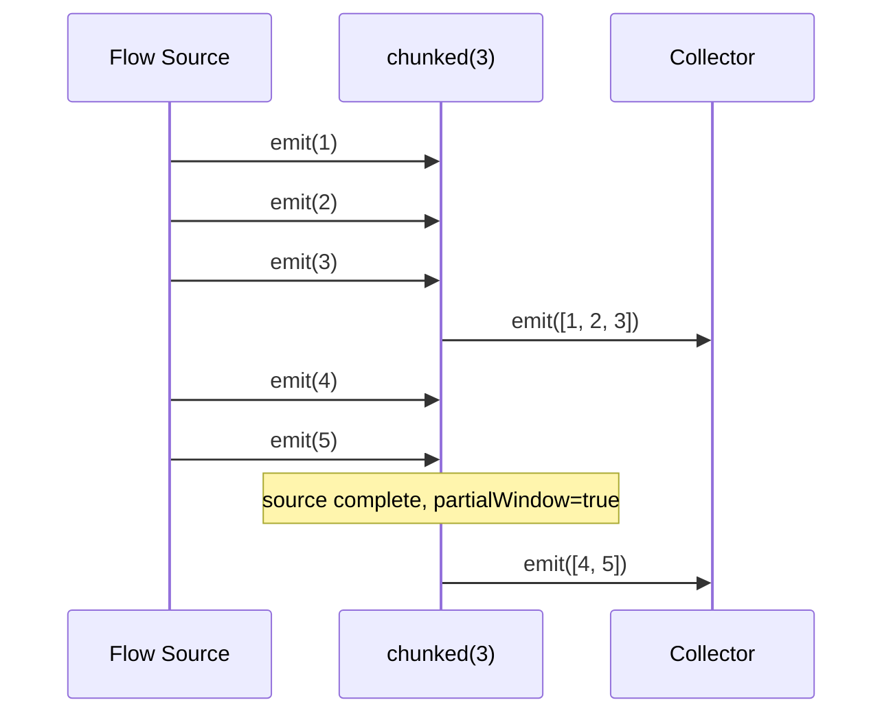
```mermaid
sequenceDiagram
    participant S as Flow Source
    participant C as chunked(3)
    participant R as Collector
    S ->> C: emit(1)
    S ->> C: emit(2)
    S ->> C: emit(3)
    C ->> R: emit([1, 2, 3])
    S ->> C: emit(4)
    S ->> C: emit(5)
    Note over C: source complete, partialWindow=true
    C ->> R: emit([4, 5])
```

---

### 3. `windowed(size, step)` — Sliding Window

Emits windows of size `size`, advancing by `step` each time.

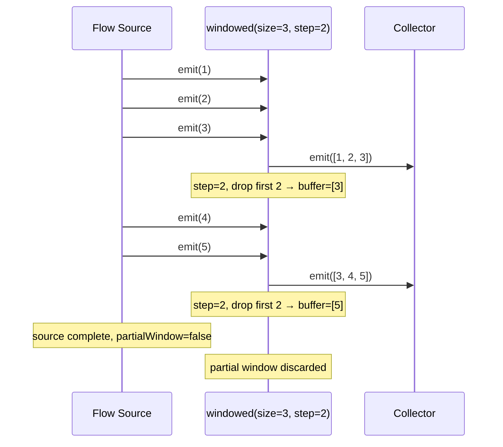
```mermaid
sequenceDiagram
    participant S as Flow Source
    participant W as windowed(size=3, step=2)
    participant R as Collector
    S ->> W: emit(1)
    S ->> W: emit(2)
    S ->> W: emit(3)
    W ->> R: emit([1, 2, 3])
    Note over W: step=2, drop first 2 → buffer=[3]
    S ->> W: emit(4)
    S ->> W: emit(5)
    W ->> R: emit([3, 4, 5])
    Note over W: step=2, drop first 2 → buffer=[5]
    Note over S: source complete, partialWindow=false
    Note over W: partial window discarded
```

---

### 4. `sliding(n)` / `bufferedSliding(n)` — One-Step Sliding Window

`sliding` is equivalent to `windowed(size, step=1)`.
`bufferedSliding` maintains a buffer and emits a snapshot on every element.

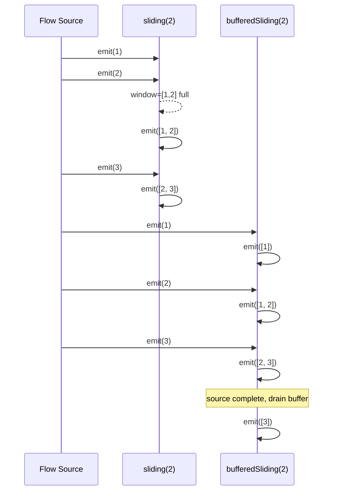
```mermaid
sequenceDiagram
    participant S as Flow Source
    participant SL as sliding(2)
    participant BS as bufferedSliding(2)
    S ->> SL: emit(1)
    S ->> SL: emit(2)
    SL -->> SL: window=[1,2] full
    SL ->> SL: emit([1, 2])
    S ->> SL: emit(3)
    SL ->> SL: emit([2, 3])
    S ->> BS: emit(1)
    BS ->> BS: emit([1])
    S ->> BS: emit(2)
    BS ->> BS: emit([1, 2])
    S ->> BS: emit(3)
    BS ->> BS: emit([2, 3])
    Note over BS: source complete, drain buffer
    BS ->> BS: emit([3])
```

---

### 5. `mapParallel(parallelism)` — Parallel Transformation

Runs the transform function on up to `parallelism` elements concurrently. Result order is not guaranteed.

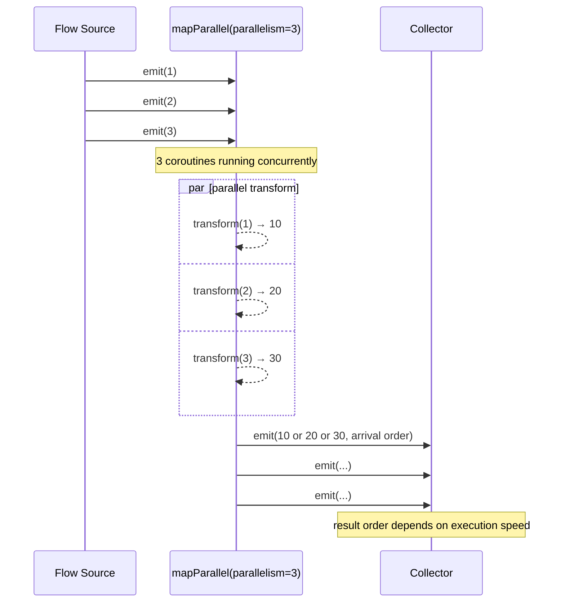
```mermaid
sequenceDiagram
    participant S as Flow Source
    participant MP as mapParallel(parallelism=3)
    participant R as Collector
    S ->> MP: emit(1)
    S ->> MP: emit(2)
    S ->> MP: emit(3)
    Note over MP: 3 coroutines running concurrently
    par parallel transform
        MP -->> MP: transform(1) → 10
    and
        MP -->> MP: transform(2) → 20
    and
        MP -->> MP: transform(3) → 30
    end
    MP ->> R: emit(10 or 20 or 30, arrival order)
    MP ->> R: emit(...)
    MP ->> R: emit(...)
    Note over R: result order depends on execution speed
```

---

### 6. `concatMapEager { }` — Order-Preserving Eager Parallel Collection

Starts inner Flows eagerly and concurrently, but **emits results in source order**.

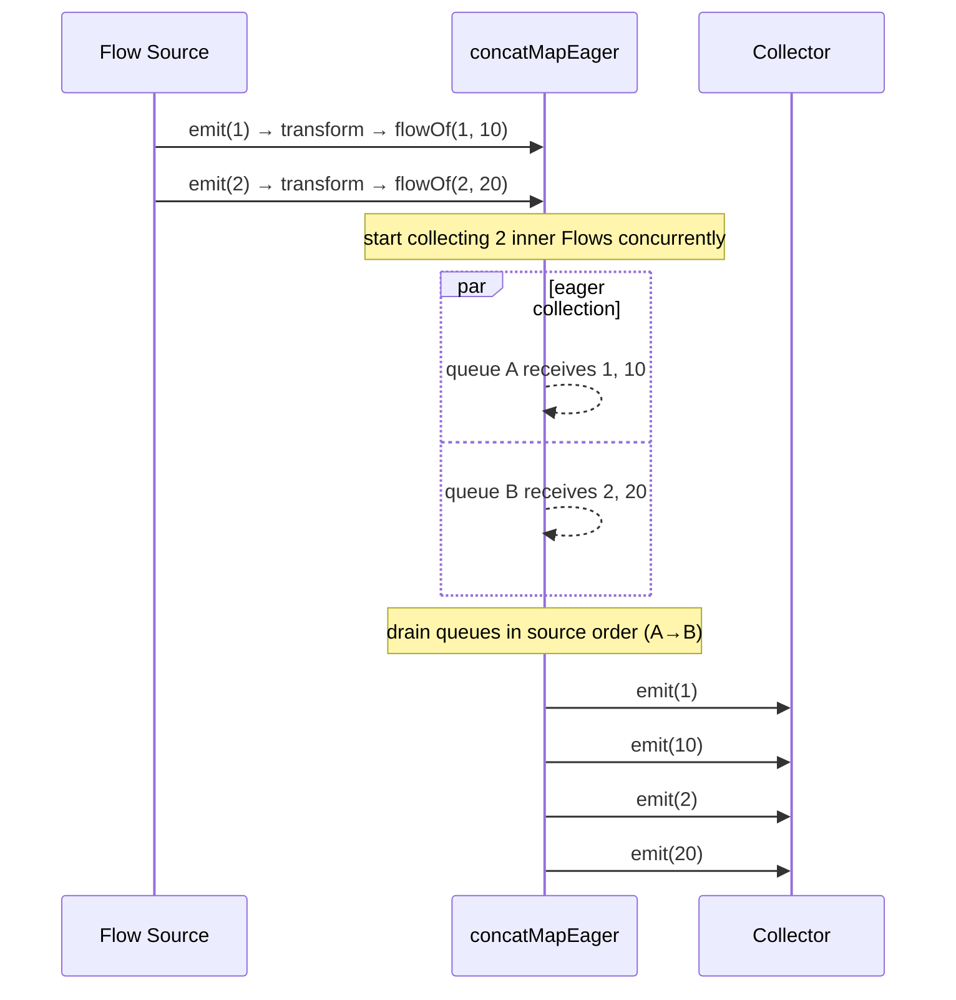
```mermaid
sequenceDiagram
    participant S as Flow Source
    participant CM as concatMapEager
    participant R as Collector
    S ->> CM: emit(1) → transform → flowOf(1, 10)
    S ->> CM: emit(2) → transform → flowOf(2, 20)
    Note over CM: start collecting 2 inner Flows concurrently
    par eager collection
        CM -->> CM: queue A receives 1, 10
    and
        CM -->> CM: queue B receives 2, 20
    end
    Note over CM: drain queues in source order (A→B)
    CM ->> R: emit(1)
    CM ->> R: emit(10)
    CM ->> R: emit(2)
    CM ->> R: emit(20)
```

---

### 7. `bufferingDebounce(timeout)` — Debounced Batching

Buffers values arriving within `timeout` and emits them together as a `List`. Resets the timeout on each new arrival.

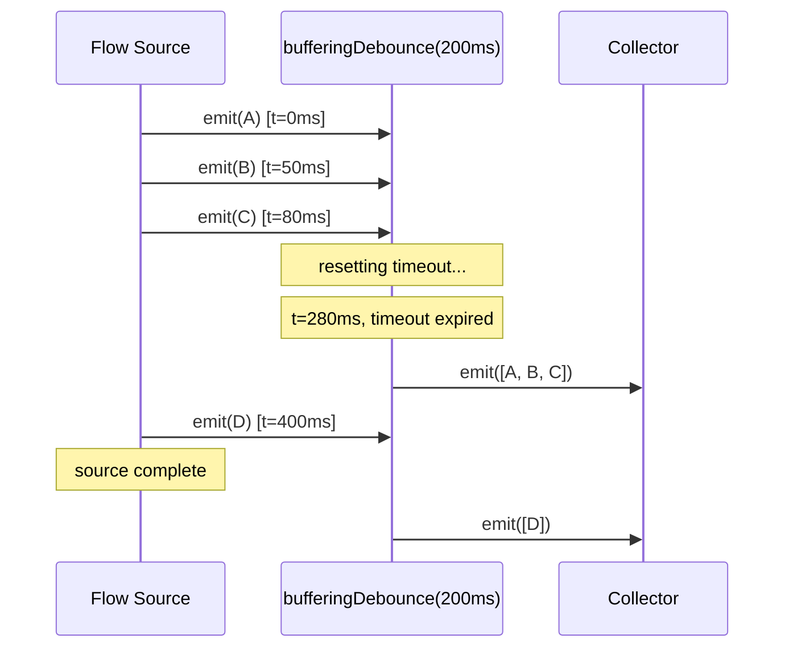
```mermaid
sequenceDiagram
    participant S as Flow Source
    participant BD as bufferingDebounce(200ms)
    participant R as Collector
    S ->> BD: emit(A) [t=0ms]
    S ->> BD: emit(B) [t=50ms]
    S ->> BD: emit(C) [t=80ms]
    Note over BD: resetting timeout...
    Note over BD: t=280ms, timeout expired
    BD ->> R: emit([A, B, C])
    S ->> BD: emit(D) [t=400ms]
    Note over S: source complete
    BD ->> R: emit([D])
```

---

### 8. `throttleLeading` / `throttleTrailing` / `throttleBoth` — Throttle

Within a fixed window, emits the first element (leading), last element (trailing), or both.

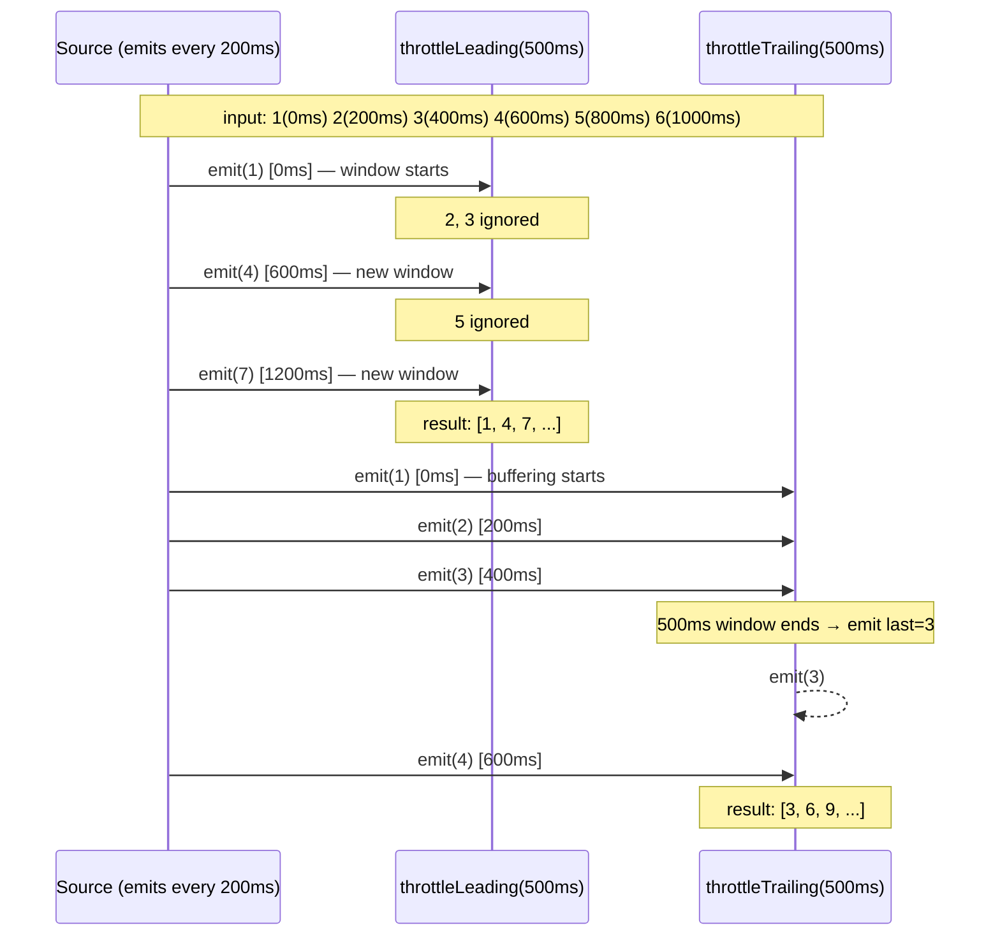
```mermaid
sequenceDiagram
    participant S as Source (emits every 200ms)
    participant TL as throttleLeading(500ms)
    participant TT as throttleTrailing(500ms)
    Note over S, TT: input: 1(0ms) 2(200ms) 3(400ms) 4(600ms) 5(800ms) 6(1000ms)
    S ->> TL: emit(1) [0ms] — window starts
    Note over TL: 2, 3 ignored
    S ->> TL: emit(4) [600ms] — new window
    Note over TL: 5 ignored
    S ->> TL: emit(7) [1200ms] — new window
    Note over TL: result: [1, 4, 7, ...]
    S ->> TT: emit(1) [0ms] — buffering starts
    S ->> TT: emit(2) [200ms]
    S ->> TT: emit(3) [400ms]
    Note over TT: 500ms window ends → emit last=3
    TT -->> TT: emit(3)
    S ->> TT: emit(4) [600ms]
    Note over TT: result: [3, 6, 9, ...]
```

---

### 9. `takeUntil(notifier)` / `skipUntil(notifier)` — Gate Control

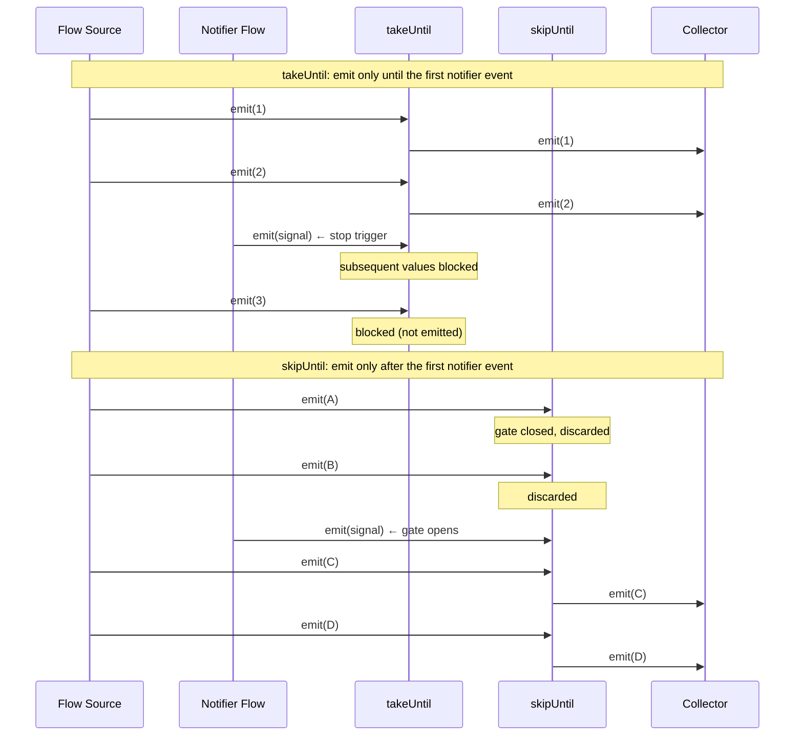
```mermaid
sequenceDiagram
    participant S as Flow Source
    participant N as Notifier Flow
    participant TU as takeUntil
    participant SU as skipUntil
    participant R as Collector
    Note over S, R: takeUntil: emit only until the first notifier event
    S ->> TU: emit(1)
    TU ->> R: emit(1)
    S ->> TU: emit(2)
    TU ->> R: emit(2)
    N ->> TU: emit(signal) ← stop trigger
    Note over TU: subsequent values blocked
    S ->> TU: emit(3)
    Note over TU: blocked (not emitted)
    Note over S, R: skipUntil: emit only after the first notifier event
    S ->> SU: emit(A)
    Note over SU: gate closed, discarded
    S ->> SU: emit(B)
    Note over SU: discarded
    N ->> SU: emit(signal) ← gate opens
    S ->> SU: emit(C)
    SU ->> R: emit(C)
    S ->> SU: emit(D)
    SU ->> R: emit(D)
```

---

### 10. `merge(flows)` — Unordered Merge

Collects multiple Flows concurrently and emits values in arrival order.

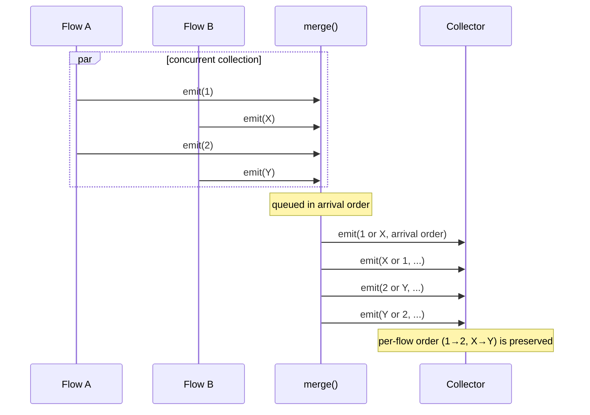
```mermaid
sequenceDiagram
    participant F1 as Flow A
    participant F2 as Flow B
    participant M as merge()
    participant R as Collector

    par concurrent collection
        F1 ->> M: emit(1)
        F2 ->> M: emit(X)
        F1 ->> M: emit(2)
        F2 ->> M: emit(Y)
    end
    Note over M: queued in arrival order
    M ->> R: emit(1 or X, arrival order)
    M ->> R: emit(X or 1, ...)
    M ->> R: emit(2 or Y, ...)
    M ->> R: emit(Y or 2, ...)
    Note over R: per-flow order (1→2, X→Y) is preserved
```

---

### 11. `pairwise()` / `zipWithNext()` — Adjacent Pairs

Pairs adjacent elements as `Pair`, optionally applying a transform. `zipWithNext` is an alias for `pairwise`.

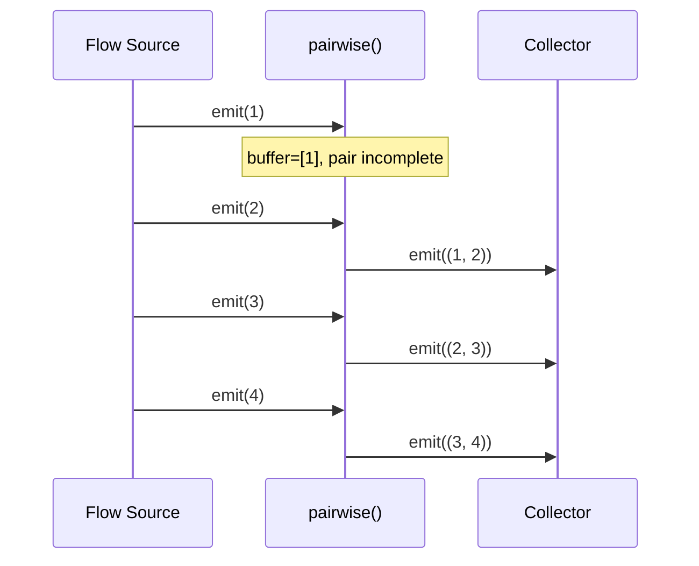
```mermaid
sequenceDiagram
    participant S as Flow Source
    participant P as pairwise()
    participant R as Collector
    S ->> P: emit(1)
    Note over P: buffer=[1], pair incomplete
    S ->> P: emit(2)
    P ->> R: emit((1, 2))
    S ->> P: emit(3)
    P ->> R: emit((2, 3))
    S ->> P: emit(4)
    P ->> R: emit((3, 4))
```

---

### 12. `scanWith(initial) { }` — Lazy Initial Value Accumulation

Calls `initialSupplier` at collect time to produce the seed, then emits each accumulated result.

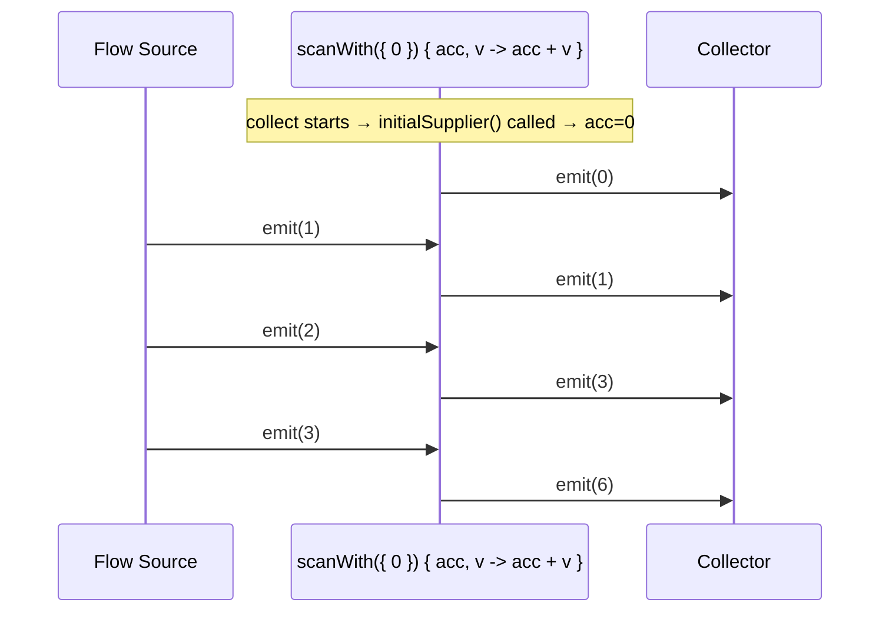
```mermaid
sequenceDiagram
    participant S as Flow Source
    participant SW as scanWith({ 0 }) { acc, v -> acc + v }
    participant R as Collector
    Note over SW: collect starts → initialSupplier() called → acc=0
    SW ->> R: emit(0)
    S ->> SW: emit(1)
    SW ->> R: emit(1)
    S ->> SW: emit(2)
    SW ->> R: emit(3)
    S ->> SW: emit(3)
    SW ->> R: emit(6)
```

---

### 13. `AsyncFlow` — Order-Preserving Async Transformation

Starts each element as a `Deferred` asynchronously, but **emits results in input order**. Unlike
`mapParallel`, output order is guaranteed.

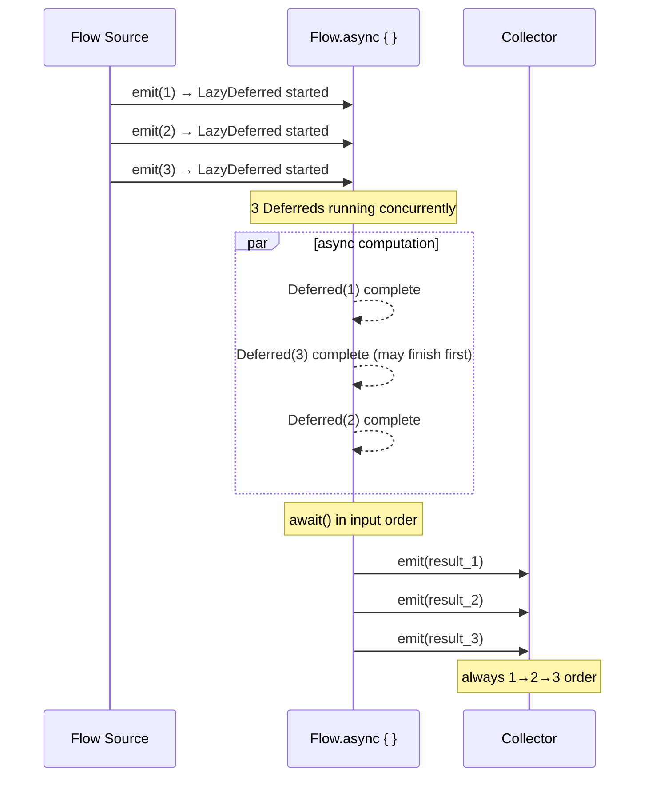
```mermaid
sequenceDiagram
    participant S as Flow Source
    participant AF as Flow.async { }
    participant R as Collector
    S ->> AF: emit(1) → LazyDeferred started
    S ->> AF: emit(2) → LazyDeferred started
    S ->> AF: emit(3) → LazyDeferred started
    Note over AF: 3 Deferreds running concurrently
    par async computation
        AF -->> AF: Deferred(1) complete
        AF -->> AF: Deferred(3) complete (may finish first)
        AF -->> AF: Deferred(2) complete
    end
    Note over AF: await() in input order
    AF ->> R: emit(result_1)
    AF ->> R: emit(result_2)
    AF ->> R: emit(result_3)
    Note over R: always 1→2→3 order
```

---

## Representative Tests

- `src/test/kotlin/io/bluetape4k/coroutines/DeferredValueTest.kt`
- `src/test/kotlin/io/bluetape4k/coroutines/support/DeferredSupportTest.kt`
- `src/test/kotlin/io/bluetape4k/coroutines/flow/extensions/MapParallelTest.kt`

Run the module tests with:

```bash
./gradlew :bluetape4k-coroutines:test
```

## Installation

```kotlin
dependencies {
    implementation("io.github.bluetape4k:bluetape4k-coroutines:${version}")
}
```

Optional integrations:

- Reactor helpers require `reactor-core` and `kotlinx-coroutines-reactor`
- Virtual-thread scope usage requires a runtime that supports virtual threads
