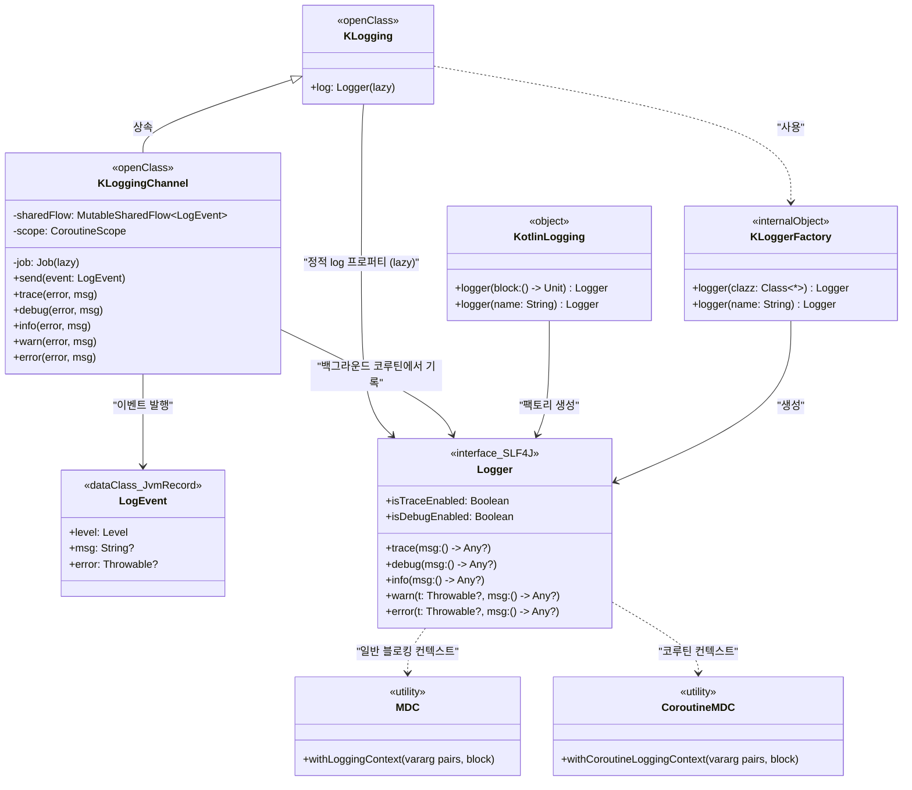
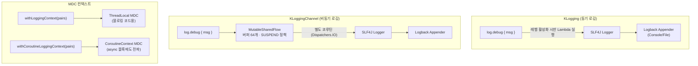
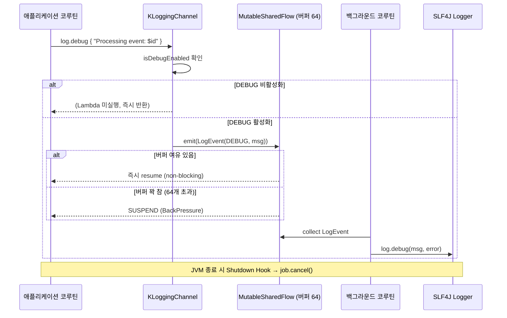

# Module bluetape4k-logging

[English](./README.md) | 한국어

Kotlin에서 SLF4J 로깅을 더 쉽고 효율적으로 사용하기 위한 라이브러리입니다.

## 아키텍처

### 클래스 계층 다이어그램



---

### 로깅 처리 흐름



---

### KLoggingChannel 비동기 로깅 시퀀스



## 주요 기능

- **Lambda 기반 Lazy Logging**: 로그 레벨이 활성화되지 않으면 메시지를 생성하지 않아 성능 향상
- **클래스 기반 로깅**: `KLogging`을 사용한 간편한 클래스 로거 정의
- **함수 레벨 로깅**: Package 함수에서도 쉽게 사용 가능
- **MDC 지원**: Slf4j MDC를 Kotlin 스타일로 간편하게 사용
- **Coroutines 지원**: Coroutines 환경에서 MDC 컨텍스트 전파
- **KLoggingChannel**: Coroutines Channel 기반 비동기 로깅 (고성능)
- **에러 강조**: warn/error 로그에 자동으로 🔥 이모지 추가

## 의존성 추가

### Gradle (Kotlin DSL)

```kotlin
dependencies {
    implementation("io.github.bluetape4k:bluetape4k-logging:${version}")

    // SLF4J 구현체 (Logback 사용 예시)
    implementation("ch.qos.logback:logback-classic:1.4.14")

    // KLoggingChannel 사용 시 필요 (Coroutines)
    implementation("org.jetbrains.kotlinx:kotlinx-coroutines-core:1.10.2")
    // MDC 사용 시
    implementation("org.jetbrains.kotlinx:kotlinx-coroutines-slf4j:1.10.2")
}
```

## 사용법

### 1. 클래스에서 로깅하기

Companion object를 `KLogging()`으로 상속받으면 static 로거를 사용할 수 있습니다.

```kotlin
import io.bluetape4k.logging.KLogging
import io.bluetape4k.logging.debug
import io.bluetape4k.logging.error

class UserService {
    companion object: KLogging()

    fun createUser(username: String, email: String) {
        log.debug { "Creating user: username=$username, email=$email" }

        try {
            // User creation logic
            log.info { "User created successfully: $username" }
        } catch (e: Exception) {
            log.error(e) { "Failed to create user: $username" }
            throw e
        }
    }
}
```

**특징:**

- `log` 프로퍼티가 자동으로 제공됨
- Lambda 표현식으로 메시지 작성 (로그 레벨이 비활성화되면 실행되지 않음)
- Exception과 함께 로깅 가능

### 2. Package 함수에서 로깅하기

Top-level 함수나 package 함수에서는 다음과 같이 로거를 선언합니다.

```kotlin
import io.bluetape4k.logging.KotlinLogging
import io.bluetape4k.logging.debug
import io.bluetape4k.logging.trace

private val log = KotlinLogging.logger {}
private val namedLogger = KotlinLogging.logger("MyCustomLogger")

fun processData(data: String) {
    log.trace { "Processing data: ${data.take(50)}..." }

    val result = data.uppercase()

    log.debug { "Data processed: length=${result.length}" }
    return result
}
```

**이름 있는 로거:**

- `KotlinLogging.logger {}`: 호출된 위치 기반 자동 이름 지정
- `KotlinLogging.logger("name")`: 명시적 이름 지정

### 3. Lambda 기반 Lazy Logging

로그 메시지가 복잡하거나 계산 비용이 높을 때 유용합니다.

```kotlin
// ❌ 나쁜 예: 로그 레벨이 비활성화되어도 문자열 연산 수행
log.debug("User details: " + user.toString() + ", Orders: " + orders.size)

// ✅ 좋은 예: 로그 레벨이 활성화될 때만 실행
log.debug { "User details: $user, Orders: ${orders.size}" }
```

**성능 비교:**

```kotlin
// DEBUG 레벨이 비활성화된 경우
log.debug("Heavy computation: " + expensiveCalculation())  // 항상 실행됨
log.debug { "Heavy computation: ${expensiveCalculation()}" }  // 실행되지 않음!
```

### 4. MDC (Mapped Diagnostic Context) 사용하기

분산 추적, 요청 ID, 사용자 ID 등을 로그에 포함시킬 수 있습니다.

```kotlin
import io.bluetape4k.logging.withLoggingContext

fun handleRequest(requestId: String, userId: String) {
    withLoggingContext("requestId" to requestId, "userId" to userId) {
        log.info { "Processing request" }
        // 로그: ... [requestId=abc-123][userId=user-456] Processing request

        processBusinessLogic()

        log.info { "Request completed" }
    }
}
```

**중첩된 MDC 컨텍스트:**

```kotlin
withLoggingContext("traceId" to "trace-100", "spanId" to "span-200") {
    log.debug { "Outer context" }
    // MDC: traceId=trace-100, spanId=span-200

    withLoggingContext("spanId" to "span-300", "operation" to "database") {
        log.debug { "Inner context" }
        // MDC: traceId=trace-100, spanId=span-300, operation=database
    }

    log.debug { "Back to outer context" }
    // MDC: traceId=trace-100, spanId=span-200
}
// MDC 자동으로 제거됨
```

**단일 Pair 사용:**

```kotlin
withLoggingContext("userId" to userId) {
    log.info { "User action logged" }
}
```

### 5. Coroutines에서 MDC 사용하기

Coroutines 환경에서 MDC 컨텍스트를 자동으로 전파합니다.

```kotlin
import io.bluetape4k.logging.coroutines.withCoroutineLoggingContext
import kotlinx.coroutines.async
import kotlinx.coroutines.coroutineScope

suspend fun processOrder(orderId: String) = coroutineScope {
    withCoroutineLoggingContext("orderId" to orderId, "operation" to "process") {
        log.info { "Starting order processing" }

        val payment = async {
            log.debug { "Processing payment" }
            // MDC가 async 블록에도 자동 전파됨
            processPayment()
        }

        val shipping = async {
            log.debug { "Preparing shipping" }
            prepareShipping()
        }

        payment.await()
        shipping.await()

        log.info { "Order processing completed" }
    }
}
```

**주요 차이점:**

- `withLoggingContext`: 일반 블로킹 코드용
- `withCoroutineLoggingContext`: Suspend 함수용, Coroutines 간 MDC 전파

### 6. KLoggingChannel - 비동기 로깅 (Coroutines Channel)

Coroutines 환경에서 로깅을 비동기적으로 처리하기 위한 채널 기반 로거입니다. `MutableSharedFlow`를 버퍼로 사용하여 로깅 성능을 최적화합니다.

#### 기본 사용법

```kotlin
import io.bluetape4k.logging.coroutines.KLoggingChannel

class EventProcessor {
    companion object: KLoggingChannel()  // KLogging 대신 KLoggingChannel 사용

    suspend fun processEvent(event: Event) {
        log.debug { "Processing event: ${event.id}" }

        try {
            val result = processLogic(event)
            log.info { "Event processed successfully: ${event.id}" }
            return result
        } catch (e: Exception) {
            log.error(e) { "Failed to process event: ${event.id}" }
            throw e
        }
    }

    suspend fun processBatch(events: List<Event>) {
        log.info { "Processing ${events.size} events" }

        events.forEach { event ->
            log.trace { "Processing event: $event" }
            processEvent(event)
        }

        log.info { "Batch processing completed" }
    }
}
```

#### KLogging vs KLoggingChannel

```kotlin
// ❌ 일반 KLogging: suspend 함수에서 사용 가능하지만 동기식
class SyncService {
    companion object: KLogging()

    suspend fun process() {
        log.debug { "Processing..." }  // 동기적으로 로그 출력
        delay(100)
    }
}

// ✅ KLoggingChannel: suspend 함수에 최적화, 비동기 로깅
class AsyncService {
    companion object: KLoggingChannel()

    suspend fun process() {
        log.debug { "Processing..." }  // 비동기로 로그 전송
        delay(100)
    }
}
```

#### 주요 특징

**1. 버퍼링**

- `MutableSharedFlow`를 사용하여 64개의 로그 이벤트 버퍼링
- 버퍼가 가득 차면 suspend (BackPressure 제어)

**2. 비동기 처리**

- 로깅 작업이 별도의 Coroutine에서 처리됨
- 메인 로직의 성능에 영향 최소화

**3. 자동 리소스 관리**

- Shutdown Hook으로 종료 시 자동 정리
- 모든 버퍼링된 로그 처리 후 종료

#### 실전 예시

```kotlin
import io.bluetape4k.logging.coroutines.KLoggingChannel
import kotlinx.coroutines.*
import kotlinx.coroutines.flow.*

class OrderProcessor {
    companion object: KLoggingChannel()

    suspend fun processOrders(orders: Flow<Order>) = coroutineScope {
        log.info { "Starting order processing" }

        orders
            .onEach { order ->
                log.debug { "Processing order: ${order.id}" }
            }
            .map { order ->
                async {
                    try {
                        processOrder(order)
                        log.info { "Order completed: ${order.id}" }
                    } catch (e: Exception) {
                        log.error(e) { "Order failed: ${order.id}" }
                        throw e
                    }
                }
            }
            .buffer(10)
            .collect { deferred ->
                deferred.await()
            }

        log.info { "All orders processed" }
    }

    private suspend fun processOrder(order: Order) {
        log.trace { "Validating order: ${order.id}" }
        validateOrder(order)

        log.trace { "Saving order: ${order.id}" }
        saveOrder(order)

        log.trace { "Notifying customer: ${order.customerId}" }
        notifyCustomer(order)
    }
}
```

#### 대용량 로깅 시나리오

```kotlin
class DataImporter {
    companion object: KLoggingChannel()

    suspend fun importData(items: Flow<DataItem>) {
        var count = 0

        items.collect { item ->
            log.trace { "Importing item ${item.id}" }
            importItem(item)

            count++
            if (count % 1000 == 0) {
                log.info { "Imported $count items" }
            }
        }

        log.info { "Data import completed: $count items" }
    }
}
```

**성능 이점:**

- 로그 메시지가 채널로 전송되어 비동기 처리
- 대량의 로그를 생성해도 메인 로직이 블록되지 않음
- 버퍼링으로 로깅 I/O 최적화

#### 언제 사용할까?

**✅ KLoggingChannel 사용:**

- Coroutines 기반 서비스
- 대량의 로그를 생성하는 경우
- 로깅 성능이 중요한 경우
- Flow 처리 등 스트림 데이터 처리

**✅ 일반 KLogging 사용:**

- 일반 동기 코드
- 로그 양이 적은 경우
- 즉시 로그 출력이 필요한 경우

#### 주의사항

```kotlin
// ⚠️ 애플리케이션 종료 시 버퍼의 로그가 모두 처리될 때까지 대기
// Shutdown Hook이 자동으로 처리하지만, 강제 종료 시 일부 로그 유실 가능

// ✅ 중요한 로그는 명시적으로 flush
suspend fun criticalOperation() {
    log.error { "Critical error occurred!" }
    delay(100)  // 로그가 처리될 시간 제공
}
```

### 7. Logback 설정

MDC 값을 로그에 출력하려면 Logback 패턴에 추가해야 합니다.

#### logback.xml 예시

```xml
<?xml version="1.0" encoding="UTF-8"?>
<configuration>
    <appender name="Console" class="ch.qos.logback.core.ConsoleAppender">
        <encoder>
            <!-- MDC 항목을 %X{키} 형태로 추가 -->
            <pattern>%d{HH:mm:ss.SSS} %highlight(%-5level) [requestId=%X{requestId}][userId=%X{userId}][%.24thread]
                %logger{36}:%line: %msg%n%throwable
            </pattern>
            <charset>UTF-8</charset>
        </encoder>
    </appender>

    <!-- 특정 패키지의 로그 레벨 설정 -->
    <logger name="io.bluetape4k" level="DEBUG"/>
    <logger name="com.myapp" level="INFO"/>

    <root level="INFO">
        <appender-ref ref="Console"/>
    </root>
</configuration>
```

**패턴 설명:**

- `%X{requestId}`: MDC의 `requestId` 값 출력
- `%highlight(%-5level)`: 로그 레벨을 색상으로 강조
- `%.24thread`: 스레드 이름 (최대 24자)
- `%logger{36}`: 로거 이름 (최대 36자)

### 8. 에러 로깅 (자동 이모지 추가)

warn과 error 레벨 로그에는 자동으로 🔥 이모지가 추가됩니다.

```kotlin
log.warn { "Connection timeout detected" }
// 출력: 🔥Connection timeout detected

log.error(exception) { "Failed to process request" }
// 출력: 🔥Failed to process request
// + exception stack trace
```

이모지 덕분에 로그에서 에러를 시각적으로 빠르게 찾을 수 있습니다.

## 전체 예시

```kotlin
import io.bluetape4k.logging.KLogging
import io.bluetape4k.logging.debug
import io.bluetape4k.logging.error
import io.bluetape4k.logging.info
import io.bluetape4k.logging.withLoggingContext
import io.bluetape4k.logging.coroutines.withCoroutineLoggingContext

class OrderService {
    companion object: KLogging()

    suspend fun createOrder(userId: String, items: List<Item>): Order {
        withCoroutineLoggingContext("userId" to userId, "itemCount" to items.size) {
            log.info { "Creating order" }

            try {
                val order = Order(userId, items)
                validateOrder(order)

                val savedOrder = saveOrder(order)

                log.debug { "Order saved with ID: ${savedOrder.id}" }

                notifyUser(userId, savedOrder)

                log.info { "Order created successfully" }
                return savedOrder

            } catch (e: ValidationException) {
                log.warn(e) { "Order validation failed" }
                throw e
            } catch (e: Exception) {
                log.error(e) { "Unexpected error during order creation" }
                throw OrderCreationException("Failed to create order", e)
            }
        }
    }

    private fun validateOrder(order: Order) {
        withLoggingContext("orderId" to order.id, "operation" to "validation") {
            log.debug { "Validating order" }
            // Validation logic
        }
    }
}
```

### KLoggingChannel 전체 예시

```kotlin
import io.bluetape4k.logging.coroutines.KLoggingChannel
import kotlinx.coroutines.flow.*

class EventStreamService {
    companion object: KLoggingChannel()

    suspend fun processEventStream(events: Flow<Event>) {
        log.info { "Starting event stream processing" }

        events
            .onEach { event ->
                log.trace { "Received event: ${event.id}, type=${event.type}" }
            }
            .filter { event ->
                val valid = event.isValid()
                if (!valid) {
                    log.warn { "Invalid event filtered: ${event.id}" }
                }
                valid
            }
            .chunked(100)
            .collect { batch ->
                log.debug { "Processing batch of ${batch.size} events" }

                try {
                    processBatch(batch)
                    log.info { "Batch processed successfully: ${batch.size} events" }
                } catch (e: Exception) {
                    log.error(e) { "Batch processing failed: ${batch.size} events" }
                    handleBatchError(batch, e)
                }
            }

        log.info { "Event stream processing completed" }
    }

    private suspend fun processBatch(events: List<Event>) {
        events.forEach { event ->
            log.trace { "Processing individual event: ${event.id}" }
            processEvent(event)
        }
    }

    private suspend fun processEvent(event: Event) {
        // Event processing logic
    }
}
```

## 모범 사례

### 1. 로그 레벨 선택

```kotlin
// TRACE: 매우 상세한 디버깅 정보
log.trace { "Entering method with params: $params" }

// DEBUG: 개발/디버깅 시 유용한 정보
log.debug { "Processing ${items.size} items" }

// INFO: 일반적인 정보성 메시지
log.info { "Service started successfully" }

// WARN: 경고 - 잠재적 문제
log.warn { "Connection pool running low: ${pool.available}/${pool.total}" }

// ERROR: 에러 - 처리 실패
log.error(exception) { "Failed to process transaction" }
```

### 2. 민감 정보 로깅 주의

```kotlin
// ❌ 나쁜 예: 비밀번호 등 민감 정보 노출
log.debug { "User login: username=$username, password=$password" }

// ✅ 좋은 예: 민감 정보 마스킹
log.debug { "User login: username=$username, password=***" }
```

### 3. 구조화된 로깅

```kotlin
// 일관된 형식으로 로깅
log.info { "action=user_login, userId=$userId, ip=$ipAddress, status=success" }
log.error { "action=payment_failed, orderId=$orderId, amount=$amount, reason=${e.message}" }
```

### 4. MDC 활용

```kotlin
// API 요청마다 고유 ID 부여
fun handleApiRequest(request: Request): Response {
    val requestId = UUID.randomUUID().toString()

    withLoggingContext("requestId" to requestId) {
        log.info { "API request received: ${request.path}" }
        // 모든 하위 로그에 requestId가 자동 포함됨
        return processRequest(request)
    }
}
```

### 5. KLogging vs KLoggingChannel 선택

```kotlin
// ✅ 일반 서비스: KLogging
class UserService {
    companion object: KLogging()

    fun createUser(user: User) {
        log.debug { "Creating user: ${user.id}" }
        // 적은 양의 로그, 동기 처리
    }
}

// ✅ Coroutines 고성능 서비스: KLoggingChannel
class EventStreamProcessor {
    companion object: KLoggingChannel()

    suspend fun processStream(events: Flow<Event>) {
        events.collect { event ->
            log.trace { "Processing: ${event.id}" }
            // 대량의 로그, 비동기 처리
        }
    }
}

// ❌ 피해야 할 패턴: Coroutines에서 과도한 동기 로깅
class BadService {
    companion object: KLogging()

    suspend fun processMany(items: Flow<Item>) {
        items.collect { item ->
            log.debug { "Item $item" }  // 수천 개의 로그 = 성능 저하
        }
    }
}
```

## 성능 고려사항

### Lambda vs String 비교

```kotlin
// 10,000번 호출 시 (DEBUG 레벨 비활성화)
// String 연산: ~50ms (항상 실행)
log.debug("Message: " + createExpensiveString())

// Lambda: ~0ms (실행되지 않음)
log.debug { "Message: ${createExpensiveString()}" }
```

### MDC 오버헤드

MDC는 ThreadLocal을 사용하므로 약간의 오버헤드가 있습니다:

- 필요한 경우에만 사용
- 너무 많은 MDC 항목은 피하기 (5-10개 이하 권장)

### KLoggingChannel 성능

**버퍼링 효과:**

```kotlin
// 대량 로그 생성 시 (10,000개)
// KLogging: ~200ms (동기 I/O)
// KLoggingChannel: ~50ms (비동기 버퍼링)
```

**메모리 사용:**

- 버퍼 크기: 최대 64개 로그 이벤트
- 각 이벤트: ~100-500 bytes
- 총 메모리: ~6-32 KB (무시할 수준)

**권장 사용:**

- ✅ Flow 처리에서 대량 로그 (초당 100+ 로그)
- ✅ 실시간 이벤트 처리
- ✅ 스트림 데이터 처리
- ❌ 일반 REST API (오버헤드 불필요)
- ❌ 배치 작업 (로그 양이 적음)

## 참고 자료

- [SLF4J 공식 문서](http://www.slf4j.org/)
- [Logback 공식 문서](https://logback.qos.ch/)
- [Kotlin Logging](https://github.com/oshai/kotlin-logging)
- [Kotlin Coroutines + SLF4J MDC](https://github.com/Kotlin/kotlinx.coroutines/tree/master/integration/kotlinx-coroutines-slf4j)
