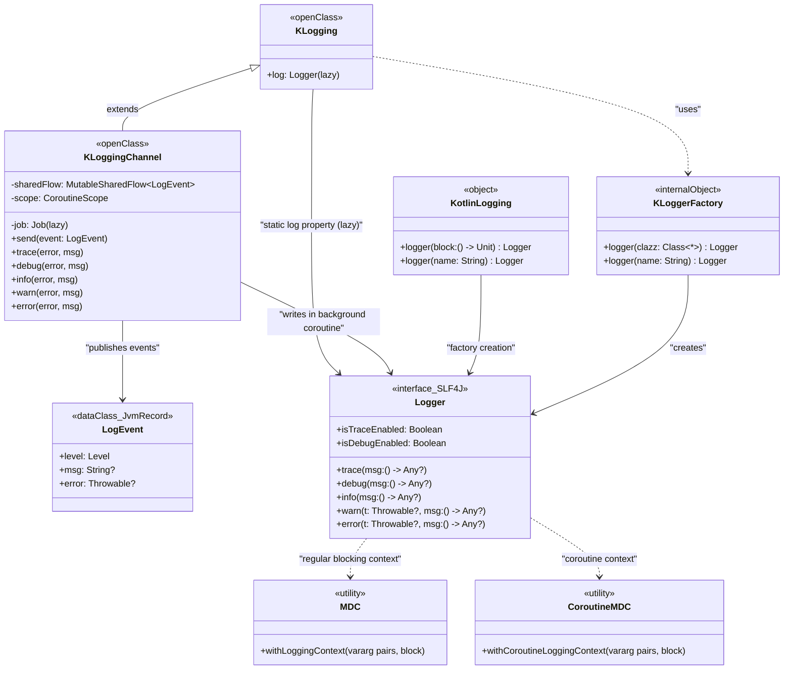
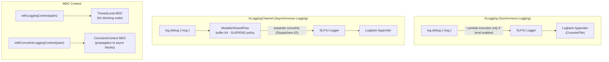
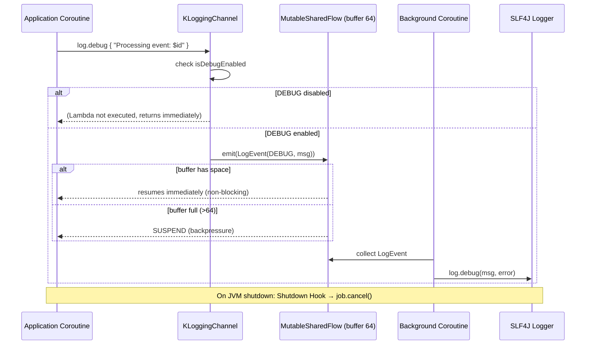

# Module bluetape4k-logging

English | [한국어](./README.ko.md)

A library that makes SLF4J logging in Kotlin easier and more efficient.

## Architecture

### Class Hierarchy Diagram



---

### Logging Processing Flow



---

### KLoggingChannel Async Logging Sequence



## Features

- **Lambda-based Lazy Logging**: Messages are not constructed unless the log level is enabled — improves performance
- **Class-level Logging**: Simple static logger definition using `KLogging`
- **Function-level Logging**: Works in top-level and package-level functions too
- **MDC Support**: SLF4J MDC in idiomatic Kotlin style
- **Coroutines Support**: MDC context propagation in coroutine environments
- **KLoggingChannel**: High-performance async logging backed by a Coroutines channel
- **Error Highlighting**: Automatically prepends 🔥 emoji to warn/error log messages

## Installation

### Gradle (Kotlin DSL)

```kotlin
dependencies {
    implementation("io.github.bluetape4k:bluetape4k-logging:${version}")

    // SLF4J implementation (Logback example)
    implementation("ch.qos.logback:logback-classic:1.4.14")

    // Required for KLoggingChannel (Coroutines)
    implementation("org.jetbrains.kotlinx:kotlinx-coroutines-core:1.10.2")
    // Required for MDC in coroutines
    implementation("org.jetbrains.kotlinx:kotlinx-coroutines-slf4j:1.10.2")
}
```

## Usage

### 1. Logging in a Class

Extend your companion object from `KLogging()` to get a static logger automatically.

```kotlin
import io.bluetape4k.logging.KLogging
import io.bluetape4k.logging.debug
import io.bluetape4k.logging.error

class UserService {
    companion object: KLogging()

    fun createUser(username: String, email: String) {
        log.debug { "Creating user: username=$username, email=$email" }

        try {
            // User creation logic
            log.info { "User created successfully: $username" }
        } catch (e: Exception) {
            log.error(e) { "Failed to create user: $username" }
            throw e
        }
    }
}
```

**Highlights:**

- The `log` property is provided automatically
- Lambda expressions for messages (not evaluated when the log level is disabled)
- Log with exceptions naturally

### 2. Logging in Package-Level Functions

Declare a logger like this for top-level and package-level functions.

```kotlin
import io.bluetape4k.logging.KotlinLogging
import io.bluetape4k.logging.debug
import io.bluetape4k.logging.trace

private val log = KotlinLogging.logger {}
private val namedLogger = KotlinLogging.logger("MyCustomLogger")

fun processData(data: String) {
    log.trace { "Processing data: ${data.take(50)}..." }

    val result = data.uppercase()

    log.debug { "Data processed: length=${result.length}" }
    return result
}
```

**Named loggers:**

- `KotlinLogging.logger {}`: name inferred from the call site automatically
- `KotlinLogging.logger("name")`: explicit name

### 3. Lambda-based Lazy Logging

Especially useful when log messages are complex or expensive to construct.

```kotlin
// ❌ Bad: string concatenation happens even when DEBUG is disabled
log.debug("User details: " + user.toString() + ", Orders: " + orders.size)

// ✅ Good: lambda is only evaluated when the level is enabled
log.debug { "User details: $user, Orders: ${orders.size}" }
```

**Performance comparison:**

```kotlin
// When DEBUG level is disabled:
log.debug("Heavy computation: " + expensiveCalculation())  // always executes
log.debug { "Heavy computation: ${expensiveCalculation()}" }  // never executes!
```

### 4. MDC (Mapped Diagnostic Context)

Include distributed tracing IDs, request IDs, user IDs, and more in every log entry.

```kotlin
import io.bluetape4k.logging.withLoggingContext

fun handleRequest(requestId: String, userId: String) {
    withLoggingContext("requestId" to requestId, "userId" to userId) {
        log.info { "Processing request" }
        // log: ... [requestId=abc-123][userId=user-456] Processing request

        processBusinessLogic()

        log.info { "Request completed" }
    }
}
```

**Nested MDC contexts:**

```kotlin
withLoggingContext("traceId" to "trace-100", "spanId" to "span-200") {
    log.debug { "Outer context" }
    // MDC: traceId=trace-100, spanId=span-200

    withLoggingContext("spanId" to "span-300", "operation" to "database") {
        log.debug { "Inner context" }
        // MDC: traceId=trace-100, spanId=span-300, operation=database
    }

    log.debug { "Back to outer context" }
    // MDC: traceId=trace-100, spanId=span-200
}
// MDC is cleared automatically
```

**Single pair:**

```kotlin
withLoggingContext("userId" to userId) {
    log.info { "User action logged" }
}
```

### 5. MDC in Coroutines

MDC context is automatically propagated across coroutine boundaries.

```kotlin
import io.bluetape4k.logging.coroutines.withCoroutineLoggingContext
import kotlinx.coroutines.async
import kotlinx.coroutines.coroutineScope

suspend fun processOrder(orderId: String) = coroutineScope {
    withCoroutineLoggingContext("orderId" to orderId, "operation" to "process") {
        log.info { "Starting order processing" }

        val payment = async {
            log.debug { "Processing payment" }
            // MDC is automatically propagated to async blocks
            processPayment()
        }

        val shipping = async {
            log.debug { "Preparing shipping" }
            prepareShipping()
        }

        payment.await()
        shipping.await()

        log.info { "Order processing completed" }
    }
}
```

**Key difference:**

- `withLoggingContext`: for regular blocking code
- `withCoroutineLoggingContext`: for suspend functions; propagates MDC across coroutines

### 6. KLoggingChannel — Asynchronous Logging (Coroutines Channel)

A channel-based logger for asynchronous log processing in coroutine environments. Uses `MutableSharedFlow` as a buffer to optimize logging throughput.

#### Basic Usage

```kotlin
import io.bluetape4k.logging.coroutines.KLoggingChannel

class EventProcessor {
    companion object: KLoggingChannel()  // use KLoggingChannel instead of KLogging

    suspend fun processEvent(event: Event) {
        log.debug { "Processing event: ${event.id}" }

        try {
            val result = processLogic(event)
            log.info { "Event processed successfully: ${event.id}" }
            return result
        } catch (e: Exception) {
            log.error(e) { "Failed to process event: ${event.id}" }
            throw e
        }
    }

    suspend fun processBatch(events: List<Event>) {
        log.info { "Processing ${events.size} events" }

        events.forEach { event ->
            log.trace { "Processing event: $event" }
            processEvent(event)
        }

        log.info { "Batch processing completed" }
    }
}
```

#### KLogging vs KLoggingChannel

```kotlin
// ❌ Regular KLogging: works in suspend functions but is synchronous
class SyncService {
    companion object: KLogging()

    suspend fun process() {
        log.debug { "Processing..." }  // logs synchronously
        delay(100)
    }
}

// ✅ KLoggingChannel: optimized for suspend functions, logs asynchronously
class AsyncService {
    companion object: KLoggingChannel()

    suspend fun process() {
        log.debug { "Processing..." }  // sends log asynchronously
        delay(100)
    }
}
```

#### Key Characteristics

**1. Buffering**

- Buffers up to 64 log events using `MutableSharedFlow`
- Suspends when the buffer is full (backpressure)

**2. Asynchronous Processing**

- Log writes happen in a separate coroutine
- Minimal impact on main logic performance

**3. Automatic Resource Management**

- Shutdown Hook cleans up resources on JVM exit
- Drains all buffered log events before terminating

#### Real-World Example

```kotlin
import io.bluetape4k.logging.coroutines.KLoggingChannel
import kotlinx.coroutines.*
import kotlinx.coroutines.flow.*

class OrderProcessor {
    companion object: KLoggingChannel()

    suspend fun processOrders(orders: Flow<Order>) = coroutineScope {
        log.info { "Starting order processing" }

        orders
            .onEach { order ->
                log.debug { "Processing order: ${order.id}" }
            }
            .map { order ->
                async {
                    try {
                        processOrder(order)
                        log.info { "Order completed: ${order.id}" }
                    } catch (e: Exception) {
                        log.error(e) { "Order failed: ${order.id}" }
                        throw e
                    }
                }
            }
            .buffer(10)
            .collect { deferred ->
                deferred.await()
            }

        log.info { "All orders processed" }
    }

    private suspend fun processOrder(order: Order) {
        log.trace { "Validating order: ${order.id}" }
        validateOrder(order)

        log.trace { "Saving order: ${order.id}" }
        saveOrder(order)

        log.trace { "Notifying customer: ${order.customerId}" }
        notifyCustomer(order)
    }
}
```

#### High-Volume Logging Scenario

```kotlin
class DataImporter {
    companion object: KLoggingChannel()

    suspend fun importData(items: Flow<DataItem>) {
        var count = 0

        items.collect { item ->
            log.trace { "Importing item ${item.id}" }
            importItem(item)

            count++
            if (count % 1000 == 0) {
                log.info { "Imported $count items" }
            }
        }

        log.info { "Data import completed: $count items" }
    }
}
```

**Performance benefits:**

- Log messages are sent to the channel and processed asynchronously
- Main logic is never blocked by heavy log output
- Buffering optimizes logging I/O

#### When to Use

**✅ Use KLoggingChannel when:**

- Building coroutine-based services
- Generating large volumes of log output
- Logging performance is critical
- Processing streaming data with Flow

**✅ Use regular KLogging when:**

- Writing ordinary synchronous code
- Log volume is low
- Immediate log output is required

#### Caveats

```kotlin
// ⚠️ On application shutdown, waits until all buffered logs are flushed
// The Shutdown Hook handles this automatically, but forced termination may lose some logs

// ✅ For critical logs, give the buffer time to drain
suspend fun criticalOperation() {
    log.error { "Critical error occurred!" }
    delay(100)  // allow time for the log to be processed
}
```

### 7. Logback Configuration

To include MDC values in log output, add them to the Logback pattern.

#### logback.xml Example

```xml
<?xml version="1.0" encoding="UTF-8"?>
<configuration>
    <appender name="Console" class="ch.qos.logback.core.ConsoleAppender">
        <encoder>
            <!-- Add MDC entries as %X{key} -->
            <pattern>%d{HH:mm:ss.SSS} %highlight(%-5level) [requestId=%X{requestId}][userId=%X{userId}][%.24thread]
                %logger{36}:%line: %msg%n%throwable
            </pattern>
            <charset>UTF-8</charset>
        </encoder>
    </appender>

    <!-- Set log levels per package -->
    <logger name="io.bluetape4k" level="DEBUG"/>
    <logger name="com.myapp" level="INFO"/>

    <root level="INFO">
        <appender-ref ref="Console"/>
    </root>
</configuration>
```

**Pattern explained:**

- `%X{requestId}`: outputs the `requestId` MDC value
- `%highlight(%-5level)`: colorizes the log level
- `%.24thread`: thread name (up to 24 characters)
- `%logger{36}`: logger name (up to 36 characters)

### 8. Error Logging (Automatic Emoji)

Warn and error log entries automatically get a 🔥 emoji prepended.

```kotlin
log.warn { "Connection timeout detected" }
// output: 🔥Connection timeout detected

log.error(exception) { "Failed to process request" }
// output: 🔥Failed to process request
// + exception stack trace
```

The emoji makes errors visually easy to spot in log output.

## Complete Example

```kotlin
import io.bluetape4k.logging.KLogging
import io.bluetape4k.logging.debug
import io.bluetape4k.logging.error
import io.bluetape4k.logging.info
import io.bluetape4k.logging.withLoggingContext
import io.bluetape4k.logging.coroutines.withCoroutineLoggingContext

class OrderService {
    companion object: KLogging()

    suspend fun createOrder(userId: String, items: List<Item>): Order {
        withCoroutineLoggingContext("userId" to userId, "itemCount" to items.size) {
            log.info { "Creating order" }

            try {
                val order = Order(userId, items)
                validateOrder(order)

                val savedOrder = saveOrder(order)

                log.debug { "Order saved with ID: ${savedOrder.id}" }

                notifyUser(userId, savedOrder)

                log.info { "Order created successfully" }
                return savedOrder

            } catch (e: ValidationException) {
                log.warn(e) { "Order validation failed" }
                throw e
            } catch (e: Exception) {
                log.error(e) { "Unexpected error during order creation" }
                throw OrderCreationException("Failed to create order", e)
            }
        }
    }

    private fun validateOrder(order: Order) {
        withLoggingContext("orderId" to order.id, "operation" to "validation") {
            log.debug { "Validating order" }
            // Validation logic
        }
    }
}
```

### KLoggingChannel Complete Example

```kotlin
import io.bluetape4k.logging.coroutines.KLoggingChannel
import kotlinx.coroutines.flow.*

class EventStreamService {
    companion object: KLoggingChannel()

    suspend fun processEventStream(events: Flow<Event>) {
        log.info { "Starting event stream processing" }

        events
            .onEach { event ->
                log.trace { "Received event: ${event.id}, type=${event.type}" }
            }
            .filter { event ->
                val valid = event.isValid()
                if (!valid) {
                    log.warn { "Invalid event filtered: ${event.id}" }
                }
                valid
            }
            .chunked(100)
            .collect { batch ->
                log.debug { "Processing batch of ${batch.size} events" }

                try {
                    processBatch(batch)
                    log.info { "Batch processed successfully: ${batch.size} events" }
                } catch (e: Exception) {
                    log.error(e) { "Batch processing failed: ${batch.size} events" }
                    handleBatchError(batch, e)
                }
            }

        log.info { "Event stream processing completed" }
    }

    private suspend fun processBatch(events: List<Event>) {
        events.forEach { event ->
            log.trace { "Processing individual event: ${event.id}" }
            processEvent(event)
        }
    }

    private suspend fun processEvent(event: Event) {
        // Event processing logic
    }
}
```

## Best Practices

### 1. Choosing the Right Log Level

```kotlin
// TRACE: highly detailed debugging information
log.trace { "Entering method with params: $params" }

// DEBUG: useful information during development/debugging
log.debug { "Processing ${items.size} items" }

// INFO: general informational messages
log.info { "Service started successfully" }

// WARN: warning — potential issues
log.warn { "Connection pool running low: ${pool.available}/${pool.total}" }

// ERROR: error — processing failure
log.error(exception) { "Failed to process transaction" }
```

### 2. Handling Sensitive Data

```kotlin
// ❌ Bad: exposes sensitive information like passwords
log.debug { "User login: username=$username, password=$password" }

// ✅ Good: mask sensitive data
log.debug { "User login: username=$username, password=***" }
```

### 3. Structured Logging

```kotlin
// Log in a consistent format
log.info { "action=user_login, userId=$userId, ip=$ipAddress, status=success" }
log.error { "action=payment_failed, orderId=$orderId, amount=$amount, reason=${e.message}" }
```

### 4. Using MDC Effectively

```kotlin
// Assign a unique ID to every API request
fun handleApiRequest(request: Request): Response {
    val requestId = UUID.randomUUID().toString()

    withLoggingContext("requestId" to requestId) {
        log.info { "API request received: ${request.path}" }
        // All nested log entries automatically include requestId
        return processRequest(request)
    }
}
```

### 5. Choosing KLogging vs KLoggingChannel

```kotlin
// ✅ General services: KLogging
class UserService {
    companion object: KLogging()

    fun createUser(user: User) {
        log.debug { "Creating user: ${user.id}" }
        // low log volume, synchronous processing
    }
}

// ✅ High-throughput coroutine services: KLoggingChannel
class EventStreamProcessor {
    companion object: KLoggingChannel()

    suspend fun processStream(events: Flow<Event>) {
        events.collect { event ->
            log.trace { "Processing: ${event.id}" }
            // high log volume, asynchronous processing
        }
    }
}

// ❌ Avoid: excessive synchronous logging in coroutines
class BadService {
    companion object: KLogging()

    suspend fun processMany(items: Flow<Item>) {
        items.collect { item ->
            log.debug { "Item $item" }  // thousands of log entries = performance hit
        }
    }
}
```

## Performance Considerations

### Lambda vs String Concatenation

```kotlin
// 10,000 calls (DEBUG level disabled)
// String concatenation: ~50ms (always executes)
log.debug("Message: " + createExpensiveString())

// Lambda: ~0ms (never executes)
log.debug { "Message: ${createExpensiveString()}" }
```

### MDC Overhead

MDC uses ThreadLocal, which introduces a small overhead:

- Use only when needed
- Keep the number of MDC entries small (5–10 recommended)

### KLoggingChannel Performance

**Buffering effect:**

```kotlin
// Generating 10,000 log entries
// KLogging: ~200ms (synchronous I/O)
// KLoggingChannel: ~50ms (async buffering)
```

**Memory usage:**

- Buffer size: up to 64 log events
- Per event: ~100–500 bytes
- Total memory: ~6–32 KB (negligible)

**Recommended use cases:**

- ✅ High-volume logging in Flow processing (100+ logs/sec)
- ✅ Real-time event processing
- ✅ Stream data processing
- ❌ Ordinary REST APIs (unnecessary overhead)
- ❌ Batch jobs (low log volume)

## References

- [SLF4J Official Documentation](http://www.slf4j.org/)
- [Logback Official Documentation](https://logback.qos.ch/)
- [Kotlin Logging](https://github.com/oshai/kotlin-logging)
- [Kotlin Coroutines + SLF4J MDC](https://github.com/Kotlin/kotlinx.coroutines/tree/master/integration/kotlinx-coroutines-slf4j)
