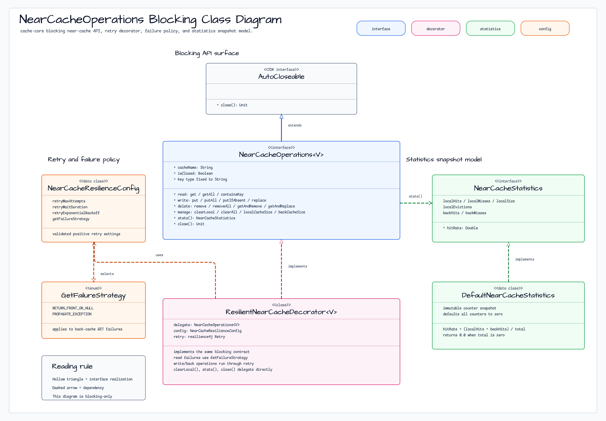
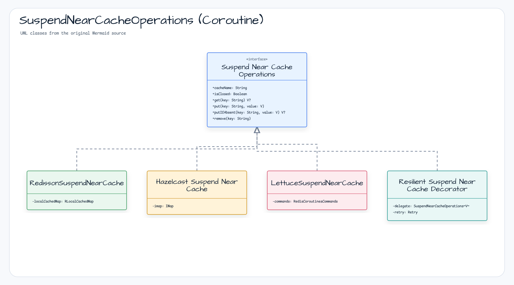
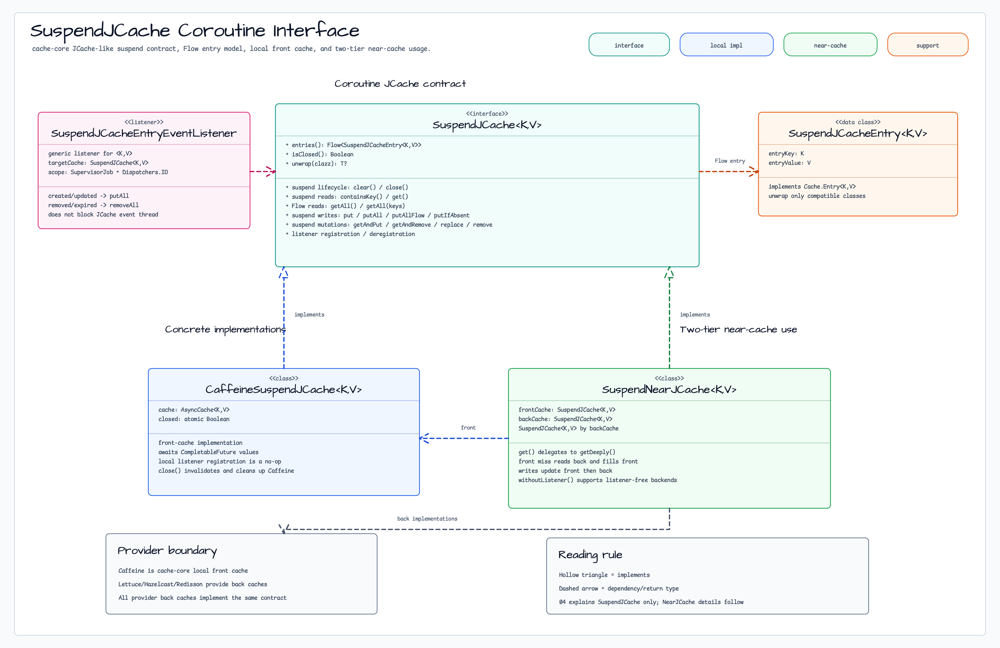
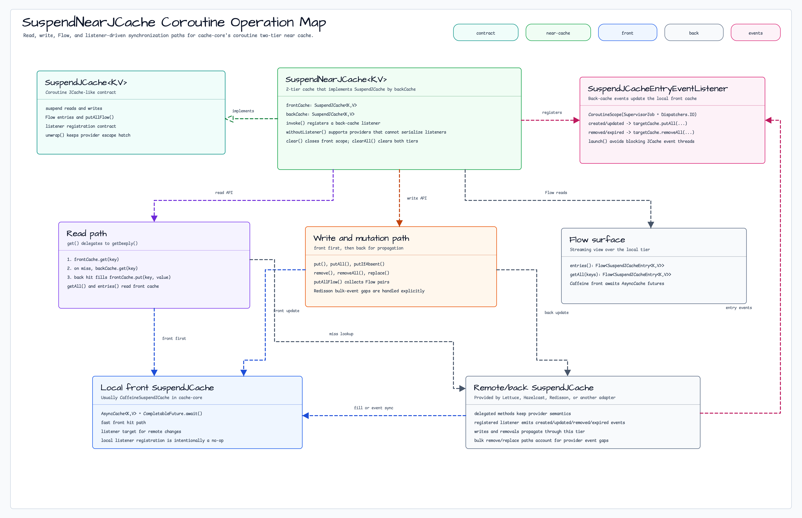

# Module bluetape4k-cache-core

[English](./README.md) | 한국어

`bluetape4k-cache-core`는 캐시 기능의 공통 API, 핵심 추상화, 그리고 **로컬 캐시 구현체**를 제공하는 모듈입니다.

> 기존 `bluetape4k-cache-local` 모듈이 이 모듈에 통합되었습니다.

## 패키지 / import 안정성

cache 폴더 재편으로 소스 위치는 `cache/cache-core/`가 되었지만 Gradle 프로젝트 이름, Maven artifact, Kotlin
package는 유지됩니다.

- Gradle project: `:bluetape4k-cache-core`
- Maven artifact: `io.github.bluetape4k:bluetape4k-cache-core`
- Kotlin package root: `io.bluetape4k.cache`

이번 재편으로 인한 사용자 import 변경은 필요하지 않습니다.

## 제공 기능

- **JCache 공통 유틸리티**: `JCaching`, `jcacheManager`, `jcacheConfiguration` 등
- **Coroutines 캐시 추상화**: `SuspendCache`, `SuspendCacheEntry`
- **NearCache 통일 인터페이스**: `NearCacheOperations<V>`, `SuspendNearCacheOperations<V>`, `NearCacheStatistics`
- **Resilient Decorator**: `ResilientNearCacheDecorator`,
  `ResilientSuspendNearCacheDecorator` (retry + failure strategy)
  - `NearCacheResilienceConfig.retryMaxAttempts`와 `retryWaitDuration`은 0보다 커야 함
- **JCache NearCache**: `NearJCache<K,V>`, `SuspendNearJCache<K,V>` — JCache 호환 2-tier 캐시 구현
- **Memoizer 추상화**: `Memoizer`, `AsyncMemoizer`, `SuspendMemoizer` (신 인터페이스)
- **로컬 캐시 Provider** (구 `cache-local` 통합):
  - **Caffeine**: `CaffeineSupport`, `CaffeineSuspendCache`, `CaffeineMemorizer`
  - **Cache2k**: `Cache2kSupport`, `Cache2kMemorizer`
  - **Ehcache**: `EhcacheSupport`, `EhCacheMemorizer`

## 설치

```kotlin
dependencies {
    implementation("io.github.bluetape4k:bluetape4k-cache-core:${bluetape4kVersion}")
}
```

분산 캐시가 필요하면 해당 Provider 모듈을 추가합니다.

## 제공 기능 (상세)

## Near-Cache Capability Matrix

Native/JCache NearCache 지원 경계는
[Near-Cache Backend Capability Matrix](../../docs/cache/near-cache-capability-matrix.md)에 정리되어 있습니다.

- Lettuce, Hazelcast IMap, Redisson native NearCache는 공통
  `NearCacheOperations` / `SuspendNearCacheOperations` conformance fixture를 상속합니다.
- Lettuce와 Redisson JCache NearCache는 listener 기반이며 공통 JCache conformance fixture를 상속합니다.
- Hazelcast JCache factory는 listener 없이 생성되는 degraded 모드입니다. 직접 listener-backed 생성은 unsupported로 테스트합니다.
- Caffeine과 Cache2k는 분산 back cache와 조합하지 않는 한 local provider입니다.

### NearCache 통일 인터페이스

모든 NearCache 백엔드(Lettuce, Hazelcast, Redisson, JCache)가 공통 인터페이스를 구현합니다.

#### Coroutine 취소와 retry

`ResilientSuspendNearCacheDecorator`는 일반 예외에 대해서만 retry를 적용합니다.
`CancellationException`은 코루틴 취소 신호이므로 retry하지 않고 즉시 전파합니다.

#### Suspend Memoizer 실패 복구

`SuspendMemoizer` 구현체는 같은 키의 동시 호출을 in-flight `Deferred`로 병합합니다.
evaluator가 실패하거나 호출 코루틴이 취소되면 해당 in-flight 항목을 제거하여, 다음 호출이
같은 실패를 재사용하지 않고 새 계산으로 복구할 수 있게 합니다.

```kotlin
var attempts = 0
val memo = suspendMemoizer<String, Int> { key ->
    attempts += 1
    if (attempts == 1) error("일시적 실패")
    key.length
}

runCatching { memo("recover") }  // 최초 1회 실패
val value = memo("recover")      // 새로 계산하여 7 반환
```

#### NearCache get() 동작 시퀀스 (front miss → back lookup → front fill)


#### NearCache put() 동작 시퀀스 (write-through)


#### NearCacheOperations (Blocking)



#### SuspendNearCacheOperations (Coroutine)



#### JCache 기반 NearCache (`nearcache.jcache` 패키지)

`JCache<K,V>` / `SuspendJCache<K,V>` 인터페이스를 직접 구현하는 2-tier 캐시입니다. `JCache<K,V> by backCache` 위임으로 JCache 호환성을 유지하며,
`NearJCacheConfig` Builder DSL로 설정할 수 있습니다.

`NearJCache<K,V>`의 표준 `javax.cache.Cache` 메서드는 논리적 2-tier 캐시를
관찰합니다. `get`, `containsKey`, `getAll`은 front를 먼저 확인하고 miss이면
back을 조회하며 두 계층에서 찾은 값을 모두 반환합니다. bulk back hit의 front
residency는 아래 설정 정책을 따릅니다. `clear`는 해당 wrapper가
소유한 front와 back의 매핑을 함께 삭제합니다. 기존 생성자와 provider factory는
`NearJCacheClearAuthority.DENY`를 사용하므로 `clear()`, `clearAllCache()`, 인자 없는
`removeAll()`은 어느 계층도 바꾸기 전에 `SecurityException`으로 실패합니다. back
namespace를 독점한다고 확인한 caller만 `NearJCacheClearAuthority.EXCLUSIVE_BACK_CACHE`를
명시적으로 선택해야 합니다. key 범위를 받는 `removeAll(keys)`와 단일 key `remove`는
이 권한 없이도 사용할 수 있습니다. 이 권한은 runtime-only이며 `NearJCacheConfig`
직렬화에 포함되지 않습니다. `nearCache.backCache.clear()` 같은 provider 직접 호출은
이 wrapper guard 밖의 caller-owned escape hatch이므로 권한 없는 코드에 back-cache
reference를 전달하지 마세요. `ResilientNearJCache`와 `ResilientSuspendNearJCache`의
`ClearBack` 경로는 이번 계약 범위가 아닙니다. 기존 `getDeeply`와 `clearAllCache`
이름은 각각 표준 `get`과 `clear`의 소스 호환 alias로 유지됩니다.

<!-- issue-1369-bulk-policy:start -->
### Bulk `getAll` 결과의 front 저장 정책

<!-- contract: default-bypass; bounded-all-or-nothing; single-key-get-unchanged; repeated-back-read; legacy-safe-default -->

```kotlin
val safeDefault = NearJCacheConfig<String, User>()
val bounded = NearJCacheConfig<String, User>(
    bulkFrontPopulationPolicy = BulkFrontPopulationPolicy.PopulateIfAtMost(128),
)
```

기본 `BulkFrontPopulationPolicy.BypassFront`도 front hit와 모든 back hit를
반환하지만, bulk 조회의 back 결과를 front에 저장하지 않습니다.
`BulkFrontPopulationPolicy.PopulateIfAtMost(n)`은 `backValues.size <= n`일 때만
batch 전체를 저장하며, 초과 batch의 일부만 저장하지 않습니다. entry 수는
메모리에 상주하는 byte 크기도 back 조회 크기 제한도 아닙니다. single-key `get()`의
read-through 저장은 바뀌지 않습니다.

Configuration MXBean은 `BYPASS_FRONT` 또는 `POPULATE_IF_AT_MOST`와
`bulkFrontPopulationMaximumEntryCount`를 노출합니다. `0`은 bypass 정책에 상한을
적용하지 않는다는 뜻입니다. 새 설정과 복원한 legacy stream은 모두 안전한 bypass를
기본으로 사용합니다. 반환 결과는 같지만 반복 `getAll`은 back을 반복 조회해 로컬 hit
ratio와 back 부하를 바꿀 수 있습니다. 이전 무제한 batch 저장 방식은 복원하지 마세요.
front 용량과 로컬 heap 예산을 검토한 뒤 상한 정책을 명시합니다.
<!-- issue-1369-bulk-policy:end -->

공유 back cache를 사용하는 다른 wrapper의 front에 이미 들어간 값까지
`clear`가 listener로 지운다고 보장하지 않습니다. peer 무효화가 필요하면
기존 per-entry `removeAll` 경로를 사용하세요. `getAndPut`, `getAndRemove`,
`getAndReplace`는 back provider의 원자 compound 연산을 먼저 수행한 뒤
local front를 조정합니다. 따라서 front를 먼저 읽고 back을 별도로 쓰는
왕복을 사용하지 않으며, back provider 실패 시 front를 변경하기 전에
예외를 전달합니다.

마지막 write-through의 operation ID·operation 이름·completion을 함께 상관관계로
관찰하려면 `nearCache.lastBackCacheWrite`를 사용하세요. 이 값은 하나의 원자
스냅숏이며 completion stage는 읽기 전용입니다. 기존
`lastBackCacheWriteOperationId`와 `lastBackCacheWriteCompletion` property는 소스
호환성을 위해 유지하지만, 두 값을 따로 읽어 상관관계를 구성하지는 마세요.

```kotlin
val observation = nearCache.lastBackCacheWrite
observation.completion.toCompletableFuture().join()
```

`NearJCacheConfig.isSynchronous=true`이면 동기 write-through의 blocking provider 호출을
전용 virtual thread에서 실행하고, 500ms 이상으로 보정된 `syncRemoteTimeout`까지만
기다립니다. provider가 같은 write의 listener를 inline 또는 synchronous callback thread에서
호출하는 경우 key/type/value 상관관계가 맞는 self-event를 front에 직접 반영하고
`mutationGate`를 다시 획득하지 않아 self-deadlock을 차단합니다. 매칭되지 않는 다른 wrapper나 외부 write의 event는 계속
`mutationGate`로 직렬화하며, 비동기 write-through도 기존 gate 경로를 유지합니다. JCache event에는 operation ID가 없으므로
동일 key/type/value의 외부 event는 활성 self-event와 구분할 수 없습니다. provider가 interrupt를 무시하면
호출자가 timeout을 관찰한 뒤 back write가 완료될 수 있으며, `backWriteLock`이 해당
late completion과 후속 write의 순서를 직렬화합니다.

`SuspendNearJCache`의 일반 mutation도 동일한 back-first 규칙을 적용합니다.
`put`, `putAll`, `putIfAbsent`, `remove`, `replace`는 back cache를 먼저
변경한 뒤 local front를 조정합니다. back 실패 시 front는 변경하지 않으며,
back commit 후 front 조정이 실패하면 해당 front key를 invalidate하여
미커밋 값을 반환하지 않습니다. 코루틴 cancellation은 fallback이나 retry로
대체하지 않고 호출자에게 재전파합니다.

기본 front 설정은 store-by-reference입니다. 필터링된 provider별 copier 계약이
정해지기 전에는 custom store-by-value front 설정을 생성 단계에서 거부합니다.

`close()`는 명시적으로 등록한 MXBean handle, 이 wrapper가 등록한 listener, 소유한
front cache 순서로 정리하며, 전달받은 back cache, `MBeanServer`, cache manager,
provider는 닫지 않습니다. 정리 실패는 호출자에게
관찰 가능하게 전달합니다. 첫 번째 실패는 주 예외로 유지하고 이후 정리 실패는
suppressed 예외로 연결합니다. 성공한 `close()`는 idempotent이며, listener
deregister 또는 front close가 실패하면 다음 호출에서 해당 정리를 재시도합니다.
close가 시작된 뒤에는 listener 재등록을 거부합니다. front cache를 생성한 뒤
생성이 실패한 경우에도 동일한 주 예외/suppressed 예외 정책으로 rollback합니다.

<!-- issue-1351-nearcache-management:start -->
#### NearJCache management·statistics 명시적 등록

Management는 opt-in입니다. wrapper를 만들기 전에 cache type과 두 feature flag를
설정하고 front cache의 `storeByValue`를 끕니다. caller가 소유한 `MBeanServer`에
안정적이고 비밀이 아닌 ID로 MXBean을 등록합니다. ID는 `ObjectName`에 노출되므로
credential, token, 개인정보를 넣지 않습니다.

```kotlin
import io.bluetape4k.cache.nearcache.jcache.NearJCache
import io.bluetape4k.cache.nearcache.jcache.NearJCacheClearAuthority
import io.bluetape4k.cache.nearcache.jcache.NearJCacheConfig
import io.bluetape4k.cache.nearcache.jcache.management.NearJCacheConfigurationMXBean
import io.bluetape4k.cache.nearcache.jcache.management.NearJCacheTierStatisticsMXBean
import io.bluetape4k.cache.nearcache.jcache.management.registerMBeans
import java.lang.management.ManagementFactory
import javax.cache.configuration.MutableConfiguration
import javax.management.JMX

val manager = NearJCacheConfig.CaffeineCacheManagerFactory.create()
val configuration = MutableConfiguration<String, String>()
    .setTypes(String::class.java, String::class.java)
    .setStatisticsEnabled(true)
    .setManagementEnabled(true)
    .setStoreByValue(false)
val front = manager.createCache("orders-front", configuration)
val back = manager.createCache("orders-back", configuration)
val nearCache = NearJCache(
    front,
    back,
    NearJCacheConfig(frontCacheConfiguration = configuration),
    NearJCacheClearAuthority.EXCLUSIVE_BACK_CACHE,
)
val server = ManagementFactory.getPlatformMBeanServer()
val registration = nearCache.registerMBeans(server, "orders-service", "orders-v1")
val names = registration.activeObjectNames.associateBy { it.getKeyProperty("type") }
val management = JMX.newMXBeanProxy(server, names.getValue("NearJCacheConfiguration"), NearJCacheConfigurationMXBean::class.java)
val statistics = JMX.newMXBeanProxy(server, names.getValue("NearJCacheStatistics"), NearJCacheTierStatisticsMXBean::class.java)

statistics.clear() // logical/tier counter만 초기화
nearCache.clear()  // 이 wrapper의 front와 back data를 삭제
registration.close()
nearCache.close()
back.close()
```

Factory는 provider-managed cache manager를 반환합니다. Wrapper cleanup에서 manager를
닫지 말고 application의 provider shutdown 시점에만 닫습니다.

Java에서는 `NearJCacheMBeans.registerMBeans(nearCache, server, managerId, cacheId)`를
사용합니다. Management bean은 wrapper 생성 시점의 immutable configuration snapshot을
노출합니다. 통계의 `statisticsScope`는 `NEAR_JCACHE_WRAPPER_V1`이며, counter를 해석하기
전에 `supportedOperations`를 확인합니다. Capability getter
`isFrontEvictionObservationSupported`, `isBulkRemovalCountSupported`,
`isBackWriteCompletionIncluded`는 현재 `false`입니다. Capability가 `false`이면 해당
사건을 관찰하지 않는다는 뜻이지 사건이 없었다는 증거가 아닙니다.

비동기 write-through의 API 성공은 caller-visible acceptance만 셉니다. 각
`BackCacheWriteCompletion`을 안정적인 correlation key인 `operationId`와 진단용
`operation` 이름으로 remote completion까지 추적합니다. zero-loss global drain API는
없습니다. Migration 전에 새 admission을 중단하고 application이 outstanding completion
inventory를 유지해야 합니다. 동기 handover는 old registration handle close, old
`nearCache` close, replacement 생성·등록 순서로 수행합니다.

Registration은 handle이 반환한 exact MXBean name만 소유합니다. `MBeanServer`, back
cache, cache manager, provider는 소유하지 않습니다. Handle이 활성인 동안 namespace를
독점합니다. Collision이 나면 기존 owner를 확인한 뒤 재시도합니다.
`RECOVERY_REQUIRED`는 즉시 cleanup incident로 처리하고 recovery handle의 `close()`를
재시도합니다. Ownership token은 stale owner 교체를 줄이는 best-effort 방어이며 atomic
JMX compare-and-swap은 아닙니다. Rollout 분류와 cleanup 증거는
[운영 가이드](../../docs/operations/issue-1351-nearcache-management.md)를 따릅니다.
<!-- issue-1351-nearcache-management:end -->

<!-- nearjcache-clear-authority-contract -->
### #1368 shared-back clear authority

기본 wrapper는 공유 back namespace에서 안전하게 동작합니다. tenant가 소유한 key
목록은 key-scoped removal로 처리하고, namespace-wide clear는 독점 소유를 확인한
caller만 명시적으로 선택합니다. 이 enum은 runtime-only이며 직렬화되는
`NearJCacheConfig`를 바꾸지 않습니다.

```kotlin
val shared = NearJCache(front, back, NearJCacheConfig(), NearJCacheClearAuthority.DENY)
shared.removeAll(setOf("tenant-a:key-1"))
val owner = NearJCache(
    front,
    back,
    NearJCacheConfig(),
    NearJCacheClearAuthority.EXCLUSIVE_BACK_CACHE,
)
owner.clearAllCache()
```
<!-- /nearjcache-clear-authority-contract -->

##### SuspendJCache 인터페이스



##### NearJCache (동기)


##### SuspendNearJCache (코루틴)



##### NearJCacheConfig Builder DSL

```kotlin
// DSL로 NearJCacheConfig 생성
val config = nearJCacheConfig<String, String> {
    cacheName = "my-near-jcache"
    isSynchronous = true
    syncRemoteTimeout = 1000L
}

// Hazelcast 기반 NearJCache
val nearCache = HazelcastCaches.nearJCache<String, String>(hazelcastInstance) {
    cacheName = "my-near-jcache"
    isSynchronous = true
}

// Lettuce 기반 NearJCache
val nearCacheLettuce = LettuceCaches.nearJCache<String, String>(redisClient) {
    cacheName = "my-near-jcache"
}

// Lettuce 기반 SuspendNearJCache
val suspendNear = LettuceCaches.suspendNearJCache<String>(redisClient) {
    cacheName = "my-suspend-near-jcache"
}
suspendNear.put("key", "value")
val v = suspendNear.get("key")
suspendNear.close()
```

> 새 코드는 `NearJCacheConfigBuilder` DSL을 활용하세요. `NearCacheOperations<V>` /
`SuspendNearCacheOperations<V>` 인터페이스 기반 구현체(Lettuce, Hazelcast, Redisson NearCache)가 더 풍부한 통계/resilience 기능을 제공합니다.

| 클래스                            | 모듈              | 설명                                      |
|--------------------------------|-----------------|-----------------------------------------|
| `JCache<K,V>`                  | cache-core      | JCache (JSR-107) 표준 인터페이스               |
| `SuspendJCache<K,V>`           | cache-core      | Coroutines suspend 캐시 인터페이스             |
| `NearJCache<K,V>`              | cache-core      | 동기 2-Tier NearCache (JCache 구현)         |
| `SuspendNearJCache<K,V>`       | cache-core      | 코루틴 2-Tier NearCache (SuspendJCache 구현) |
| `NearJCacheConfig<K,V>`        | cache-core      | NearJCache 설정 data class                |
| `NearJCacheConfigBuilder<K,V>` | cache-core      | NearJCacheConfig DSL 빌더                 |
| `CaffeineSuspendJCache<K,V>`   | cache-core      | Caffeine 기반 SuspendJCache (front cache) |
| `LettuceJCache<K,V>`           | cache-lettuce   | Lettuce Redis hash 기반 JCache            |
| `LettuceSuspendJCache<V>`      | cache-lettuce   | Lettuce 기반 SuspendJCache                |
| `HazelcastSuspendJCache<K,V>`  | cache-hazelcast | Hazelcast 기반 SuspendJCache              |
| `RedissonSuspendJCache<K,V>`   | cache-redisson  | Redisson 기반 SuspendJCache               |

| 클래스                                     | 모듈              | 설명                                                 |
|-----------------------------------------|-----------------|----------------------------------------------------|
| `NearCacheOperations<V>`                | cache-core      | 공통 blocking 인터페이스 (AutoCloseable)                  |
| `SuspendNearCacheOperations<V>`         | cache-core      | 공통 suspend 인터페이스                                   |
| `NearCacheStatistics`                   | cache-core      | 로컬/백엔드 hit/miss 통계                                 |
| `NearCacheResilienceConfig`             | cache-core      | retry + failure strategy 설정                        |
| `ResilientNearCacheDecorator<V>`        | cache-core      | Decorator: Resilience4j retry + GetFailureStrategy |
| `ResilientSuspendNearCacheDecorator<V>` | cache-core      | Decorator suspend 버전                               |
| `LettuceNearCache<V>`                   | cache-lettuce   | RESP3 CLIENT TRACKING 기반                           |
| `LettuceSuspendNearCache<V>`            | cache-lettuce   | Lettuce coroutines 버전                              |
| `HazelcastNearCache<V>`                 | cache-hazelcast | IMap + EntryListener invalidation                  |
| `HazelcastSuspendNearCache<V>`          | cache-hazelcast | IMap async + await                                 |
| `RedissonNearCache<V>`                  | cache-redisson  | RLocalCachedMap (내장 invalidation)                  |
| `RedissonSuspendNearCache<V>`           | cache-redisson  | RLocalCachedMap async + await                      |

**Resilience Decorator 사용:**

```kotlin
// 어떤 백엔드든 .withResilience {} 로 래핑 가능
val cache = lettuceNearCacheOf<String>(redisClient, codec, config)
    .withResilience {
        retryMaxAttempts = 5
        retryWaitDuration = Duration.ofSeconds(1)
        getFailureStrategy = GetFailureStrategy.PROPAGATE_EXCEPTION
    }
```

**GetFailureStrategy:**

- `RETURN_FRONT_OR_NULL`: back cache GET 실패 시 null 반환 (graceful degradation)
- `PROPAGATE_EXCEPTION`: 예외를 호출자에게 전파

---

## 기본 사용 예시

### 1. Caffeine 로컬 캐시

```kotlin
import io.bluetape4k.cache.caffeine.caffeine
import com.github.benmanes.caffeine.cache.Cache

val cache: Cache<String, Any> = caffeine {
    maximumSize(1_000)
    expireAfterWrite(10, TimeUnit.MINUTES)
}.build()
```

### 2. CaffeineSuspendCache

```kotlin
import io.bluetape4k.cache.jcache.CaffeineSuspendCache

val suspendCache = CaffeineSuspendCache<String, Any>("local-cache")
suspendCache.put("key", "value")
val value = suspendCache.get("key")
```

### 3. JCache 유틸리티

```kotlin
import io.bluetape4k.cache.jcache.jcacheConfiguration

val config = jcacheConfiguration<String, String> {
    isStatisticsEnabled = true
    isManagementEnabled = true
}
```

### 4. NearCacheOperations (통일 인터페이스)

```kotlin
import io.bluetape4k.cache.nearcache.jcacheNearCacheOf
import io.bluetape4k.cache.jcache.JCaching

// JCache 백엔드로 NearCache 생성
val backCache = JCaching.Caffeine.getOrCreate<String, String>("back-cache")
val cache = jcacheNearCacheOf<String>(backCache)

cache.put("key", "value")
cache.get("key")             // front hit → 즉시 반환
cache.clearLocal()           // front만 비우기
cache.clearAll()             // front + back 모두 비우기
cache.stats()                // NearCacheStatistics 조회
cache.close()
```

### 5. Resilient Decorator (.withResilience)

```kotlin
import io.bluetape4k.cache.nearcache.jcacheNearCacheOf
import io.bluetape4k.cache.nearcache.withResilience
import io.bluetape4k.cache.nearcache.GetFailureStrategy

val cache = jcacheNearCacheOf<String>(backCache)
    .withResilience {
        retryMaxAttempts = 3
        retryWaitDuration = Duration.ofMillis(200)
        retryExponentialBackoff = true
        getFailureStrategy = GetFailureStrategy.RETURN_FRONT_OR_NULL
    }

cache.put("key", "value")   // retry 적용된 write-through
cache.get("key")             // retry + failure strategy 적용
cache.close()
```

### 7. Caffeine Memorizer

```kotlin
import io.bluetape4k.cache.memorizer.caffeine.CaffeineMemorizer

val factorial = CaffeineMemorizer<Int, Long> { n ->
    (1..n).fold(1L) { acc, i -> acc * i }
}

val result = factorial[10]  // 캐싱되어 반복 계산 방지
```

## 권장 사용 방식

| 사용 목적                           | 권장 모듈                         |
|---------------------------------|-------------------------------|
| 로컬 캐시(Caffeine/Cache2k/Ehcache) | `bluetape4k-cache-core`       |
| Hazelcast 분산 캐시 + Near Cache    | `bluetape4k-cache-hazelcast`  |
| Redisson 분산 캐시 + Near Cache     | `bluetape4k-cache-redisson`   |
| 전체 Provider 일괄 사용               | `bluetape4k-cache` (umbrella) |

## testFixtures 활용 가이드

`bluetape4k-cache-core`는 분산 캐시 Provider 구현을 위한 **6개의 추상 테스트 클래스**를 `testFixtures`로 제공합니다.

### 추상 테스트 클래스 목록

| 클래스                                         | 패키지         | 설명                                                 |
|---------------------------------------------|-------------|----------------------------------------------------|
| `AbstractSuspendCacheTest`                  | `jcache`    | `SuspendCache` 기본 CRUD + 동시성 검증                    |
| `AbstractNearCacheOperationsTest<V>`        | `nearcache` | `NearCacheOperations` 공통 14개 시나리오 (blocking)       |
| `AbstractSuspendNearCacheOperationsTest<V>` | `nearcache` | `SuspendNearCacheOperations` 공통 14개 시나리오 (suspend) |
| `AbstractNearCacheTest`                     | `nearcache` | `NearCache` (legacy) write-through/event 전파 검증     |
| `AbstractSuspendNearCacheTest`              | `nearcache` | `SuspendNearCache` (legacy) coroutines 검증          |
| `AbstractMemorizerTest`                     | `memorizer` | `Memorizer` 단일 계산 보장                               |
| `AbstractAsyncMemorizerTest`                | `memorizer` | `AsyncMemorizer` CompletableFuture 검증              |
| `AbstractSuspendMemorizerTest`              | `memorizer` | `SuspendMemorizer` suspend 검증                      |

### Provider별 호환성 매트릭스

| testFixtures                   | Hazelcast | Ignite2 | Redisson |   Lettuce    |
|--------------------------------|:---------:|:-------:|:--------:|:------------:|
| `AbstractSuspendCacheTest`     |     ✅     |    ✅    |    ✅     |      ✅       |
| `AbstractNearCacheTest`        |     ✅     |    ✅    |    ✅     | N/A(아키텍처 상이) |
| `AbstractSuspendNearCacheTest` |     ✅     |    ✅    |    ✅     | N/A(아키텍처 상이) |
| `AbstractMemorizerTest` 3종     |    N/A    |   N/A   |   N/A    |     N/A      |

> Memorizer는 로컬 캐시 전용 패턴으로 분산 캐시 모듈에는 해당 없음

### 새 Provider에서 testFixtures 사용하기

```kotlin
// build.gradle.kts
dependencies {
    testImplementation(testFixtures("io.github.bluetape4k:bluetape4k-cache-core:${bluetape4kVersion}"))
}
```

```kotlin
// 새 Provider NearCache 테스트 예시 (통일 인터페이스)
class MyProviderNearCacheTest : AbstractNearCacheOperationsTest<String>() {
    override fun createCache(): NearCacheOperations<String> = myProviderNearCacheOf(/* ... */)
    override fun sampleValue(): String = "hello"
    override fun anotherValue(): String = "world"
}

// Resilient Decorator 테스트도 동일 패턴
class ResilientMyProviderTest : AbstractNearCacheOperationsTest<String>() {
    override fun createCache() = myProviderNearCacheOf(/* ... */)
        .withResilience { retryMaxAttempts = 3 }
    override fun sampleValue(): String = "hello"
    override fun anotherValue(): String = "world"
}
```
