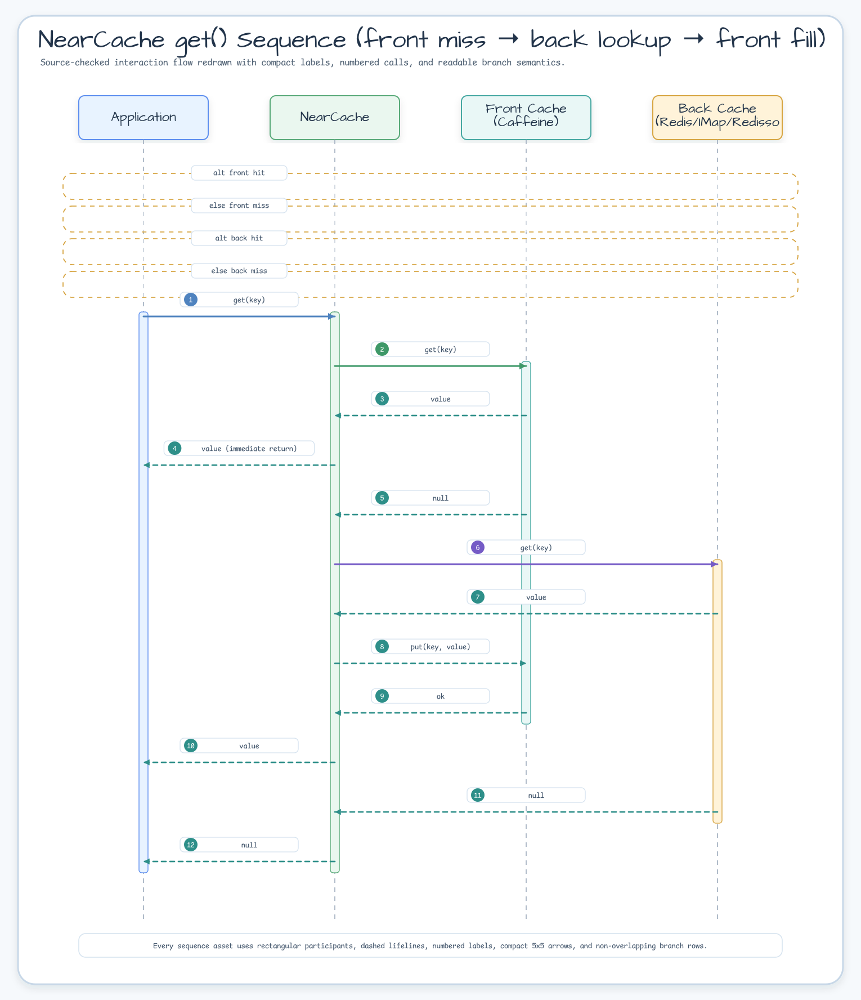
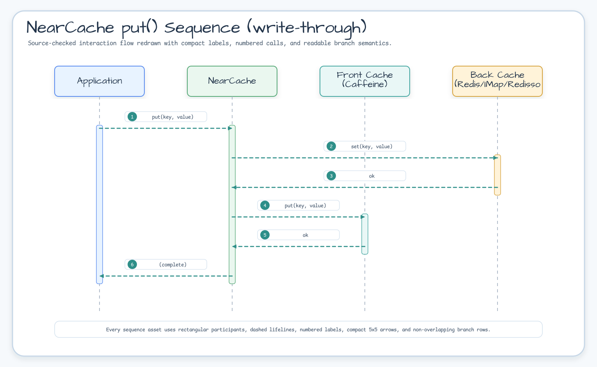
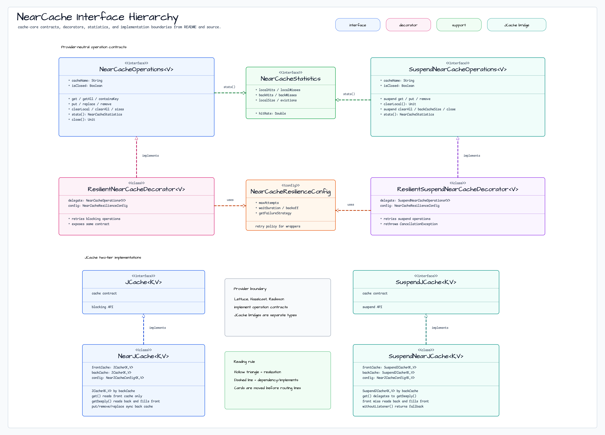

# Module bluetape4k-cache-core

English | [한국어](./README.ko.md)

`bluetape4k-cache-core` provides the shared cache API, core abstractions, and **local cache implementations**.

> The former `bluetape4k-cache-local` module was merged into this module.

## Package / Import Stability

The cache folder reorganization moved this module under `cache/cache-core/`, but
the Gradle project name, Maven artifact ID, and Kotlin packages remain stable:

- Gradle project: `:bluetape4k-cache-core`
- Maven artifact: `io.github.bluetape4k:bluetape4k-cache-core`
- Kotlin package root: `io.bluetape4k.cache`

No user import migration is required for the reorganization.

## Provided Features

- **Common JCache utilities**: `JCaching`, `jcacheManager`, `jcacheConfiguration`, and more
- **Coroutines cache abstractions**: `SuspendCache`, `SuspendCacheEntry`
- **Unified NearCache interfaces**: `NearCacheOperations<V>`, `SuspendNearCacheOperations<V>`, `NearCacheStatistics`
- **Resilient decorators**: `ResilientNearCacheDecorator`, `ResilientSuspendNearCacheDecorator`
- **JCache NearCache**: `NearJCache<K,V>`, `SuspendNearJCache<K,V>`
- **Memoizer abstractions** for sync, async, and suspend flows
- **Local cache providers**: Caffeine, Cache2k, and Ehcache

## Architecture Diagrams

### NearCache get() Sequence (front miss → back lookup → front fill)



### NearCache put() Sequence (write-through)



### NearCache Interface Hierarchy



## Installation

```kotlin
dependencies {
    implementation("io.github.bluetape4k:bluetape4k-cache-core:${bluetape4kVersion}")
}
```

Add the appropriate provider module if you need distributed caching.

## Detailed Features

### JCache NearCache contract

`NearJCache<K,V>` is a logical two-tier implementation of `javax.cache.Cache`.
Standard `get`, `containsKey`, and `getAll` check the front cache first, fall
back to the back cache on a miss, and populate the front cache with back hits.
Standard `clear` removes mappings from both layers owned by the wrapper. The
`getDeeply` and `clearAllCache` names remain source-compatible aliases for the
standard `get` and `clear` behavior.

The clear operation does not promise invalidation of another wrapper's already
populated front cache when the back cache is shared or listener propagation is
unavailable. Use the existing per-entry `removeAll` path when peer invalidation
is required. `getAndPut`, `getAndRemove`, and `getAndReplace` use the back
provider's atomic compound operation and then reconcile the local front cache;
they do not implement a front-read/back-write round trip. A provider failure is
propagated before the front cache is changed.

When `NearJCacheConfig.isSynchronous=true`, synchronous write-through runs the
blocking provider call on a dedicated virtual thread and waits only up to the
bounded `syncRemoteTimeout` (with a 500 ms minimum). If a provider invokes the
listener for that same write inline or on a synchronous callback thread,
`NearJCache` uses an operation-scoped key/type/value match to reconcile the
self-event directly to the front cache instead of reacquiring `mutationGate`;
this prevents self-deadlock. Non-matching peer or external events still use
`mutationGate`, and asynchronous write-through keeps the existing gated path.
JCache events do not carry an operation ID, so an external event with the same
key/type/value cannot be distinguished from the active self-event. A provider that
ignores interruption may complete after the caller observes a timeout;
`backWriteLock` serializes that late completion with following writes.

`SuspendNearJCache` uses the same back-first rule for ordinary mutations:
`put`, `putAll`, `putIfAbsent`, `remove`, and `replace` update the back cache
before reconciling the local front cache. A back failure leaves the front
unchanged; if front reconciliation fails after a back commit, the affected
front key(s) are invalidated so an uncommitted value is not returned. Coroutine
cancellation is propagated without fallback or retry.

The default front configuration uses store-by-reference. A custom store-by-value
front configuration is rejected until a filtered, provider-specific copier
contract is supplied.

`close()` deregisters the listener registered by this wrapper and closes only its
owned front cache; it never closes the supplied back cache or provider. Cleanup
failures are observable: the first failure is propagated and later cleanup
failures are attached as suppressed exceptions. A successful `close()` is
idempotent, while a listener-deregistration or front-close failure is retried by
the next call. Listener registration is rejected once close has started. If
construction fails after the front cache is created, the same
primary/suppressed exception policy is applied during rollback.

## Near-Cache Capability Matrix

The shared support boundary for native and JCache near-cache variants is tracked
in [Near-Cache Backend Capability Matrix](../../docs/cache/near-cache-capability-matrix.md).

- Lettuce, Hazelcast IMap, and Redisson native near caches are covered by the
  shared `NearCacheOperations` / `SuspendNearCacheOperations` conformance
  fixtures.
- Lettuce and Redisson JCache near caches are listener-backed and covered by the
  shared JCache conformance fixtures.
- Hazelcast JCache factory methods are listener-free by design; direct
  listener-backed construction is unsupported and tested explicitly.
- Caffeine and Cache2k are local providers unless paired with a distributed back
  cache through a supported near-cache implementation.

### Unified NearCache Interface

All NearCache backends, including Lettuce, Hazelcast, Redisson, and JCache-based implementations, share a common interface.

- `NearCacheOperations` is the blocking contract.
- `SuspendNearCacheOperations` is the coroutine contract.
- `NearCacheStatistics` exposes hit/miss and capacity-oriented counters.
- Resilience decorators wrap these interfaces to add retry and failure strategies.

The Korean README contains the full sequence diagrams and class diagrams for `get()`,
`put()`, and JCache-backed two-tier caches.

## Basic Usage Examples

Typical usage patterns:

- local cache only through Caffeine / Cache2k / Ehcache providers
- common cache abstractions shared across distributed backends
- resilience decorators in front of remote NearCache implementations
- memoizers for repeatable, computation-heavy functions

### Suspend Memoizer Failure Recovery

Suspend memoizers merge concurrent calls for the same key through an in-flight
`Deferred`. If the evaluator fails or the caller is cancelled, that in-flight
entry is removed so a later call can recompute instead of replaying a stale
failure.

```kotlin
var attempts = 0
val memo = suspendMemoizer<String, Int> { key ->
    attempts += 1
    if (attempts == 1) error("temporary backend failure")
    key.length
}

runCatching { memo("recover") }  // fails once
val value = memo("recover")      // recomputes and returns 7
```

## Recommended Usage Patterns

- Use `cache-core` directly when local cache and common abstractions are enough.
- Use provider modules such as Hazelcast, Lettuce, or Redisson when remote storage or invalidation is required.
- Prefer the newer `Memoizer` / `AsyncMemoizer` / `SuspendMemoizer` abstractions for new code.
- Use `NearCacheOperations` / `SuspendNearCacheOperations` for provider-neutral two-tier cache contracts.
- Suspend resilience decorators do not retry `CancellationException`; coroutine cancellation is propagated immediately.

## `testFixtures` Usage Guide

`cache-core` is also suitable for shared test helpers and fixtures in modules that need consistent cache contracts during tests. Reuse the abstractions from this module rather than duplicating provider-neutral helpers in each backend-specific module.
