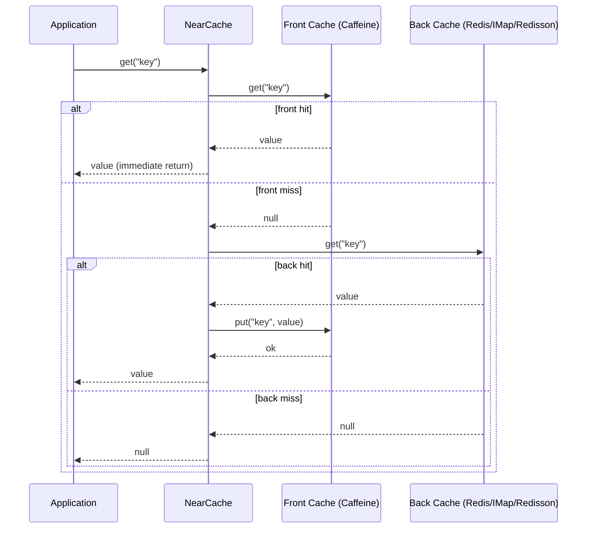
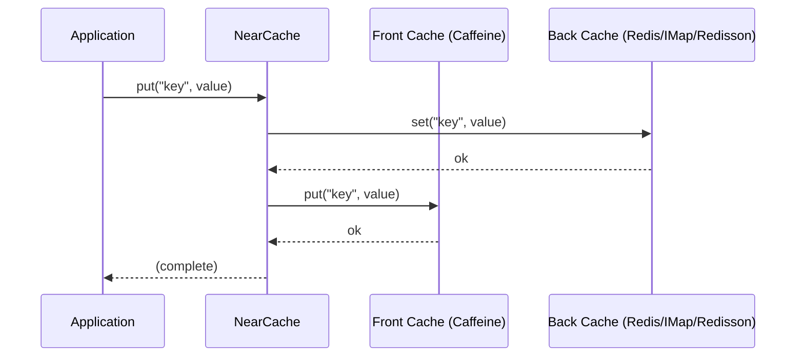
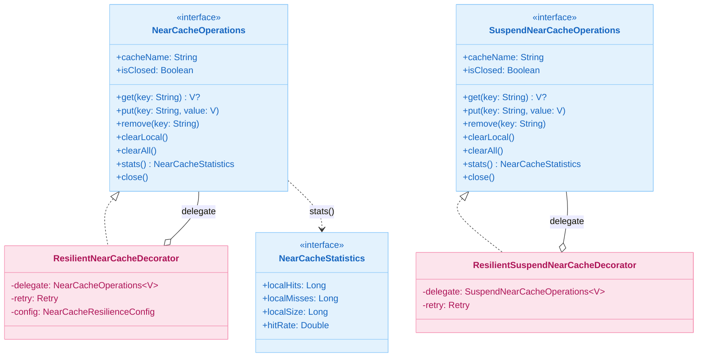

# Module bluetape4k-cache-core

English | [한국어](./README.ko.md)

`bluetape4k-cache-core` provides the shared cache API, core abstractions, and **local cache implementations**.

> The former `bluetape4k-cache-local` module was merged into this module.

## Package / Import Stability

The cache folder reorganization moved this module under `cache/cache-core/`, but
the Gradle project name, Maven artifact ID, and Kotlin packages remain stable:

- Gradle project: `:bluetape4k-cache-core`
- Maven artifact: `io.github.bluetape4k:bluetape4k-cache-core`
- Kotlin package root: `io.bluetape4k.cache`

No user import migration is required for the reorganization.

## Provided Features

- **Common JCache utilities**: `JCaching`, `jcacheManager`, `jcacheConfiguration`, and more
- **Coroutines cache abstractions**: `SuspendCache`, `SuspendCacheEntry`
- **Unified NearCache interfaces**: `NearCacheOperations<V>`, `SuspendNearCacheOperations<V>`, `NearCacheStatistics`
- **Resilient decorators**: `ResilientNearCacheDecorator`, `ResilientSuspendNearCacheDecorator`
- **JCache NearCache**: `NearJCache<K,V>`, `SuspendNearJCache<K,V>`
- **Memoizer abstractions** for sync, async, and suspend flows
- **Local cache providers**: Caffeine, Cache2k, and Ehcache

## Installation

```kotlin
dependencies {
    implementation("io.github.bluetape4k:bluetape4k-cache-core:${bluetape4kVersion}")
}
```

Add the appropriate provider module if you need distributed caching.

## Detailed Features

### Unified NearCache Interface

All NearCache backends, including Lettuce, Hazelcast, Redisson, and JCache-based implementations, share a common interface.

- `NearCacheOperations` is the blocking contract.
- `SuspendNearCacheOperations` is the coroutine contract.
- `NearCacheStatistics` exposes hit/miss and capacity-oriented counters.
- Resilience decorators wrap these interfaces to add retry and failure strategies.

The Korean README contains the full sequence diagrams and class diagrams for `get()`,
`put()`, and JCache-backed two-tier caches.

## Basic Usage Examples

Typical usage patterns:

- local cache only through Caffeine / Cache2k / Ehcache providers
- common cache abstractions shared across distributed backends
- resilience decorators in front of remote NearCache implementations
- memoizers for repeatable, computation-heavy functions

### Suspend Memoizer Failure Recovery

Suspend memoizers merge concurrent calls for the same key through an in-flight
`Deferred`. If the evaluator fails or the caller is cancelled, that in-flight
entry is removed so a later call can recompute instead of replaying a stale
failure.

```kotlin
var attempts = 0
val memo = suspendMemoizer<String, Int> { key ->
    attempts += 1
    if (attempts == 1) error("temporary backend failure")
    key.length
}

runCatching { memo("recover") }  // fails once
val value = memo("recover")      // recomputes and returns 7
```

## Recommended Usage Patterns

- Use `cache-core` directly when local cache and common abstractions are enough.
- Use provider modules such as Hazelcast, Lettuce, or Redisson when remote storage or invalidation is required.
- Prefer the newer `Memoizer` / `AsyncMemoizer` / `SuspendMemoizer` abstractions for new code.
- Use `NearCacheOperations` / `SuspendNearCacheOperations` for provider-neutral two-tier cache contracts.
- Suspend resilience decorators do not retry `CancellationException`; coroutine cancellation is propagated immediately.

## Architecture Diagrams

### NearCache get() Sequence (front miss → back lookup → front fill)



### NearCache put() Sequence (write-through)



### NearCache Interface Hierarchy



## `testFixtures` Usage Guide

`cache-core` is also suitable for shared test helpers and fixtures in modules that need consistent cache contracts during tests. Reuse the abstractions from this module rather than duplicating provider-neutral helpers in each backend-specific module.
