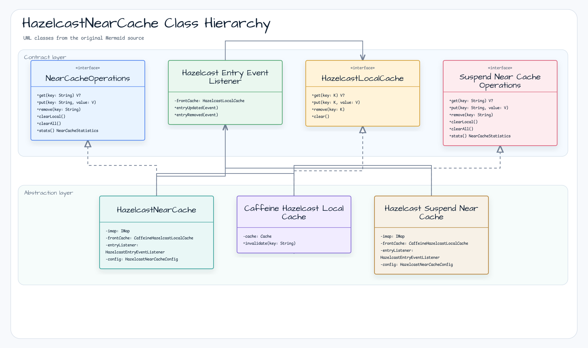
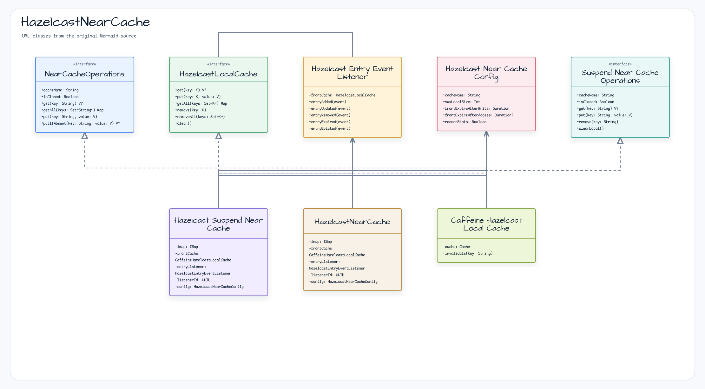
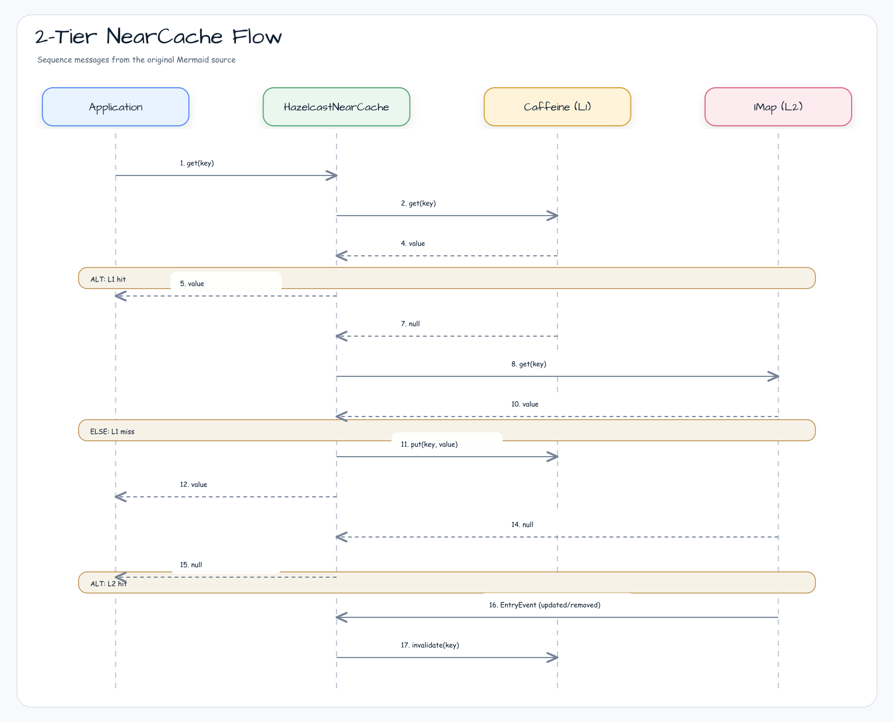

# Module bluetape4k-cache-hazelcast

English | [한국어](./README.ko.md)

`bluetape4k-cache-hazelcast` provides a Hazelcast-based JCache provider, coroutine-friendly cache implementations, and a
**Caffeine + Hazelcast IMap 2-tier near cache**.

> The former `bluetape4k-cache-hazelcast-near` module was merged into this module.

## Package / Import Stability

The cache folder reorganization moved this module under `cache/cache-hazelcast/`,
but the Gradle project name, Maven artifact ID, and Kotlin packages remain stable:

- Gradle project: `:bluetape4k-cache-hazelcast`
- Maven artifact: `io.github.bluetape4k:bluetape4k-cache-hazelcast`
- Kotlin package root: `io.bluetape4k.cache`

No user import migration is required for the reorganization.

## Provided Features

- `HazelcastJCaching`
- `HazelcastSuspendCache`
- `HazelcastNearCache<V>`
- `HazelcastSuspendNearCache<V>`
- `ResilientHazelcastNearCache<V>`
- `ResilientHazelcastSuspendNearCache<V>`
- `HazelcastNearCacheConfig`
- `ResilientHazelcastNearCacheConfig`
- `HazelcastLocalCache<V>`
- `CaffeineHazelcastLocalCache<V>`
- `HazelcastEntryEventListener`
- sync / async / suspend memoizers based on `IMap`

## NearCache Architecture

Two main modes are supported:

- **Write-through**
  - front-cache hit returns immediately
  - front-cache miss reads from IMap and repopulates the front cache
  - writes update both front cache and IMap synchronously
  - invalidation is handled through `IMap` `EntryListener`

- **Write-behind (Resilient)**
  - front cache is updated immediately
  - remote writes are processed asynchronously through a queue
  - stale-read prevention and retry handling are built in

## Architecture Diagrams

### HazelcastNearCache Class Hierarchy



### HazelcastNearCache Runtime Flow



### 2-Tier NearCache Sequence



## Installation

```kotlin
dependencies {
    implementation("io.github.bluetape4k:bluetape4k-cache-hazelcast:${bluetape4kVersion}")
}
```

## Factory (`HazelcastCaches`)

`HazelcastCaches` offers convenient factory functions for JCache, suspend cache, near cache, and resilient near-cache variants.

## JCache-Based NearCache (`nearcache.jcache` package)

`NearJCache<K,V>` and
`SuspendNearJCache<K,V>` directly implement the JCache interface with a Caffeine(front) + Hazelcast IMap(back) structure.

The class and runtime diagrams above include the JCache adapters and the listener-related caveat, including why
factory-created `SuspendNearJCache` uses `withoutListener(front, back)` for the Hazelcast client case.

## Near-Cache Capability

Hazelcast IMap native near caches are fully supported by the shared
`NearCacheOperations` / `SuspendNearCacheOperations` conformance suites.

Hazelcast JCache near-cache factories are intentionally listener-free because
Hazelcast distributes JCache listener configuration through serialization and
the current listener captures non-serializable front-cache state. Factory-created
JCache near caches support read-through and write-through, but peer front-cache
propagation is not promised. Direct listener-backed construction is unsupported
and covered by explicit tests.

The factory-created wrapper owns only its front cache for lifecycle purposes.
Calling `close()` does not close the supplied Hazelcast instance or back cache.
Cleanup failures are propagated with the first failure as primary and later
failures as suppressed; a successful close is idempotent. If construction fails
after front creation, rollback follows the same exception policy.

See the full [Near-Cache Backend Capability Matrix](../../docs/cache/near-cache-capability-matrix.md).

## Class Structure

The main pieces are:

- blocking and coroutine NearCache operation interfaces
- `HazelcastNearCache` / `HazelcastSuspendNearCache`
- `HazelcastLocalCache` and its Caffeine-backed implementation
- `HazelcastEntryEventListener` for invalidation
- `HazelcastNearCacheConfig` for sizing and expiration rules

## Usage Examples

Typical usage includes:

- `HazelcastSuspendCache`
- `HazelcastNearCache`
- `HazelcastSuspendNearCache`
- resilient near-cache variants with retry configuration
- factory-based cache creation through `HazelcastCaches`

## `HazelcastNearCacheConfig` Options

Important options include:

- `cacheName`
- `maxLocalSize`
- `frontExpireAfterWrite`
- `frontExpireAfterAccess`
- `recordStats`

Validation rules from the Korean README still apply:

- `cacheName` must not be blank
- `maxLocalSize` must be greater than zero
- expiration durations must be greater than zero when configured

## `ResilientHazelcastNearCacheConfig` Options

Resilient configuration extends the normal near-cache configuration with queue sizes, retry behavior, failure-handling strategy, and write-behind controls.

## Registered `CachingProvider` List

When multiple JCache providers are present on the classpath, explicitly choose the Hazelcast provider when needed, especially in Spring or shared umbrella-module setups.
