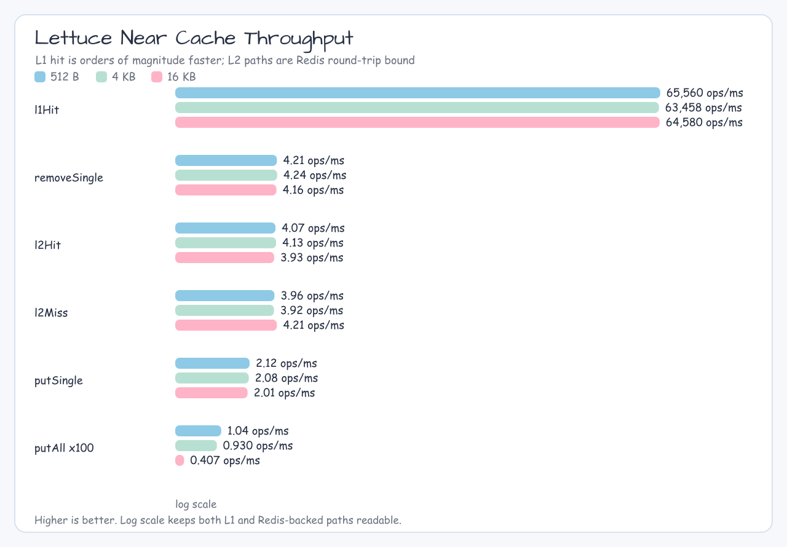

# LettuceNearCache Benchmark

[English](./Benchmark.md) | [한국어](./Benchmark.ko.md)

Performance measurement results for `LettuceNearCache` (L1=Caffeine, L2=Redis RESP3) using kotlinx-benchmark (JMH).

## Architecture

```
LettuceNearCache
├── L1: Caffeine (in-process, lock-free)
└── L2: Redis 7+ via Lettuce RESP3
        └── CLIENT TRACKING → automatic L1 invalidation
```

## Measurement Scenarios

| Benchmark | Description | What's measured |
|-----------|-------------|----------------|
| `l1Hit` | L1 (Caffeine) cache hit | Pure in-memory read, no Redis round-trip |
| `l2Hit` | `clearLocal()` + L2 (Redis) hit | `clearLocal()` cost + Redis round-trip + L1 refill |
| `l2Miss` | Both caches miss | Redis GET returns null |
| `putSingle` | Write-through PUT (1 entry) | L1 + L2 write + CLIENT TRACKING GET |
| `putAll` | Batch PUT (100 entries) | 100× L1 + L2 write |
| `removeSingle` | Remove 1 entry | L1 + L2 DEL (pre-put excluded via `@Setup(Level.Invocation)`) |

> **Note**: `l2Hit` measurements include `clearLocal()` overhead. See Analysis section.

## How to Run

```bash
./gradlew :bluetape4k-cache-lettuce:benchmark
```

Requires Docker (Testcontainers Redis 7+).

---

## Results

### Summary Table (Throughput: ops/ms, higher is better)

| Benchmark | payloadSize=512 | payloadSize=4096 | payloadSize=16384 |
|-----------|:--------------:|:----------------:|:-----------------:|
| **l1Hit** | **65,560 ± 10,861** | **63,458 ± 23,120** | **64,580 ± 9,507** |
| l2Hit | 4.067 ± 0.532 | 4.130 ± 0.452 | 3.930 ± 1.370 |
| l2Miss | 3.961 ± 1.394 | 3.917 ± 0.784 | 4.208 ± 0.408 |
| putSingle | 2.119 ± 0.100 | 2.077 ± 0.276 | 2.014 ± 0.152 |
| putAll (×100) | 1.038 ± 0.247 | 0.930 ± 0.118 | 0.407 ± 0.281 |
| removeSingle | 4.213 ± 0.177 | 4.243 ± 0.352 | 4.164 ± 0.271 |

### Detailed JMH Output

```
Benchmark                              (batchSize)  (payloadSize)   Mode  Cnt      Score       Error   Units
NearCacheBenchmark.l1Hit                       100            512  thrpt    5  65560.418 ± 10860.848  ops/ms
NearCacheBenchmark.l1Hit                       100           4096  thrpt    5  63457.547 ± 23120.211  ops/ms
NearCacheBenchmark.l1Hit                       100          16384  thrpt    5  64579.546 ±  9507.354  ops/ms
NearCacheBenchmark.l2Hit                       100            512  thrpt    5      4.067 ±     0.532  ops/ms
NearCacheBenchmark.l2Hit                       100           4096  thrpt    5      4.130 ±     0.452  ops/ms
NearCacheBenchmark.l2Hit                       100          16384  thrpt    5      3.930 ±     1.370  ops/ms
NearCacheBenchmark.l2Miss                      100            512  thrpt    5      3.961 ±     1.394  ops/ms
NearCacheBenchmark.l2Miss                      100           4096  thrpt    5      3.917 ±     0.784  ops/ms
NearCacheBenchmark.l2Miss                      100          16384  thrpt    5      4.208 ±     0.408  ops/ms
NearCacheBenchmark.putAll                      100            512  thrpt    5      1.038 ±     0.247  ops/ms
NearCacheBenchmark.putAll                      100           4096  thrpt    5      0.930 ±     0.118  ops/ms
NearCacheBenchmark.putAll                      100          16384  thrpt    5      0.407 ±     0.281  ops/ms
NearCacheBenchmark.putSingle                   100            512  thrpt    5      2.119 ±     0.100  ops/ms
NearCacheBenchmark.putSingle                   100           4096  thrpt    5      2.077 ±     0.276  ops/ms
NearCacheBenchmark.putSingle                   100          16384  thrpt    5      2.014 ±     0.152  ops/ms
NearCacheRemoveBenchmark.removeSingle          N/A            512  thrpt    5      4.213 ±     0.177  ops/ms
NearCacheRemoveBenchmark.removeSingle          N/A           4096  thrpt    5      4.243 ±     0.352  ops/ms
NearCacheRemoveBenchmark.removeSingle          N/A          16384  thrpt    5      4.164 ±     0.271  ops/ms
```

### Performance Chart: L1 Hit vs L2 Operations



> Higher is better. Log scale keeps the L1 hit and Redis-backed operations readable.

---

## Analysis

### 1. L1 Hit — Extreme Speed, Payload-Independent

- **63,458–65,560 ops/ms** across all payload sizes (512B → 16KB)
- Caffeine's lock-free read path shows near-zero payload sensitivity
- This represents the theoretical maximum for NearCache — all hot-path reads should serve from L1

### 2. L2 Hit — `clearLocal()` Overhead Included

- **~4.0 ops/ms** — significantly limited by `clearLocal()` being called in the benchmark body
- **Real L2 hit latency**: To measure pure Redis round-trip without L1 clear, use per-key invalidation or a warmed L2-only key
- Redis RTT on localhost (Testcontainers): ~0.2–0.5ms → theoretical ceiling ~2,000–5,000 ops/ms
- The measurement here represents the worst case: "L1 was invalidated, refetch from Redis"

### 3. L2 Miss — Consistent Redis RTT

- **3.9–4.2 ops/ms** — consistent across all payload sizes
- Payload size doesn't affect L2 miss because no data is transferred (key not found)
- Comparable to l2Hit, confirming Redis RTT dominates both

### 4. putSingle — Write-Through Overhead

- **~2.1 ops/ms** — noticeably slower than l2Hit/Miss
- Extra overhead: after `SET`, Lettuce sends `GET` for CLIENT TRACKING registration
- Two Redis round-trips per `put` call (SET + GET tracking)

### 5. putAll — Batch Write, Payload-Sensitive

- **512B: 1.038 ops/ms → 16KB: 0.407 ops/ms** — **2.5× degradation** with 32× larger payload
- Each `putAll` call issues 1× MSET (write all entries) + 1× MGET (CLIENT TRACKING registration) = 2 Redis round-trips, but carries `batchSize × payloadSize` bytes per call
- Large payloads saturate Redis write bandwidth

### 6. removeSingle — Clean L1+L2 Delete

- **~4.2 ops/ms** — one Redis `UNLINK` + L1 eviction
- Virtually identical to l2Hit/l2Miss → Redis RTT dominates

### Key Takeaways

| Insight | Implication |
|---------|------------|
| L1 hits 16,000× faster than L2 | Maximize L1 hit rate via appropriate `maxLocalSize` |
| putSingle is 2× slower than get | Write-heavy workloads pay a CLIENT TRACKING tax |
| putAll degrades 2.5× at 16KB | Use smaller payloads or chunk large batches |
| All L2 ops ~4 ops/ms | Redis RTT (~250µs) is the universal bottleneck |
| Payload size irrelevant for L1/read | Cache value deserialization cost is negligible |

---

## Benchmark Environment

| Item | Value |
|------|-------|
| **CPU** | Apple M4 Pro (12-core) |
| **RAM** | 48 GB |
| **OS** | macOS 26.4.1 (Darwin 25.4.0) |
| **JVM** | Oracle GraalVM 21.0.11+9.1 |
| **Redis** | 7+ (Testcontainers, Docker) |
| **Kotlin** | 2.3 |
| **kotlinx-benchmark** | 0.4.15 |
| **JMH** | 1.37 |
| **Warmup** | 3 iterations × 2s |
| **Measurement** | 5 iterations × 3s |
| **Fork** | 1 |
| **Threads** | 1 |
| **Mode** | Throughput (ops/ms) |
| **batchSize** | 100 (putAll only) |
| **payloadSizes** | 512B, 4096B, 16384B |
| **Date** | 2026-04-27 |
