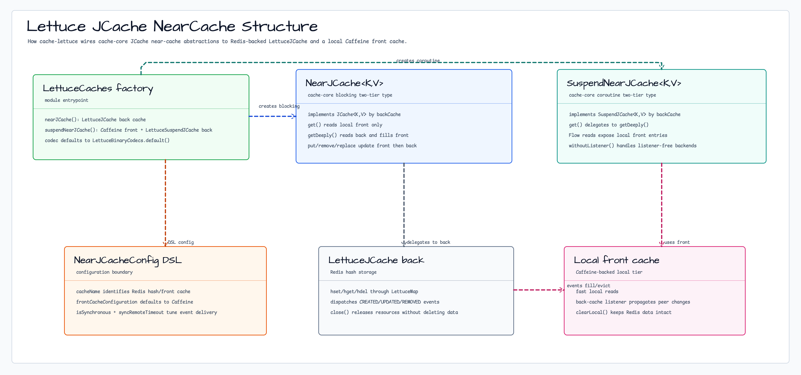
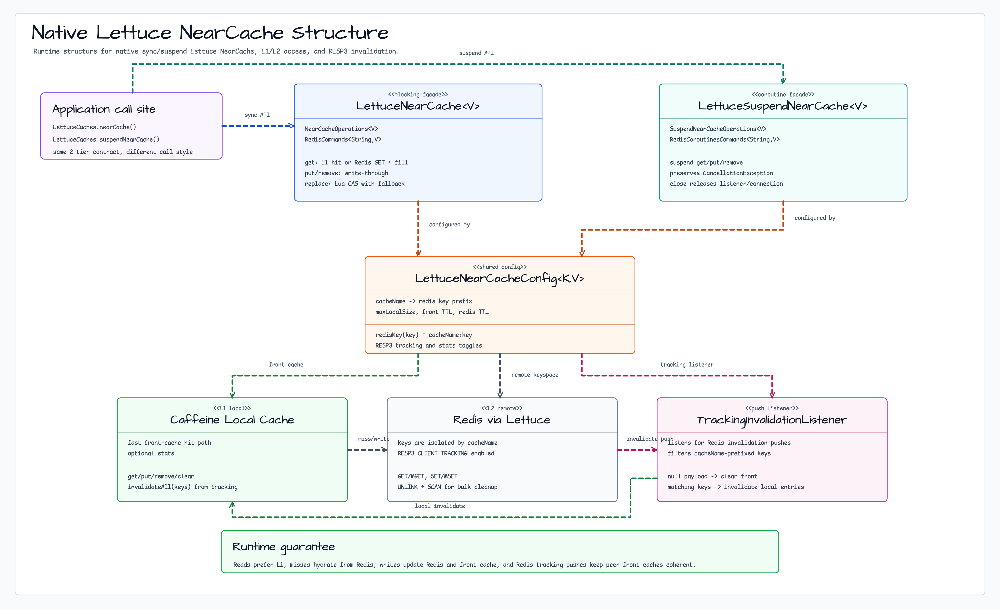
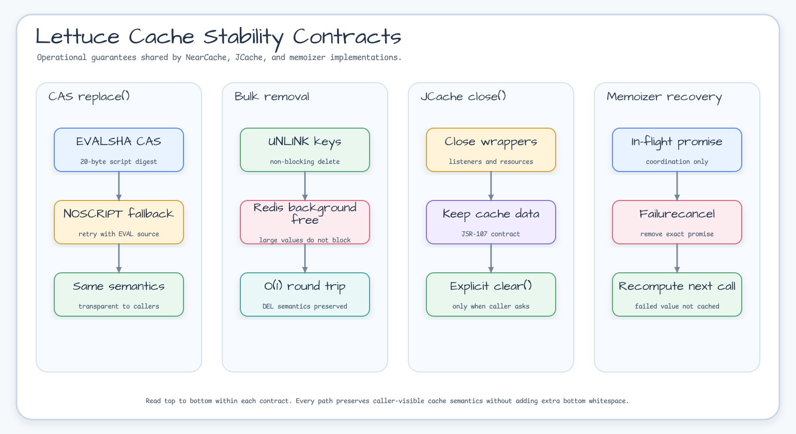

# Module bluetape4k-cache-lettuce

[English](./README.md) | 한국어

`bluetape4k-cache-lettuce`는 Lettuce(Redis) 기반 JCache Provider와 NearCache 구현을 제공합니다.

## 패키지 / import 안정성

cache 폴더 재편으로 소스 위치는 `cache/cache-lettuce/`가 되었지만 Gradle 프로젝트 이름, Maven artifact,
Kotlin package는 유지됩니다.

- Gradle project: `:bluetape4k-cache-lettuce`
- Maven artifact: `io.github.bluetape4k:bluetape4k-cache-lettuce`
- Kotlin package root: `io.bluetape4k.cache`

이번 재편으로 인한 사용자 import 변경은 필요하지 않습니다.

## 설치

```kotlin
dependencies {
    implementation("io.github.bluetape4k:bluetape4k-cache-lettuce:${bluetape4kVersion}")
}
```

## 제공 기능

### Memoizer (함수 결과 Redis 캐싱)

| 클래스                            | 설명                                                               |
|--------------------------------|------------------------------------------------------------------|
| `LettuceMemoizer<K, V>`        | `LettuceMap<V>` 기반 동기 메모이제이션 (`Memoizer<K,V>` 인터페이스)             |
| `LettuceAsyncMemoizer<K, V>`   | `LettuceMap<V>` 기반 비동기 메모이제이션 (`AsyncMemoizer<K,V>` 인터페이스)       |
| `LettuceSuspendMemoizer<K, V>` | `LettuceMap<V>` 기반 suspend 메모이제이션 (`SuspendMemoizer<K,V>` 인터페이스) |

```kotlin
import io.bluetape4k.redis.lettuce.codec.LettuceLongCodec
import io.bluetape4k.redis.lettuce.codec.LettuceIntCodec
import io.bluetape4k.redis.lettuce.map.LettuceMap
import io.bluetape4k.cache.memoizer.memoizer
import io.bluetape4k.cache.memoizer.asyncMemoizer
import io.bluetape4k.cache.memoizer.suspendMemoizer

// Long→Long 메모이저 (LettuceLongCodec 사용)
val longConnection = redisClient.connect(LettuceLongCodec)
val longMap = LettuceMap<Long>(longConnection, "memoizer:factorial")

val factorial = longMap.memoizer { n: Long -> computeFactorial(n) }
val result = factorial(10L)   // 계산 후 Redis에 저장
val cached = factorial(10L)   // Redis에서 반환

// Int→Int 비동기 메모이저 (LettuceIntCodec 사용)
val intConnection = redisClient.connect(LettuceIntCodec)
val intMap = LettuceMap<Int>(intConnection, "memoizer:squares")

val asyncSquare = intMap.asyncMemoizer { n: Int ->
    CompletableFuture.supplyAsync { n * n }
}
val squareResult = asyncSquare(7).join()  // 49

// suspend 메모이저
val suspendMemoizer = longMap.suspendMemoizer { n: Long ->
    delay(10)
    computeFactorial(n)
}
val suspendResult = suspendMemoizer(5L)  // 120L
```

### JCache (JSR-107)

- Lettuce 기반 `javax.cache.spi.CachingProvider` 구현
- `LettuceJCaching` — Lettuce JCache 설정 및 CachingProvider 초기화 헬퍼

### NearCache (2-Tier Cache)

Caffeine(로컬) + Redis(분산) 2단계 캐시로, RESP3 CLIENT TRACKING을 통한 자동 invalidation을 지원합니다.

| 클래스                                     | 설명                                                 |
|-----------------------------------------|----------------------------------------------------|
| `LettuceNearCache<V>`                   | 동기(Blocking) 2-Tier 캐시 (write-through)             |
| `LettuceSuspendNearCache<V>`            | Coroutines(suspend) 2-Tier 캐시 (write-through)      |
| `ResilientLettuceNearCache<V>`          | write-behind + retry + graceful degradation 동기 구현  |
| `ResilientLettuceSuspendNearCache<V>`   | write-behind + retry + graceful degradation 코루틴 구현 |
| `LettuceNearCacheConfig<K, V>`          | NearCache 설정 data class + DSL 빌더                   |
| `ResilientLettuceNearCacheConfig<K, V>` | Resilient NearCache 추가 설정 (retry, queue 등)         |
| `LocalCache<K, V>`                      | front cache 추상 인터페이스                               |
| `CaffeineLocalCache<K, V>`              | Caffeine 기반 LocalCache 구현                          |
| `TrackingInvalidationListener<V>`       | RESP3 CLIENT TRACKING push 리스너                     |

### Near-Cache Capability

Lettuce native/JCache NearCache는 공통 conformance suite에서 supported로 검증됩니다.
Native `LettuceNearCache` / `LettuceSuspendNearCache`는 Redis RESP3 `CLIENT TRACKING`과 write-through를 사용합니다.
JCache 변형은 cache-entry listener로 peer front-cache 전파를 지원합니다.

`isSynchronous=true`인 JCache NearCache의 `put`, `putAll`, `putIfAbsent`, `remove`,
`replace`는 제한된 `syncRemoteTimeout` 안에서 Lettuce write-through 완료를 기다립니다.
Lettuce가 write worker에서 해당 write의 listener를 inline 호출할 수 있으므로,
`NearJCache`는 self-event를 front에 직접 반영해 caller가 잡은 mutation gate를 worker가
다시 획득하지 않도록 합니다. 다른 wrapper나 외부 write의 event는 계속 gate로
직렬화하며 비동기 모드의 기존 순서도 유지합니다. timeout 이후 provider가 늦게 완료하는
경우에도 near cache의 back-write barrier가 후속 write와 순서를 보장합니다.

전체 행렬은 [Near-Cache Backend Capability Matrix](../../docs/cache/near-cache-capability-matrix.md)를 참고하세요.

`LettuceCacheConfig`/`LettuceNearCacheConfig` 사용 시:

- 배치 크기, 큐 크기, 재시도 횟수, local cache 크기는 0보다 커야 합니다.
- TTL은 지정 시 0보다 커야 합니다.
- 캐시 이름과 key prefix는 공백일 수 없습니다.

### JCache 기반 NearCache (nearcache.jcache 패키지)

`NearJCache<K,V>` /
`SuspendNearJCache<K,V>`는 JCache 인터페이스를 직접 구현하는 2-tier 캐시입니다. Caffeine(front) + LettuceJCache(back) 구조로,
`NearJCacheConfig` Builder DSL로 설정합니다.



#### NearJCacheConfig DSL

```kotlin
import io.bluetape4k.cache.nearcache.jcache.nearJCacheConfig

val config = nearJCacheConfig<String, String> {
    cacheName = "my-near-jcache"
    isSynchronous = true               // 동기 이벤트 전파
    syncRemoteTimeout = 1000L          // 이벤트 타임아웃 (ms)
}
```

#### NearJCache (동기) 사용 예

```kotlin
val cache = LettuceCaches.nearJCache<String, String>(redisClient) {
    cacheName = "orders-near-jcache"
}

cache.put("order-1", "data")
val value = cache.get("order-1")   // front(Caffeine) → back(Lettuce) 순으로 조회
cache.close()
```

#### SuspendNearJCache (코루틴) 사용 예

```kotlin
val cache = LettuceCaches.suspendNearJCache<String>(redisClient) {
    cacheName = "sessions-suspend-near-jcache"
}

cache.put("session-1", "token-abc")
val token = cache.get("session-1")   // suspend fun
cache.close()
```

> **선택 기준**: JCache 표준 호환이 필요하면 `NearJCache`/`SuspendNearJCache`를, 더 풍부한 통계·resilience가 필요하면 `LettuceNearCache`/
`LettuceSuspendNearCache`를 사용하세요.

### 클래스 구조

#### Native Lettuce NearCache Runtime Structure



#### RESP3 CLIENT TRACKING 기반 Invalidation 흐름


### NearCache 아키텍처

#### Write-through (기본)

```
Application
    |
[LettuceNearCache / LettuceSuspendNearCache]
    |
+---+---+
|       |
Front   Back
Caffeine  Redis (via Lettuce RESP3)

Invalidation: Redis CLIENT TRACKING → server push → local invalidate
```

- **Read**: front hit → 즉시 반환 / front miss → Redis GET → front populate → 반환
- **Write**: front put + Redis SET (write-through, 동기)
- **Invalidation**: RESP3 CLIENT TRACKING push → 로컬 캐시 자동 무효화

#### Write-behind (Resilient)

```
Application
    |
[ResilientLettuceNearCache / ResilientLettuceSuspendNearCache]
    |
+---+----------+
|              |
Front          Write Queue (LinkedBlockingQueue / Channel)
Caffeine           |
(즉시 반영)    Consumer (virtualThread / coroutine)
               (retry { syncCommands.set/del })
```

- **write-behind**: put/remove → front 즉시, Redis 쓰기는 비동기 큐로 처리
- **tombstones**: remove 후 write-behind 완료 전 stale read 방지
- **clearPending**: clearAll 호출 후 Redis read 차단
- **retry**: Resilience4j Retry로 Redis 쓰기 실패 시 재시도 (지수 백오프 옵션)
- **GetFailureStrategy**: Redis GET 실패 시 null 반환(RETURN_FRONT_OR_NULL) 또는 예외 전파(PROPAGATE_EXCEPTION)

### JCache TTL 계약

- `LettuceCacheConfig.ttlSeconds`는 Redis hash field가 아니라 캐시 hash key 전체 TTL입니다.
- `put`, `putAll`, `putIfAbsent`, `replace` 계열 쓰기 API는 성공 시 동일한 TTL을 다시 적용합니다.
- Redis 8 이상에서는 `HSETEX`를 우선 사용하고 hash key `EXPIRE`도 함께 갱신합니다.
- Redis 7 이하 서버에서는 자동으로 `HSET/HMSET + EXPIRE` 경로로 fallback 합니다.
- TTL이 지나면 해당 cacheName에 속한 항목이 함께 만료됩니다.
- 현재 JCache의 `EntryProcessor` 기반 `invoke` / `invokeAll`은 지원하지 않으며 호출 시 `CacheException`을 반환합니다.

```kotlin
import io.bluetape4k.cache.jcache.LettuceJCaching

val sessions = LettuceJCaching.getOrCreate<String, String>(
    cacheName = "sessions",
    ttlSeconds = 60,
)

sessions.put("token:1", "value")
sessions.putIfAbsent("token:2", "value2")
```

## Factory (LettuceCaches)

`LettuceCaches` object를 사용하면 JCache, NearCache, SuspendNearCache, ResilientNearCache를 간편하게 생성할 수 있습니다.

```kotlin
// JCache 생성
val jcache = LettuceCaches.jcache<String, String>(redisClient, "my-cache")

// SuspendJCache 생성 (코루틴)
val suspendJCache = LettuceCaches.suspendJCache<String>(redisClient, "my-cache")

// NearJCache — JCache 기반 2-Tier (동기)
val nearJCache = LettuceCaches.nearJCache<String, String>(redisClient) {
    cacheName = "my-near-jcache"
    isSynchronous = true
}

// SuspendNearJCache — JCache 기반 2-Tier (코루틴)
val suspendNearJCache = LettuceCaches.suspendNearJCache<String>(redisClient) {
    cacheName = "my-suspend-near-jcache"
}

// NearCache — RESP3 CLIENT TRACKING 기반 (동기)
val near = LettuceCaches.nearCache<String>(redisClient) { cacheName = "my-near" }

// SuspendNearCache — RESP3 CLIENT TRACKING 기반 (코루틴)
val suspendNear = LettuceCaches.suspendNearCache<String>(redisClient) { cacheName = "my-near" }

// ResilientNearCache (write-behind + retry)
val resilient = LettuceCaches.resilientNearCache<String>(redisClient)

// ResilientSuspendNearCache (코루틴 + write-behind + retry)
val resilientSuspend = LettuceCaches.resilientSuspendNearCache<String>(redisClient)
```

## 사용 예시

### LettuceNearCacheConfig DSL

```kotlin
import io.bluetape4k.cache.nearcache.lettuceNearCacheConfig

val config = lettuceNearCacheConfig<String, String> {
    cacheName = "my-cache"
    maxLocalSize = 10_000
    frontExpireAfterWrite = Duration.ofMinutes(30)
    redisTtl = Duration.ofHours(1)
    useRespProtocol3 = true  // CLIENT TRACKING 활성화
}
```

### 동기 NearCache

```kotlin
import io.bluetape4k.cache.nearcache.LettuceNearCache
import io.bluetape4k.cache.nearcache.LettuceNearCacheConfig
import io.lettuce.core.RedisClient
import io.lettuce.core.ClientOptions
import io.lettuce.core.protocol.ProtocolVersion

// RESP3 활성화 RedisClient 생성
val redisClient = RedisClient.create("redis://localhost:6379").also {
    it.options = ClientOptions.builder()
        .protocolVersion(ProtocolVersion.RESP3)
        .build()
}

val cache = LettuceNearCache(
    redisClient = redisClient,
    config = LettuceNearCacheConfig(cacheName = "orders"),
)

cache.use { c ->
    c.put("order-1", "data")
    val value = c.get("order-1")  // front hit (로컬)
    c.remove("order-1")
}
```

### Coroutines NearCache

```kotlin
import io.bluetape4k.cache.nearcache.LettuceSuspendNearCache
import io.bluetape4k.cache.nearcache.LettuceNearCacheConfig

val cache = LettuceSuspendNearCache(
    redisClient = redisClient,
    config = LettuceNearCacheConfig(cacheName = "sessions"),
)

cache.use { c ->
    c.put("session-1", "token-abc")
    val token = c.get("session-1")  // suspend fun
    c.clearAll()
}
```

### ResilientLettuceNearCache (write-behind + retry)

```kotlin
import io.bluetape4k.cache.nearcache.ResilientLettuceNearCache
import io.bluetape4k.cache.nearcache.ResilientLettuceNearCacheConfig
import io.bluetape4k.cache.nearcache.LettuceNearCacheConfig
import java.time.Duration

val cache = ResilientLettuceNearCache<String, String>(
    redisClient = redisClient,
    config = ResilientLettuceNearCacheConfig(
        base = LettuceNearCacheConfig(cacheName = "orders"),
        writeQueueCapacity = 1024,
        retryMaxAttempts = 3,
        retryWaitDuration = Duration.ofMillis(200),
        retryExponentialBackoff = true,
    ),
)

cache.put("key", "value")       // front 즉시 반영, Redis는 write-behind
cache.get("key")                // front hit → 즉시 반환
cache.localCacheSize()          // 로컬 Caffeine 크기
cache.backCacheSize()           // Redis 키 개수
cache.clearAll()                // front 즉시 초기화, Redis는 write-behind
cache.close()
```

### ResilientLettuceSuspendNearCache (코루틴)

```kotlin
import io.bluetape4k.cache.nearcache.ResilientLettuceSuspendNearCache

val cache = ResilientLettuceSuspendNearCache<String, String>(
    redisClient = redisClient,
    config = ResilientLettuceNearCacheConfig(
        base = LettuceNearCacheConfig(cacheName = "sessions"),
    ),
)

// suspend 함수로 사용
cache.put("session-1", "token-abc")
val token = cache.get("session-1")
cache.close()
```

## ResilientLettuceNearCacheConfig 옵션

| 옵션                        | 기본값                        | 설명                   |
|---------------------------|----------------------------|----------------------|
| `base`                    | `LettuceNearCacheConfig()` | 기본 NearCache 설정      |
| `writeQueueCapacity`      | `1024`                     | write-behind 큐 최대 용량 |
| `retryMaxAttempts`        | `3`                        | Redis 쓰기 최대 재시도 횟수   |
| `retryWaitDuration`       | `500ms`                    | 재시도 대기 시간            |
| `retryExponentialBackoff` | `true`                     | 지수 백오프 사용 여부         |
| `getFailureStrategy`      | `RETURN_FRONT_OR_NULL`     | Redis GET 실패 시 동작 전략 |

## LettuceNearCacheConfig 옵션

| 옵션                       | 기본값                    | 설명                               |
|--------------------------|------------------------|----------------------------------|
| `cacheName`              | `"lettuce-near-cache"` | 캐시 이름 (Redis key prefix, `:` 금지) |
| `maxLocalSize`           | `10_000`               | Caffeine 최대 항목 수                 |
| `frontExpireAfterWrite`  | `30분`                  | 로컬 캐시 write 후 만료 시간              |
| `frontExpireAfterAccess` | `null`                 | 로컬 캐시 access 후 만료 시간             |
| `redisTtl`               | `null`                 | Redis TTL (null이면 영구 보존)         |
| `useRespProtocol3`       | `true`                 | RESP3 CLIENT TRACKING 활성화 여부     |
| `recordStats`            | `false`                | Caffeine 통계 수집 여부                |

## Key 격리 전략

Redis key는 `{cacheName}:{key}` 형태의 prefix로 저장됩니다.

```
cacheName="orders", key="user:123" → Redis key: "orders:user:123"
```

- `clearAll()`은 SCAN으로 해당 cacheName의 key만 삭제 (FLUSHDB 사용 안 함)
- 서로 다른 cacheName 인스턴스는 완전히 독립적인 key 공간을 가짐
- key에 `:` 포함 가능 (cacheName에만 `:` 금지)

## 참고

- RESP3 CLIENT TRACKING은 Redis 6.0+ 이상에서 지원됩니다.
- NearCache는 단일 Redis 연결에서 동작하며, 클러스터 모드에서는 별도 설정이 필요합니다.
- 다른 분산 캐시 백엔드가 필요한 경우:
  - Redisson 기반: `bluetape4k-cache-redisson`
  - Hazelcast 기반: `bluetape4k-cache-hazelcast`

## 성능 벤치마크

`LettuceNearCache` (L1=Caffeine, L2=Redis RESP3) JMH 벤치마크 결과 (Apple M4 Pro / GraalVM 21 / 2026-04-27):

| 벤치마크 | payloadSize=512 | payloadSize=4096 | payloadSize=16384 |
|---------|:--------------:|:----------------:|:-----------------:|
| **l1Hit** | **65,560 ops/ms** | **63,458 ops/ms** | **64,580 ops/ms** |
| l2Hit (clearLocal 포함) | 4.07 ops/ms | 4.13 ops/ms | 3.93 ops/ms |
| l2Miss | 3.96 ops/ms | 3.92 ops/ms | 4.21 ops/ms |
| putSingle | 2.12 ops/ms | 2.08 ops/ms | 2.01 ops/ms |
| putAll (×100) | 1.04 ops/ms | 0.93 ops/ms | 0.41 ops/ms |
| removeSingle | 4.21 ops/ms | 4.24 ops/ms | 4.16 ops/ms |


> L1 캐시 적중은 L2(Redis) 연산 대비 **~16,000배 빠름**.
> 전체 결과 및 분석: [Benchmark.md](./Benchmark.md) · [한국어](./Benchmark.ko.md)
> 실행: `./gradlew :bluetape4k-cache-lettuce:benchmark` (Docker 필요)

## 성능 · 안정성 계약 (Performance / Stability Notes)



아래 계약은 `LettuceNearCache`, `LettuceSuspendNearCache`, `LettuceAsyncMemoizer`, `LettuceJCache` 모든 구현에 공통 적용됩니다.

### `replace(key, oldValue, newValue)` — EVALSHA + NOSCRIPT fallback 기반 CAS

동기/코루틴 변형 모두 공용 Lua 스크립트(`NearCacheScripts.COMPARE_AND_SET`)로 compare-and-set 을 수행합니다. SHA1 은 클래스 로드 시점에 한 번 계산되어 이후 모든 호출에서 재사용됩니다.

- 1차 경로: `EVALSHA <sha1> 1 <key> <old> <new>` — 스크립트 원문 대신 20B SHA1 만 전송.
- Fallback: 서버가 `NOSCRIPT` 를 반환하면(`SCRIPT FLUSH` / failover 등) 자동으로 원문 `EVAL` 로 재시도합니다. 호출자 관점에서 동작은 완전히 동일합니다.

### `remove` / `removeAll` / `clearBack` — 비차단 삭제

벌크 삭제는 `DEL` 대신 `UNLINK` 를 사용합니다. 큰 값은 Redis 백그라운드 스레드에서 회수되므로, 값 크기와 무관하게 클라이언트 roundtrip 이 O(1) 입니다. 동작 의미(semantics)는 `DEL` 과 동일합니다.

### `LettuceJCache.close()` — JCache 명세 준수

`close()` 는 리소스(리스너, executor, 연결 핸들)를 해제할 뿐 **데이터를 삭제하지 않습니다**. 과거 구현은 `close()` 내부에서 `clear()` 를 수행해 JSR-107 계약을 위반했으므로 제거되었습니다. 종료 시점에 데이터를 비우려면 `close()` 이전에 `clear()` 를 명시적으로 호출하세요.

`LettuceSuspendJCache.close()` 도 래핑한 `LettuceJCache` 와 같은 계약을 따릅니다. suspend cache manager의 close 경로는 호출자 취소가 요청되어도 non-cancellable 정리 구간에서 나머지 캐시 wrapper close를 먼저 시도합니다. 개별 cache close가 `CancellationException` 을 명시적으로 던지면 잔여 정리를 끝낸 뒤 다시 던집니다.

### `LettuceSuspendMemoizer` — transient failure 및 cancellation 복구

suspend memoizer의 in-flight 항목은 계산 조율 상태이지 영구 캐시 값이 아닙니다. evaluator가 실패하거나 취소되면 해당 in-flight `Deferred`를 예외 완료 후 제거해, 다음 같은 key 호출이 새 계산으로 복구될 수 있게 합니다.

```kotlin
val attempts = AtomicInteger(0)
val memoizer = suspendMap.suspendMemoizer<Int, Int> { key ->
    if (attempts.incrementAndGet() == 1) error("temporary failure")
    key * key
}

// 첫 실패는 성공 값처럼 캐시되지 않으므로 다음 호출에서 다시 계산한다.
```

### `LettuceJCache.putAll` — 존재 여부 조회 배치화

`CacheEntryListener` 가 등록된 경우 CREATED/UPDATED 이벤트 구분을 위해 키별로 `HEXISTS` 를 `N` 번 호출하던 비용을 단일 `HMGET` 한 번으로 줄였습니다. 엔트리 개수와 무관하게 roundtrip 이 1회로 고정됩니다.

### `LettuceAsyncMemoizer` — in-flight 레이스 수정

같은 키에 대해 evaluator 완료 직후 다른 호출이 재진입하며 새 promise 를 심는 경우, 기존 `inFlight.remove(key)` 가 재진입 promise 까지 함께 삭제하는 버그가 있었습니다. 현재는 `ConcurrentHashMap.remove(key, promise)` 로 **정확히 내가 생성한 key+value 쌍** 만 제거합니다.
