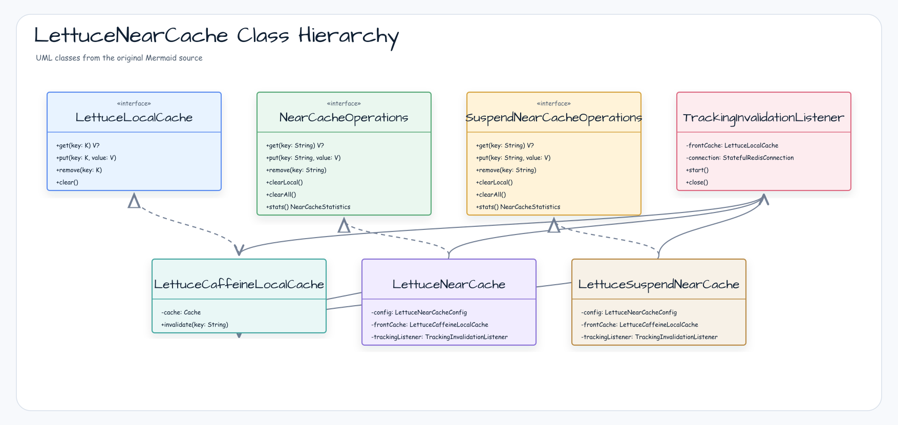
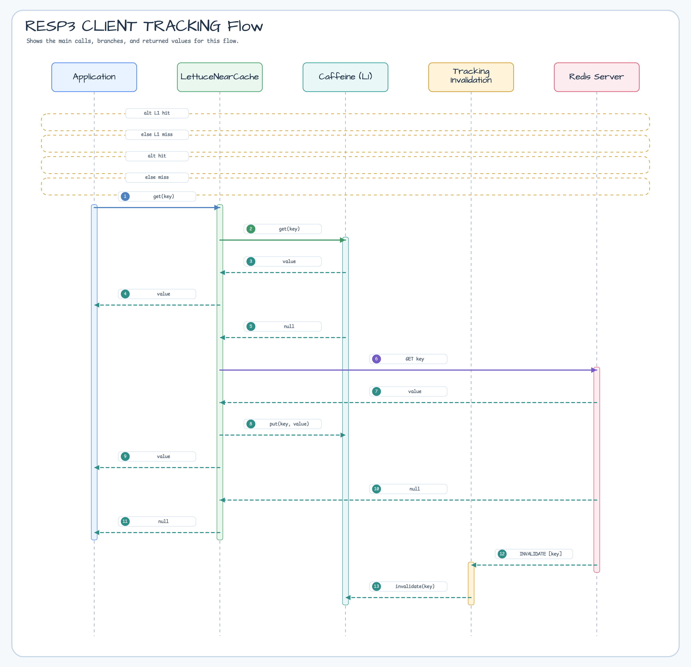

# Module bluetape4k-cache-lettuce

English | [한국어](./README.ko.md)

`bluetape4k-cache-lettuce` provides a Lettuce (Redis)-based JCache provider and NearCache implementations.

## Package / Import Stability

The cache folder reorganization moved this module under `cache/cache-lettuce/`,
but the Gradle project name, Maven artifact ID, and Kotlin packages remain stable:

- Gradle project: `:bluetape4k-cache-lettuce`
- Maven artifact: `io.github.bluetape4k:bluetape4k-cache-lettuce`
- Kotlin package root: `io.bluetape4k.cache`

No user import migration is required for the reorganization.

## Installation

```kotlin
dependencies {
    implementation("io.github.bluetape4k:bluetape4k-cache-lettuce:${bluetape4kVersion}")
}
```

## Provided Features

- sync / async / suspend memoizers built on `LettuceMap`
- Lettuce-based `CachingProvider` and `LettuceJCaching`
- blocking and coroutine two-tier near caches
- resilient near-cache variants with write-behind and retry
- JCache-based `NearJCache` / `SuspendNearJCache`
- RESP3 `CLIENT TRACKING` invalidation support

## Near-Cache Capability

Lettuce native and JCache near-cache variants are fully supported by the shared
conformance suites. Native `LettuceNearCache` and `LettuceSuspendNearCache` use
Redis RESP3 `CLIENT TRACKING` plus explicit write-through. JCache variants
register cache-entry listeners and support peer front-cache propagation.

See the full [Near-Cache Backend Capability Matrix](../../docs/cache/near-cache-capability-matrix.md).

## Factory (`LettuceCaches`)

`LettuceCaches` exposes factory methods for:

- `jcache`
- `suspendCache`
- `nearJCache`
- `suspendNearJCache`
- `nearCache`
- `suspendNearCache`
- resilient near-cache variants

## Usage Examples

Typical examples include:

- memoizer creation for Redis-backed function caching
- `NearJCacheConfig` DSL usage
- sync / suspend JCache-backed near caches
- native `LettuceNearCache` / `LettuceSuspendNearCache`

## Architecture Diagrams

### LettuceNearCache Class Hierarchy



### RESP3 CLIENT TRACKING Flow



## `ResilientLettuceNearCacheConfig` Options

The resilient configuration extends the standard near-cache config with write-behind queueing, retry settings, and graceful-degradation behavior.

## `LettuceNearCacheConfig` Options

Core options include:

- `cacheName`
- `maxLocalSize`
- `frontExpireAfterWrite`
- `redisTtl`
- `useRespProtocol3`
- `recordStats`

Validation rules:

- batch size, queue size, retry count, and local cache size must be greater than zero
- TTL must be greater than zero when configured
- cache names and key prefixes must not be blank

## Key Isolation Strategy

Redis keys are namespaced through the configured cache name and key prefix so multiple caches can coexist safely in the same Redis deployment.

## Notes

- Use `NearJCache` / `SuspendNearJCache` when JCache standard compatibility is important.
- Use `LettuceNearCache` / `LettuceSuspendNearCache` when richer stats and resilience features matter.
- RESP3 `CLIENT TRACKING` is the basis for automatic invalidation.

## Performance Benchmark

`LettuceNearCache` (L1=Caffeine, L2=Redis RESP3) JMH benchmark results (Apple M4 Pro / GraalVM 21 / 2026-04-27):

| Benchmark | payloadSize=512 | payloadSize=4096 | payloadSize=16384 |
|-----------|:--------------:|:----------------:|:-----------------:|
| **l1Hit** | **65,560 ops/ms** | **63,458 ops/ms** | **64,580 ops/ms** |
| l2Hit (incl. clearLocal) | 4.07 ops/ms | 4.13 ops/ms | 3.93 ops/ms |
| l2Miss | 3.96 ops/ms | 3.92 ops/ms | 4.21 ops/ms |
| putSingle | 2.12 ops/ms | 2.08 ops/ms | 2.01 ops/ms |
| putAll (×100) | 1.04 ops/ms | 0.93 ops/ms | 0.41 ops/ms |
| removeSingle | 4.21 ops/ms | 4.24 ops/ms | 4.16 ops/ms |

> L1 cache hit is **~16,000× faster** than any L2 (Redis) operation.
> Full results & analysis: [Benchmark.md](./Benchmark.md) · [벤치마크 결과 (한국어)](./Benchmark.ko.md)
> Run: `./gradlew :bluetape4k-cache-lettuce:benchmark` (requires Docker)

## Performance / Stability Notes

These contracts are guaranteed across the `LettuceNearCache`, `LettuceSuspendNearCache`, `LettuceAsyncMemoizer`, and `LettuceJCache` implementations.

### `replace(key, oldValue, newValue)` — CAS via EVALSHA + NOSCRIPT fallback

Both sync and suspend NearCache variants execute compare-and-set via a shared Lua script (`NearCacheScripts.COMPARE_AND_SET`). The SHA1 is computed once at class load time and reused for every call.

- Primary path: `EVALSHA <sha1> 1 <key> <old> <new>` — 20-byte script digest instead of the full script body.
- Fallback path: when the server returns `NOSCRIPT` (e.g., after `SCRIPT FLUSH` or a failover), the client retries with the full `EVAL` payload. Semantics are identical — the second call is transparent to the caller.

### `remove` / `removeAll` / `clearBack` — non-blocking delete

Bulk deletes issue `UNLINK` instead of `DEL`. Large keys are evicted on a background thread in Redis, so the client roundtrip is O(1) regardless of value size. Semantics are otherwise identical to `DEL`.

### `LettuceJCache.close()` — JCache spec compliance

`close()` releases resources (listeners, executors, connection handles) but does **not** delete data. Previously `close()` also ran `clear()`, which violated the JSR-107 contract. If you need data removal on shutdown, call `clear()` explicitly before `close()`.

`LettuceSuspendJCache.close()` follows the same contract through its wrapped `LettuceJCache`. Suspend cache managers also protect close cleanup from caller cancellation: remaining cache wrappers are closed in a non-cancellable cleanup section. If an individual cache close explicitly throws `CancellationException`, the manager finishes the remaining cleanup first and then rethrows it.

### `LettuceSuspendMemoizer` — transient failure and cancellation recovery

Suspend memoizer in-flight entries are coordination state, not durable cache entries. If an evaluator fails or is cancelled, the in-flight `Deferred` is completed exceptionally and removed so the next call for the same key can start a fresh computation.

```kotlin
val attempts = AtomicInteger(0)
val memoizer = suspendMap.suspendMemoizer<Int, Int> { key ->
    if (attempts.incrementAndGet() == 1) error("temporary failure")
    key * key
}

// The first failed call is not cached as a value; the next call recomputes.
```

### `LettuceJCache.putAll` — existence check batching

When `CacheEntryListener` is registered, CREATED/UPDATED event classification used to cost `N × HEXISTS` roundtrips. It now uses a single `HMGET` to fetch the existence bitmap in one shot — O(1) roundtrips regardless of entry count.

### `LettuceAsyncMemoizer` — in-flight race fix

When a promise completes and another invocation for the same key races during cleanup, the old implementation (`inFlight.remove(key)`) could accidentally evict the replacement promise. The new code uses `ConcurrentHashMap.remove(key, promise)` to remove only the exact key+value pair we created.
