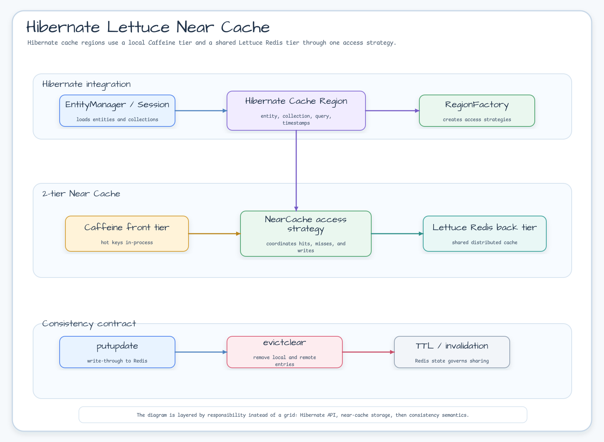
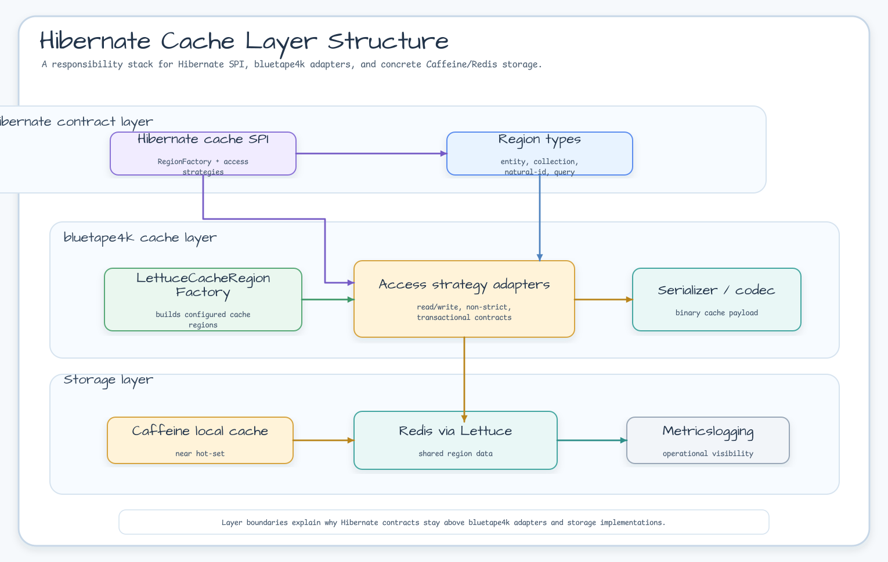
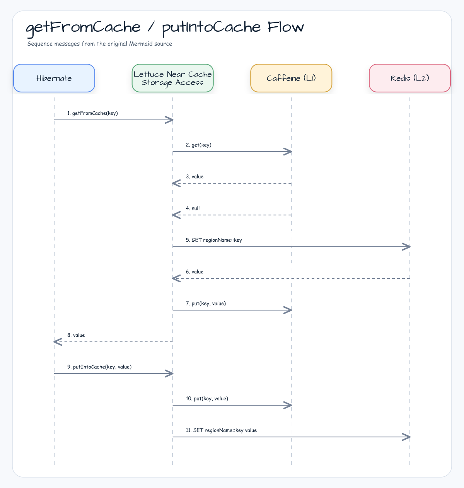

# Module bluetape4k-hibernate-cache-lettuce

English | [한국어](./README.ko.md)

Hibernate 7.2 **2nd Level Cache** implementation backed by Lettuce Near Cache (Caffeine L1 + Redis L2). Simply configure
`hibernate.cache.lettuce.*` properties and Near Cache is automatically applied to all regions.

> The Near Cache core uses the `bluetape4k-cache-lettuce` module from `bluetape4k-projects`.
> For Spring Boot 4 integration, see [`spring-boot/hibernate-lettuce`](../../spring-boot/hibernate-lettuce/README.md).

## Package / Import Stability

The cache folder reorganization moved this module under
`cache/hibernate-cache-lettuce/`, but the Gradle project name, Maven artifact ID, and Kotlin packages remain stable:

- Gradle project: `:bluetape4k-hibernate-cache-lettuce`
- Maven artifact: `io.github.bluetape4k:bluetape4k-hibernate-cache-lettuce`
- Kotlin package root: `io.bluetape4k.hibernate.cache.lettuce`

No user import migration is required for the reorganization.

## Requirements

- **Hibernate ORM**: 7.2.7.Final or later
- **Jakarta Persistence API**: 3.2.0 (enforced via `configurations.all` to override Spring Boot downgrades)
- **Java**: JDK 21+ (aligned with bluetape4k project baseline)
- **Redis**: 6+ when using RESP3 Client Tracking (set `use_resp3=false` for older Redis)

## Architecture

### Near Cache 2-Tier Structure



### Layer Structure



- **Region Isolation**: Each region gets its own `LettuceNearCache` instance
- **Key Prefix**: Redis keys use the `{regionName}:{key}` prefix so regions do not share a key space
- **Hibernate Key
  Encoding**: Hibernate keys are normalized to a versioned collision-resistant digest before the region prefix is applied
- **AccessType**: `NONSTRICT_READ_WRITE` is recommended (soft-locking is unnecessary in a distributed cache)

## Recent Changes

- Changed `LettuceNearCacheStorageAccess.evictData()` from region local-only clear to **local + Redis clearAll**
- Propagated Redis failures from keyed and region eviction instead of reporting normal success
- Replaced `session.get()` with `session.find()` in tests to remove deprecated Hibernate API usage
- Added cache scenario tests for One-To-Many, Many-To-One, and Many-To-Many relationships

## Dependencies

```kotlin
// build.gradle.kts
dependencies {
    implementation("io.github.bluetape4k:bluetape4k-hibernate-cache-lettuce:${bluetape4kVersion}")

    // Runtime serialization (required — must be declared explicitly since bluetape4k-io uses optional dependencies)
    implementation(Libs.fory_kotlin)  // Apache Fory
    implementation(Libs.lz4_java)     // LZ4 compression
}
```

## Configuration

### Hibernate Properties

```properties
# Register the Region Factory (required)
hibernate.cache.region.factory_class=io.bluetape4k.hibernate.cache.lettuce.LettuceNearCacheRegionFactory
hibernate.cache.use_second_level_cache=true

# Redis connection
hibernate.cache.lettuce.redis_uri=redis://localhost:6379

# Serialization codec (default: lz4fory)
# Options: lz4fory | lz4fastfory | fory | fastfory | kryo | lz4kryo | lz4jdk | gzipfory | gzipfastfory | zstdfory | zstdfastfory | jdk
hibernate.cache.lettuce.codec=lz4fory

# Enable RESP3 + CLIENT TRACKING (requires Redis 6+)
hibernate.cache.lettuce.use_resp3=true

# L1 (Caffeine) settings
hibernate.cache.lettuce.local.max_size=10000
hibernate.cache.lettuce.local.expire_after_write=30m

# Redis TTL (default; supports ms/s/m/h units)
hibernate.cache.lettuce.redis_ttl.default=120s

# Per-region TTL overrides
hibernate.cache.lettuce.redis_ttl.io.example.Product=300s
hibernate.cache.lettuce.redis_ttl.io.example.Order=600s

# TTL is disabled for the timestamps region to maintain query cache invalidation accuracy

# Enable Caffeine statistics collection (activate when integrating Metrics)
hibernate.cache.lettuce.local.record_stats=false
```

### application.yml (when used without Spring Boot)

```yaml
spring:
  jpa:
    properties:
      hibernate:
        cache:
          region.factory_class: io.bluetape4k.hibernate.cache.lettuce.LettuceNearCacheRegionFactory
          use_second_level_cache: true
          lettuce:
            redis_uri: redis://localhost:6379
            codec: lz4fory
            use_resp3: true
            local:
              max_size: 10000
              expire_after_write: 30m
            redis_ttl:
              default: 120s
```

Supported codec values include the `jdk`, `kryo`, `fory`, `fastfory`, `gzip*`, `lz4*`, `snappy*`, and
`zstd*` families. Typos or unsupported codec names cause an immediate exception rather than silently falling back to a default.

FastFory codecs use `SCHEMA_CONSISTENT` mode and are not a symmetric wire-compatible
replacement for existing Fory cache data. Use them only for regions where entries can be
evicted or migrated before switching modes.

## Entity Configuration

```kotlin
@Entity
@Cacheable
@Cache(usage = CacheConcurrencyStrategy.NONSTRICT_READ_WRITE)
class Product(
    @Id @GeneratedValue
    val id: Long = 0,
    val name: String = "",
    val price: BigDecimal = BigDecimal.ZERO,
)
```

### Collection Caching

```kotlin
@OneToMany(mappedBy = "category")
@Cache(usage = CacheConcurrencyStrategy.NONSTRICT_READ_WRITE)
val products: MutableList<Product> = mutableListOf()
```

`NONSTRICT_READ_WRITE` is recommended because soft-lock-based
`READ_WRITE` introduces additional overhead in a distributed Redis environment.

## How It Works

#### getFromCache / putIntoCache Flow



| Operation                       | Behavior                                                               |
|---------------------------------|------------------------------------------------------------------------|
| `getFromCache`                  | L1 (Caffeine) hit → return immediately; miss → Redis GET → populate L1 |
| `putIntoCache`                  | Write-through to both L1 and L2 simultaneously                         |
| `evictData(key)`                | Delete the key from both L1 and L2                                     |
| `evictData()` (entire region)   | Remove all entries from L1 and L2 (`clearAll()`)                       |
| External Redis change detection | RESP3 CLIENT TRACKING push → automatic L1 invalidation                 |

### Eviction failure contract

`evictData(key)` and `evictData()` are write-through invalidation operations. If Redis cannot complete the removal, the backend exception is logged and propagated to Hibernate instead of being reported as a successful eviction. The local front cache may already be cleared while a stale Redis entry remains, so callers must treat the operation as failed and apply their recovery policy.

## Supported Codecs

| Codec Name | Description                     | Compression |
|------------|---------------------------------|-------------|
| `lz4fory`  | LZ4 + Apache Fory **(default)** | LZ4         |
| `lz4fastfory` | LZ4 + Apache FastFory        | LZ4         |
| `fory`     | Apache Fory                     | -           |
| `fastfory` | Apache FastFory                 | -           |
| `gzipfory` | GZip + Apache Fory              | GZip        |
| `gzipfastfory` | GZip + Apache FastFory      | GZip        |
| `snappyfory` | Snappy + Apache Fory          | Snappy      |
| `snappyfastfory` | Snappy + Apache FastFory  | Snappy      |
| `zstdfory` | Zstd + Apache Fory              | Zstd        |
| `zstdfastfory` | Zstd + Apache FastFory      | Zstd        |
| `kryo`     | Kryo                            | -           |
| `lz4kryo`  | LZ4 + Kryo                      | LZ4         |
| `jdk`      | Java serialization              | -           |
| `lz4jdk`   | LZ4 + Java serialization        | LZ4         |

## TTL Units

`ms` (milliseconds) · `s` (seconds) · `m` (minutes) · `h` (hours) · (no suffix = seconds)

## Running Tests

```bash
./gradlew :hibernate-cache-lettuce:test
```

Redis 7+ is automatically started via Testcontainers; an H2 in-memory database is used.

## Notes

- **Disable TTL for the timestamps region**:
  Redis TTL is not applied to
  `default-update-timestamps-region` in order to preserve the query cache invalidation contract.
- **H2 Version**: Hibernate 7.2 requires H2 v2 (`com.h2database:h2:2.x`).
- **Jakarta Persistence
  3.2.0**: This module enforces Jakarta Persistence 3.2.0 via build configuration. Spring Boot BOM may default to an earlier version; the `configurations.all` block in `build.gradle.kts`
  ensures the correct version is used for Hibernate 7.2 compatibility.
- **Redis 6+**: Required when `use_resp3=true` (the default). For older Redis versions, set `use_resp3=false`.
