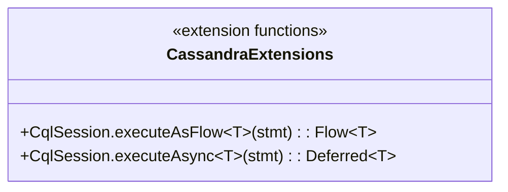
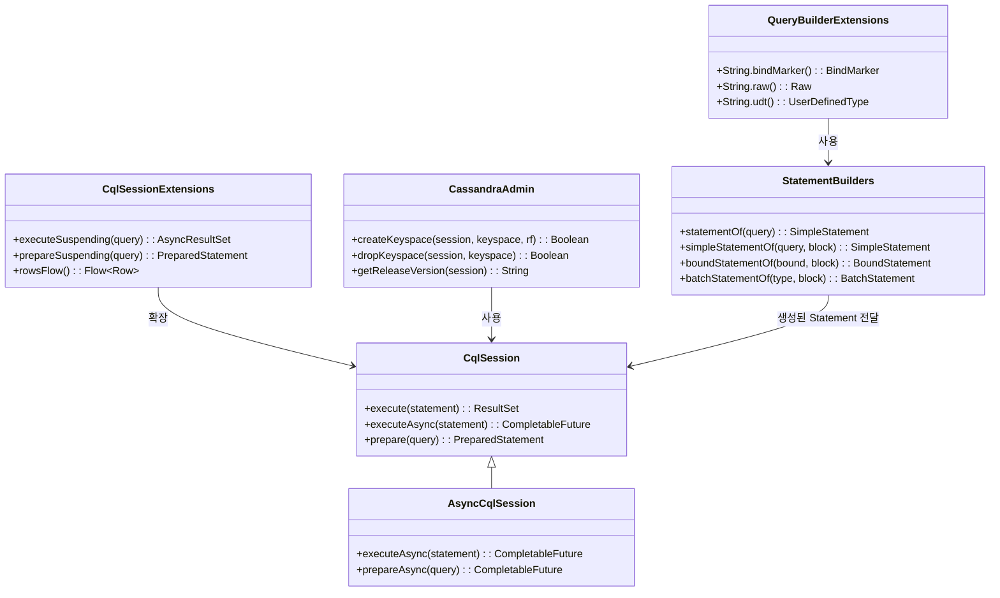
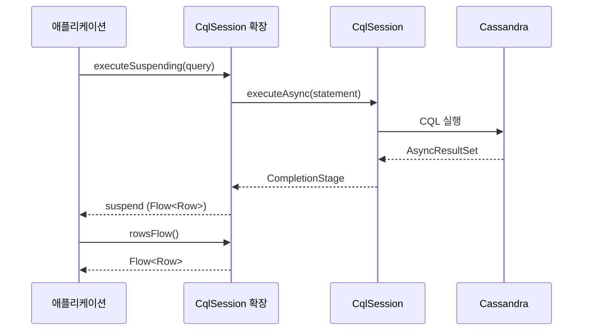

# Module bluetape4k-cassandra

[Apache Cassandra](https://cassandra.apache.org/) Java Driver를 Kotlin에서 더욱 편리하게 사용할 수 있도록 하는 확장 라이브러리입니다.

## 특징

- **Session 확장**: `CqlSession`, `AsyncCqlSession` 생성 및 관리를 위한 DSL
- **Coroutines 지원**: `suspend` 함수를 이용한 비동기 쿼리 실행
- **Row/Gettable/Settable 확장**: 타입 안전한 값 조회/설정
- **QueryBuilder 확장**: CQL 빌더 작성 편의 함수
- **Statement 지원**: SimpleStatement, BoundStatement, BatchStatement 생성 DSL
- **Admin 유틸**: Keyspace 생성/삭제, 버전 확인 등 관리 작업 지원

## 의존성 추가

```kotlin
dependencies {
    implementation("io.github.bluetape4k:bluetape4k-cassandra:${bluetape4kVersion}")
}
```

## 주요 기능

### 1. CqlSession 생성

```kotlin
import io.bluetape4k.cassandra.*
import java.net.InetSocketAddress

// DSL 방식으로 Session 생성
val session = cqlSession {
    addContactPoint(InetSocketAddress("localhost", 9042))
    withLocalDatacenter("datacenter1")
    withKeyspace("my_keyspace")
    withAuthCredentials("username", "password")
}

// 간편한 Session 생성
val session2 = cqlSessionOf(
    contactPoint = InetSocketAddress("localhost", 9042),
    localDatacenter = "datacenter1",
    keyspaceName = "my_keyspace"
)

// Session 사용 후 닫기
session.use { /* 작업 수행 */ }
```

### 2. 비동기 쿼리 (Coroutines)

```kotlin
import io.bluetape4k.cassandra.cql.*
import kotlinx.coroutines.flow.*

// suspend 함수로 쿼리 실행
suspend fun fetchUsers(): List<User> {
    val result = session.executeSuspending("SELECT * FROM users")
    return result.map { row ->
        User(
            id = row.getInt("id"),
            name = row.getString("name"),
            email = row.getString("email")
        )
    }.toList()
}

// Named parameter 사용
suspend fun fetchUserById(id: Int): User? {
    val result = session.executeSuspending(
        "SELECT * FROM users WHERE id = :id",
        mapOf("id" to id)
    )
    return result.one()?.let { row ->
        User(
            id = row.getInt("id"),
            name = row.getString("name")
        )
    }
}

// PreparedStatement 생성
suspend fun prepareAndExecute() {
    val prepared = session.prepareSuspending("SELECT * FROM users WHERE id = :id")
    val bound = prepared.bind(123)
    val result = session.executeSuspending(bound)
}
```

### 3. Row 데이터 조회

```kotlin
import io.bluetape4k.cassandra.cql.*

// Row를 Map으로 변환
val row = result.one()
val dataMap: Map<Int, Any?> = row.toMap()
val namedMap: Map<String, Any?> = row.toNamedMap()
val cqlIdMap: Map<CqlIdentifier, Any?> = row.toCqlIdentifierMap()

// 빈 문자열 기본값
val name = row.getStringOrEmpty("name")
val nameByIndex = row.getStringOrEmpty(0)

// 변환 함수 적용
val stringValues = row.map { value -> value?.toString() ?: "" }
val namedStringValues = row.mapWithName { it?.toString() }
```

### 4. Gettable/Settable 지원

```kotlin
import io.bluetape4k.cassandra.data.*

// Row, UdtValue, TupleValue 등에서 타입 안전하게 값 조회
val name: String? = row.getValue<String>("name")
val age: Int? = row.getValue<Int>("age")
val tags: MutableList<String>? = row.getList<String>("tags")
val metadata: MutableMap<String, String>? = row.getMap<String, String>("metadata")

// 인덱스 기반 조회
val firstName: String? = row.getValue<String>(0)
val scores: MutableList<Int>? = row.getList<Int>(1)

// CqlIdentifier 기반 조회
val value = row.getValue(CqlIdentifier.fromCql("column_name"))

// 동적 타입 조회
val value: Any? = row.getObject("column_name", String::class)
```

### 5. Statement 생성

```kotlin
import io.bluetape4k.cassandra.cql.*

// SimpleStatement 생성
val simple = statementOf("SELECT * FROM users")

// 파라미터가 있는 Statement
val withParams = statementOf(
    "SELECT * FROM users WHERE age > ? AND status = ?",
    18, "active"
)

// Named parameter Statement
val namedParams = statementOf(
    "SELECT * FROM users WHERE age > :min_age AND status = :status",
    mapOf("min_age" to 18, "status" to "active")
)

// Builder 패턴
val statement = simpleStatementOf("SELECT * FROM users") {
    setKeyspace("my_keyspace")
    setPageSize(100)
    setConsistencyLevel(ConsistencyLevel.QUORUM)
    setTimeout(Duration.ofSeconds(5))
}

// BoundStatement 생성
val prepared = session.prepare("INSERT INTO users (id, name, email) VALUES (?, ?, ?)")
val bound = boundStatementOf(prepared.bind()) {
    setInt("id", 1)
    setString("name", "John")
    setString("email", "john@example.com")
}

// BatchStatement
val batch = batchStatementOf(BatchType.LOGGED) {
    add(statement1)
    add(statement2)
    add(statement3)
}

// 또는 기존 Statement에서
val batch2 = batchStatementOf(existingBatch) {
    addAll(listOf(statement4, statement5))
}
```

### 6. QueryBuilder 확장

```kotlin
import io.bluetape4k.cassandra.querybuilder.*
import com.datastax.oss.driver.api.querybuilder.QueryBuilder.*

// BindMarker 생성
val nameMarker = "name".bindMarker()
val idMarker = CqlIdentifier.fromCql("id").bindMarker()

// Raw CQL snippet
val rawSnippet = "ttl(?)".raw()

// UserDefinedType
val addressUdt = "address".udt()
val addressUdt2 = CqlIdentifier.fromCql("address").udt()

// SELECT 구문
val select = selectFrom("users")
    .column("id")
    .column("name")
    .whereColumn("age").isGreaterThan(bindMarker("min_age"))
    .build()

// INSERT 구문
val insert = insertInto("users")
    .value("id", bindMarker("id"))
    .value("name", bindMarker("name"))
    .ifNotExists()
    .build()

// UPDATE 구문
val update = update("users")
    .setColumn("name", bindMarker("name"))
    .whereColumn("id").isEqualTo(bindMarker("id"))
    .ifColumn("version").isEqualTo(bindMarker("version"))
    .build()

// DELETE 구문
val delete = deleteFrom("users")
    .whereColumn("id").isEqualTo(bindMarker("id"))
    .ifColumn("status").isEqualTo(literal("inactive"))
    .build()
```

### 7. Cassandra 관리 (Admin)

```kotlin
import io.bluetape4k.cassandra.CassandraAdmin

// Keyspace 생성
val created = CassandraAdmin.createKeyspace(
    session = session,
    keyspace = "my_keyspace",
    replicationFactor = 3
)

// Keyspace 삭제
val dropped = CassandraAdmin.dropKeyspace(session, "my_keyspace")

// Cassandra 버전 확인
val version = CassandraAdmin.getReleaseVersion(session)
println("Cassandra version: $version")
```

### 8. 문자열 처리 유틸리티

```kotlin
import io.bluetape4k.cassandra.*

// Single quote 이스케이프
val quoted = "Simpson's family".quote()  // 'Simpson''s family'
val unquoted = "'Simpson''s family'".unquote()  // Simpson's family

// Double quote 이스케이프
val doubleQuoted = "<div class=\"content\">".doubleQuote()  // <div class=""content"">
val unDoubleQuoted = "<div class=""content"">".unDoubleQuote()  // <div class="content">

// Quote 상태 확인
val isQuoted = "'test'".isQuoted()  // true
val isDoubleQuoted = """"test"""".isDoubleQuoted()  // true
val needsQuotes = "test column".needsDoubleQuotes()  // true
```

### 9. CqlIdentifier 지원

```kotlin
import io.bluetape4k.cassandra.CqlIdentifierSupport

// 문자열을 CqlIdentifier로 변환
val id = "my_column".toCqlIdentifier()
val id2 = CqlIdentifier.fromCql("my_column")

// Quote가 필요한 경우 자동 처리
val idWithSpace = "my column".toCqlIdentifier()  // "my column"
```

### 10. 비동기 ResultSet 처리

```kotlin
import io.bluetape4k.cassandra.cql.*
import kotlinx.coroutines.flow.*

// AsyncResultSet을 Flow로 변환
suspend fun fetchAllUsers(): Flow<User> {
    val result = session.executeSuspending("SELECT * FROM users")
    return result.rowsFlow()
        .map { row ->
            User(
                id = row.getInt("id"),
                name = row.getString("name")
            )
        }
}

// 페이징 처리
suspend fun fetchWithPaging() {
    var result = session.executeSuspending("SELECT * FROM large_table")
    
    do {
        result.currentPage().forEach { row ->
            process(row)
        }
    } while (result.hasMorePages().also {
        if (it) result = result.fetchNextPage().await()
    })
}
```

## 테스트 지원

```kotlin
import io.bluetape4k.cassandra.AbstractCassandraTest

class MyCassandraTest: AbstractCassandraTest() {
    
    @Test
    fun `사용자 조회 테스트`() {
        // Keyspace 생성
        CassandraAdmin.createKeyspace(session, "test_keyspace")
        
        // 테이블 생성
        session.execute("""
            CREATE TABLE IF NOT EXISTS test_keyspace.users (
                id int PRIMARY KEY,
                name text,
                email text
            )
        """.trimIndent())
        
        // 데이터 삽입
        session.execute(
            "INSERT INTO test_keyspace.users (id, name, email) VALUES (?, ?, ?)",
            1, "John", "john@example.com"
        )
        
        // 데이터 조회
        val result = session.execute("SELECT * FROM test_keyspace.users WHERE id = ?", 1)
        val row = result.one()!!
        
        row.getInt("id") shouldBeEqualTo 1
        row.getString("name") shouldBeEqualTo "John"
    }
}
```

## 예제

더 많은 예제는 `src/test/kotlin/io/bluetape4k/cassandra` 패키지에서 확인할 수 있습니다:

- `examples/`: 기본 사용 예제
  - `BasicExamples.kt`: 기본 CRUD 작업
  - `datatypes/`: 다양한 데이터 타입 처리 (Blob, Tuple, UDT, Custom Codec)
  - `json/`: JSON 데이터 처리
- `querybuilder/`: QueryBuilder 사용 예제
  - `SelectFromStatementExamples.kt`: SELECT 구문
  - `InsertIntoStatementExamples.kt`: INSERT 구문
  - `UpateStatementExamples.kt`: UPDATE 구문
  - `DeleteFromStatementExamples.kt`: DELETE 구문
  - `schema/`: 스키마 관리 예제 (Keyspace, Table, Index, UDT 등)

## 아키텍처 다이어그램

### 확장 함수 API 개요



### 주요 API 구조



### 비동기 쿼리 실행 흐름



## 참고 자료

- [Apache Cassandra 공식 문서](https://cassandra.apache.org/doc/latest/)
- [DataStax Java Driver 문서](https://docs.datastax.com/en/developer/java-driver/latest/)
- [CQL Query Builder](https://docs.datastax.com/en/developer/java-driver/latest/manual/query_builder/)
- [Driver Mapper](https://docs.datastax.com/en/developer/java-driver/latest/manual/mapper/)

## 라이선스

Apache License 2.0
