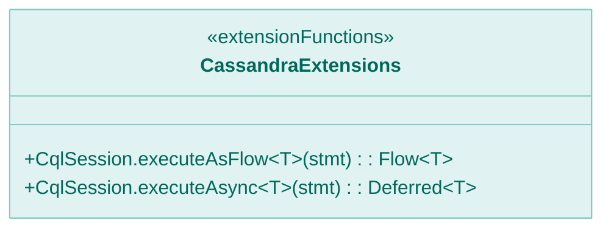
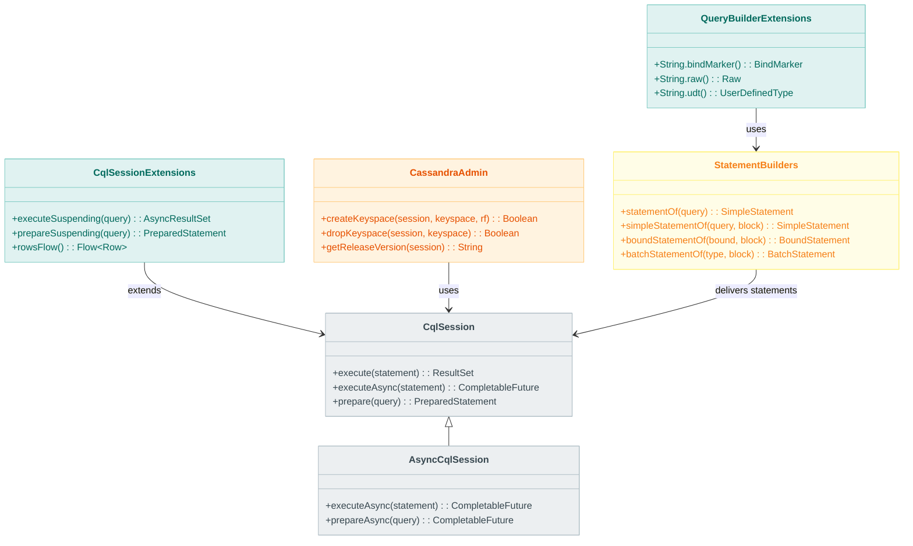
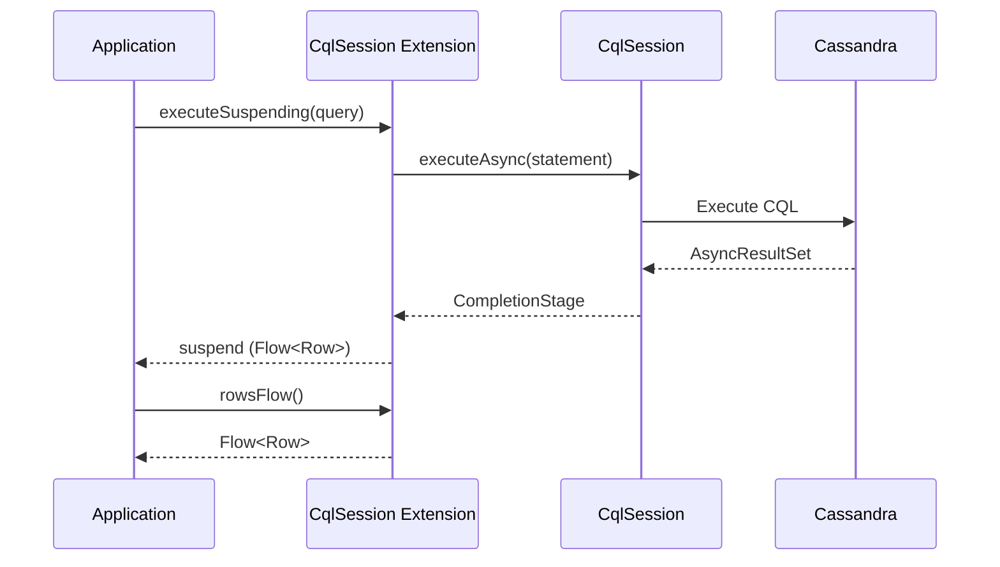

# Module bluetape4k-cassandra

English | [한국어](./README.ko.md)

A Kotlin extension library that makes it easier to use the [Apache Cassandra](https://cassandra.apache.org/) Java Driver.

## Features

- **Session Extensions**: DSL for creating and managing `CqlSession` and `AsyncCqlSession`
- **Coroutines Support**: Asynchronous query execution via `suspend` functions
- **Row/Gettable/Settable Extensions**: Type-safe value access and mutation
- **QueryBuilder Extensions**: Convenience functions for building CQL queries
- **Statement Support**: DSL for creating SimpleStatement, BoundStatement, and BatchStatement
- **Admin Utilities**: Keyspace creation/deletion, version checks, and other administrative tasks

## Dependency

```kotlin
dependencies {
    implementation("io.github.bluetape4k:bluetape4k-cassandra:${bluetape4kVersion}")
}
```

## Core Features

### 1. Creating a CqlSession

```kotlin
import io.bluetape4k.cassandra.*
import java.net.InetSocketAddress

// Create a session using DSL
val session = cqlSession {
    addContactPoint(InetSocketAddress("localhost", 9042))
    withLocalDatacenter("datacenter1")
    withKeyspace("my_keyspace")
    withAuthCredentials("username", "password")
}

// Convenience factory function
val session2 = cqlSessionOf(
    contactPoint = InetSocketAddress("localhost", 9042),
    localDatacenter = "datacenter1",
    keyspaceName = "my_keyspace"
)

// Auto-close after use
session.use { /* perform operations */ }
```

### 2. Asynchronous Queries (Coroutines)

```kotlin
import io.bluetape4k.cassandra.cql.*
import kotlinx.coroutines.flow.*

// Execute a query using suspend functions
suspend fun fetchUsers(): List<User> {
    val result = session.executeSuspending("SELECT * FROM users")
    return result.map { row ->
        User(
            id = row.getInt("id"),
            name = row.getString("name"),
            email = row.getString("email")
        )
    }.toList()
}

// Using named parameters
suspend fun fetchUserById(id: Int): User? {
    val result = session.executeSuspending(
        "SELECT * FROM users WHERE id = :id",
        mapOf("id" to id)
    )
    return result.one()?.let { row ->
        User(
            id = row.getInt("id"),
            name = row.getString("name")
        )
    }
}

// Prepare and execute a statement
suspend fun prepareAndExecute() {
    val prepared = session.prepareSuspending("SELECT * FROM users WHERE id = :id")
    val bound = prepared.bind(123)
    val result = session.executeSuspending(bound)
}
```

### 3. Row Data Access

```kotlin
import io.bluetape4k.cassandra.cql.*

// Convert a Row to a Map
val row = result.one()
val dataMap: Map<Int, Any?> = row.toMap()
val namedMap: Map<String, Any?> = row.toNamedMap()
val cqlIdMap: Map<CqlIdentifier, Any?> = row.toCqlIdentifierMap()

// Access with empty string fallback
val name = row.getStringOrEmpty("name")
val nameByIndex = row.getStringOrEmpty(0)

// Apply transformation functions
val stringValues = row.map { value -> value?.toString() ?: "" }
val namedStringValues = row.mapWithName { it?.toString() }
```

### 4. Gettable/Settable Support

```kotlin
import io.bluetape4k.cassandra.data.*

// Type-safe value access from Row, UdtValue, TupleValue, etc.
val name: String? = row.getValue<String>("name")
val age: Int? = row.getValue<Int>("age")
val tags: MutableList<String>? = row.getList<String>("tags")
val metadata: MutableMap<String, String>? = row.getMap<String, String>("metadata")

// Index-based access
val firstName: String? = row.getValue<String>(0)
val scores: MutableList<Int>? = row.getList<Int>(1)

// CqlIdentifier-based access
val value = row.getValue(CqlIdentifier.fromCql("column_name"))

// Dynamic type access
val value: Any? = row.getObject("column_name", String::class)
```

### 5. Building Statements

```kotlin
import io.bluetape4k.cassandra.cql.*

// Create a SimpleStatement
val simple = statementOf("SELECT * FROM users")

// Statement with positional parameters
val withParams = statementOf(
    "SELECT * FROM users WHERE age > ? AND status = ?",
    18, "active"
)

// Statement with named parameters
val namedParams = statementOf(
    "SELECT * FROM users WHERE age > :min_age AND status = :status",
    mapOf("min_age" to 18, "status" to "active")
)

// Builder pattern
val statement = simpleStatementOf("SELECT * FROM users") {
    setKeyspace("my_keyspace")
    setPageSize(100)
    setConsistencyLevel(ConsistencyLevel.QUORUM)
    setTimeout(Duration.ofSeconds(5))
}

// Create a BoundStatement
val prepared = session.prepare("INSERT INTO users (id, name, email) VALUES (?, ?, ?)")
val bound = boundStatementOf(prepared.bind()) {
    setInt("id", 1)
    setString("name", "John")
    setString("email", "john@example.com")
}

// BatchStatement
val batch = batchStatementOf(BatchType.LOGGED) {
    add(statement1)
    add(statement2)
    add(statement3)
}

// Or build from an existing batch
val batch2 = batchStatementOf(existingBatch) {
    addAll(listOf(statement4, statement5))
}
```

### 6. QueryBuilder Extensions

```kotlin
import io.bluetape4k.cassandra.querybuilder.*
import com.datastax.oss.driver.api.querybuilder.QueryBuilder.*

// Create BindMarkers
val nameMarker = "name".bindMarker()
val idMarker = CqlIdentifier.fromCql("id").bindMarker()

// Raw CQL snippet
val rawSnippet = "ttl(?)".raw()

// UserDefinedType
val addressUdt = "address".udt()
val addressUdt2 = CqlIdentifier.fromCql("address").udt()

// SELECT statement
val select = selectFrom("users")
    .column("id")
    .column("name")
    .whereColumn("age").isGreaterThan(bindMarker("min_age"))
    .build()

// INSERT statement
val insert = insertInto("users")
    .value("id", bindMarker("id"))
    .value("name", bindMarker("name"))
    .ifNotExists()
    .build()

// UPDATE statement
val update = update("users")
    .setColumn("name", bindMarker("name"))
    .whereColumn("id").isEqualTo(bindMarker("id"))
    .ifColumn("version").isEqualTo(bindMarker("version"))
    .build()

// DELETE statement
val delete = deleteFrom("users")
    .whereColumn("id").isEqualTo(bindMarker("id"))
    .ifColumn("status").isEqualTo(literal("inactive"))
    .build()
```

### 7. Cassandra Administration

```kotlin
import io.bluetape4k.cassandra.CassandraAdmin

// Create a keyspace
val created = CassandraAdmin.createKeyspace(
    session = session,
    keyspace = "my_keyspace",
    replicationFactor = 3
)

// Drop a keyspace
val dropped = CassandraAdmin.dropKeyspace(session, "my_keyspace")

// Check Cassandra version
val version = CassandraAdmin.getReleaseVersion(session)
println("Cassandra version: $version")
```

### 8. String Utilities

```kotlin
import io.bluetape4k.cassandra.*

// Single-quote escaping
val quoted = "Simpson's family".quote()  // 'Simpson''s family'
val unquoted = "'Simpson''s family'".unquote()  // Simpson's family

// Double-quote escaping
val doubleQuoted = "<div class=\"content\">".doubleQuote()  // <div class=""content"">
val unDoubleQuoted = """<div class=""content"">""".unDoubleQuote()  // <div class="content">

// Check quote state
val isQuoted = "'test'".isQuoted()  // true
val isDoubleQuoted = """"test"""".isDoubleQuoted()  // true
val needsQuotes = "test column".needsDoubleQuotes()  // true
```

### 9. CqlIdentifier Support

```kotlin
import io.bluetape4k.cassandra.CqlIdentifierSupport

// Convert a string to a CqlIdentifier
val id = "my_column".toCqlIdentifier()
val id2 = CqlIdentifier.fromCql("my_column")

// Automatically handles quoting when necessary
val idWithSpace = "my column".toCqlIdentifier()  // "my column"
```

### 10. Asynchronous ResultSet Processing

```kotlin
import io.bluetape4k.cassandra.cql.*
import kotlinx.coroutines.flow.*

// Convert an AsyncResultSet to a Flow
suspend fun fetchAllUsers(): Flow<User> {
    val result = session.executeSuspending("SELECT * FROM users")
    return result.rowsFlow()
        .map { row ->
            User(
                id = row.getInt("id"),
                name = row.getString("name")
            )
        }
}

// Paged result processing
suspend fun fetchWithPaging() {
    var result = session.executeSuspending("SELECT * FROM large_table")
    
    do {
        result.currentPage().forEach { row ->
            process(row)
        }
    } while (result.hasMorePages().also {
        if (it) result = result.fetchNextPage().await()
    })
}
```

## Test Support

```kotlin
import io.bluetape4k.cassandra.AbstractCassandraTest

class MyCassandraTest: AbstractCassandraTest() {
    
    @Test
    fun `fetch user test`() {
        // Create keyspace
        CassandraAdmin.createKeyspace(session, "test_keyspace")
        
        // Create table
        session.execute("""
            CREATE TABLE IF NOT EXISTS test_keyspace.users (
                id int PRIMARY KEY,
                name text,
                email text
            )
        """.trimIndent())
        
        // Insert data
        session.execute(
            "INSERT INTO test_keyspace.users (id, name, email) VALUES (?, ?, ?)",
            1, "John", "john@example.com"
        )
        
        // Query data
        val result = session.execute("SELECT * FROM test_keyspace.users WHERE id = ?", 1)
        val row = result.one()!!
        
        row.getInt("id") shouldBeEqualTo 1
        row.getString("name") shouldBeEqualTo "John"
    }
}
```

## Examples

More examples are available in the `src/test/kotlin/io/bluetape4k/cassandra` package:

- `examples/`: Basic usage examples
    - `BasicExamples.kt`: Basic CRUD operations
    - `datatypes/`: Various data type handling (Blob, Tuple, UDT, Custom Codec)
    - `json/`: JSON data handling
- `querybuilder/`: QueryBuilder usage examples
    - `SelectFromStatementExamples.kt`: SELECT statements
    - `InsertIntoStatementExamples.kt`: INSERT statements
    - `UpateStatementExamples.kt`: UPDATE statements
    - `DeleteFromStatementExamples.kt`: DELETE statements
    - `schema/`: Schema management examples (Keyspace, Table, Index, UDT, etc.)

## Architecture Diagrams

### Extension Function API Overview



### Core API Structure



### Asynchronous Query Execution Flow



## References

- [Apache Cassandra Official Documentation](https://cassandra.apache.org/doc/latest/)
- [DataStax Java Driver Documentation](https://docs.datastax.com/en/developer/java-driver/latest/)
- [CQL Query Builder](https://docs.datastax.com/en/developer/java-driver/latest/manual/query_builder/)
- [Driver Mapper](https://docs.datastax.com/en/developer/java-driver/latest/manual/mapper/)

## License

Apache License 2.0
