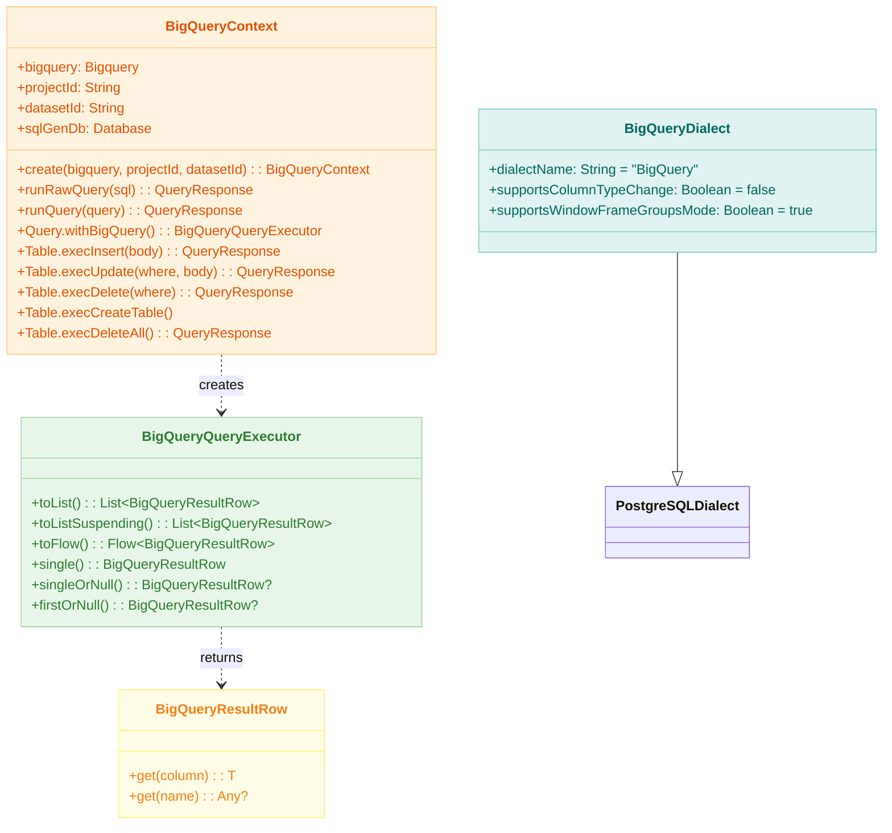
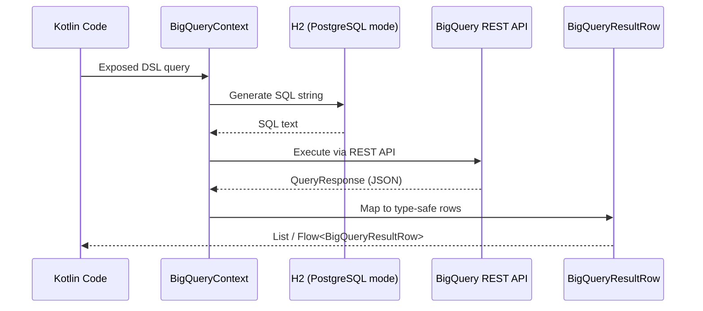

# Module bluetape4k-exposed-bigquery

English | [한국어](./README.ko.md)

A module that generates SQL using JetBrains Exposed DSL and executes it via the Google BigQuery REST API. It uses
`google-api-services-bigquery-v2` without a JDBC driver and employs H2 (PostgreSQL mode) solely for SQL generation.

## Overview

`bluetape4k-exposed-bigquery` provides:

- **BigQueryContext
  **: Converts Exposed DSL to SQL (via H2 in PostgreSQL mode), then executes it against the BigQuery REST API
    - Supports SELECT, INSERT, UPDATE, DELETE, and CREATE TABLE DDL
    - Includes suspend/Flow async APIs
- **BigQueryQueryExecutor**: Executes Exposed `Query` objects against BigQuery with automatic pagination
- **BigQueryResultRow**: Type-safe row access via column references (Long, BigDecimal, Instant, etc.)
    - Case-insensitive column name lookup
    - Converts `"null"` strings and BigQuery null sentinels to Kotlin `null`
- **BigQueryDialect**: Extends `PostgreSQLDialect` with BigQuery-specific overrides

## Module Positioning

`bluetape4k-exposed-bigquery` is not a JDBC-driver-based ORM module. It reuses the Exposed DSL as a SQL generator while delegating actual execution to the BigQuery REST API.

- Use this module when you need to execute queries via the BigQuery REST API.
- For JDBC transaction consistency or Trino connector-based execution, use `bluetape4k-exposed-trino` or the upcoming
  `exposed-bigquery-trino`.
- `sqlGenDb` is an internal implementation for SQL string generation only — it is not an application data store.

## Capabilities

| Supported                                          | Not Supported                         |
|----------------------------------------------------|---------------------------------------|
| SELECT/filter/order/group/aggregate                | Full DAO compatibility                |
| INSERT/UPDATE/DELETE DML                           | JDBC transaction semantics            |
| CREATE TABLE DDL (with type mapping)               | `transaction {}` atomicity / rollback |
| Large result sets (automatic `pageToken` handling) | Full SchemaUtils automation           |
| suspend/Flow async API                             | SERIAL/SEQUENCE auto-increment        |
| Column-based type conversion                       | ALTER COLUMN TYPE                     |

## Dependency

```kotlin
dependencies {
    implementation("io.github.bluetape4k:bluetape4k-exposed-bigquery:${version}")
}
```

## Basic Usage

### 1. Creating a BigQueryContext

```kotlin
import io.bluetape4k.exposed.bigquery.BigQueryContext
import com.google.api.services.bigquery.Bigquery

// Create via factory (H2 sqlGenDb is configured automatically)
val context = BigQueryContext.create(
    bigquery = bigqueryClient,
    projectId = "my-project",
    datasetId = "my-dataset",
)
```

### 2. SELECT Queries

```kotlin
with(context) {
    // Synchronous
    val rows = Events.selectAll()
        .where { Events.region eq "kr" }
        .withBigQuery()
        .toList()

    val region: String = rows[0][Events.region]
    val userId: Long   = rows[0][Events.userId]

    // Suspend
    val rows = Events.selectAll().withBigQuery().toListSuspending()

    // Flow (for large result sets)
    Events.selectAll().withBigQuery().toFlow().collect { row -> println(row) }
}
```

### 2.1 Choosing a Result Consumption Strategy

- `toList()` / `toListSuspending()`:
  Loads all results into memory. Suitable for small to medium result sets and single/batch post-processing.
- `toFlow()`:
  Follows BigQuery `pageToken` pagination and emits rows sequentially. Recommended for large result sets.

### 3. DML (INSERT / UPDATE / DELETE)

```kotlin
with(context) {
    // INSERT
    Events.execInsert {
        it[eventId] = 1L
        it[region]  = "kr"
    }

    // UPDATE
    Events.execUpdate(Events.region eq "kr") {
        it[eventType] = "UPDATED"
    }

    // DELETE
    Events.execDelete(Events.region eq "us")

    // Suspend variants
    Events.execInsertSuspending { /* insert logic */ }
    Events.execUpdateSuspending(where) { /* update logic */ }
    Events.execDeleteSuspending(where)
}
```

### 4. DDL (CREATE TABLE)

```kotlin
with(context) {
    // Automatically generates DDL from the Exposed Table definition and executes it in BigQuery
    // BIGINT → INT64, VARCHAR(n) → STRING, DECIMAL → NUMERIC are converted automatically
    Events.execCreateTable()
}
```

### 5. Raw SQL

```kotlin
with(context) {
    runRawQuery("SELECT COUNT(*) FROM events")
    runRawQuerySuspending("SELECT region, SUM(amount) FROM events GROUP BY region")
}
```

## Type Mapping

BigQuery REST API response → Kotlin type conversion:

| BigQuery Type | Kotlin Type                                             |
|---------------|---------------------------------------------------------|
| INT64         | `Long`                                                  |
| STRING        | `String`                                                |
| NUMERIC       | `BigDecimal`                                            |
| TIMESTAMP     | `Instant` (auto-converted from float string in seconds) |
| nullable      | `null`                                                  |

`BigQueryResultRow` normalizes all keys to lowercase, so both `row["REGION"]` and `row["region"]` work identically.
`"null"` / `"NULL"` strings and null sentinel values from nullable columns are treated as Kotlin `null`.

## Transaction and Consistency Notes

This module uses the BigQuery REST API and does not provide JDBC transaction semantics.

- The `transaction {}` blocks called on `sqlGenDb` are internal Exposed implementations for SQL string generation only.
- Actual BigQuery write operations are performed per REST API call.
- When calling multiple DML operations sequentially, your application must account for the possibility of partial writes.
- Do not expect RDBMS-level rollback, savepoints, or nested transaction atomicity.

## Architecture Diagram



### Query Execution Flow



## Key Files / Classes

| File                                           | Description                                                                                         |
|------------------------------------------------|-----------------------------------------------------------------------------------------------------|
| `BigQueryContext.kt`                           | SQL generation + BigQuery REST execution context; includes common DML/DDL and paginated query logic |
| `BigQueryQueryExecutor.kt`                     | Executes Exposed Query objects against BigQuery; provides full-load and Flow-based query APIs       |
| `BigQueryQueryExecutor.kt` (BigQueryResultRow) | Type-safe row access via column references                                                          |
| `dialect/BigQueryDialect.kt`                   | BigQuery dialect extending PostgreSQLDialect                                                        |

## Testing

Integration tests are provided using the BigQuery emulator (`goccy/bigquery-emulator`).

Running the local emulator directly allows you to test quickly without Testcontainers:

```bash
brew install goccy/bigquery-emulator/bigquery-emulator
bigquery-emulator --project=test --dataset=testdb --port=9050

./gradlew :bluetape4k-exposed-bigquery:test
```

If the emulator is not available, a Testcontainers Docker container starts automatically.

Regression test examples:

```bash
./gradlew :bluetape4k-exposed-bigquery:test --tests "io.bluetape4k.exposed.bigquery.BigQueryResultRowTest"
./gradlew :bluetape4k-exposed-bigquery:test --tests "io.bluetape4k.exposed.bigquery.query.SelectQueryTest"
```

## References

- [Google BigQuery REST API](https://cloud.google.com/bigquery/docs/reference/rest)
- [goccy/bigquery-emulator](https://github.com/goccy/bigquery-emulator)
- [JetBrains Exposed](https://github.com/JetBrains/Exposed)
