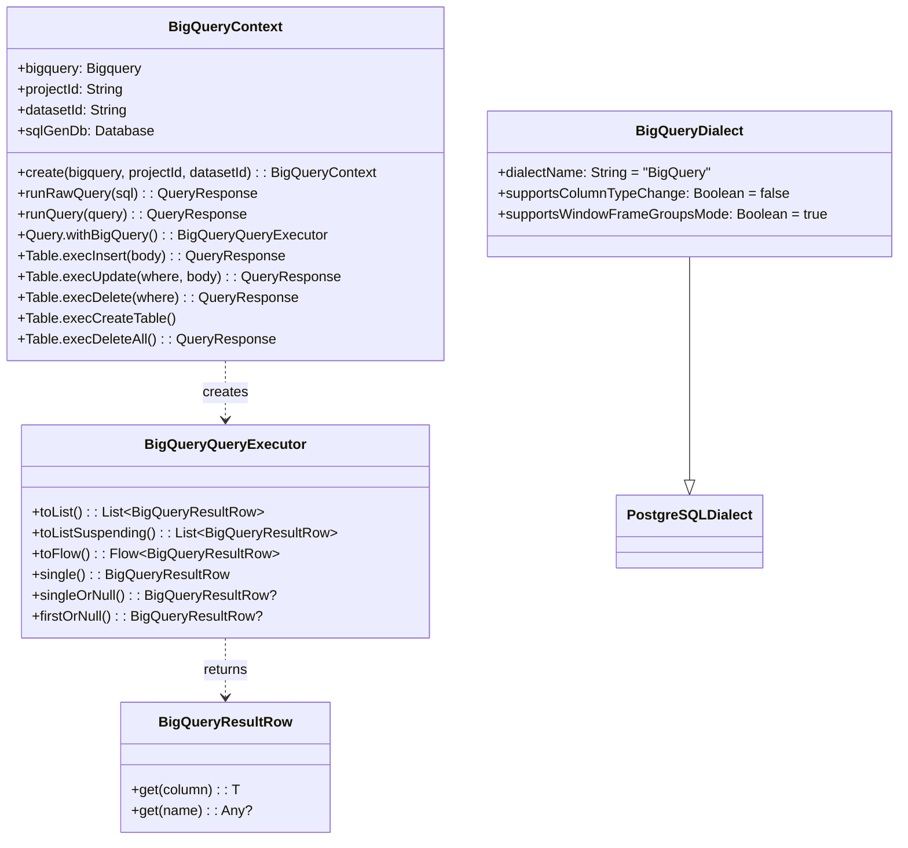

# Module bluetape4k-exposed-bigquery

JetBrains Exposed DSL로 SQL을 생성하고 Google BigQuery REST API로 실행하는 모듈입니다. JDBC 드라이버 없이 `google-api-services-bigquery-v2`를 사용하며, H2(PostgreSQL 모드)로 SQL 문자열을 생성합니다.

## 개요

`bluetape4k-exposed-bigquery`는 다음을 제공합니다:

- **BigQueryContext**: Exposed DSL → SQL(H2 PostgreSQL 모드) 변환 후 BigQuery REST API 실행
  - SELECT, INSERT, UPDATE, DELETE, CREATE TABLE DDL 지원
  - suspend/Flow 비동기 API 포함
- **BigQueryQueryExecutor**: Exposed `Query` → BigQuery 실행, 페이지네이션 자동 처리
- **BigQueryResultRow**: Column 참조로 타입 안전한 행 접근 (Long, BigDecimal, Instant 등)
  - 컬럼 이름 조회 시 대소문자 무시
  - `"null"` 문자열과 BigQuery null sentinel을 Kotlin `null`로 변환
- **BigQueryDialect**: `PostgreSQLDialect` 상속, BigQuery 제약사항 override

## 포지셔닝

| 지원 | 미지원 |
|------|--------|
| SELECT/filter/order/group/aggregate | DAO 완전 호환 |
| INSERT/UPDATE/DELETE DML | JDBC 트랜잭션 의미론 |
| CREATE TABLE DDL (타입 변환 포함) | SchemaUtils DDL 자동화 |
| 대용량 결과셋 (pageToken 자동 처리) | SERIAL/SEQUENCE auto-increment |
| suspend/Flow 비동기 API | ALTER COLUMN TYPE |

## 의존성 추가

```kotlin
dependencies {
    implementation("io.github.bluetape4k:bluetape4k-exposed-bigquery:${version}")
}
```

## 기본 사용법

### 1. BigQueryContext 생성

```kotlin
import io.bluetape4k.exposed.bigquery.BigQueryContext
import com.google.api.services.bigquery.Bigquery

// 팩토리로 생성 (H2 sqlGenDb 자동 설정)
val context = BigQueryContext.create(
    bigquery = bigqueryClient,
    projectId = "my-project",
    datasetId = "my-dataset",
)
```

### 2. SELECT 쿼리

```kotlin
with(context) {
    // 동기
    val rows = Events.selectAll()
        .where { Events.region eq "kr" }
        .withBigQuery()
        .toList()

    val region: String = rows[0][Events.region]
    val userId: Long   = rows[0][Events.userId]

    // suspend
    val rows = Events.selectAll().withBigQuery().toListSuspending()

    // Flow (대용량 결과셋)
    Events.selectAll().withBigQuery().toFlow().collect { row -> ... }
}
```

### 3. DML (INSERT / UPDATE / DELETE)

```kotlin
with(context) {
    // INSERT
    Events.execInsert {
        it[eventId] = 1L
        it[region]  = "kr"
    }

    // UPDATE
    Events.execUpdate(Events.region eq "kr") {
        it[eventType] = "UPDATED"
    }

    // DELETE
    Events.execDelete(Events.region eq "us")

    // suspend 버전
    Events.execInsertSuspending { ... }
    Events.execUpdateSuspending(where) { ... }
    Events.execDeleteSuspending(where)
}
```

### 4. DDL (CREATE TABLE)

```kotlin
with(context) {
    // Exposed Table 정의에서 DDL 자동 생성 후 BigQuery에서 실행
    // BIGINT → INT64, VARCHAR(n) → STRING, DECIMAL → NUMERIC 자동 변환
    Events.execCreateTable()
}
```

### 5. 원시 SQL

```kotlin
with(context) {
    runRawQuery("SELECT COUNT(*) FROM events")
    runRawQuerySuspending("SELECT region, SUM(amount) FROM events GROUP BY region")
}
```

## 타입 변환

BigQuery REST API 응답 → Kotlin 타입 변환:

| BigQuery 타입 | Kotlin 타입 |
|--------------|------------|
| INT64 | `Long` |
| STRING | `String` |
| NUMERIC | `BigDecimal` |
| TIMESTAMP | `Instant` (초 단위 float 문자열 자동 변환) |
| nullable | `null` |

`BigQueryResultRow`는 내부 키를 소문자로 정규화하므로 `row["REGION"]`, `row["region"]` 모두 동일하게 동작합니다.
또한 nullable 컬럼에서 내려오는 `"null"` 문자열과 null sentinel 값은 Kotlin `null`로 처리합니다.

## 다이어그램



## 주요 파일/클래스 목록

| 파일 | 설명 |
|------|------|
| `BigQueryContext.kt` | SQL 생성 + BigQuery REST 실행 컨텍스트, DML/DDL 포함 |
| `BigQueryQueryExecutor.kt` | Exposed Query → BigQuery 실행기, 페이지네이션 자동 처리 |
| `BigQueryQueryExecutor.kt` (BigQueryResultRow) | Column 참조 타입 안전 행 접근 |
| `dialect/BigQueryDialect.kt` | PostgreSQLDialect 상속 BigQuery 다이얼렉트 |

## 테스트

BigQuery 에뮬레이터(`goccy/bigquery-emulator`) 기반 통합 테스트를 제공합니다.

로컬 에뮬레이터를 직접 실행하면 Testcontainers 없이 빠르게 테스트할 수 있습니다:

```bash
brew install goccy/bigquery-emulator/bigquery-emulator
bigquery-emulator --project=test --dataset=testdb --port=9050

./gradlew :bluetape4k-exposed-bigquery:test
```

에뮬레이터가 없으면 Testcontainers Docker 컨테이너가 자동 시작됩니다.

회귀 테스트 예:

```bash
./gradlew :bluetape4k-exposed-bigquery:test --tests "io.bluetape4k.exposed.bigquery.BigQueryResultRowTest"
```

## 참고

- [Google BigQuery REST API](https://cloud.google.com/bigquery/docs/reference/rest)
- [goccy/bigquery-emulator](https://github.com/goccy/bigquery-emulator)
- [JetBrains Exposed](https://github.com/JetBrains/Exposed)
