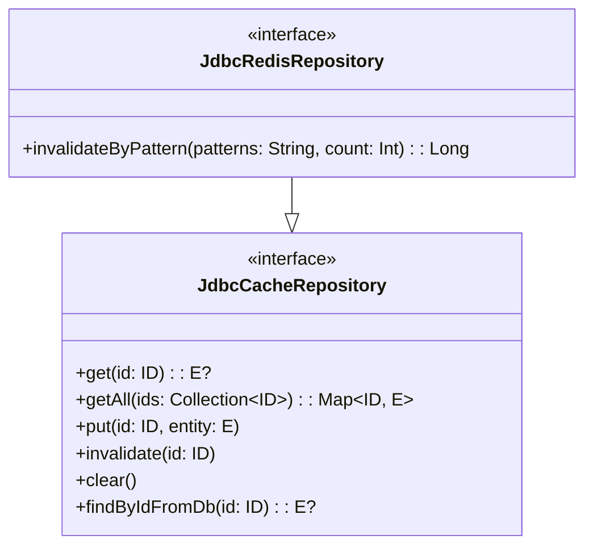

# Module bluetape4k-exposed-cache

[](https://central.sonatype.com/artifact/io.github.bluetape4k/bluetape4k-exposed-cache)

## 개요

`bluetape4k-exposed-cache`는 캐시 기반 Exposed 저장소를 위한 **핵심 인터페이스와 공통 설정**을 정의합니다.

**캐시 백엔드 독립적** 설계 — 동일한 인터페이스가 로컬 캐시(Caffeine)와 원격 캐시(Redis via Lettuce/Redisson) 구현체에서 모두 사용됩니다.

## 아키텍처



## 주요 기능

- **캐시 백엔드 독립적 인터페이스**: `JdbcCacheRepository`, `SuspendedJdbcCacheRepository`, `R2dbcCacheRepository`
- **Redis 전용 서브인터페이스**: `JdbcRedisRepository`, `SuspendJdbcRedisRepository`, `R2dbcRedisRepository` — `invalidateByPattern` 추가 제공
- **`CacheMode`**: `LOCAL` (Caffeine/Cache2k), `REMOTE` (Redis), `NEAR_CACHE` (L1+L2)
- **`CacheWriteMode`**: `READ_ONLY`, `WRITE_THROUGH`, `WRITE_BEHIND`
- **`LocalCacheConfig`**: 로컬 캐시 구현체의 공통 설정 — 상속으로 확장 가능
- **`RedisRepositoryResilienceConfig`**: Redis 저장소 전용 선택적 Resilience 설정
- **testFixtures**: 모든 구현체에서 재사용 가능한 캐시 시나리오 테스트

## 관련 모듈

| 모듈 | 캐시 백엔드 | 인터페이스 |
|------|------------|-----------|
| `exposed-jdbc-lettuce` | Lettuce Redis | `JdbcRedisRepository` |
| `exposed-jdbc-redisson` | Redisson Redis | `JdbcRedisRepository` |
| `exposed-r2dbc-lettuce` | Lettuce Redis | `R2dbcRedisRepository` |
| `exposed-r2dbc-redisson` | Redisson Redis | `R2dbcRedisRepository` |
| `exposed-jdbc-caffeine` | Caffeine (로컬) | `JdbcCacheRepository` |
| `exposed-r2dbc-caffeine` | Caffeine (로컬) | `R2dbcCacheRepository` |

## 의존성 추가

```kotlin
dependencies {
    api("io.github.bluetape4k:bluetape4k-exposed-cache:$version")
}
```
