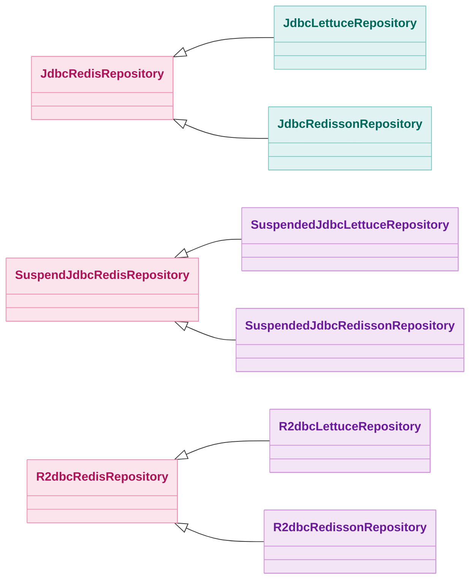
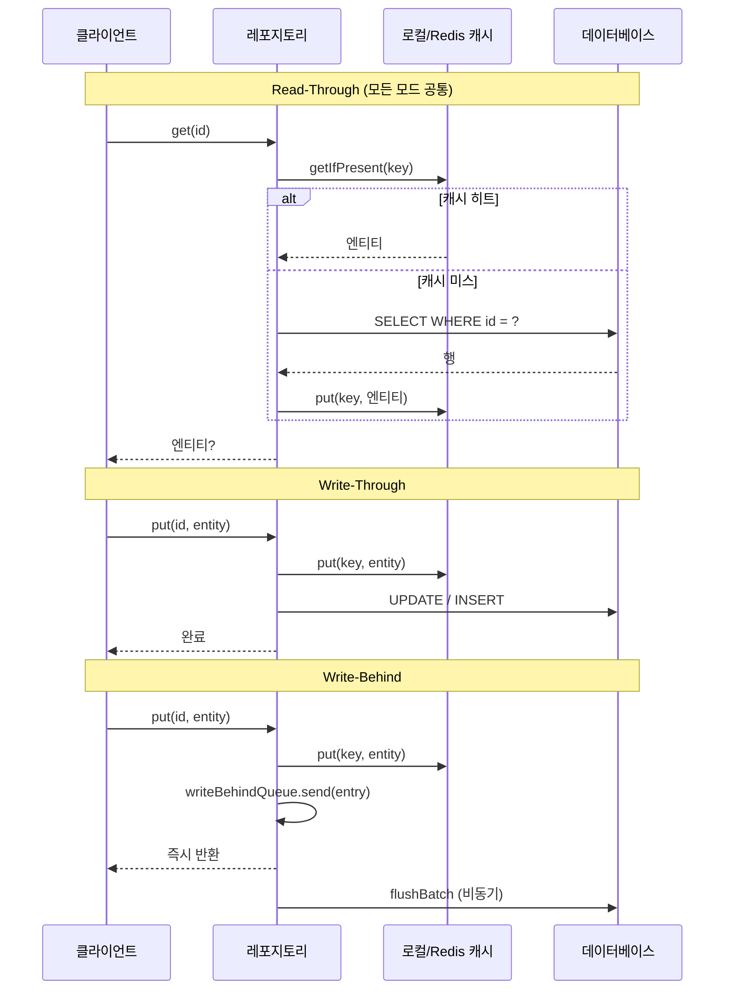

# bluetape4k-exposed-cache

[English](./README.md) | 한국어

[](https://central.sonatype.com/artifact/io.github.bluetape4k/bluetape4k-exposed-cache)

## 개요

`bluetape4k-exposed-cache`는 캐시 기반 Exposed 저장소를 위한 **핵심 인터페이스와 공통 설정**을 정의합니다.

**캐시 백엔드에 독립적**으로 설계되어, 동일한 인터페이스를 로컬 캐시(Caffeine)와 분산 캐시(Redis — Lettuce/Redisson) 모듈이 모두 구현합니다. 각 캐시 모듈은 이 허브 모듈에 의존하며, 백엔드 특화 구현만 추가합니다.

## 모듈 생태계

| 모듈 | 캐시 백엔드 | 캐시 모드 | DB 접근 | Suspend 지원 |
|------|-----------|---------|--------|-------------|
| `exposed-jdbc-caffeine` | Caffeine (로컬) | `LOCAL` | JDBC | sync + suspend |
| `exposed-r2dbc-caffeine` | Caffeine (로컬) | `LOCAL` | R2DBC | suspend 전용 |
| `exposed-jdbc-lettuce` | Redis (Lettuce) | `REMOTE` / `NEAR_CACHE` | JDBC | sync + suspend |
| `exposed-r2dbc-lettuce` | Redis (Lettuce) | `REMOTE` | R2DBC | suspend 전용 |
| `exposed-jdbc-redisson` | Redis (Redisson) | `REMOTE` / `NEAR_CACHE` | JDBC | sync + suspend |
| `exposed-r2dbc-redisson` | Redis (Redisson) | `REMOTE` | R2DBC | suspend 전용 |

## 인터페이스 계층 구조

```mermaid
classDiagram
    direction TB

    class JdbcCacheRepository {
        <<interface>>
        +get(id: ID): E?
        +getAll(ids: Collection~ID~): Map~ID, E~
        +put(id: ID, entity: E)
        +putAll(entities: Map~ID, E~)
        +invalidate(id: ID)
        +invalidateAll(ids: Collection~ID~)
        +clear()
        +containsKey(id: ID): Boolean
        +findByIdFromDb(id: ID): E?
        +findAllFromDb(ids: Collection~ID~): List~E~
        +findAll(...): List~E~
    }
    class JdbcRedisRepository {
        <<interface>>
        +invalidateByPattern(patterns: String, count: Int): Long
    }
    class JdbcCaffeineRepository {
        <<interface>>
        +config: LocalCacheConfig
        +cache: Cache~String, E~
    }
    class SuspendedJdbcCacheRepository {
        <<interface>>
        +get(id: ID): E?
        +put(id: ID, entity: E)
        +invalidate(id: ID)
        +clear()
        +findByIdFromDb(id: ID): E?
        +findAll(...): List~E~
    }
    class SuspendJdbcRedisRepository {
        <<interface>>
        +invalidateByPattern(patterns: String, count: Int): Long
    }
    class SuspendedJdbcCaffeineRepository {
        <<interface>>
        +config: LocalCacheConfig
        +cache: Cache~String, E~
    }
    class R2dbcCacheRepository {
        <<interface>>
        +get(id: ID): E?
        +put(id: ID, entity: E)
        +invalidate(id: ID)
        +clear()
        +findByIdFromDb(id: ID): E?
        +findAll(...): List~E~
    }
    class R2dbcRedisRepository {
        <<interface>>
        +invalidateByPattern(patterns: String, count: Int): Long
    }
    class R2dbcCaffeineRepository {
        <<interface>>
        +config: LocalCacheConfig
        +cache: AsyncCache~String, E~
    }

    JdbcCacheRepository <|-- JdbcRedisRepository
    JdbcCacheRepository <|-- JdbcCaffeineRepository
    SuspendedJdbcCacheRepository <|-- SuspendJdbcRedisRepository
    SuspendedJdbcCacheRepository <|-- SuspendedJdbcCaffeineRepository
    R2dbcCacheRepository <|-- R2dbcRedisRepository
    R2dbcCacheRepository <|-- R2dbcCaffeineRepository

    style JdbcCacheRepository fill:#E3F2FD,stroke:#90CAF9,color:#1565C0
    style JdbcRedisRepository fill:#FCE4EC,stroke:#F48FB1,color:#AD1457
    style JdbcCaffeineRepository fill:#E0F2F1,stroke:#80CBC4,color:#00695C
    style SuspendedJdbcCacheRepository fill:#E3F2FD,stroke:#90CAF9,color:#1565C0
    style SuspendJdbcRedisRepository fill:#FCE4EC,stroke:#F48FB1,color:#AD1457
    style SuspendedJdbcCaffeineRepository fill:#E0F2F1,stroke:#80CBC4,color:#00695C
    style R2dbcCacheRepository fill:#E3F2FD,stroke:#90CAF9,color:#1565C0
    style R2dbcRedisRepository fill:#FCE4EC,stroke:#F48FB1,color:#AD1457
    style R2dbcCaffeineRepository fill:#F3E5F5,stroke:#CE93D8,color:#6A1B9A
```



Redis 전용 하위 인터페이스(Lettuce/Redisson)는 Redis 인터페이스를 확장합니다:



## CacheMode

| 값 | 설명 |
|----|------|
| `LOCAL` | 인프로세스 캐시만 사용 (Caffeine). 가장 빠르지만 JVM 프로세스 간 공유 불가. |
| `REMOTE` | 원격 캐시만 사용 (Redis). 모든 인스턴스에서 공유. |
| `NEAR_CACHE` | L1 로컬 캐시 + L2 Redis. 네트워크 왕복을 줄여 읽기 성능 극대화. Lettuce/Redisson 모듈에서 지원. |

## CacheWriteMode

| 값 | 읽기 | 쓰기 |
|----|------|------|
| `READ_ONLY` | Read-through: 캐시 미스 시 DB에서 로드 후 캐싱 | 캐시만 갱신 — DB 쓰기 없음 |
| `WRITE_THROUGH` | Read-through | 캐시 + DB 동기 쓰기 |
| `WRITE_BEHIND` | Read-through | 캐시 즉시 쓰기, DB는 비동기 배치 쓰기 |

## LocalCacheConfig

로컬(인프로세스) 캐시 구현체의 공통 설정입니다. Caffeine 모듈은 이를 직접 사용하며, Redis 모듈은 L1 NearCache 설정으로 활용합니다.

| 프로퍼티 | 기본값 | 설명 |
|---------|-------|------|
| `keyPrefix` | `"local"` | 캐시 키 접두사 |
| `maximumSize` | `10_000` | 캐시 최대 항목 수 |
| `expireAfterWrite` | `10분` | 마지막 쓰기 이후 TTL |
| `expireAfterAccess` | `null` (비활성) | 마지막 접근 이후 TTL |
| `writeMode` | `READ_ONLY` | 쓰기 전략 (`READ_ONLY` / `WRITE_THROUGH` / `WRITE_BEHIND`) |
| `writeBehindBatchSize` | `100` | Write-Behind flush 배치 크기 |
| `writeBehindQueueCapacity` | `10_000` | Write-Behind 큐 용량 (무제한 금지) |

**사전 정의 상수**:

```kotlin
LocalCacheConfig.READ_ONLY      // writeMode = READ_ONLY
LocalCacheConfig.WRITE_THROUGH  // writeMode = WRITE_THROUGH
LocalCacheConfig.WRITE_BEHIND   // writeMode = WRITE_BEHIND
```

## RedisRepositoryResilienceConfig

Redis 기반 저장소의 선택적 Resilience 설정입니다. `null`(기본값)로 설정하면 Resilience 래핑을 비활성화합니다.

| 프로퍼티 | 기본값 | 설명 |
|---------|-------|------|
| `retryMaxAttempts` | `3` | Redis 장애 시 최대 재시도 횟수 |
| `retryWaitDuration` | `500ms` | 재시도 대기 시간 |
| `retryExponentialBackoff` | `true` | 지수 백오프 사용 여부 |
| `circuitBreakerEnabled` | `false` | Circuit Breaker 활성화 여부 |
| `timeoutDuration` | `2초` | Redis 작업 타임아웃 |

## 쓰기 전략 패턴



## testFixtures 시나리오

`exposed-cache`는 모든 구현 모듈이 재사용할 수 있는 테스트 시나리오 클래스를 testFixtures로 제공합니다.

| 시나리오 클래스 | 대상 인터페이스 | 커버 시나리오 |
|--------------|--------------|------------|
| `JdbcCacheTestScenario` | `JdbcCacheRepository` | Read-through, Write-through, Write-behind, invalidate |
| `JdbcReadThroughScenario` | `JdbcCacheRepository` | 캐시 미스 → DB 로드, 캐시 히트, getAll 부분 미스 |
| `JdbcWriteThroughScenario` | `JdbcCacheRepository` | put / putAll → DB 즉시 반영 |
| `JdbcWriteBehindScenario` | `JdbcCacheRepository` | put → 캐시 즉시, DB 비동기 flush |
| `SuspendedJdbcCacheTestScenario` | `SuspendedJdbcCacheRepository` | 위와 동일, suspend 버전 |
| `SuspendedJdbcReadThroughScenario` | `SuspendedJdbcCacheRepository` | suspend Read-through 시나리오 |
| `SuspendedJdbcWriteThroughScenario` | `SuspendedJdbcCacheRepository` | suspend Write-through 시나리오 |
| `SuspendedJdbcWriteBehindScenario` | `SuspendedJdbcCacheRepository` | suspend Write-behind 시나리오 |
| `R2dbcCacheTestScenario` | `R2dbcCacheRepository` | R2DBC 전체 시나리오 |
| `R2dbcReadThroughScenario` | `R2dbcCacheRepository` | R2DBC Read-through |
| `R2dbcWriteThroughScenario` | `R2dbcCacheRepository` | R2DBC Write-through |
| `R2dbcWriteBehindScenario` | `R2dbcCacheRepository` | R2DBC Write-behind |

**테스트에서 재사용**:

```kotlin
// build.gradle.kts
testImplementation(testFixtures("io.github.bluetape4k:bluetape4k-exposed-cache:$version"))

// 모듈 테스트에서 시나리오 상속
class MyCaffeineReadThroughTest : JdbcReadThroughScenario() {
    override val repo = ActorCaffeineRepository(LocalCacheConfig.WRITE_THROUGH)
}
```

## 모듈 선택 가이드

| 상황 | 권장 모듈 |
|------|---------|
| 단일 인스턴스, Redis 없음 | `exposed-jdbc-caffeine` / `exposed-r2dbc-caffeine` |
| 분산 캐시, Redis 있음 | `exposed-jdbc-lettuce` / `exposed-r2dbc-lettuce` |
| L1(로컬) + L2(Redis) NearCache | `exposed-jdbc-lettuce` (nearCacheEnabled=true) |
| R2DBC + Redis | `exposed-r2dbc-lettuce` / `exposed-r2dbc-redisson` |
| 패턴 기반 캐시 무효화 필요 | Redis 계열 (`invalidateByPattern`) |
| Redisson 기능(분산 락 등) 필요 | `exposed-jdbc-redisson` / `exposed-r2dbc-redisson` |

## 모듈 링크

- [exposed-jdbc-caffeine](../exposed-jdbc-caffeine/README.ko.md) — JDBC + Caffeine 로컬 캐시
- [exposed-r2dbc-caffeine](../exposed-r2dbc-caffeine/README.ko.md) — R2DBC + Caffeine 로컬 캐시
- [exposed-jdbc-lettuce](../exposed-jdbc-lettuce/README.ko.md) — JDBC + Lettuce Redis 캐시
- [exposed-r2dbc-lettuce](../exposed-r2dbc-lettuce/README.ko.md) — R2DBC + Lettuce Redis 캐시

## 의존성

```kotlin
dependencies {
    api("io.github.bluetape4k:bluetape4k-exposed-cache:$version")
}
```
