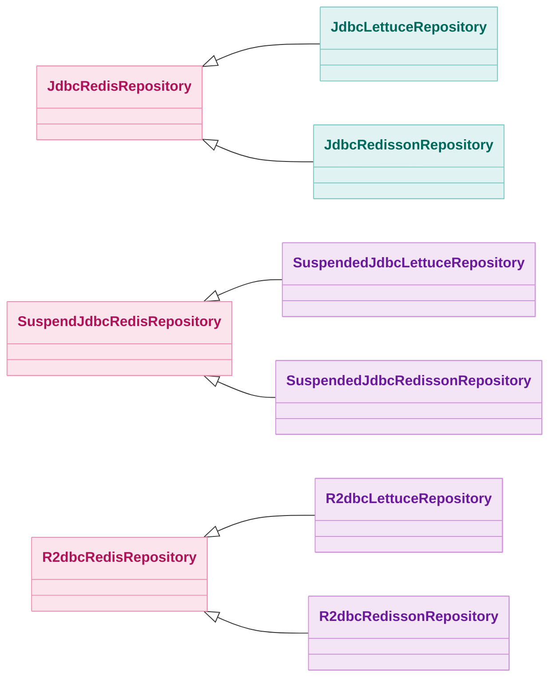
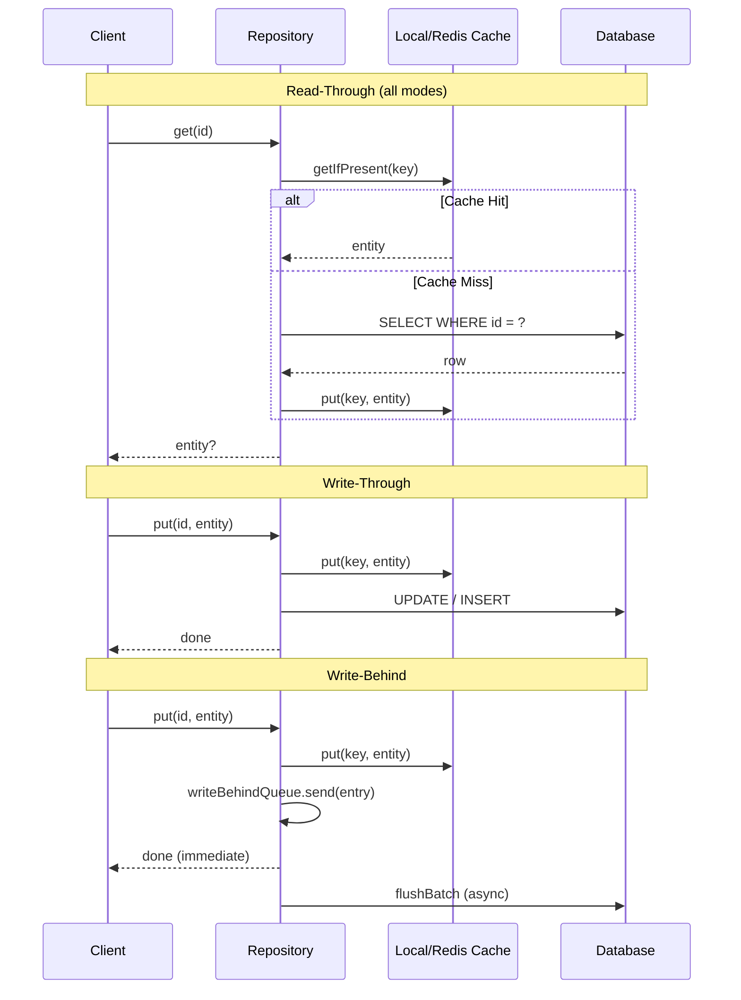

# bluetape4k-exposed-cache

English | [한국어](./README.ko.md)

[](https://central.sonatype.com/artifact/io.github.bluetape4k/bluetape4k-exposed-cache)

## Overview

`bluetape4k-exposed-cache` defines the **core interfaces and shared configuration** for cache-backed Exposed repositories.

It is **cache-backend agnostic** — the same interfaces are implemented by both local cache (Caffeine) and distributed cache (Redis via Lettuce/Redisson) modules. All cache-specific modules depend on this hub module and add only their backend-specific implementation.

## Module Ecosystem

| Module | Cache Backend | Cache Mode | DB Access | Suspend Support |
|--------|--------------|------------|-----------|-----------------|
| `exposed-jdbc-caffeine` | Caffeine (local) | `LOCAL` | JDBC | sync + suspend |
| `exposed-r2dbc-caffeine` | Caffeine (local) | `LOCAL` | R2DBC | suspend only |
| `exposed-jdbc-lettuce` | Redis (Lettuce) | `REMOTE` / `NEAR_CACHE` | JDBC | sync + suspend |
| `exposed-r2dbc-lettuce` | Redis (Lettuce) | `REMOTE` | R2DBC | suspend only |
| `exposed-jdbc-redisson` | Redis (Redisson) | `REMOTE` / `NEAR_CACHE` | JDBC | sync + suspend |
| `exposed-r2dbc-redisson` | Redis (Redisson) | `REMOTE` | R2DBC | suspend only |

## Interface Hierarchy

```mermaid
classDiagram
    direction TB

    class JdbcCacheRepository {
        <<interface>>
        +get(id: ID): E?
        +getAll(ids: Collection~ID~): Map~ID, E~
        +put(id: ID, entity: E)
        +putAll(entities: Map~ID, E~)
        +invalidate(id: ID)
        +invalidateAll(ids: Collection~ID~)
        +clear()
        +containsKey(id: ID): Boolean
        +findByIdFromDb(id: ID): E?
        +findAllFromDb(ids: Collection~ID~): List~E~
        +findAll(...): List~E~
    }
    class JdbcRedisRepository {
        <<interface>>
        +invalidateByPattern(patterns: String, count: Int): Long
    }
    class JdbcCaffeineRepository {
        <<interface>>
        +config: LocalCacheConfig
        +cache: Cache~String, E~
    }
    class SuspendedJdbcCacheRepository {
        <<interface>>
        +get(id: ID): E?
        +put(id: ID, entity: E)
        +invalidate(id: ID)
        +clear()
        +findByIdFromDb(id: ID): E?
        +findAll(...): List~E~
    }
    class SuspendJdbcRedisRepository {
        <<interface>>
        +invalidateByPattern(patterns: String, count: Int): Long
    }
    class SuspendedJdbcCaffeineRepository {
        <<interface>>
        +config: LocalCacheConfig
        +cache: Cache~String, E~
    }
    class R2dbcCacheRepository {
        <<interface>>
        +get(id: ID): E?
        +put(id: ID, entity: E)
        +invalidate(id: ID)
        +clear()
        +findByIdFromDb(id: ID): E?
        +findAll(...): List~E~
    }
    class R2dbcRedisRepository {
        <<interface>>
        +invalidateByPattern(patterns: String, count: Int): Long
    }
    class R2dbcCaffeineRepository {
        <<interface>>
        +config: LocalCacheConfig
        +cache: AsyncCache~String, E~
    }

    JdbcCacheRepository <|-- JdbcRedisRepository
    JdbcCacheRepository <|-- JdbcCaffeineRepository
    SuspendedJdbcCacheRepository <|-- SuspendJdbcRedisRepository
    SuspendedJdbcCacheRepository <|-- SuspendedJdbcCaffeineRepository
    R2dbcCacheRepository <|-- R2dbcRedisRepository
    R2dbcCacheRepository <|-- R2dbcCaffeineRepository

    style JdbcCacheRepository fill:#E3F2FD,stroke:#90CAF9,color:#1565C0
    style JdbcRedisRepository fill:#FCE4EC,stroke:#F48FB1,color:#AD1457
    style JdbcCaffeineRepository fill:#E0F2F1,stroke:#80CBC4,color:#00695C
    style SuspendedJdbcCacheRepository fill:#E3F2FD,stroke:#90CAF9,color:#1565C0
    style SuspendJdbcRedisRepository fill:#FCE4EC,stroke:#F48FB1,color:#AD1457
    style SuspendedJdbcCaffeineRepository fill:#E0F2F1,stroke:#80CBC4,color:#00695C
    style R2dbcCacheRepository fill:#E3F2FD,stroke:#90CAF9,color:#1565C0
    style R2dbcRedisRepository fill:#FCE4EC,stroke:#F48FB1,color:#AD1457
    style R2dbcCaffeineRepository fill:#F3E5F5,stroke:#CE93D8,color:#6A1B9A
```



Redis-specific sub-interfaces (Lettuce and Redisson) extend the Redis interfaces:



## CacheMode

| Value | Description |
|-------|-------------|
| `LOCAL` | In-process cache only (Caffeine). Fastest, but not shared across JVM processes. |
| `REMOTE` | Remote cache only (Redis). Shared across all instances. |
| `NEAR_CACHE` | L1 local cache + L2 Redis. Minimizes network round-trips; supported by Lettuce/Redisson modules. |

## CacheWriteMode

| Value | Read | Write |
|-------|------|-------|
| `READ_ONLY` | Read-through: cache miss loads from DB and caches | Cache only — no DB writes |
| `WRITE_THROUGH` | Read-through | Cache + DB written synchronously |
| `WRITE_BEHIND` | Read-through | Cache written immediately; DB written asynchronously in batches |

## LocalCacheConfig

Configuration for local (in-process) cache implementations. Caffeine modules use this directly; Redis modules use it as the L1 near-cache configuration.

| Property | Default | Description |
|----------|---------|-------------|
| `keyPrefix` | `"local"` | Cache key prefix |
| `maximumSize` | `10_000` | Maximum number of cache entries |
| `expireAfterWrite` | `10 minutes` | TTL from last write |
| `expireAfterAccess` | `null` (disabled) | TTL from last access |
| `writeMode` | `READ_ONLY` | Write strategy (`READ_ONLY` / `WRITE_THROUGH` / `WRITE_BEHIND`) |
| `writeBehindBatchSize` | `100` | Write-Behind flush batch size |
| `writeBehindQueueCapacity` | `10_000` | Write-Behind queue capacity (must not be unlimited) |

**Predefined constants**:

```kotlin
LocalCacheConfig.READ_ONLY      // writeMode = READ_ONLY
LocalCacheConfig.WRITE_THROUGH  // writeMode = WRITE_THROUGH
LocalCacheConfig.WRITE_BEHIND   // writeMode = WRITE_BEHIND
```

## RedisRepositoryResilienceConfig

Optional resilience configuration for Redis-backed repositories. Pass `null` (the default) to disable resilience wrapping.

| Property | Default | Description |
|----------|---------|-------------|
| `retryMaxAttempts` | `3` | Maximum retry attempts on Redis failure |
| `retryWaitDuration` | `500ms` | Wait time between retries |
| `retryExponentialBackoff` | `true` | Use exponential backoff for retries |
| `circuitBreakerEnabled` | `false` | Enable Circuit Breaker |
| `timeoutDuration` | `2s` | Redis operation timeout |

## Write Strategy Patterns



## testFixtures Scenarios

`exposed-cache` ships testFixtures with reusable scenario classes that all implementing modules inherit for consistency.

| Scenario class | Interface tested | Covered scenarios |
|----------------|-----------------|-------------------|
| `JdbcCacheTestScenario` | `JdbcCacheRepository` | Read-through, Write-through, Write-behind, invalidate |
| `JdbcReadThroughScenario` | `JdbcCacheRepository` | Cache miss → DB load, cache hit, getAll partial miss |
| `JdbcWriteThroughScenario` | `JdbcCacheRepository` | put / putAll → DB updated immediately |
| `JdbcWriteBehindScenario` | `JdbcCacheRepository` | put → cache immediate, DB flushed asynchronously |
| `SuspendedJdbcCacheTestScenario` | `SuspendedJdbcCacheRepository` | Same as above, suspend variants |
| `SuspendedJdbcReadThroughScenario` | `SuspendedJdbcCacheRepository` | suspend read-through scenarios |
| `SuspendedJdbcWriteThroughScenario` | `SuspendedJdbcCacheRepository` | suspend write-through scenarios |
| `SuspendedJdbcWriteBehindScenario` | `SuspendedJdbcCacheRepository` | suspend write-behind scenarios |
| `R2dbcCacheTestScenario` | `R2dbcCacheRepository` | R2DBC full scenario suite |
| `R2dbcReadThroughScenario` | `R2dbcCacheRepository` | R2DBC read-through |
| `R2dbcWriteThroughScenario` | `R2dbcCacheRepository` | R2DBC write-through |
| `R2dbcWriteBehindScenario` | `R2dbcCacheRepository` | R2DBC write-behind |

**Reuse in tests**:

```kotlin
// testFixtures dependency in build.gradle.kts
testImplementation(testFixtures("io.github.bluetape4k:bluetape4k-exposed-cache:$version"))

// Extend the scenario in your module test
class MyCaffeineReadThroughTest : JdbcReadThroughScenario() {
    override val repo = ActorCaffeineRepository(LocalCacheConfig.WRITE_THROUGH)
}
```

## When to Use Which Module

| Scenario | Recommended Module |
|----------|--------------------|
| Single instance, no Redis | `exposed-jdbc-caffeine` / `exposed-r2dbc-caffeine` |
| Distributed cache, Redis available | `exposed-jdbc-lettuce` / `exposed-r2dbc-lettuce` |
| L1 local + L2 Redis NearCache | `exposed-jdbc-lettuce` (nearCacheEnabled=true) |
| R2DBC + Redis | `exposed-r2dbc-lettuce` / `exposed-r2dbc-redisson` |
| Pattern-based cache invalidation needed | Any Redis module (`invalidateByPattern`) |
| Redisson features (distributed locks, etc.) | `exposed-jdbc-redisson` / `exposed-r2dbc-redisson` |

## Module Links

- [exposed-jdbc-caffeine](../exposed-jdbc-caffeine/README.md) — JDBC + Caffeine local cache
- [exposed-r2dbc-caffeine](../exposed-r2dbc-caffeine/README.md) — R2DBC + Caffeine local cache
- [exposed-jdbc-lettuce](../exposed-jdbc-lettuce/README.md) — JDBC + Lettuce Redis cache
- [exposed-r2dbc-lettuce](../exposed-r2dbc-lettuce/README.md) — R2DBC + Lettuce Redis cache

## Dependency

```kotlin
dependencies {
    api("io.github.bluetape4k:bluetape4k-exposed-cache:$version")
}
```
