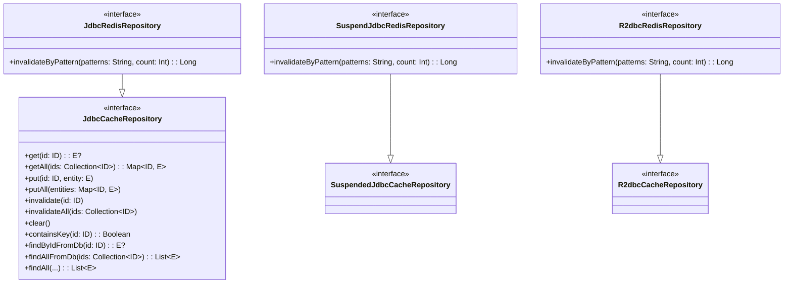

# Module bluetape4k-exposed-cache

[](https://central.sonatype.com/artifact/io.github.bluetape4k/bluetape4k-exposed-cache)

## Overview

`bluetape4k-exposed-cache` defines the **core interfaces and common configuration** for cache-backed Exposed repositories.

It is **cache-backend agnostic** — the same interfaces are implemented by both local cache (Caffeine) and remote cache (Redis via Lettuce/Redisson) modules.

## Architecture



## Features

- **Cache-backend agnostic interfaces**: `JdbcCacheRepository`, `SuspendedJdbcCacheRepository`, `R2dbcCacheRepository`
- **Redis-specific sub-interfaces**: `JdbcRedisRepository`, `SuspendJdbcRedisRepository`, `R2dbcRedisRepository` — adds `invalidateByPattern`
- **`CacheMode`**: `LOCAL` (Caffeine/Cache2k), `REMOTE` (Redis), `NEAR_CACHE` (L1+L2)
- **`CacheWriteMode`**: `READ_ONLY`, `WRITE_THROUGH`, `WRITE_BEHIND`
- **`LocalCacheConfig`**: Common configuration for local cache implementations — extensible via inheritance
- **`RedisRepositoryResilienceConfig`**: Optional resilience configuration for Redis-backed repositories
- **testFixtures**: Reusable cache scenario tests for all implementations

## Modules

| Module | Cache Backend | Interface |
|--------|--------------|-----------|
| `exposed-jdbc-lettuce` | Lettuce Redis | `JdbcRedisRepository` |
| `exposed-jdbc-redisson` | Redisson Redis | `JdbcRedisRepository` |
| `exposed-r2dbc-lettuce` | Lettuce Redis | `R2dbcRedisRepository` |
| `exposed-r2dbc-redisson` | Redisson Redis | `R2dbcRedisRepository` |
| `exposed-jdbc-caffeine` | Caffeine (local) | `JdbcCacheRepository` |
| `exposed-r2dbc-caffeine` | Caffeine (local) | `R2dbcCacheRepository` |

## Dependency

```kotlin
dependencies {
    api("io.github.bluetape4k:bluetape4k-exposed-cache:$version")
}
```

## Usage

### Implementing a Cache Repository

```kotlin
class ActorCaffeineRepository(
    config: LocalCacheConfig = LocalCacheConfig.WRITE_THROUGH,
) : AbstractJdbcCaffeineRepository<Long, ActorRecord>(config) {
    override val table = ActorTable
    override fun ResultRow.toEntity() = ActorRecord(this[ActorTable.id].value, this[ActorTable.name])
    override fun UpdateStatement.updateEntity(entity: ActorRecord) { this[ActorTable.name] = entity.name }
    override fun BatchInsertStatement.insertEntity(entity: ActorRecord) { this[ActorTable.name] = entity.name }
    override fun extractId(entity: ActorRecord) = entity.id
}
```
