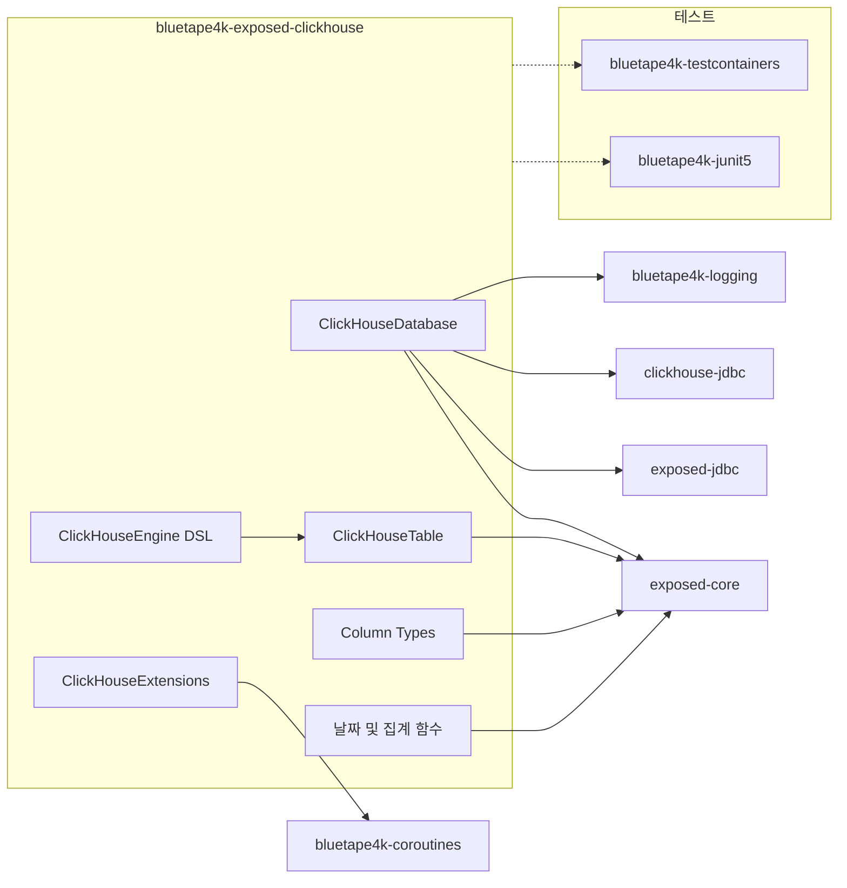
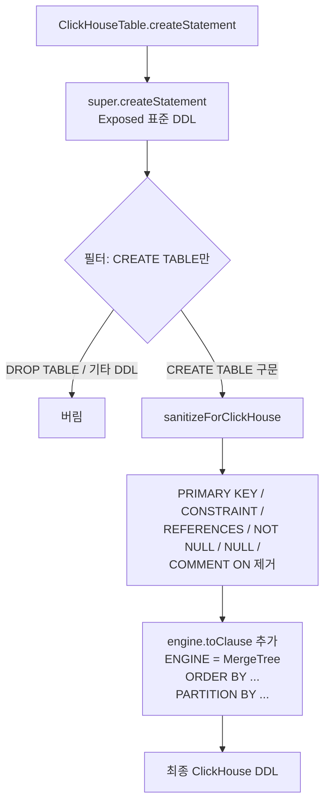

한국어 | [English](./README.md)

# bluetape4k-exposed-clickhouse

ClickHouse JDBC를 위한 Kotlin/Exposed 다이얼렉트 — 타입 안전 DSL, MergeTree 엔진 설정, ClickHouse 전용 컬럼 타입, 코루틴 친화 헬퍼를 제공합니다.

## 아키텍처



## 주요 기능

- **ClickHouseDatabase** — `connect(host, port, database)` 및 `connect(jdbcUrl)` 팩토리 함수로 JDBC 연결 설정
- **ClickHouseTable** — `engine: ClickHouseEngine` 파라미터를 받는 추상 기본 클래스; DDL 정제 및 ENGINE 절 주입 처리
- **MergeTree 엔진 DSL** — `mergeTree {}`, `replacingMergeTree {}`, `summingMergeTree {}`, `aggregatingMergeTree {}`, `Log`, `TinyLog`, `Memory` 타입 안전 DSL
- **풍부한 컬럼 타입** — `String`, `FixedString(N)`, `Int8`–`Int64`, `UInt8`–`UInt64`, `Float32/64`, `DateTime64`, `Date32`, `LowCardinality(T)`, `Array(T)`, `Nullable(T)`
- **날짜 함수** — `toYYYYMM()`, `dateDiff(unit, start, end)`, `toStartOfInterval()`
- **집계 함수** — `argMax()`, `argMin()`, `quantile(level)()`, `uniq()`, `uniqExact()`
- **코루틴 헬퍼** — 논블로킹 DB 접근을 위한 `suspendTransaction {}`, 스트리밍 쿼리 결과를 `Flow<T>`로 반환하는 `queryFlow {}`

## 빠른 시작

```kotlin
// 1. ClickHouse 연결
val database = ClickHouseDatabase.connect(
    host = "localhost",
    port = 8123,
    database = "analytics"
)

// 2. 테이블 정의
object EventsTable : ClickHouseTable("events", engine = mergeTree {
    orderBy("event_date, user_id")
    partitionBy("toYYYYMM(event_date)")
}) {
    val eventDate = date32("event_date")
    val userId    = chInt64("user_id")
    val eventType = lowCardinalityString("event_type")
    val value     = chFloat64("value")
}

// 3. 스키마 생성
transaction(database) {
    SchemaUtils.create(EventsTable)
}

// 4. 배치 삽입
transaction(database) {
    EventsTable.batchInsert(events) { e ->
        this[EventsTable.eventDate]  = e.date
        this[EventsTable.userId]     = e.userId
        this[EventsTable.eventType]  = e.type
        this[EventsTable.value]      = e.value
    }
}

// 5. 코루틴 쿼리 (논블로킹)
val results = suspendTransaction(database) {
    EventsTable
        .select(EventsTable.userId, EventsTable.value.sum())
        .groupBy(EventsTable.userId)
        .toList()
}
```

## 컬럼 타입

| ClickHouse 타입 | Kotlin 타입 | 빌더 |
|----------------|-------------|------|
| String | String | `chString(name)` |
| FixedString(N) | String | `fixedString(name, n)` |
| Int8 | Byte | `chInt8(name)` |
| Int16 | Short | `chInt16(name)` |
| Int32 | Int | `chInt32(name)` |
| Int64 | Long | `chInt64(name)` |
| UInt8 | UByte | `chUByte(name)` |
| UInt16 | UShort | `chUShort(name)` |
| UInt32 | UInt | `chUInt(name)` |
| UInt64 | ULong | `chULong(name)` |
| UInt64 | BigInteger | `chUInt64BigInt(name)` |
| Float32 | Float | `chFloat32(name)` |
| Float64 | Double | `chFloat64(name)` |
| DateTime64(n) | Instant | `dateTime64(name, precision)` |
| Date32 | LocalDate | `date32(name)` |
| LowCardinality(T) | T | `lowCardinality(name, innerType)` / `lowCardinalityString(name)` |
| Array(T) | List\<T\> | `chArray(name, innerType)` |
| Nullable(T) | T? | `chNullable(name, innerType)` |

## 엔진 DSL

```kotlin
// MergeTree — 완전한 제어
val engine1 = mergeTree {
    orderBy("event_date, user_id")
    partitionBy("toYYYYMM(event_date)")
    primaryKey("event_date")
    settings("index_granularity = 8192")
}

// ReplacingMergeTree — 버전 컬럼을 이용한 중복 제거
val engine2 = replacingMergeTree {
    orderBy("id")
    versionColumn("updated_at")
}

// SummingMergeTree — 사전 집계
val engine3 = summingMergeTree {
    orderBy("category, event_date")
    sumColumns("amount", "count")
}

// AggregatingMergeTree — 구체화된 뷰용
val engine4 = aggregatingMergeTree {
    orderBy("id")
    partitionBy("toYYYYMM(ts)")
}

// 경량 엔진
val logEngine    = ClickHouseEngine.Log
val tinyLog      = ClickHouseEngine.TinyLog
val memoryEngine = ClickHouseEngine.Memory
```

## 날짜 및 집계 함수

```kotlin
transaction(database) {
    // toYYYYMM — 연월 정수 추출
    EventsTable
        .select(toYYYYMM(EventsTable.eventDate).alias("month"), EventsTable.value.sum())
        .groupBy(toYYYYMM(EventsTable.eventDate))
        .toList()

    // dateDiff — 두 날짜의 차이
    val diff = dateDiff("day", EventsTable.eventDate, EventsTable.eventDate)

    // toStartOfInterval — 인터벌 경계로 내림
    val monthly = toStartOfInterval(EventsTable.eventDate, "1 MONTH")

    // argMax — 다른 컬럼이 최대일 때의 값
    val latestValue = argMax(EventsTable.value, EventsTable.eventDate)

    // quantile — 근사 분위수
    val p95 = quantile(0.95)(EventsTable.value)

    // uniq — HyperLogLog 카디널리티 추정
    val approxUniq = uniq(EventsTable.userId)

    // uniqExact — 정확한 카디널리티
    val exactUniq = uniqExact(EventsTable.userId)
}
```

## DDL 생성 흐름



## 주의사항

1. **트랜잭션 원자성 없음** — `ClickHouseConnectionWrapper`에서 `commit()`과 `rollback()`은 no-op입니다. 실패 전에 실행된 DML은 **롤백되지 않습니다**. 멱등 삽입이나 ReplacingMergeTree를 이용한 중복 제거로 설계하세요.

2. **`modifyColumn` 미지원** — `alterTable { modifyColumn(...) }`은 빈 리스트를 반환합니다. 컬럼 타입 변경은 ClickHouse 네이티브 DDL로 직접 처리해야 합니다.

3. **JDBC 전용, R2DBC 미지원** — 이 모듈은 JDBC 기반입니다. R2DBC/리액티브 통합은 지원하지 않습니다.

4. **`LowCardinality` 래핑 순서** — ClickHouse는 `Nullable(LowCardinality(T))`를 지원하지 않습니다. 반드시 `LowCardinality(Nullable(T))` 순서를 사용하세요.

5. **HikariCP 설정** — `autoCommit=true`가 강제됩니다. 불필요한 연결 낭비를 막으려면 `minimumIdle=1`을 설정하세요.

6. **DDL에서 PRIMARY KEY 미지원** — `CREATE TABLE`에서 `PRIMARY KEY`와 `CONSTRAINT` 절이 제거됩니다. 엔진 DSL의 `ORDER BY`를 사용해 물리적 정렬 키를 정의하세요.

7. **컬럼 코멘트 제거** — `COMMENT ON COLUMN` 구문은 DDL 필터에 의해 제거되어 효과가 없습니다.

## 라이선스

Apache License 2.0 — 자세한 내용은 [LICENSE](../../LICENSE)를 참조하세요.
