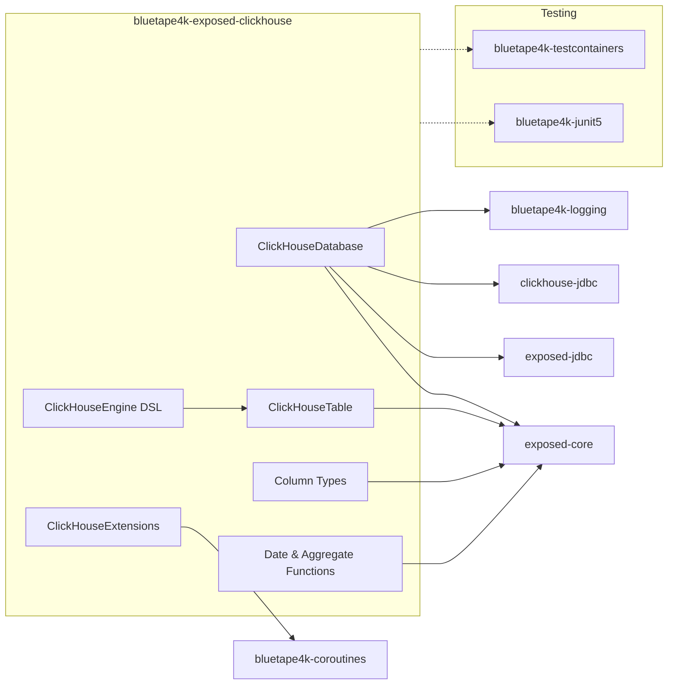
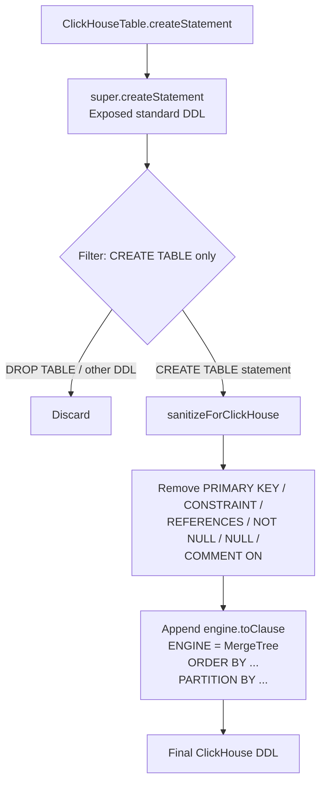

[한국어](./README.ko.md) | English

# bluetape4k-exposed-clickhouse

Kotlin/Exposed dialect for ClickHouse JDBC — brings type-safe DSL, MergeTree engine configuration, ClickHouse-specific column types, and coroutine-friendly helpers to your ClickHouse-backed applications.

## Architecture



## Features

- **ClickHouseDatabase** — factory functions `connect(host, port, database)` and `connect(jdbcUrl)` for JDBC connection setup
- **ClickHouseTable** — abstract base class with `engine: ClickHouseEngine` parameter; handles DDL sanitization and ENGINE clause injection
- **MergeTree Engine DSL** — type-safe DSL for `mergeTree {}`, `replacingMergeTree {}`, `summingMergeTree {}`, `aggregatingMergeTree {}`, `Log`, `TinyLog`, `Memory`
- **Rich Column Types** — `String`, `FixedString(N)`, `Int8`–`Int64`, `UInt8`–`UInt64`, `Float32/64`, `DateTime64`, `Date32`, `LowCardinality(T)`, `Array(T)`, `Nullable(T)`
- **Date Functions** — `toYYYYMM()`, `dateDiff(unit, start, end)`, `toStartOfInterval()`
- **Aggregate Functions** — `argMax()`, `argMin()`, `quantile(level)()`, `uniq()`, `uniqExact()`
- **Coroutine Helpers** — `suspendTransaction {}` for non-blocking DB access, `queryFlow {}` for streaming query results as `Flow<T>`

## Quick Start

```kotlin
// 1. Connect to ClickHouse
val database = ClickHouseDatabase.connect(
    host = "localhost",
    port = 8123,
    database = "analytics"
)

// 2. Define a table
object EventsTable : ClickHouseTable("events", engine = mergeTree {
    orderBy("event_date, user_id")
    partitionBy("toYYYYMM(event_date)")
}) {
    val eventDate = date32("event_date")
    val userId    = chInt64("user_id")
    val eventType = lowCardinalityString("event_type")
    val value     = chFloat64("value")
}

// 3. Create schema
transaction(database) {
    SchemaUtils.create(EventsTable)
}

// 4. Batch insert
transaction(database) {
    EventsTable.batchInsert(events) { e ->
        this[EventsTable.eventDate]  = e.date
        this[EventsTable.userId]     = e.userId
        this[EventsTable.eventType]  = e.type
        this[EventsTable.value]      = e.value
    }
}

// 5. Coroutine query (non-blocking)
val results = suspendTransaction(database) {
    EventsTable
        .select(EventsTable.userId, EventsTable.value.sum())
        .groupBy(EventsTable.userId)
        .toList()
}
```

## Column Types

| ClickHouse Type | Kotlin Type | Builder |
|----------------|-------------|---------|
| String | String | `chString(name)` |
| FixedString(N) | String | `fixedString(name, n)` |
| Int8 | Byte | `chInt8(name)` |
| Int16 | Short | `chInt16(name)` |
| Int32 | Int | `chInt32(name)` |
| Int64 | Long | `chInt64(name)` |
| UInt8 | UByte | `chUByte(name)` |
| UInt16 | UShort | `chUShort(name)` |
| UInt32 | UInt | `chUInt(name)` |
| UInt64 | ULong | `chULong(name)` |
| UInt64 | BigInteger | `chUInt64BigInt(name)` |
| Float32 | Float | `chFloat32(name)` |
| Float64 | Double | `chFloat64(name)` |
| DateTime64(n) | Instant | `dateTime64(name, precision)` |
| Date32 | LocalDate | `date32(name)` |
| LowCardinality(T) | T | `lowCardinality(name, innerType)` / `lowCardinalityString(name)` |
| Array(T) | List\<T\> | `chArray(name, innerType)` |
| Nullable(T) | T? | `chNullable(name, innerType)` |

## Engine DSL

```kotlin
// MergeTree — full control
val engine1 = mergeTree {
    orderBy("event_date, user_id")
    partitionBy("toYYYYMM(event_date)")
    primaryKey("event_date")
    settings("index_granularity = 8192")
}

// ReplacingMergeTree — deduplication with version column
val engine2 = replacingMergeTree {
    orderBy("id")
    versionColumn("updated_at")
}

// SummingMergeTree — pre-aggregation
val engine3 = summingMergeTree {
    orderBy("category, event_date")
    sumColumns("amount", "count")
}

// AggregatingMergeTree — for materialized views
val engine4 = aggregatingMergeTree {
    orderBy("id")
    partitionBy("toYYYYMM(ts)")
}

// Lightweight engines
val logEngine    = ClickHouseEngine.Log
val tinyLog      = ClickHouseEngine.TinyLog
val memoryEngine = ClickHouseEngine.Memory
```

## Date & Aggregate Functions

```kotlin
transaction(database) {
    // toYYYYMM — extract year-month integer
    EventsTable
        .select(toYYYYMM(EventsTable.eventDate).alias("month"), EventsTable.value.sum())
        .groupBy(toYYYYMM(EventsTable.eventDate))
        .toList()

    // dateDiff — difference between two dates
    val diff = dateDiff("day", EventsTable.eventDate, EventsTable.eventDate)

    // toStartOfInterval — floor to interval boundary
    val monthly = toStartOfInterval(EventsTable.eventDate, "1 MONTH")

    // argMax — value at maximum of another column
    val latestValue = argMax(EventsTable.value, EventsTable.eventDate)

    // quantile — approximate quantile
    val p95 = quantile(0.95)(EventsTable.value)

    // uniq — HyperLogLog cardinality estimate
    val approxUniq = uniq(EventsTable.userId)

    // uniqExact — exact cardinality
    val exactUniq = uniqExact(EventsTable.userId)
}
```

## DDL Flow



## Caveats

1. **No transaction atomicity** — `commit()` and `rollback()` are no-ops in `ClickHouseConnectionWrapper`. DML statements that execute before a failure are **not** rolled back. Design accordingly (idempotent inserts, deduplication via ReplacingMergeTree).

2. **`modifyColumn` not supported** — `alterTable { modifyColumn(...) }` returns an empty list; column type changes must be handled manually via native ClickHouse DDL.

3. **JDBC-only, no R2DBC** — this module is JDBC-based. R2DBC/reactive integration is not available.

4. **`LowCardinality` wrapping order** — ClickHouse does not support `Nullable(LowCardinality(T))`. Always use `LowCardinality(Nullable(T))` order.

5. **HikariCP configuration** — `autoCommit=true` is enforced. Set `minimumIdle=1` to avoid unnecessary connection churn.

6. **No PRIMARY KEY in DDL** — `CREATE TABLE` strips `PRIMARY KEY` and `CONSTRAINT` clauses. Use `ORDER BY` in the engine DSL to define the physical sort key.

7. **Column comments stripped** — `COMMENT ON COLUMN` statements are removed by the DDL filter and have no effect.

## License

Apache License 2.0 — see [LICENSE](../../LICENSE) for details.
