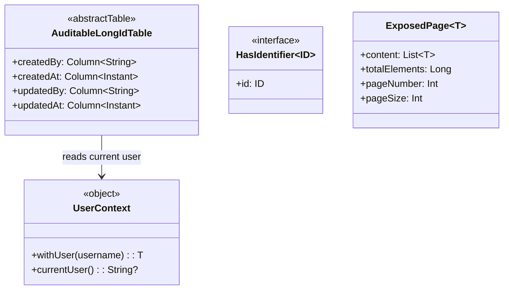
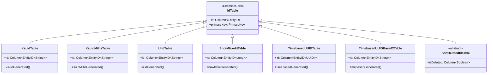
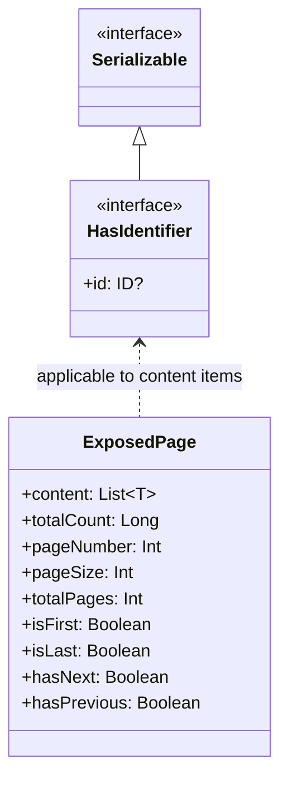
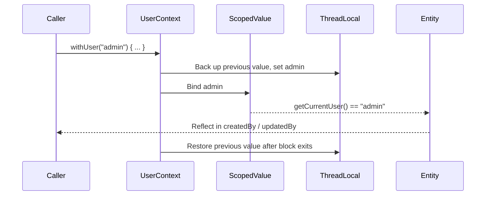

# Module bluetape4k-exposed-core

English | [한국어](./README.ko.md)

A foundation module that provides core column types, extension functions, and common Repository interfaces for JetBrains Exposed. It has no JDBC dependency, making it shareable across R2DBC, serialization, encryption, and other higher-level modules.

## Overview

`bluetape4k-exposed-core` provides:

- **Custom column types
  **: Binary/Blob columns backed by compression (LZ4/Snappy/Zstd), encryption, and serialization (Kryo/Fory)
- **Network column types**: IPv4/IPv6 addresses (`inetAddress`), CIDR blocks (`cidr`), PostgreSQL `<<` operator
- **Phone number column types**: E.164-normalized storage (`phoneNumber`,
  `phoneNumberString`) based on Google libphonenumber
- **Column extension functions**: Client-side ID generation (`timebasedGenerated`, `snowflakeGenerated`,
  `ksuidGenerated`, `ulidGenerated`, etc.)
- **ResultRow extensions**: Helpers like `getOrNull` and `toMap`
- **Blob extensions**: Utility functions for `ExposedBlob`
- **Batch insert**: `BatchInsertOnConflictDoNothing` (ignore-duplicate batch insert)
- **Common interfaces**: `HasIdentifier<ID>`, `ExposedPage<T>`

## Adding Dependencies

```kotlin
dependencies {
    implementation("io.github.bluetape4k:bluetape4k-exposed-core:${version}")

    // For compressed column types
    implementation("io.github.bluetape4k:bluetape4k-io:${version}")

    // For encrypted column types
    implementation("io.github.bluetape4k:bluetape4k-crypto:${version}")

    // For phone number column types (phoneNumber, phoneNumberString)
    implementation("com.googlecode.libphonenumber:libphonenumber:8.13.52")
}
```

## Basic Usage

### 1. Auto-generated client-side ID columns

```kotlin
import io.bluetape4k.exposed.core.ksuidGenerated
import io.bluetape4k.exposed.core.snowflakeGenerated
import io.bluetape4k.exposed.core.timebasedGenerated
import org.jetbrains.exposed.v1.core.dao.id.IntIdTable

object Orders: IntIdTable("orders") {
    // Auto-generate a Timebased UUID on the client side
    val trackingId = javaUUID("tracking_id").timebasedGenerated()

    // Auto-generate a Snowflake ID on the client side
    val snowflakeId = long("snowflake_id").snowflakeGenerated()

    // Auto-generate a KSUID on the client side
    val ksuid = varchar("ksuid", 27).ksuidGenerated()

    // Auto-generate a StatefulMonotonic ULID
    val ulid = varchar("ulid", 26).ulidGenerated()

    val name = varchar("name", 255)
}
```

### 2. Compressed column types

```kotlin
import io.bluetape4k.exposed.core.compress.compressedBinary
import io.bluetape4k.exposed.core.compress.compressedBlob
import io.bluetape4k.io.compressor.Compressors
import org.jetbrains.exposed.v1.core.dao.id.LongIdTable

object Documents: LongIdTable("documents") {
    val title = varchar("title", 255)

    // Store as Binary with LZ4 compression
    val contentLz4 = compressedBinary("content_lz4", 65535, Compressors.LZ4)

    // Store as Blob with Zstd compression
    val contentZstd = compressedBlob("content_zstd", Compressors.Zstd).nullable()
}
```

### 3. Encrypted column types

```kotlin
import io.bluetape4k.exposed.core.encrypt.encryptedVarChar
import io.bluetape4k.exposed.core.encrypt.encryptedBinary
import io.bluetape4k.crypto.encrypt.Encryptors
import org.jetbrains.exposed.v1.core.dao.id.LongIdTable

object Users: LongIdTable("users") {
    val name = varchar("name", 100)

    // Store as AES-encrypted varchar
    val ssn = encryptedVarChar("ssn", 512, Encryptors.AES)

    // Store as encrypted Binary
    val secret = encryptedBinary("secret", 1024, Encryptors.AES).nullable()
}
```

### 4. Serialized column types

```kotlin
import io.bluetape4k.exposed.core.serializable.binarySerializedBinary
import io.bluetape4k.io.serializer.BinarySerializers
import org.jetbrains.exposed.v1.core.dao.id.LongIdTable

data class UserProfile(val age: Int, val tags: List<String>)

object Users: LongIdTable("users") {
    val name = varchar("name", 100)

    // Store as Kryo-serialized Binary
    val profile = binarySerializedBinary<UserProfile>(
        "profile", 4096, BinarySerializers.Kryo
    ).nullable()
}
```

### 5. Network address column types

```kotlin
import io.bluetape4k.exposed.core.inet.inetAddress
import io.bluetape4k.exposed.core.inet.cidr
import io.bluetape4k.exposed.core.inet.isContainedBy
import org.jetbrains.exposed.v1.core.dao.id.LongIdTable
import java.net.InetAddress

object Networks : LongIdTable("networks") {
    val ip = inetAddress("ip")        // PostgreSQL: INET, others: VARCHAR(45)
    val network = cidr("network")     // PostgreSQL: CIDR, others: VARCHAR(50)
}

// PostgreSQL-only << operator (checks if an IP is contained within a CIDR)
Networks.selectAll()
    .where { Networks.ip.isContainedBy(Networks.network) }
```

### 6. Phone number column types

```kotlin
import io.bluetape4k.exposed.core.phone.phoneNumber
import io.bluetape4k.exposed.core.phone.phoneNumberString
import org.jetbrains.exposed.v1.core.dao.id.LongIdTable

// Dependency: com.googlecode.libphonenumber:libphonenumber

object Contacts : LongIdTable("contacts") {
    val phone = phoneNumber("phone")              // PhoneNumber object, stored as E.164
    val phoneStr = phoneNumberString("phone_str") // Normalized to E.164 string
}

// Stored: "010-1234-5678" → "+821012345678"
```

### 7. Ignore-duplicate batch insert

```kotlin
import io.bluetape4k.exposed.core.BatchInsertOnConflictDoNothing
import org.jetbrains.exposed.v1.jdbc.statements.BatchInsertBlockingExecutable

val executable = BatchInsertBlockingExecutable(
    statement = BatchInsertOnConflictDoNothing(MyTable)
)
executable.run {
    statement.addBatch()
    statement[MyTable.uniqueKey] = "key1"
    execute(transaction)
}
```

### 8. HasIdentifier interface

```kotlin
import io.bluetape4k.exposed.core.HasIdentifier

// Common interface for entities that have an ID
data class UserRecord(
    override val id: Long,
    val name: String,
    val email: String
): HasIdentifier<Long>
```

### 9. ExposedPage (paginated results)

```kotlin
import io.bluetape4k.exposed.core.ExposedPage

// Wrapper for paginated results
val page: ExposedPage<UserRecord> = ExposedPage(
    content = users,
    totalCount = 100L,
    pageNumber = 0,
    pageSize = 20
)

println("Total pages: ${page.totalPages}")
println("Is last page: ${page.isLast}")
```

## Diagrams

### Core Auditable Structure

Illustrates the relationships among `AuditableLongIdTable`, `UserContext`, `HasIdentifier`, and `ExposedPage`.



### Custom Column Type Hierarchy

Compressed, encrypted, and serialized column types are consistently structured around `ColumnWithTransform`.


### IdTable Hierarchy by ID Generation Strategy

Custom `IdTable` implementations that generate IDs on the client side.



### HasIdentifier and ExposedPage



## Key Files and Classes

| File                                               | Description                                        |
|----------------------------------------------------|----------------------------------------------------|
| `HasIdentifier.kt`                                 | Common interface for entities with an ID           |
| `ColumnExtensions.kt`                              | Client-side ID auto-generation extension functions |
| `ExposedColumnSupports.kt`                         | Column type support utilities                      |
| `ResultRowExtensions.kt`                           | ResultRow processing extensions                    |
| `BatchInsertOnConflictDoNothing.kt`                | Ignore-duplicate batch insert                      |
| `statements/api/ExposedBlobExtensions.kt`          | ExposedBlob utility functions                      |
| `compress/CompressedBinaryColumnType.kt`           | Compressed Binary column type                      |
| `compress/CompressedBlobColumnType.kt`             | Compressed Blob column type                        |
| `encrypt/EncryptedVarCharColumnType.kt`            | Encrypted VarChar column type                      |
| `encrypt/EncryptedBinaryColumnType.kt`             | Encrypted Binary column type                       |
| `encrypt/EncryptedBlobColumnType.kt`               | Encrypted Blob column type                         |
| `serializable/BinarySerializedBinaryColumnType.kt` | Serialized Binary column type                      |
| `serializable/BinarySerializedBlobColumnType.kt`   | Serialized Blob column type                        |
| `ExposedPage.kt`                                   | Paginated result data class                        |
| `dao/id/KsuidTable.kt`                             | KSUID primary key table                            |
| `dao/id/KsuidMillisTable.kt`                       | KsuidMillis primary key table                      |
| `dao/id/UlidTable.kt`                              | ULID primary key table                             |
| `dao/id/SnowflakeIdTable.kt`                       | Snowflake Long primary key table                   |
| `dao/id/TimebasedUUIDTable.kt`                     | UUIDv7 primary key table                           |
| `dao/id/TimebasedUUIDBase62Table.kt`               | UUIDv7 Base62-encoded primary key table            |
| `dao/id/SoftDeletedIdTable.kt`                     | Soft-delete primary key table                      |
| `inet/InetColumnTypes.kt`                          | IPv4/IPv6 and CIDR column types                    |
| `inet/InetExtensions.kt`                           | `inetAddress`, `cidr`, `isContainedBy` extensions  |
| `phone/PhoneNumberColumnType.kt`                   | Phone number column type (E.164 normalization)     |
| `phone/PhoneNumberExtensions.kt`                   | `phoneNumber`, `phoneNumberString` extensions      |

## Auditable (Audit Tracking)

The `Auditable` interface and
`AuditableIdTable` automatically track the creator, creation time, modifier, and modification time for every entity.

### Auditable Interface

```kotlin
import io.bluetape4k.exposed.core.auditable.Auditable
import java.time.Instant

interface Auditable {
    val createdBy: String        // Set automatically on INSERT (default: "system")
    val createdAt: Instant?      // Set to DB CURRENT_TIMESTAMP on INSERT
    val updatedBy: String?       // Set automatically on UPDATE
    val updatedAt: Instant?      // Set to DB CURRENT_TIMESTAMP on UPDATE
}
```

### UserContext — Managing the Current User

A context object that propagates the current user's name. Supports both Virtual Thread / Structured Concurrency and Coroutines environments.



#### Virtual Thread environment

```kotlin
import io.bluetape4k.exposed.core.auditable.UserContext

UserContext.withUser("admin") {
    // INSERT/UPDATE inside this block will have createdBy/updatedBy = "admin"
    userRepository.save(entity)
}
```

Nested `withUser(...)` calls are safe — the outer user context is restored when the inner block exits.

#### Coroutines environment

```kotlin
UserContext.withThreadLocalUser("admin") {
    // Use the ThreadLocal-specific method in a Coroutines context
    userRepository.save(entity)
}
```

#### Retrieving the current user

```kotlin
val user = UserContext.getCurrentUser()  // Priority: ScopedValue > ThreadLocal > "system"
```

### AuditableIdTable Usage

#### 1. Table definition

```kotlin
import io.bluetape4k.exposed.core.auditable.AuditableLongIdTable
import org.jetbrains.exposed.v1.core.varchar
import org.jetbrains.exposed.v1.core.text

object ArticleTable : AuditableLongIdTable("articles") {
    val title = varchar("title", 255)
    val content = text("content")
    // createdBy, createdAt, updatedBy, updatedAt are added automatically
}
```

#### 2. Column behavior

| Column       | On INSERT                             | On UPDATE                             | Notes                 |
|--------------|---------------------------------------|---------------------------------------|-----------------------|
| `created_by` | Set to `UserContext.getCurrentUser()` | Unchanged                             | Default: "system"     |
| `created_at` | Set to DB `CURRENT_TIMESTAMP`         | Unchanged                             | UTC, nullable         |
| `updated_by` | null                                  | Set to `UserContext.getCurrentUser()` | Managed by Repository |
| `updated_at` | null                                  | Set to DB `CURRENT_TIMESTAMP`         | Managed by Repository |

#### 3. Concrete table classes

| Class                  | Primary key type                         | When to use                 |
|------------------------|------------------------------------------|-----------------------------|
| `AuditableIntIdTable`  | `Int` (auto-increment)                   | Small datasets              |
| `AuditableLongIdTable` | `Long` (auto-increment)                  | Large datasets, distributed |
| `AuditableUUIDTable`   | `java.util.UUID` (client-side generated) | Distributed environments    |

#### 4. Complete example

```kotlin
import io.bluetape4k.exposed.core.auditable.AuditableLongIdTable
import org.jetbrains.exposed.v1.core.varchar
import org.jetbrains.exposed.v1.core.text
import org.jetbrains.exposed.v1.jdbc.transactions.transaction
import org.jetbrains.exposed.v1.jdbc.insert
import io.bluetape4k.exposed.core.auditable.UserContext

object ArticleTable : AuditableLongIdTable("articles") {
    val title = varchar("title", 255)
    val content = text("content")
}

transaction {
    UserContext.withUser("john@example.com") {
        // INSERT: createdBy="john@example.com", createdAt set to current DB time
        ArticleTable.insert {
            it[title] = "Hello Exposed"
            it[content] = "Auditable demo"
        }
    }
}

transaction {
    UserContext.withUser("editor@example.com") {
        // UPDATE: updatedBy="editor@example.com", updatedAt set to current DB time
        // (use auditedUpdateById — see exposed-jdbc)
    }
}
```

### Dependencies

The `exposed-java-time` module is required:

```kotlin
dependencies {
    implementation("io.github.bluetape4k:bluetape4k-exposed-core:${version}")

    // Required for Auditable
    compileOnly("org.jetbrains.exposed:exposed-java-time:${exposedVersion}")
}
```

## Testing

```bash
./gradlew :bluetape4k-exposed-core:test
```

## References

- [JetBrains Exposed](https://github.com/JetBrains/Exposed)
- [bluetape4k-io (compression/serialization)](../../../io/io)
- [bluetape4k-crypto (encryption)](../../../io/crypto)
- [bluetape4k-idgenerators (ID generation)](../../../utils/idgenerators)
