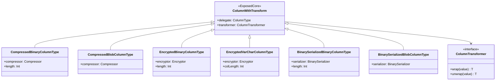
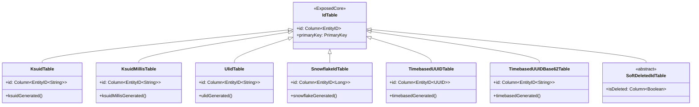
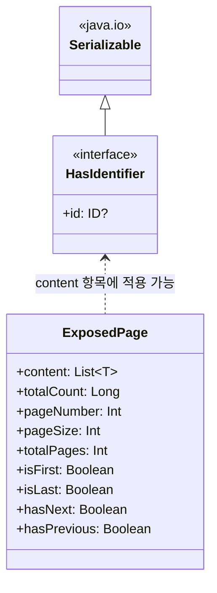
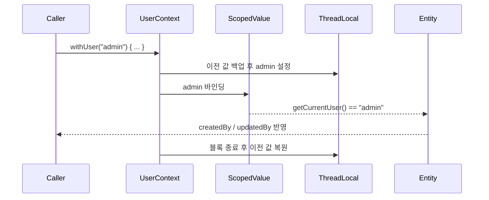

# Module bluetape4k-exposed-core

JetBrains Exposed의 핵심 컬럼 타입, 확장 함수, Repository 공통 인터페이스를 제공하는 기반 모듈입니다. JDBC 의존 없이 사용할 수 있어 R2DBC, 직렬화, 암호화 등 다양한 상위 모듈에서 공유됩니다.

## 개요

`bluetape4k-exposed-core`는 다음을 제공합니다:

- **커스텀 컬럼 타입**: 압축(LZ4/Snappy/Zstd), 암호화, 직렬화(Kryo/Fory) 기반의 Binary/Blob 컬럼
- **네트워크 컬럼 타입**: IPv4/IPv6 주소(`inetAddress`), CIDR 블록(`cidr`), PostgreSQL `<<` 연산자
- **전화번호 컬럼 타입**: E.164 정규화 저장(`phoneNumber`, `phoneNumberString`), Google libphonenumber 기반
- **컬럼 확장 함수**: 클라이언트 측 ID 생성(`timebasedGenerated`, `snowflakeGenerated`, `ksuidGenerated`, `ulidGenerated` 등)
- **ResultRow 확장**: `getOrNull`, `toMap` 등 ResultRow 처리 보조
- **Blob 확장**: `ExposedBlob` 유틸 함수
- **배치 삽입**: `BatchInsertOnConflictDoNothing` (중복 무시 배치 삽입)
- **공통 인터페이스**: `HasIdentifier<ID>`, `ExposedPage<T>`

## 의존성 추가

```kotlin
dependencies {
    implementation("io.github.bluetape4k:bluetape4k-exposed-core:${version}")

    // 압축 컬럼 타입 사용 시
    implementation("io.github.bluetape4k:bluetape4k-io:${version}")

    // 암호화 컬럼 타입 사용 시
    implementation("io.github.bluetape4k:bluetape4k-crypto:${version}")

    // 전화번호 컬럼 타입 사용 시 (phoneNumber, phoneNumberString)
    implementation("com.googlecode.libphonenumber:libphonenumber:8.13.52")
}
```

## 기본 사용법

### 1. 클라이언트 측 ID 자동 생성 컬럼

```kotlin
import io.bluetape4k.exposed.core.ksuidGenerated
import io.bluetape4k.exposed.core.snowflakeGenerated
import io.bluetape4k.exposed.core.timebasedGenerated
import org.jetbrains.exposed.v1.core.dao.id.IntIdTable

object Orders: IntIdTable("orders") {
    // 클라이언트에서 Timebased UUID 자동 생성
    val trackingId = javaUUID("tracking_id").timebasedGenerated()

    // 클라이언트에서 Snowflake ID 자동 생성
    val snowflakeId = long("snowflake_id").snowflakeGenerated()

    // 클라이언트에서 KSUID 자동 생성
    val ksuid = varchar("ksuid", 27).ksuidGenerated()

    // StatefulMonotonic ULID 자동 생성
    val ulid = varchar("ulid", 26).ulidGenerated()

    val name = varchar("name", 255)
}
```

### 2. 압축 컬럼 타입

```kotlin
import io.bluetape4k.exposed.core.compress.compressedBinary
import io.bluetape4k.exposed.core.compress.compressedBlob
import io.bluetape4k.io.compressor.Compressors
import org.jetbrains.exposed.v1.core.dao.id.LongIdTable

object Documents: LongIdTable("documents") {
    val title = varchar("title", 255)

    // LZ4 압축으로 Binary 저장
    val contentLz4 = compressedBinary("content_lz4", 65535, Compressors.LZ4)

    // Zstd 압축으로 Blob 저장
    val contentZstd = compressedBlob("content_zstd", Compressors.Zstd).nullable()
}
```

### 3. 암호화 컬럼 타입

```kotlin
import io.bluetape4k.exposed.core.encrypt.encryptedVarChar
import io.bluetape4k.exposed.core.encrypt.encryptedBinary
import io.bluetape4k.crypto.encrypt.Encryptors
import org.jetbrains.exposed.v1.core.dao.id.LongIdTable

object Users: LongIdTable("users") {
    val name = varchar("name", 100)

    // AES 암호화로 varchar 저장
    val ssn = encryptedVarChar("ssn", 512, Encryptors.AES)

    // 암호화된 Binary 저장
    val secret = encryptedBinary("secret", 1024, Encryptors.AES).nullable()
}
```

### 4. 직렬화 컬럼 타입

```kotlin
import io.bluetape4k.exposed.core.serializable.binarySerializedBinary
import io.bluetape4k.io.serializer.BinarySerializers
import org.jetbrains.exposed.v1.core.dao.id.LongIdTable

data class UserProfile(val age: Int, val tags: List<String>)

object Users: LongIdTable("users") {
    val name = varchar("name", 100)

    // Kryo 직렬화로 Binary 저장
    val profile = binarySerializedBinary<UserProfile>(
        "profile", 4096, BinarySerializers.Kryo
    ).nullable()
}
```

### 5. 네트워크 주소 컬럼 타입

```kotlin
import io.bluetape4k.exposed.core.inet.inetAddress
import io.bluetape4k.exposed.core.inet.cidr
import io.bluetape4k.exposed.core.inet.isContainedBy
import org.jetbrains.exposed.v1.core.dao.id.LongIdTable
import java.net.InetAddress

object Networks : LongIdTable("networks") {
    val ip = inetAddress("ip")        // PostgreSQL: INET, 기타: VARCHAR(45)
    val network = cidr("network")     // PostgreSQL: CIDR, 기타: VARCHAR(50)
}

// PostgreSQL 전용 << 연산자 (IP가 CIDR에 속하는지 확인)
Networks.selectAll()
    .where { Networks.ip.isContainedBy(Networks.network) }
```

### 6. 전화번호 컬럼 타입

```kotlin
import io.bluetape4k.exposed.core.phone.phoneNumber
import io.bluetape4k.exposed.core.phone.phoneNumberString
import org.jetbrains.exposed.v1.core.dao.id.LongIdTable

// 의존성: com.googlecode.libphonenumber:libphonenumber

object Contacts : LongIdTable("contacts") {
    val phone = phoneNumber("phone")           // PhoneNumber 객체, E.164로 저장
    val phoneStr = phoneNumberString("phone_str") // E.164 문자열로 정규화하여 저장
}

// 저장: "010-1234-5678" → "+821012345678"
```

### 7. 중복 무시 배치 삽입

```kotlin
import io.bluetape4k.exposed.core.BatchInsertOnConflictDoNothing
import org.jetbrains.exposed.v1.jdbc.statements.BatchInsertBlockingExecutable

val executable = BatchInsertBlockingExecutable(
    statement = BatchInsertOnConflictDoNothing(MyTable)
)
executable.run {
    statement.addBatch()
    statement[MyTable.uniqueKey] = "key1"
    execute(transaction)
}
```

### 6. HasIdentifier 인터페이스

```kotlin
import io.bluetape4k.exposed.core.HasIdentifier

// ID를 가진 엔티티 인터페이스
data class UserRecord(
    override val id: Long,
    val name: String,
    val email: String
): HasIdentifier<Long>
```

### 7. ExposedPage (페이징 결과)

```kotlin
import io.bluetape4k.exposed.core.ExposedPage

// 페이징 결과 래퍼
val page: ExposedPage<UserRecord> = ExposedPage(
    content = users,
    totalCount = 100L,
    pageNumber = 0,
    pageSize = 20
)

println("총 페이지: ${page.totalPages}")
println("마지막 페이지: ${page.isLast}")
```

## 다이어그램

### Auditable 핵심 구조

`AuditableLongIdTable`, `UserContext`, `HasIdentifier`, `ExposedPage`의 관계를 나타냅니다.


### 커스텀 컬럼 타입 계층

`ColumnWithTransform`을 기반으로 압축/암호화/직렬화 컬럼 타입이 일관된 구조로 구성됩니다.



### ID 생성 전략별 IdTable 계층

클라이언트 측에서 ID를 생성하는 커스텀 `IdTable` 구현체들입니다.



### HasIdentifier 및 ExposedPage



## 주요 파일/클래스 목록

| 파일                                                 | 설명                     |
|----------------------------------------------------|------------------------|
| `HasIdentifier.kt`                                 | ID를 가진 엔티티 공통 인터페이스    |
| `ColumnExtensions.kt`                              | 클라이언트 측 ID 자동 생성 확장 함수 |
| `ExposedColumnSupports.kt`                         | 컬럼 타입 관련 지원 함수         |
| `ResultRowExtensions.kt`                           | ResultRow 처리 확장 함수     |
| `BatchInsertOnConflictDoNothing.kt`                | 중복 무시 배치 삽입            |
| `statements/api/ExposedBlobExtensions.kt`          | ExposedBlob 유틸 함수      |
| `compress/CompressedBinaryColumnType.kt`           | 압축 Binary 컬럼 타입        |
| `compress/CompressedBlobColumnType.kt`             | 압축 Blob 컬럼 타입          |
| `encrypt/EncryptedVarCharColumnType.kt`            | 암호화 VarChar 컬럼 타입      |
| `encrypt/EncryptedBinaryColumnType.kt`             | 암호화 Binary 컬럼 타입       |
| `encrypt/EncryptedBlobColumnType.kt`               | 암호화 Blob 컬럼 타입         |
| `serializable/BinarySerializedBinaryColumnType.kt` | 직렬화 Binary 컬럼 타입       |
| `serializable/BinarySerializedBlobColumnType.kt`   | 직렬화 Blob 컬럼 타입         |
| `ExposedPage.kt`                                   | 페이징 결과 데이터 클래스         |
| `dao/id/KsuidTable.kt`                             | KSUID 기본키 테이블             |
| `dao/id/KsuidMillisTable.kt`                       | KsuidMillis 기본키 테이블       |
| `dao/id/UlidTable.kt`                              | ULID 기본키 테이블              |
| `dao/id/SnowflakeIdTable.kt`                       | Snowflake Long 기본키 테이블    |
| `dao/id/TimebasedUUIDTable.kt`                     | UUIDv7 기본키 테이블            |
| `dao/id/TimebasedUUIDBase62Table.kt`               | UUIDv7 Base62 기본키 테이블     |
| `dao/id/SoftDeletedIdTable.kt`                     | 소프트 삭제 기본키 테이블          |
| `inet/InetColumnTypes.kt`                          | IPv4/IPv6, CIDR 컬럼 타입     |
| `inet/InetExtensions.kt`                           | inetAddress, cidr, isContainedBy 확장 함수 |
| `phone/PhoneNumberColumnType.kt`                   | 전화번호 컬럼 타입 (E.164 정규화)  |
| `phone/PhoneNumberExtensions.kt`                   | phoneNumber, phoneNumberString 확장 함수 |

## Auditable (감사 추적)

`Auditable` 인터페이스 및 `AuditableIdTable`을 통해 모든 엔티티의 생성자, 생성 시간, 수정자, 수정 시간을 자동으로 추적합니다.

### Auditable 인터페이스

```kotlin
import io.bluetape4k.exposed.core.auditable.Auditable
import java.time.Instant

interface Auditable {
    val createdBy: String        // INSERT 시 자동 설정 (기본값: "system")
    val createdAt: Instant?      // INSERT 시 DB CURRENT_TIMESTAMP 자동 설정
    val updatedBy: String?       // UPDATE 시 자동 설정
    val updatedAt: Instant?      // UPDATE 시 DB CURRENT_TIMESTAMP 자동 설정
}
```

### UserContext — 사용자 컨텍스트 관리

현재 작업 중인 사용자명을 전파하는 컨텍스트 객체입니다. Virtual Thread / Structured Concurrency와 Coroutines 환경 모두 지원합니다.



#### Virtual Thread 환경

```kotlin
import io.bluetape4k.exposed.core.auditable.UserContext

UserContext.withUser("admin") {
    // 이 블록 내에서 INSERT/UPDATE 시 createdBy/updatedBy = "admin"
    userRepository.save(entity)
}
```

중첩 `withUser(...)` 호출도 안전합니다. inner 블록 종료 후 outer 사용자 컨텍스트가 다시 복원됩니다.

#### Coroutines 환경

```kotlin
UserContext.withThreadLocalUser("admin") {
    // Coroutines 환경에서는 ThreadLocal 전용 메서드 사용
    userRepository.save(entity)
}
```

#### 현재 사용자 조회

```kotlin
val user = UserContext.getCurrentUser()  // 우선순위: ScopedValue > ThreadLocal > "system"
```

### AuditableIdTable 사용법

#### 1. 테이블 정의

```kotlin
import io.bluetape4k.exposed.core.auditable.AuditableLongIdTable
import org.jetbrains.exposed.v1.core.varchar
import org.jetbrains.exposed.v1.core.text

object ArticleTable : AuditableLongIdTable("articles") {
    val title = varchar("title", 255)
    val content = text("content")
    // createdBy, createdAt, updatedBy, updatedAt은 자동으로 추가됨
}
```

#### 2. 컬럼 동작

| 컬럼 | INSERT 시 | UPDATE 시 | 비고 |
|-----|----------|----------|------|
| `created_by` | `UserContext.getCurrentUser()` 자동 설정 | 변경 없음 | 기본값: "system" |
| `created_at` | DB `CURRENT_TIMESTAMP` 자동 설정 | 변경 없음 | UTC, nullable |
| `updated_by` | null | `UserContext.getCurrentUser()` 설정 | Repository에서 관리 |
| `updated_at` | null | DB `CURRENT_TIMESTAMP` 설정 | Repository에서 관리 |

#### 3. 구체 테이블 클래스

| 클래스 | 기본키 타입 | 사용 시기 |
|--------|----------|----------|
| `AuditableIntIdTable` | `Int` (자동증가) | 소규모 데이터셋 |
| `AuditableLongIdTable` | `Long` (자동증가) | 대규모 데이터셋, 분산환경 |
| `AuditableUUIDTable` | `java.util.UUID` (client-side 생성) | 분산 환경 |

#### 4. 완전한 예시

```kotlin
import io.bluetape4k.exposed.core.auditable.AuditableLongIdTable
import org.jetbrains.exposed.v1.core.varchar
import org.jetbrains.exposed.v1.core.text
import org.jetbrains.exposed.v1.jdbc.transactions.transaction
import org.jetbrains.exposed.v1.jdbc.insert
import io.bluetape4k.exposed.core.auditable.UserContext

object ArticleTable : AuditableLongIdTable("articles") {
    val title = varchar("title", 255)
    val content = text("content")
}

transaction {
    UserContext.withUser("john@example.com") {
        // INSERT: createdBy="john@example.com", createdAt=DB현재시각 자동 설정
        ArticleTable.insert {
            it[title] = "Hello Exposed"
            it[content] = "Auditable demo"
        }
    }
}

transaction {
    UserContext.withUser("editor@example.com") {
        // UPDATE: updatedBy="editor@example.com", updatedAt=DB현재시각 자동 설정
        // (auditedUpdateById 메서드 사용, exposed-jdbc 참고)
    }
}
```

### 의존성

`exposed-java-time` 모듈이 필요합니다:

```kotlin
dependencies {
    implementation("io.github.bluetape4k:bluetape4k-exposed-core:${version}")

    // Auditable 사용 시
    compileOnly("org.jetbrains.exposed:exposed-java-time:${exposedVersion}")
}
```

## 테스트

```bash
./gradlew :bluetape4k-exposed-core:test
```

## 참고

- [JetBrains Exposed](https://github.com/JetBrains/Exposed)
- [bluetape4k-io (압축/직렬화)](../../../io/io)
- [bluetape4k-crypto (암호화)](../../../io/crypto)
- [bluetape4k-idgenerators (ID 생성)](../../../utils/idgenerators)
