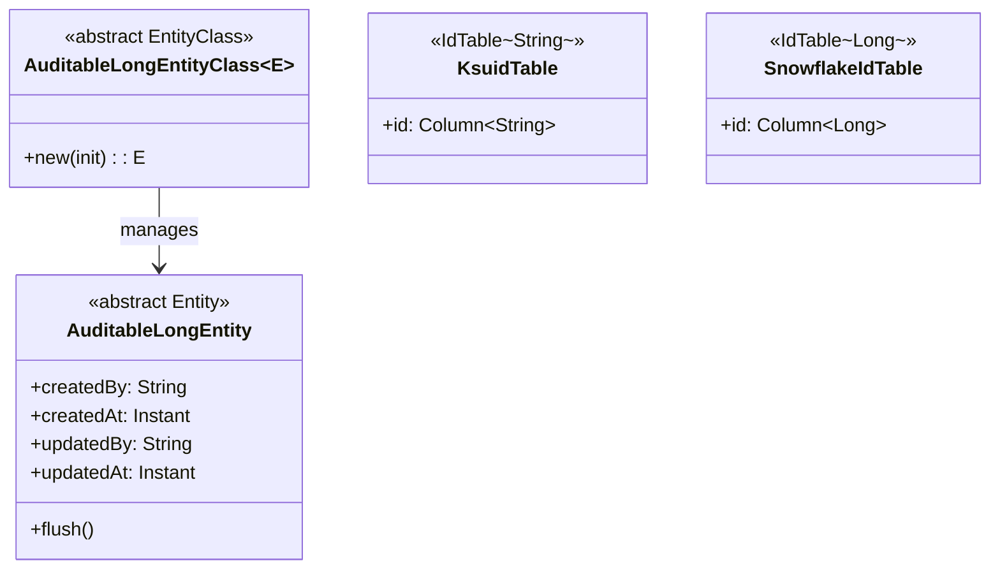
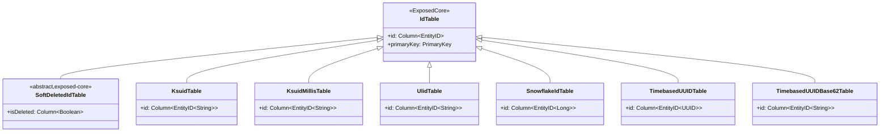
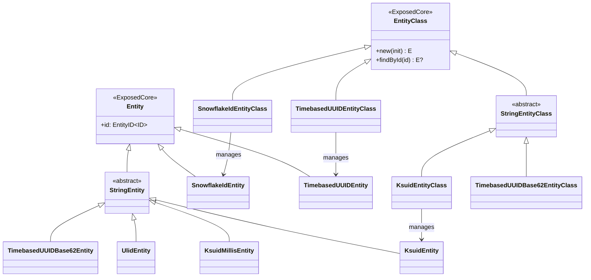
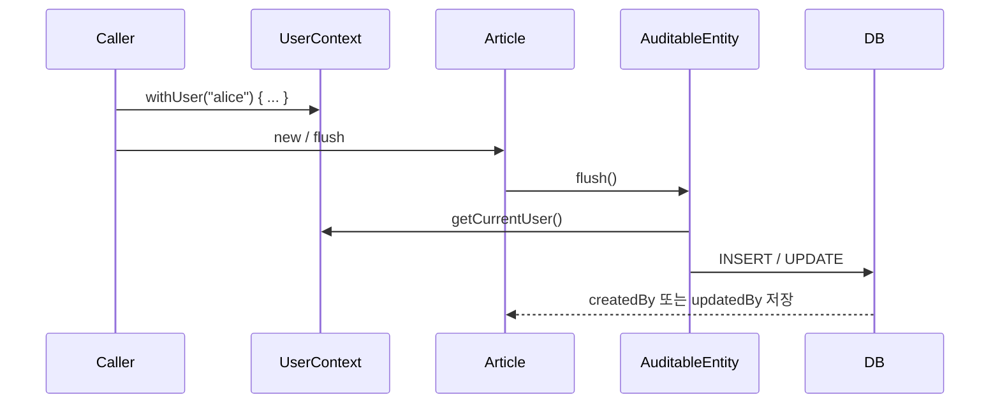

# Module bluetape4k-exposed-dao

JetBrains Exposed DAO 계층을 위한 엔티티 확장, String 기반 엔티티, 그리고 다양한 클라이언트 ID 전략을 사용하는 IdTable 구현을 제공합니다.

## 개요

`bluetape4k-exposed-dao`는 다음을 제공합니다:

- **DAO 확장 함수**: `idEquals`, `idHashCode`, `entityToStringBuilder` 등 Entity 공통 구현 보조
- **StringEntity**: `String` 타입 기본 키를 가진 DAO Entity
- **커스텀 IdTable**: KSUID, ULID, Snowflake, Timebased UUID, Soft Delete 등 다양한 ID 전략
- `bluetape4k-exposed-core`를 기반으로 하며, DAO 레이어에서만 필요한 기능을 분리

## 의존성 추가

```kotlin
dependencies {
    implementation("io.github.bluetape4k:bluetape4k-exposed-dao:${version}")
}
```

## 기본 사용법

### 1. DAO Entity 공통 구현

```kotlin
import io.bluetape4k.exposed.dao.idEquals
import io.bluetape4k.exposed.dao.idHashCode
import io.bluetape4k.exposed.dao.entityToStringBuilder
import org.jetbrains.exposed.v1.core.dao.id.EntityID
import org.jetbrains.exposed.v1.core.dao.id.LongIdTable
import org.jetbrains.exposed.v1.dao.LongEntity
import org.jetbrains.exposed.v1.dao.LongEntityClass

object UserTable: LongIdTable("users") {
    val name = varchar("name", 100)
    val email = varchar("email", 200)
}

class UserEntity(id: EntityID<Long>): LongEntity(id) {
    companion object: LongEntityClass<UserEntity>(UserTable)

    var name by UserTable.name
    var email by UserTable.email

    // idEquals/idHashCode 로 ID 기반 equals/hashCode 자동 구현
    override fun equals(other: Any?): Boolean = idEquals(other)
    override fun hashCode(): Int = idHashCode()

    // entityToStringBuilder 로 편리한 toString
    override fun toString(): String = entityToStringBuilder()
        .add("name", name)
        .add("email", email)
        .toString()
}
```

### 2. StringEntity (String PK)

```kotlin
import io.bluetape4k.exposed.dao.StringEntity
import io.bluetape4k.exposed.dao.StringEntityClass
import org.jetbrains.exposed.v1.core.dao.id.EntityID
import org.jetbrains.exposed.v1.core.dao.id.IdTable

object TagTable: IdTable<String>("tags") {
    override val id = varchar("id", 64).entityId()
    val description = text("description").nullable()
    override val primaryKey = PrimaryKey(id)
}

class TagEntity(id: EntityID<String>): StringEntity(id) {
    companion object: StringEntityClass<TagEntity>(TagTable)

    var description by TagTable.description
}

// 사용: id를 직접 지정해서 생성
val tag = TagEntity.new("kotlin") {
    description = "Kotlin 관련 태그"
}
```

### 3. KSUID 기반 DAO 엔티티

```kotlin
import io.bluetape4k.exposed.core.dao.id.KsuidTable
import io.bluetape4k.exposed.dao.id.KsuidEntity
import io.bluetape4k.exposed.dao.id.KsuidEntityClass
import io.bluetape4k.exposed.dao.id.KsuidEntityID

// KSUID를 PK로 사용하는 테이블 (client-side 자동 생성, 시간 정렬 보장)
object OrderTable: KsuidTable("orders") {
    val amount = decimal("amount", 10, 2)
    val status = varchar("status", 20)
}

class OrderEntity(id: KsuidEntityID): KsuidEntity(id) {
    companion object: KsuidEntityClass<OrderEntity>(OrderTable)

    var amount by OrderTable.amount
    var status by OrderTable.status
}

// insert 시 KSUID 자동 생성
val order = OrderEntity.new {
    amount = 15000.toBigDecimal()
    status = "PENDING"
}
println(order.id.value) // "2Dgh3kZ..." (27자 KSUID)
```

### 4. Snowflake ID 기반 DAO 엔티티

```kotlin
import io.bluetape4k.exposed.core.dao.id.SnowflakeIdTable
import io.bluetape4k.exposed.dao.id.SnowflakeIdEntity
import io.bluetape4k.exposed.dao.id.SnowflakeIdEntityClass
import io.bluetape4k.exposed.dao.id.SnowflakeIdEntityID

// Snowflake ID(Long)를 PK로 사용하는 테이블
object EventTable: SnowflakeIdTable("events") {
    val type = varchar("type", 50)
    val payload = text("payload")
}

class EventEntity(id: SnowflakeIdEntityID): SnowflakeIdEntity(id) {
    companion object: SnowflakeIdEntityClass<EventEntity>(EventTable)

    var type by EventTable.type
    var payload by EventTable.payload
}
```

### 5. ULID 기반 DAO 엔티티

```kotlin
import io.bluetape4k.exposed.core.dao.id.UlidTable
import io.bluetape4k.exposed.dao.id.UlidEntity
import io.bluetape4k.exposed.dao.id.UlidEntityClass
import io.bluetape4k.exposed.dao.id.UlidEntityID

object SessionTable: UlidTable("sessions") {
    val userId = long("user_id")
    val status = varchar("status", 20)
}

class SessionEntity(id: UlidEntityID): UlidEntity(id) {
    companion object: UlidEntityClass<SessionEntity>(SessionTable)

    var userId by SessionTable.userId
    var status by SessionTable.status
}
```

### 6. Timebased UUID 기반 DAO 엔티티

```kotlin
import io.bluetape4k.exposed.core.dao.id.TimebasedUUIDTable
import io.bluetape4k.exposed.core.dao.id.TimebasedUUIDBase62Table
import io.bluetape4k.exposed.dao.id.TimebasedUUIDEntity
import io.bluetape4k.exposed.dao.id.TimebasedUUIDEntityClass
import io.bluetape4k.exposed.dao.id.TimebasedUUIDBase62Entity
import io.bluetape4k.exposed.dao.id.TimebasedUUIDBase62EntityClass

// UUID v7 (시간 기반) PK
object SessionTable: TimebasedUUIDTable("sessions") {
    val userId = long("user_id")
    val expiresAt = long("expires_at")
}

class SessionEntity(id: TimebasedUUIDEntityID): TimebasedUUIDEntity(id) {
    companion object: TimebasedUUIDEntityClass<SessionEntity>(SessionTable)

    var userId by SessionTable.userId
}

// Base62 인코딩된 UUID PK (URL-safe)
object TokenTable: TimebasedUUIDBase62Table("tokens") {
    val userId = long("user_id")
    val scope = varchar("scope", 100)
}

class TokenEntity(id: TimebasedUUIDBase62EntityID): TimebasedUUIDBase62Entity(id) {
    companion object: TimebasedUUIDBase62EntityClass<TokenEntity>(TokenTable)

    var userId by TokenTable.userId
}
```

### 7. Soft Delete 지원 IdTable

```kotlin
import io.bluetape4k.exposed.core.dao.id.SoftDeletedIdTable
import org.jetbrains.exposed.v1.core.Column
import org.jetbrains.exposed.v1.core.dao.id.EntityID

// isDeleted 컬럼이 자동으로 추가되는 테이블
object PostTable: SoftDeletedIdTable<Long>("posts") {
    override val id: Column<EntityID<Long>> = long("id").autoIncrement().entityId()
    val title = varchar("title", 255)
    val content = text("content")
    override val primaryKey = PrimaryKey(id)
}

// soft delete
transaction {
    PostTable.update({ PostTable.id eq postId }) {
        it[isDeleted] = true
    }
}

// 활성 레코드만 조회
transaction {
    PostTable.selectAll()
        .where { PostTable.isDeleted eq false }
        .map { it[PostTable.title] }
}
```

## 다이어그램

### AuditableEntity 핵심 구조

`AuditableLongEntity`, `AuditableLongEntityClass`, 커스텀 IdTable 계층의 관계를 나타냅니다.



### 커스텀 IdTable 계층

`exposed-core`의 IdTable 구현을 DAO 엔티티와 함께 사용하는 전체 계층입니다.



### Entity 확장 계층

각 IdTable에 대응하는 DAO Entity 및 EntityClass 계층입니다.



## 주요 파일/클래스 목록

| 파일                                   | 설명                                                            |
|--------------------------------------|---------------------------------------------------------------|
| `EntityExtensions.kt`                | `idEquals`, `idHashCode`, `entityToStringBuilder` 등 Entity 보조 |
| `StringEntity.kt`                    | String PK 기반 Entity/EntityClass                               |
| `dao/id/KsuidTable.kt`               | KSUID PK IdTable                                              |
| `dao/id/KsuidMillisTable.kt`         | KSUID Millis PK IdTable                                       |
| `dao/id/UlidTable.kt`                | ULID PK IdTable                                               |
| `dao/id/SnowflakeIdTable.kt`         | Snowflake Long PK IdTable                                     |
| `dao/id/TimebasedUUIDTable.kt`       | Timebased UUID PK IdTable                                     |
| `dao/id/TimebasedUUIDBase62Table.kt` | Timebased UUID Base62 인코딩 PK IdTable                          |
| `dao/id/SoftDeletedIdTable.kt`       | `isDeleted` 컬럼 포함 Soft Delete IdTable                         |

## ID 전략 비교

| IdTable                    | PK 타입    | 길이  | 특징                |
|----------------------------|----------|-----|-------------------|
| `KsuidTable`               | `String` | 27자 | 시간 정렬, URL-safe   |
| `KsuidMillisTable`         | `String` | 27자 | 밀리초 정밀도 KSUID     |
| `UlidTable`                | `String` | 26자 | StatefulMonotonic ULID |
| `SnowflakeIdTable`         | `Long`   | -   | 분산 환경, 고성능        |
| `TimebasedUUIDTable`       | `UUID`   | 36자 | UUID v7 기반 시간 정렬 ID |
| `TimebasedUUIDBase62Table` | `String` | 최대 24자 | UUID v7을 Base62로 인코딩 |
| `SoftDeletedIdTable`       | 제네릭      | -   | `isDeleted` 컬럼 포함 |

## AuditableEntity (감사 추적 DAO)

`AuditableEntity`와 `AuditableEntityClass`를 통해 DAO 엔티티에 자동 감사 기능을 추가합니다.

### AuditableEntity 설명

`flush()` 메서드 오버라이드를 통해 `createdBy`와 `updatedBy`를 자동으로 설정합니다.

#### 자동 설정 동작

| 상황 | 자동 설정 필드 | 비고 |
|-----|-------------|------|
| 신규 엔티티 INSERT | `createdBy` | `createdAt`은 테이블의 DB `defaultExpression(CurrentTimestamp)`으로 설정 |
| 기존 엔티티 UPDATE | `updatedBy` | `updatedAt`은 Repository의 `auditedUpdateById()` 호출 시 설정 |



#### 주의 사항

- `flush()` 단독 호출 시 `updatedAt`은 자동 설정되지 않습니다.
- `updatedAt` 자동 설정은 `AuditableJdbcRepository.auditedUpdateById()` 사용 시에만 보장됩니다.

### 테이블 정의 (exposed-core)

```kotlin
import io.bluetape4k.exposed.core.auditable.AuditableLongIdTable

object ArticleTable : AuditableLongIdTable("articles") {
    val title = varchar("title", 255)
    val content = text("content")
    // createdBy, createdAt, updatedBy, updatedAt 자동 추가
}
```

### 엔티티 정의

```kotlin
import io.bluetape4k.exposed.dao.auditable.AuditableLongEntity
import io.bluetape4k.exposed.dao.auditable.AuditableLongEntityClass
import org.jetbrains.exposed.v1.core.dao.id.EntityID
import java.time.Instant

class Article(id: EntityID<Long>) : AuditableLongEntity(id) {
    companion object : AuditableLongEntityClass<Article>(ArticleTable)

    var title by ArticleTable.title
    var content by ArticleTable.content

    override var createdBy by ArticleTable.createdBy
    override var createdAt by ArticleTable.createdAt
    override var updatedBy by ArticleTable.updatedBy
    override var updatedAt by ArticleTable.updatedAt
}
```

### 엔티티 사용

```kotlin
import org.jetbrains.exposed.v1.jdbc.transactions.transaction
import io.bluetape4k.exposed.core.auditable.UserContext

transaction {
    UserContext.withUser("alice@example.com") {
        // INSERT: flush() 호출 시 createdBy="alice@example.com" 자동 설정
        val article = Article.new {
            title = "Exposed DAO Auditing"
            content = "Auto tracking of changes"
        }
        println("생성자: ${article.createdBy}")  // "alice@example.com"
    }

    UserContext.withUser("bob@example.com") {
        // UPDATE: flush() 호출 시 updatedBy="bob@example.com" 자동 설정
        article.title = "Updated Title"
        article.flush()
        println("수정자: ${article.updatedBy}")  // "bob@example.com"
    }
}
```

`UserContext.withUser(...)`는 중첩 호출 시에도 outer 사용자 컨텍스트를 복원하므로, 감사 필드 기록 중 스코프가 흔들리지 않습니다.

### 구체 엔티티/EntityClass 타입

| 기본키 | Entity | EntityClass |
|-------|--------|------------|
| `Int` | `AuditableIntEntity` | `AuditableIntEntityClass` |
| `Long` | `AuditableLongEntity` | `AuditableLongEntityClass` |
| `UUID` | `AuditableUUIDEntity` | `AuditableUUIDEntityClass` |

## 테스트

```bash
./gradlew :bluetape4k-exposed-dao:test
```

## 참고

- [JetBrains Exposed DAO](https://github.com/JetBrains/Exposed/wiki/DAO)
- [bluetape4k-exposed-core](../exposed-core)
- [bluetape4k-exposed-jdbc (AuditableJdbcRepository)](../exposed-jdbc)
- [bluetape4k-idgenerators](../../../utils/idgenerators)
