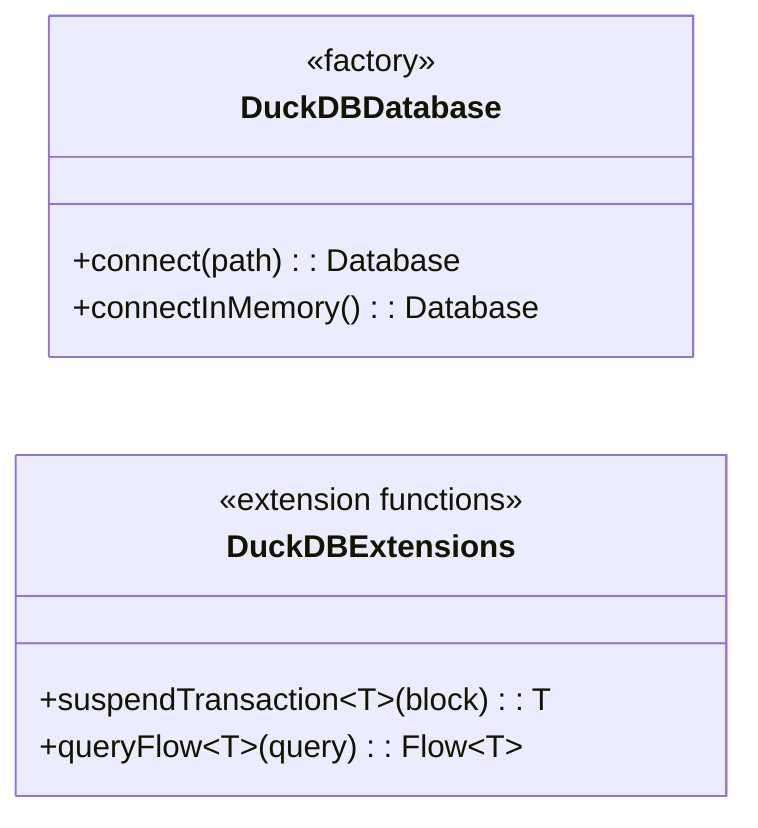
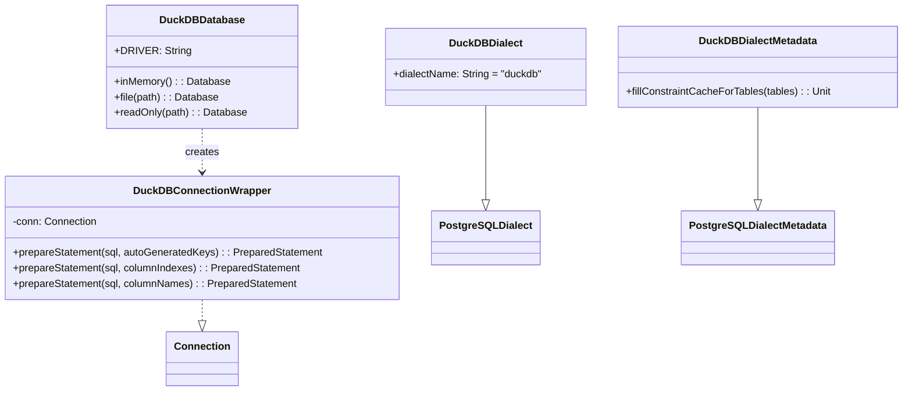

# Module bluetape4k-exposed-duckdb

JetBrains Exposed ORM과 DuckDB JDBC를 통합하는 모듈입니다. PostgreSQL Dialect 기반으로 DuckDB에서 Exposed DSL을 사용하고, 코루틴 기반 suspend 트랜잭션과 Flow 쿼리를 지원합니다.

## 개요

`bluetape4k-exposed-duckdb`는 다음을 제공합니다:

- **DuckDBDialect**: `PostgreSQLDialect` 상속, Exposed ORM과 DuckDB 호환
- **DuckDBDialectMetadata**: `getImportedKeys` 미지원 우회 (FK 제약 캐싱 no-op)
- **DuckDBConnectionWrapper**: JDBC 1.1.3 `prepareStatement` 오버로드 호환 래퍼
- **DuckDBDatabase**: 인메모리/파일/읽기전용 연결 팩토리 (`object`)
- **suspendTransaction**: `Dispatchers.IO`에서 블로킹 JDBC를 suspend 함수로 래핑
- **queryFlow**: 트랜잭션 안에서 결과를 materialize 한 뒤 `Flow<T>`로 emit

## 의존성 추가

```kotlin
dependencies {
    implementation("io.github.bluetape4k:bluetape4k-exposed-duckdb:${version}")
}
```

## 기본 사용법

### 1. 인메모리 DuckDB 연결

```kotlin
import io.bluetape4k.exposed.duckdb.DuckDBDatabase
import org.jetbrains.exposed.v1.jdbc.SchemaUtils
import org.jetbrains.exposed.v1.jdbc.transactions.transaction

val db = DuckDBDatabase.inMemory()
transaction(db) {
    SchemaUtils.create(Events)
    Events.insert { it[eventId] = 1L; it[region] = "kr" }
    val rows = Events.selectAll().toList()
}
```

> **주의**: `jdbc:duckdb:` URL은 연결마다 독립된 인메모리 DB를 생성합니다.
> 여러 트랜잭션에서 같은 DB를 공유하려면 `DuckDBConnection.duplicate()`를 사용하세요.

### 2. 파일 기반 연결

```kotlin
val db = DuckDBDatabase.file("/tmp/analytics.db")
transaction(db) {
    SchemaUtils.create(Events)
}
```

### 3. suspend 트랜잭션

```kotlin
import io.bluetape4k.exposed.duckdb.suspendTransaction

val rows = suspendTransaction(db) {
    Events.selectAll().where { Events.region eq "kr" }.toList()
}
```

### 4. Flow 쿼리 (대용량 결과셋)

```kotlin
import io.bluetape4k.exposed.duckdb.queryFlow

queryFlow(db) {
    Events.selectAll().where { Events.region eq "kr" }
}.collect { row ->
    println(row[Events.eventId])
}
```

> `queryFlow`는 JDBC `ResultSet` 수명과 Exposed 트랜잭션 경계를 안전하게 유지하기 위해
> 트랜잭션 안에서 결과를 `List`로 materialize 한 뒤 emit 합니다.
> 따라서 API는 `Flow`이지만, 진짜 row-by-row streaming cursor는 아닙니다.

## 핵심 API 다이어그램



## 다이어그램



## 주요 파일/클래스 목록

| 파일 | 설명 |
|------|------|
| `DuckDBDatabase.kt` | 연결 팩토리 (인메모리/파일/읽기전용) |
| `DuckDBConnectionWrapper.kt` | JDBC 1.1.3 호환 Connection 래퍼 |
| `DuckDBExtensions.kt` | `suspendTransaction`, `queryFlow` 확장 함수 |
| `dialect/DuckDBDialect.kt` | PostgreSQLDialect 상속 DuckDB 다이얼렉트 |
| `dialect/DuckDBDialectMetadata.kt` | FK 제약 캐싱 no-op 구현 |

## 테스트

```bash
./gradlew :bluetape4k-exposed-duckdb:test
```

핵심 회귀 테스트 예:

```bash
./gradlew :bluetape4k-exposed-duckdb:test --tests "io.bluetape4k.exposed.duckdb.DuckDBConnectionWrapperTest"
./gradlew :bluetape4k-exposed-duckdb:test --tests "io.bluetape4k.exposed.duckdb.DuckDBDatabaseTest"
```

## 참고

- [DuckDB](https://duckdb.org/)
- [DuckDB JDBC](https://duckdb.org/docs/api/java.html)
- [JetBrains Exposed](https://github.com/JetBrains/Exposed)
