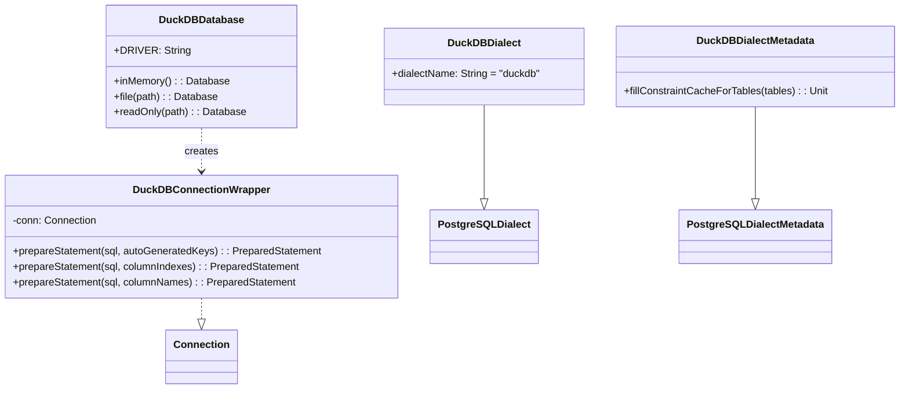

# Module bluetape4k-exposed-duckdb

English | [한국어](./README.ko.md)

A module that integrates JetBrains Exposed ORM with DuckDB JDBC. Built on PostgreSQL Dialect, it enables using the Exposed DSL with DuckDB and supports coroutine-based suspend transactions and Flow queries.

## Overview

`bluetape4k-exposed-duckdb` provides:

- **DuckDBDialect**: Extends `PostgreSQLDialect` for Exposed ORM compatibility with DuckDB
- **DuckDBDialectMetadata**: Bypasses unsupported `getImportedKeys` (FK constraint caching no-op)
- **DuckDBConnectionWrapper**: Compatibility wrapper for JDBC 1.1.3 `prepareStatement` overloads
- **DuckDBDatabase**: Connection factory for in-memory, file-based, and read-only connections (`object`)
- **suspendTransaction**: Wraps blocking JDBC calls in a suspend function using `Dispatchers.IO`
- **queryFlow**: Materializes results inside a transaction and emits them as a `Flow<T>`

## Positioning

- Use DuckDB as an Exposed JDBC backend for analytics, temporary storage, or embedded file-based databases.
- `DuckDBDatabase.inMemory()` creates an independent in-memory database per connection, making it unsuitable as a shared store across multiple transactions.
- If you need persistence or a consistent shared state across transactions, prefer `DuckDBDatabase.file(...)`.

## Dependency

```kotlin
dependencies {
    implementation("io.github.bluetape4k:bluetape4k-exposed-duckdb:${version}")
}
```

## Basic Usage

### 1. In-Memory DuckDB Connection

```kotlin
import io.bluetape4k.exposed.duckdb.DuckDBDatabase
import org.jetbrains.exposed.v1.jdbc.SchemaUtils
import org.jetbrains.exposed.v1.jdbc.transactions.transaction

val db = DuckDBDatabase.inMemory()
transaction(db) {
    SchemaUtils.create(Events)
    Events.insert { it[eventId] = 1L; it[region] = "kr" }
    val rows = Events.selectAll().toList()
}
```

> **Note**: The `jdbc:duckdb:` URL creates an independent in-memory database per connection.
> To share the same database across multiple transactions, use `DuckDBConnection.duplicate()`.

### 2. File-Based Connection

```kotlin
val db = DuckDBDatabase.file("/tmp/analytics.db")
transaction(db) {
    SchemaUtils.create(Events)
}
```

Blank file paths are not accepted.

### 2.1 Read-Only File Connection

```kotlin
val db = DuckDBDatabase.readOnly("/tmp/analytics.db")

transaction(db) {
    val rows = Events.selectAll().toList()
}
```

Read-only connections are suitable for safely querying existing file data. Write attempts may trigger exceptions or blocking depending on the driver/file-lock combination, so they should be avoided.

### 3. Suspend Transaction

```kotlin
import io.bluetape4k.exposed.duckdb.suspendTransaction

val rows = suspendTransaction(db) {
    Events.selectAll().where { Events.region eq "kr" }.toList()
}
```

### 4. Flow Query (Large Result Sets)

```kotlin
import io.bluetape4k.exposed.duckdb.queryFlow

queryFlow(db) {
    Events.selectAll().where { Events.region eq "kr" }
}.collect { row ->
    println(row[Events.eventId])
}
```

> To safely manage JDBC `ResultSet` lifetimes and Exposed transaction boundaries,
> `queryFlow` materializes results into a `List` inside the transaction before emitting.
> The API surface is `Flow`, but it does not perform true row-by-row streaming.
> Even with the `Flow` API, large result sets are ultimately loaded into memory — consider a separate pagination strategy for very large datasets.

## Diagram



## Key Files / Classes

| File | Description |
|------|-------------|
| `DuckDBDatabase.kt` | Connection factory (in-memory / file / read-only) |
| `DuckDBConnectionWrapper.kt` | Compatibility wrapper for JDBC 1.1.3 generated-key overloads |
| `DuckDBExtensions.kt` | `suspendTransaction` and `queryFlow` extension functions |
| `dialect/DuckDBDialect.kt` | DuckDB dialect extending PostgreSQLDialect |
| `dialect/DuckDBDialectMetadata.kt` | FK constraint caching no-op implementation |

## Testing

```bash
./gradlew :bluetape4k-exposed-duckdb:test
```

Core regression test examples:

```bash
./gradlew :bluetape4k-exposed-duckdb:test --tests "io.bluetape4k.exposed.duckdb.DuckDBConnectionWrapperTest"
./gradlew :bluetape4k-exposed-duckdb:test --tests "io.bluetape4k.exposed.duckdb.DuckDBDatabaseTest"
./gradlew :bluetape4k-exposed-duckdb:test --tests "io.bluetape4k.exposed.duckdb.DuckDBExtensionsTest"
```

## References

- [DuckDB](https://duckdb.org/)
- [DuckDB JDBC](https://duckdb.org/docs/api/java.html)
- [JetBrains Exposed](https://github.com/JetBrains/Exposed)
