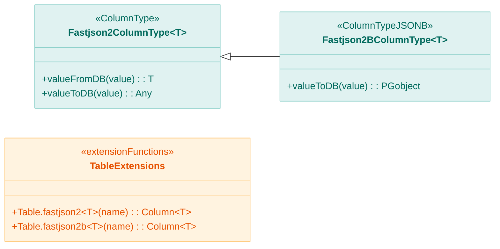
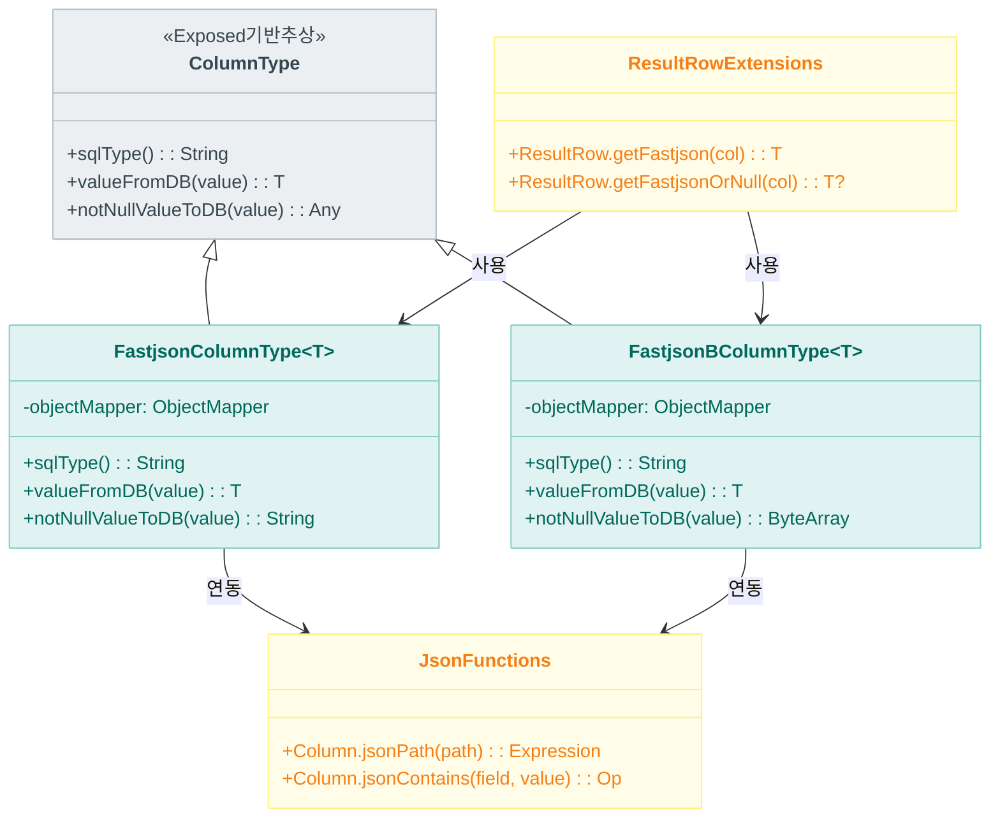
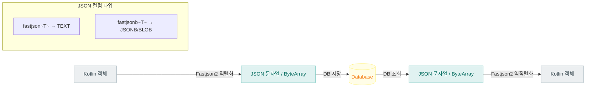

# Module bluetape4k-exposed-fastjson2

[English](./README.md) | 한국어

Exposed JSON/JSONB 컬럼을 Fastjson2로 직렬화/역직렬화하기 위한 모듈입니다.

## 개요

`bluetape4k-exposed-fastjson2`는 JetBrains Exposed의 JSON/JSONB 컬럼 타입을 [Alibaba Fastjson2](https://github.com/alibaba/fastjson2)로 직렬화/역직렬화하는 기능을 제공합니다. 고성능 JSON 처리가 필요한 환경에 적합합니다.

### 주요 기능

- **Fastjson 컬럼 타입**: JSON/JSONB 컬럼 매핑
- **ResultRow 확장**: JSON 컬럼 값 읽기 유틸
- **JSON 함수/조건식**: DB별 JSON 조회 조건 작성 보조

## 의존성 추가

```kotlin
dependencies {
    implementation("io.github.bluetape4k:bluetape4k-exposed-fastjson2:${version}")
    implementation("io.github.bluetape4k:bluetape4k-fastjson2:${version}")
}
```

## 기본 사용법

### 1. JSON 컬럼 정의

```kotlin
import io.bluetape4k.exposed.core.fastjson2.fastjson
import io.bluetape4k.exposed.core.fastjson2.fastjsonb
import org.jetbrains.exposed.v1.core.dao.id.IdTable

// 데이터 클래스
data class ProductMetadata(
    val brand: String = "",
    val tags: List<String> = emptyList(),
    val attributes: Map<String, String> = emptyMap()
)

// 테이블 정의
object Products: IdTable<Long>("products") {
    val name = varchar("name", 255)

    // JSON 컬럼 (문자열 기반)
    val metadata = fastjson<ProductMetadata>("metadata")

    // JSONB 컬럼 (이진 포맷, PostgreSQL)
    val extraData = fastjsonb<Map<String, Any>>("extra_data")
}
```

### 2. JSON 컬럼 사용

```kotlin
// 삽입
Products.insert {
    it[name] = "Product A"
    it[metadata] = ProductMetadata(
        brand = "BrandX",
        tags = listOf("electronics", "sale"),
        attributes = mapOf("color" to "red")
    )
}

// 조회
val product = Products.selectAll().where { Products.id eq 1L }.single()
val metadata: ProductMetadata = product[Products.metadata]
val tags = metadata.tags  // ["electronics", "sale"]
```

### 3. JSON 조건식

```kotlin
import io.bluetape4k.exposed.core.fastjson2.*

// JSON 경로로 검색
val query = Products.selectAll()
    .where { Products.metadata.jsonPath<String>("$.brand") eq "BrandX" }

// JSON 포함 검색
val query2 = Products.selectAll()
    .where { Products.metadata.jsonContains("tags", "sale") }
```

### 4. ResultRow 확장

```kotlin
import io.bluetape4k.exposed.core.fastjson2.*

val metadata: ProductMetadata = resultRow.getFastjson(Products.metadata)
val extraData: Map<String, Any>? = resultRow.getFastjsonOrNull(Products.extraData)
```

## 주요 파일/클래스 목록

| 파일                       | 설명                   |
|--------------------------|----------------------|
| `FastjsonColumnType.kt`  | JSON 컬럼 타입 (문자열 기반)  |
| `FastjsonBColumnType.kt` | JSONB 컬럼 타입 (이진 포맷)  |
| `JsonFunctions.kt`       | JSON 함수 확장           |
| `JsonConditions.kt`      | JSON 조건식 확장          |
| `ResultRowExtensions.kt` | ResultRow JSON 읽기 확장 |

## Jackson vs Fastjson2 선택 가이드

| 특징    | Jackson | Fastjson2 |
|-------|---------|-----------|
| 성능    | 좋음      | 매우 빠름     |
| 안정성   | 높음      | 중간        |
| 기능    | 풍부      | 기본적       |
| 권장 용도 | 일반적 사용  | 고성능 필요 시  |

## 테스트

```bash
./gradlew :bluetape4k-exposed-fastjson2:test
```

## 아키텍처 다이어그램

### 컬럼 타입 구조 (요약)



### JSON 컬럼 타입 클래스 구조



### JSON 컬럼 데이터 흐름



## 참고

- [JetBrains Exposed](https://github.com/JetBrains/Exposed)
- [Fastjson2](https://github.com/alibaba/fastjson2)
- bluetape4k-fastjson2
