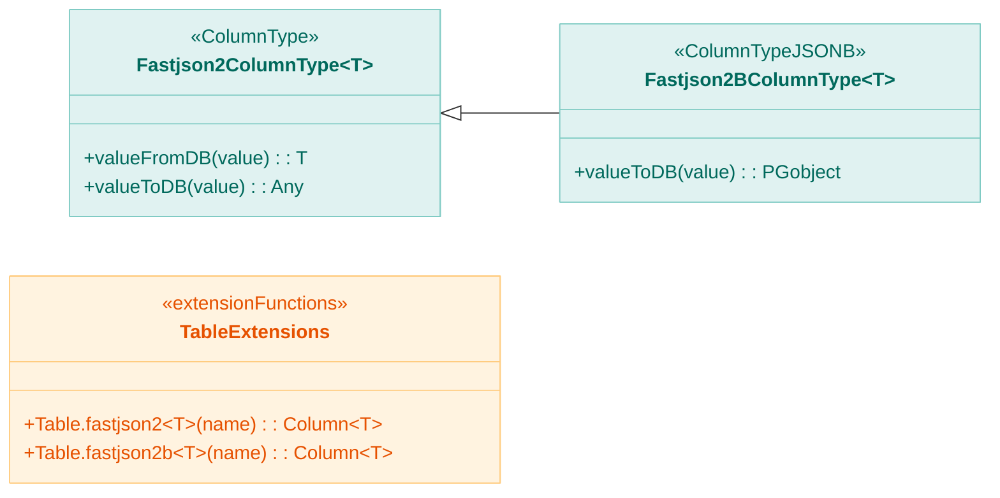
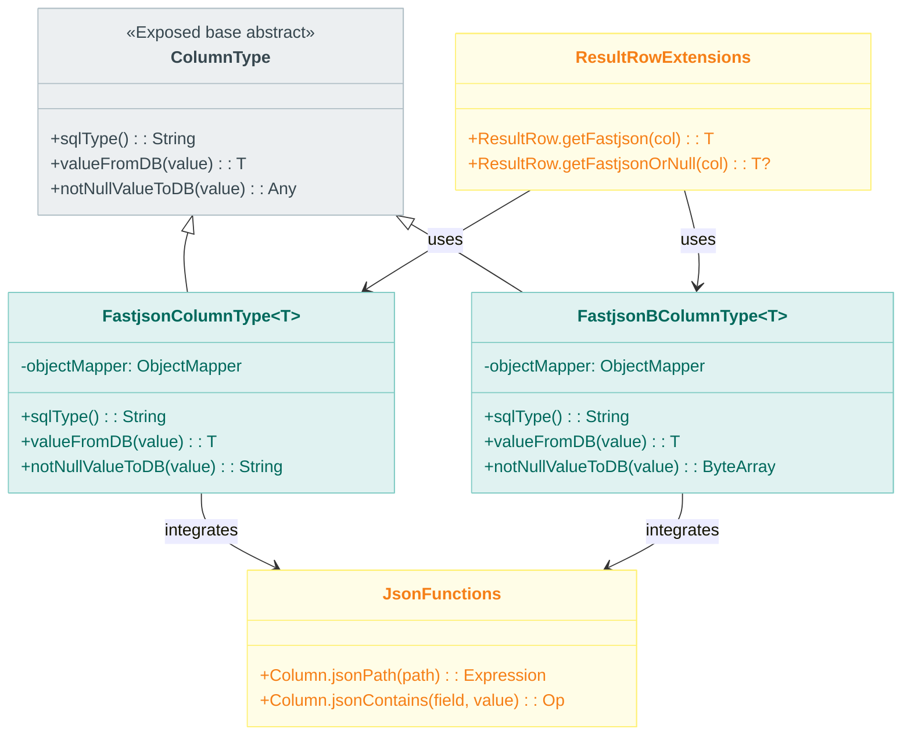
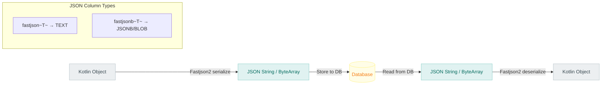

# Module bluetape4k-exposed-fastjson2

English | [한국어](./README.ko.md)

A module for serializing and deserializing Exposed JSON/JSONB columns using Fastjson2.

## Overview

`bluetape4k-exposed-fastjson2` provides serialization and deserialization of JetBrains Exposed JSON/JSONB column types using [Alibaba Fastjson2](https://github.com/alibaba/fastjson2). It is well-suited for environments that require high-performance JSON processing.

### Key Features

- **Fastjson column types**: JSON/JSONB column mapping
- **ResultRow extensions**: Utilities for reading JSON column values
- **JSON functions/conditions**: Helpers for building database-specific JSON query conditions

## Dependency

```kotlin
dependencies {
    implementation("io.github.bluetape4k:bluetape4k-exposed-fastjson2:${version}")
    implementation("io.github.bluetape4k:bluetape4k-fastjson2:${version}")
}
```

## Basic Usage

### 1. Defining JSON Columns

```kotlin
import io.bluetape4k.exposed.core.fastjson2.fastjson
import io.bluetape4k.exposed.core.fastjson2.fastjsonb
import org.jetbrains.exposed.v1.core.dao.id.IdTable

// Data class
data class ProductMetadata(
    val brand: String = "",
    val tags: List<String> = emptyList(),
    val attributes: Map<String, String> = emptyMap()
)

// Table definition
object Products: IdTable<Long>("products") {
    val name = varchar("name", 255)

    // JSON column (string-based)
    val metadata = fastjson<ProductMetadata>("metadata")

    // JSONB column (binary format, PostgreSQL)
    val extraData = fastjsonb<Map<String, Any>>("extra_data")
}
```

### 2. Using JSON Columns

```kotlin
// Insert
Products.insert {
    it[name] = "Product A"
    it[metadata] = ProductMetadata(
        brand = "BrandX",
        tags = listOf("electronics", "sale"),
        attributes = mapOf("color" to "red")
    )
}

// Query
val product = Products.selectAll().where { Products.id eq 1L }.single()
val metadata: ProductMetadata = product[Products.metadata]
val tags = metadata.tags  // ["electronics", "sale"]
```

### 3. JSON Condition Expressions

```kotlin
import io.bluetape4k.exposed.core.fastjson2.*

// Search by JSON path
val query = Products.selectAll()
    .where { Products.metadata.jsonPath<String>("$.brand") eq "BrandX" }

// Search by JSON containment
val query2 = Products.selectAll()
    .where { Products.metadata.jsonContains("tags", "sale") }
```

### 4. ResultRow Extensions

```kotlin
import io.bluetape4k.exposed.core.fastjson2.*

val metadata: ProductMetadata = resultRow.getFastjson(Products.metadata)
val extraData: Map<String, Any>? = resultRow.getFastjsonOrNull(Products.extraData)
```

## Key Files / Classes

| File                     | Description                          |
|--------------------------|--------------------------------------|
| `FastjsonColumnType.kt`  | JSON column type (string-based)      |
| `FastjsonBColumnType.kt` | JSONB column type (binary format)    |
| `JsonFunctions.kt`       | JSON function extensions             |
| `JsonConditions.kt`      | JSON condition expression extensions |
| `ResultRowExtensions.kt` | ResultRow JSON read extensions       |

## Jackson vs Fastjson2 Selection Guide

| Feature         | Jackson     | Fastjson2                  |
|-----------------|-------------|----------------------------|
| Performance     | Good        | Very fast                  |
| Stability       | High        | Moderate                   |
| Features        | Rich        | Basic                      |
| Recommended for | General use | High-performance scenarios |

## Testing

```bash
./gradlew :bluetape4k-exposed-fastjson2:test
```

## Architecture Diagram

### Column Type Structure (Summary)



### JSON Column Type Class Structure



### JSON Column Data Flow



## References

- [JetBrains Exposed](https://github.com/JetBrains/Exposed)
- [Fastjson2](https://github.com/alibaba/fastjson2)
- bluetape4k-fastjson2
