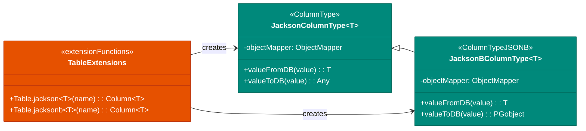
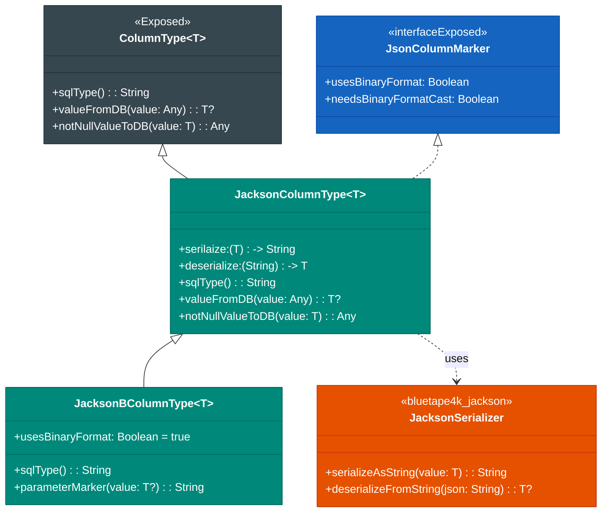
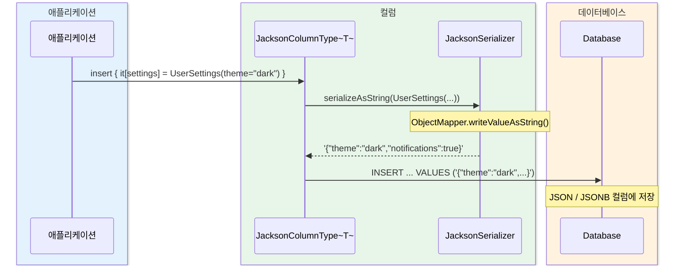
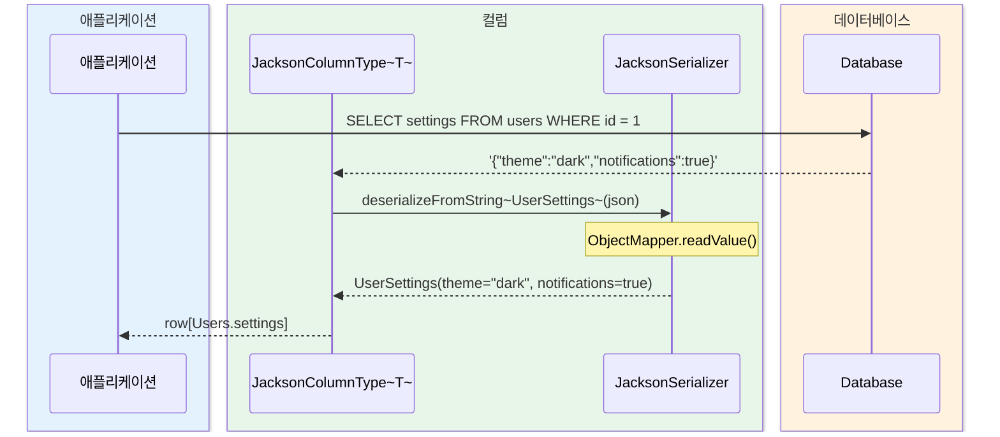

# Module bluetape4k-exposed-jackson

[English](./README.md) | 한국어

Exposed JSON/JSONB 컬럼을 Jackson 2로 직렬화/역직렬화하기 위한 모듈입니다.

## 개요

`bluetape4k-exposed-jackson`은 JetBrains Exposed의 JSON/JSONB 컬럼 타입을 [Jackson 2.x](https://github.com/FasterXML/jackson)로 직렬화/역직렬화하는 기능을 제공합니다. PostgreSQL, H2 등의 JSON 타입을 지원합니다.

### 주요 기능

- **Jackson 컬럼 타입**: JSON/JSONB 컬럼 매핑
- **Serializer 지원**: 공통 Jackson Serializer 구성
- **JSON 함수/조건식**: JSON 조회식 작성 보조
- **ResultRow 확장**: JSON 컬럼 값 읽기 유틸

## 의존성 추가

```kotlin
dependencies {
    implementation("io.github.bluetape4k:bluetape4k-exposed-jackson:${version}")
    implementation("io.github.bluetape4k:bluetape4k-jackson2:${version}")
}
```

## 기본 사용법

### 1. JSON 컬럼 정의

```kotlin
import io.bluetape4k.exposed.core.jackson.jackson
import org.jetbrains.exposed.v1.core.dao.id.IdTable

// 데이터 클래스
data class UserSettings(
    val theme: String = "light",
    val notifications: Boolean = true,
    val language: String = "ko"
)

// 테이블 정의
object Users: IdTable<Long>("users") {
    val name = varchar("name", 100)

    // JSON 컬럼
    val settings = jackson<UserSettings>("settings")
}
```

### 2. JSONB 컬럼 정의

```kotlin
import io.bluetape4k.exposed.core.jackson.jacksonb

object Products: IdTable<Long>("products") {
    val name = varchar("name", 255)

    // JSONB 컬럼 (이진 포맷)
    val metadata = jacksonb<ProductMetadata>("metadata")
}
```

### 3. 커스텀 Serializer 사용

```kotlin
import io.bluetape4k.exposed.core.jackson.jackson
import io.bluetape4k.jackson.JacksonSerializer

// 커스텀 Serializer 정의
val customSerializer = JacksonSerializer(
    jsonMapper {
        configure(SerializationFeature.INDENT_OUTPUT, false)
        disable(DeserializationFeature.FAIL_ON_UNKNOWN_PROPERTIES)
    }
)

object Events: IdTable<Long>("events") {
    val payload = jackson<EventPayload>("payload", customSerializer)
}
```

### 4. JSON 함수 사용

```kotlin
import io.bluetape4k.exposed.core.jackson.*

// JSON 경로 조회
val theme = Users.settings.jsonPath<String>("$.theme")

// JSON 조건식
val query = Users
    .selectAll()
    .where { Users.settings.jsonContains("theme", "dark") }
```

### 5. ResultRow 확장

```kotlin
import io.bluetape4k.exposed.core.jackson.*

val settings: UserSettings = resultRow.getJackson(Users.settings)
val metadata: ProductMetadata? = resultRow.getJacksonOrNull(Products.metadata)
```

## 아키텍처 다이어그램

### 컬럼 타입 구조 (요약)



## 클래스 다이어그램



## 직렬화/역직렬화 시퀀스 다이어그램

### 객체 → JSON → DB 저장



### DB 조회 → JSON → 객체 역직렬화



## 주요 파일/클래스 목록

| 파일                       | 설명                    |
|--------------------------|-----------------------|
| `JacksonColumnType.kt`   | JSON 컬럼 타입 (문자열 기반)   |
| `JacksonBColumnType.kt`  | JSONB 컬럼 타입 (이진 포맷)   |
| `JacksonSerializer.kt`   | Jackson Serializer 구성 |
| `JsonFunctions.kt`       | JSON 함수 확장            |
| `JsonConditions.kt`      | JSON 조건식 확장           |
| `ResultRowExtensions.kt` | ResultRow JSON 읽기 확장  |
| `ReadableExtensions.kt`  | Readable JSON 읽기 확장   |

## 테스트

```bash
./gradlew :bluetape4k-exposed-jackson:test
```

## 참고

- [JetBrains Exposed](https://github.com/JetBrains/Exposed)
- [Jackson 2.x](https://github.com/FasterXML/jackson)
- [PostgreSQL JSON Types](https://www.postgresql.org/docs/current/datatype-json.html)
