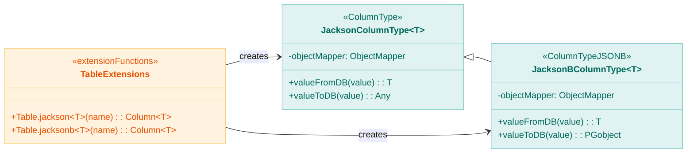
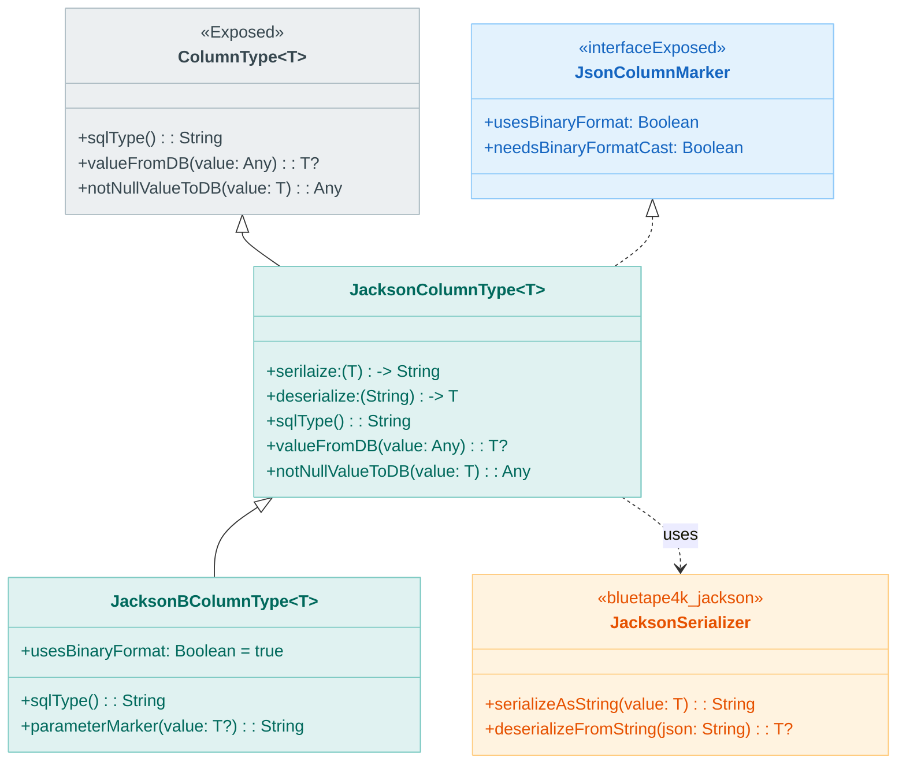
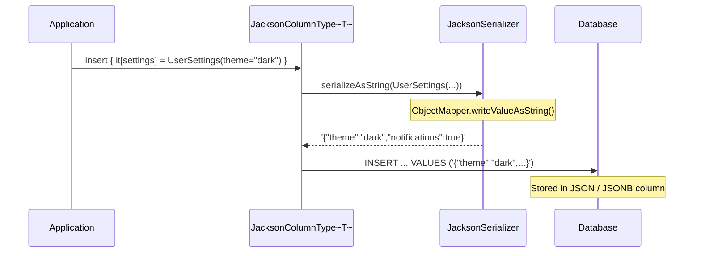
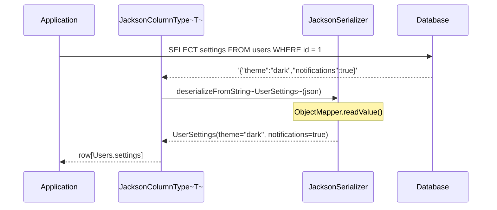

# Module bluetape4k-exposed-jackson

English | [한국어](./README.ko.md)

A module for serializing and deserializing Exposed JSON/JSONB columns using Jackson 2.

## Overview

`bluetape4k-exposed-jackson` provides serialization and deserialization of JetBrains Exposed JSON/JSONB column types using [Jackson 2.x](https://github.com/FasterXML/jackson). It supports JSON column types in PostgreSQL, H2, and other databases.

### Key Features

- **Jackson column types**: JSON/JSONB column mapping
- **Serializer support**: Common Jackson serializer configuration
- **JSON functions/conditions**: Helpers for building JSON query expressions
- **ResultRow extensions**: Utilities for reading JSON column values

## Dependency

```kotlin
dependencies {
    implementation("io.github.bluetape4k:bluetape4k-exposed-jackson:${version}")
    implementation("io.github.bluetape4k:bluetape4k-jackson2:${version}")
}
```

## Basic Usage

### 1. Defining a JSON Column

```kotlin
import io.bluetape4k.exposed.core.jackson.jackson
import org.jetbrains.exposed.v1.core.dao.id.IdTable

// Data class
data class UserSettings(
    val theme: String = "light",
    val notifications: Boolean = true,
    val language: String = "ko"
)

// Table definition
object Users: IdTable<Long>("users") {
    val name = varchar("name", 100)

    // JSON column
    val settings = jackson<UserSettings>("settings")
}
```

### 2. Defining a JSONB Column

```kotlin
import io.bluetape4k.exposed.core.jackson.jacksonb

object Products: IdTable<Long>("products") {
    val name = varchar("name", 255)

    // JSONB column (binary format)
    val metadata = jacksonb<ProductMetadata>("metadata")
}
```

### 3. Using a Custom Serializer

```kotlin
import io.bluetape4k.exposed.core.jackson.jackson
import io.bluetape4k.jackson.JacksonSerializer

// Define a custom serializer
val customSerializer = JacksonSerializer(
    jsonMapper {
        configure(SerializationFeature.INDENT_OUTPUT, false)
        disable(DeserializationFeature.FAIL_ON_UNKNOWN_PROPERTIES)
    }
)

object Events: IdTable<Long>("events") {
    val payload = jackson<EventPayload>("payload", customSerializer)
}
```

### 4. Using JSON Functions

```kotlin
import io.bluetape4k.exposed.core.jackson.*

// JSON path query
val theme = Users.settings.jsonPath<String>("$.theme")

// JSON condition expression
val query = Users
    .selectAll()
    .where { Users.settings.jsonContains("theme", "dark") }
```

### 5. ResultRow Extensions

```kotlin
import io.bluetape4k.exposed.core.jackson.*

val settings: UserSettings = resultRow.getJackson(Users.settings)
val metadata: ProductMetadata? = resultRow.getJacksonOrNull(Products.metadata)
```

## Architecture Diagram

### Column Type Structure (Summary)



## Class Diagram



## Serialization / Deserialization Sequence Diagrams

### Object → JSON → DB



### DB → JSON → Object



## Key Files / Classes

| File                     | Description                          |
|--------------------------|--------------------------------------|
| `JacksonColumnType.kt`   | JSON column type (string-based)      |
| `JacksonBColumnType.kt`  | JSONB column type (binary format)    |
| `JacksonSerializer.kt`   | Jackson serializer configuration     |
| `JsonFunctions.kt`       | JSON function extensions             |
| `JsonConditions.kt`      | JSON condition expression extensions |
| `ResultRowExtensions.kt` | ResultRow JSON read extensions       |
| `ReadableExtensions.kt`  | Readable JSON read extensions        |

## Testing

```bash
./gradlew :bluetape4k-exposed-jackson:test
```

## References

- [JetBrains Exposed](https://github.com/JetBrains/Exposed)
- [Jackson 2.x](https://github.com/FasterXML/jackson)
- [PostgreSQL JSON Types](https://www.postgresql.org/docs/current/datatype-json.html)
