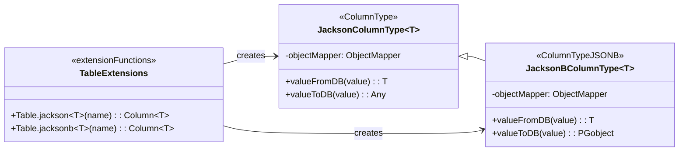
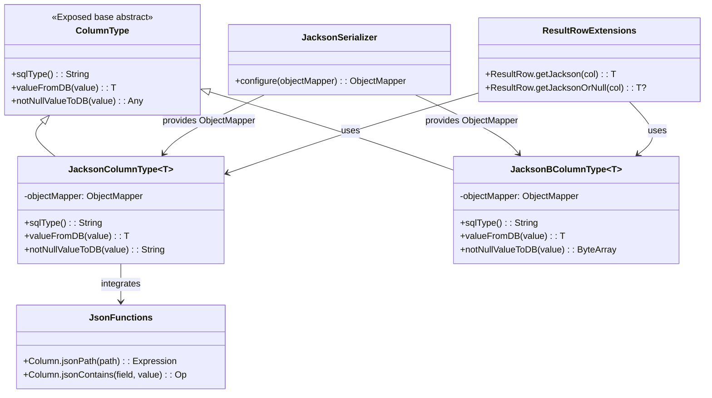
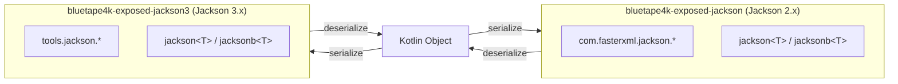

# Module bluetape4k-exposed-jackson3

English | [한국어](./README.ko.md)

A module for serializing and deserializing Exposed JSON/JSONB columns using Jackson 3.

## Overview

`bluetape4k-exposed-jackson3` provides serialization and deserialization of JetBrains Exposed JSON/JSONB column types using [Jackson 3.x](https://github.com/FasterXML/jackson). It takes advantage of Jackson 3's new features and improved performance.

### Key Features

- **Jackson 3 column types**: JSON/JSONB column mapping
- **Serializer support**: Jackson 3 serializer configuration
- **JSON functions/conditions**: Helpers for building JSON query expressions
- **ResultRow extensions**: Utilities for reading JSON column values

## Dependency

```kotlin
dependencies {
    implementation("io.github.bluetape4k:bluetape4k-exposed-jackson3:${version}")
    implementation("io.github.bluetape4k:bluetape4k-jackson3:${version}")
}
```

## Basic Usage

### 1. Defining JSON Columns

```kotlin
import io.bluetape4k.exposed.core.jackson3.jackson
import io.bluetape4k.exposed.core.jackson3.jacksonb
import org.jetbrains.exposed.v1.core.dao.id.IdTable

// Data class
data class UserSettings(
    val theme: String = "light",
    val notifications: Boolean = true,
    val language: String = "ko"
)

// Table definition
object Users: IdTable<Long>("users") {
    val name = varchar("name", 100)

    // JSON column (string-based)
    val settings = jackson<UserSettings>("settings")

    // JSONB column (binary format)
    val preferences = jacksonb<Map<String, Any>>("preferences")
}
```

### 2. Using JSON Columns

```kotlin
// Insert
Users.insert {
    it[name] = "John"
    it[settings] = UserSettings(
        theme = "dark",
        notifications = false,
        language = "en"
    )
}

// Query
val user = Users.selectAll().where { Users.id eq 1L }.single()
val settings: UserSettings = user[Users.settings]
```

### 3. JSON Condition Expressions

```kotlin
import io.bluetape4k.exposed.core.jackson3.*

// Search by JSON path
val query = Users.selectAll()
    .where { Users.settings.jsonPath<String>("$.theme") eq "dark" }

// Search by JSON containment
val query2 = Users.selectAll()
    .where { Users.settings.jsonContains("language", "ko") }
```

## Jackson 2 vs Jackson 3

| Feature | Jackson 2 | Jackson 3 |
|---------|-----------|-----------|
| Package | `com.fasterxml.jackson` | `tools.jackson` |
| Java version | Java 8+ | Java 17+ |
| Performance | Good | Improved |
| Recommendation | Stable / established | New projects |

## Key Files / Classes

| File | Description |
|------|-------------|
| `JacksonColumnType.kt` | JSON column type (string-based) |
| `JacksonBColumnType.kt` | JSONB column type (binary format) |
| `JacksonSerializer.kt` | Jackson 3 serializer configuration |
| `JsonFunctions.kt` | JSON function extensions |
| `JsonConditions.kt` | JSON condition expression extensions |
| `ResultRowExtensions.kt` | ResultRow JSON read extensions |

## Testing

```bash
./gradlew :bluetape4k-exposed-jackson3:test
```

## Architecture Diagram

### Column Type Structure (Summary)



### JSON Column Type Class Structure



### Jackson 2 vs Jackson 3 Package Differences



## References

- [JetBrains Exposed](https://github.com/JetBrains/Exposed)
- [Jackson 3.x](https://github.com/FasterXML/jackson)
- bluetape4k-jackson3
- bluetape4k-exposed-jackson
