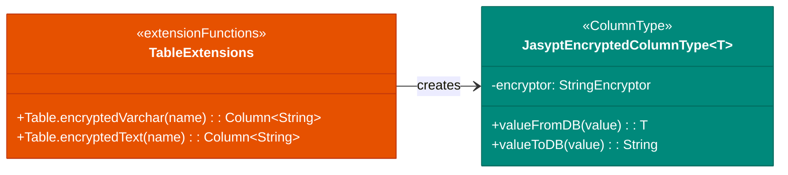
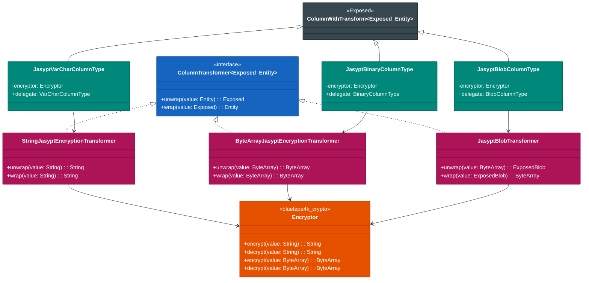
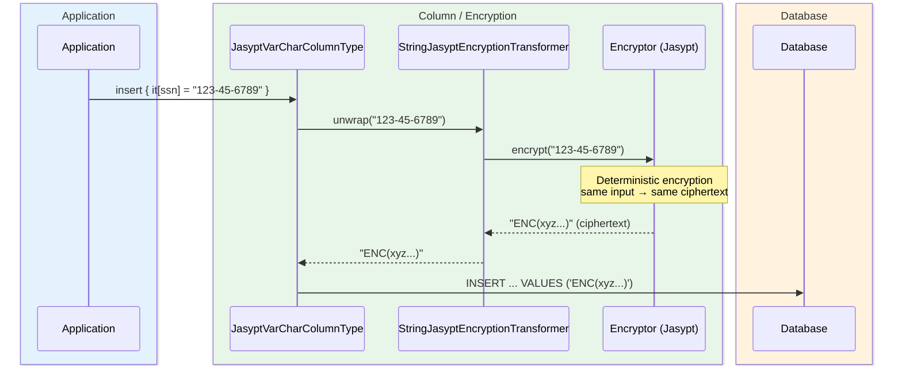
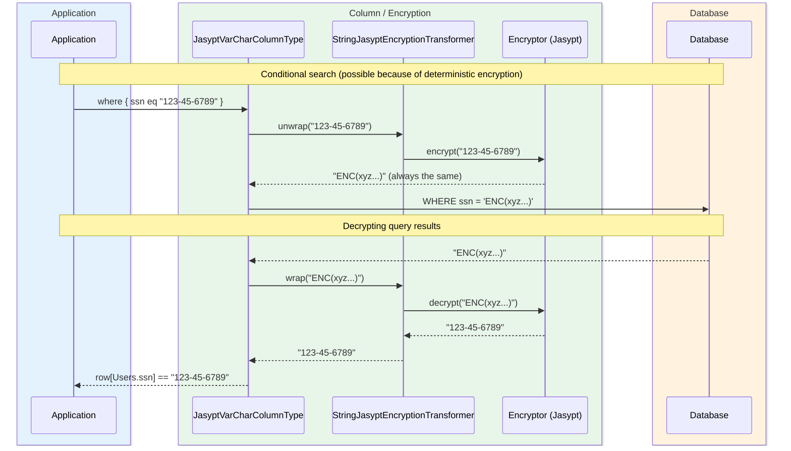

# Module bluetape4k-exposed-jasypt

English | [한국어](./README.ko.md)

A module for encrypting and decrypting Exposed column values using Jasypt.

## Overview

`bluetape4k-exposed-jasypt` provides transparent encryption of JetBrains Exposed column values using the [Jasypt](http://www.jasypt.org/) library. It uses deterministic encryption, so the same plaintext always produces the same ciphertext.

### Key Features

- **Deterministic encrypted column types**: Same input always produces the same ciphertext
- **String and binary encryption**: Supports `VARCHAR` and `BINARY` columns
- **Searchable / indexable**: Encrypted columns can be used in WHERE clauses and have indexes

## Dependency

```kotlin
dependencies {
    implementation("io.github.bluetape4k:bluetape4k-exposed-jasypt:${version}")
    implementation("io.github.bluetape4k:bluetape4k-crypto:${version}")
}
```

## Basic Usage

### 1. Defining Encrypted Columns

```kotlin
import io.bluetape4k.exposed.core.jasypt.jasyptVarChar
import io.bluetape4k.exposed.core.jasypt.jasyptBinary
import io.bluetape4k.crypto.encrypt.Encryptors
import org.jetbrains.exposed.v1.core.dao.id.IdTable

object Users: IdTable<Long>("users") {
    val name = varchar("name", 100)

    // Jasypt-encrypted VARCHAR column
    val ssn = jasyptVarChar(
        name = "ssn",
        colLength = 512,
        encryptor = Encryptors.Jasypt
    )

    // Jasypt-encrypted BINARY column
    val privateKey = jasyptBinary(
        name = "private_key",
        colLength = 1024,
        encryptor = Encryptors.Jasypt
    )
}
```

### 2. Using Encrypted Columns

```kotlin
// Automatically encrypted on insert
Users.insert {
    it[name] = "John Doe"
    it[ssn] = "123-45-6789"  // encrypted automatically before storage
}

// Automatically decrypted on read
val user = Users.selectAll().where { Users.id eq 1L }.single()
val ssn = user[Users.ssn]  // decrypted automatically

// Searchable (because deterministic encryption is used)
val userBySsn = Users.selectAll()
    .where { Users.ssn eq "123-45-6789" }
    .single()
```

## Deterministic Encryption Trade-offs

| Advantage                   | Disadvantage                                                 |
|-----------------------------|--------------------------------------------------------------|
| Searchable via WHERE clause | Same plaintext → same ciphertext (pattern analysis possible) |
| Supports indexes            | May not meet high-security requirements                      |
| Supports sorting            |                                                              |

## Architecture Diagram

### Column Type Structure (Summary)



## Class Diagram



## Encryption / Decryption Sequence Diagrams

### Automatic Encryption on DB Insert



### DB Read and Conditional Search



## Key Files / Classes

| File                         | Description                   |
|------------------------------|-------------------------------|
| `JasyptVarCharColumnType.kt` | Encrypted VARCHAR column type |
| `JasyptBinaryColumnType.kt`  | Encrypted BINARY column type  |
| `Tables.kt`                  | Table extension functions     |

## Notes

1. **Security considerations
   **: Deterministic encryption is advantageous for indexing and searching, but since the same plaintext always maps to the same ciphertext, it may not be appropriate for high-security requirements.

2. **Column length**: Encrypted values are longer than the original plaintext, so allocate sufficient column length.

3. **Key management**: Encryption keys must be managed securely.

## Testing

```bash
./gradlew :bluetape4k-exposed-jasypt:test
```

## References

- [JetBrains Exposed](https://github.com/JetBrains/Exposed)
- [Jasypt](http://www.jasypt.org/)
- bluetape4k-crypto
