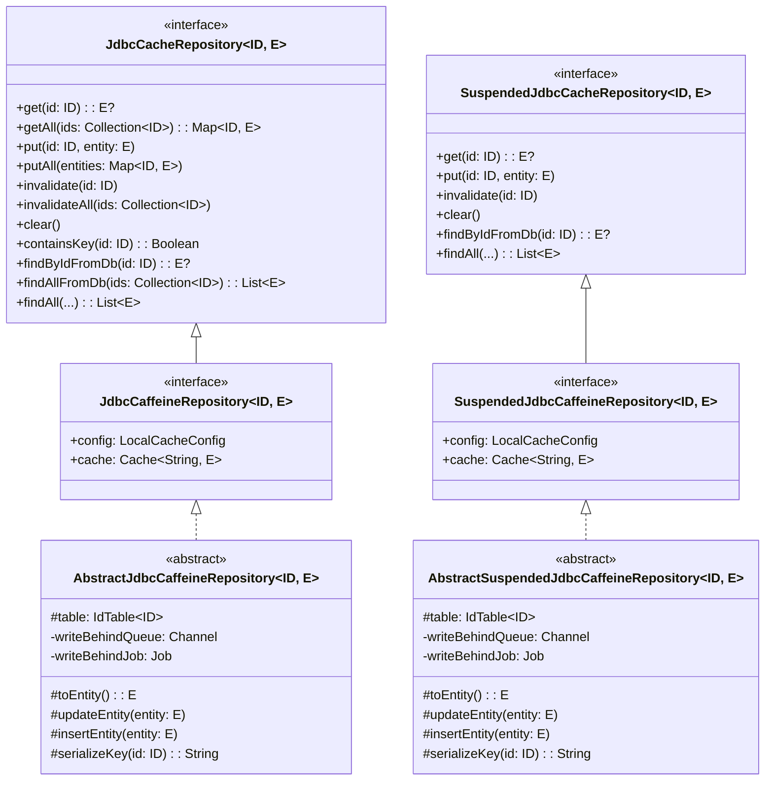
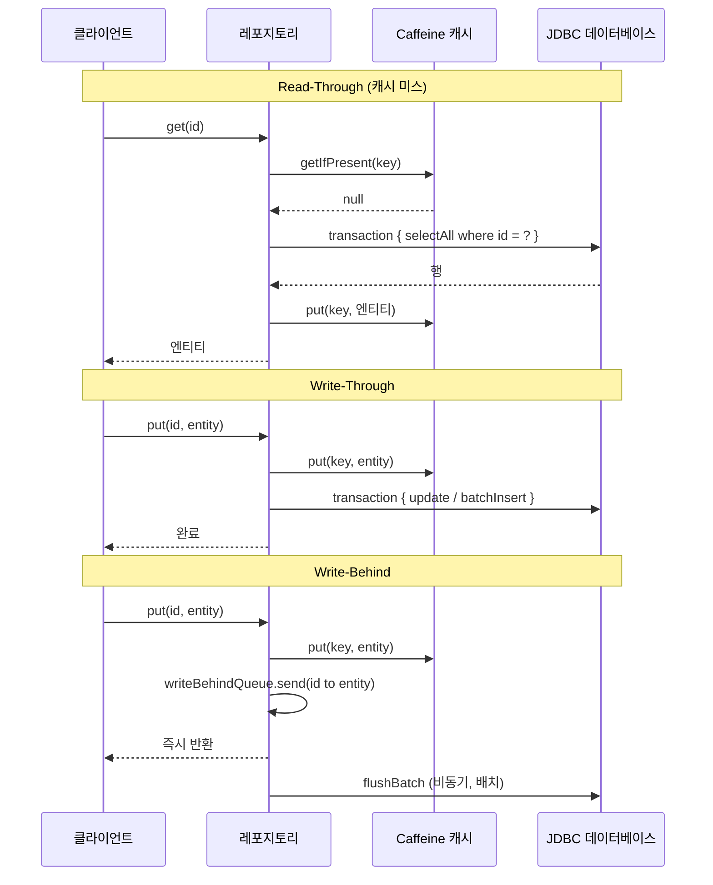

# bluetape4k-exposed-jdbc-caffeine

[English](./README.md) | 한국어

[](https://central.sonatype.com/artifact/io.github.bluetape4k/bluetape4k-exposed-jdbc-caffeine)

Caffeine 로컬(인프로세스) 캐시를 사용하는 Exposed JDBC 저장소입니다. Redis 의존 없이 `exposed-cache` 인터페이스만 사용합니다.

> **참고**: [exposed-cache — 전체 모듈 생태계 및 인터페이스 계층 구조](../exposed-cache/README.ko.md)

## 아키텍처



## 쓰기 전략 흐름



## 주요 기능

- **Read-Through**: 캐시 미스 시 `transaction { selectAll }`로 DB 로드, 결과를 Caffeine에 저장
- **Write-Through**: `put()` 호출 시 Caffeine과 DB를 단일 JDBC 트랜잭션 안에서 동기 반영
- **Write-Behind**: `put()` 호출 시 Caffeine 즉시 갱신, DB 쓰기는 Kotlin `Channel`을 통해 비동기 배치 처리
- **동기 레포지토리**: `AbstractJdbcCaffeineRepository` — 모든 메서드가 블로킹 `transaction {}` 사용
- **Suspend 레포지토리**: `AbstractSuspendedJdbcCaffeineRepository` — 모든 DB 호출이 `suspendedTransactionAsync` 사용
- **Redis 의존 없음**: 순수 인프로세스 Caffeine, 단일 인스턴스 배포에 적합
- **AutoIncrement 안전**: Write-Through/Write-Behind 시 AutoInc 테이블 신규 엔티티의 INSERT 건너뜀 (DB가 ID 할당)
- **안전한 종료**: `close()` 호출 시 Write-Behind 큐를 모두 처리 후 코루틴 스코프 취소

## 사용 예시

### 동기 레포지토리 (AbstractJdbcCaffeineRepository)

```kotlin
import io.bluetape4k.exposed.cache.LocalCacheConfig
import io.bluetape4k.exposed.jdbc.caffeine.repository.AbstractJdbcCaffeineRepository
import org.jetbrains.exposed.v1.core.ResultRow
import org.jetbrains.exposed.v1.core.statements.BatchInsertStatement
import org.jetbrains.exposed.v1.core.statements.UpdateStatement

data class ActorRecord(val id: Long, val firstName: String, val lastName: String) : java.io.Serializable {
    companion object { private const val serialVersionUID = 1L }
}

class ActorCaffeineRepository(
    config: LocalCacheConfig = LocalCacheConfig.WRITE_THROUGH,
) : AbstractJdbcCaffeineRepository<Long, ActorRecord>(config) {

    override val table = ActorTable

    override fun ResultRow.toEntity() = ActorRecord(
        id = this[ActorTable.id].value,
        firstName = this[ActorTable.firstName],
        lastName = this[ActorTable.lastName],
    )

    override fun UpdateStatement.updateEntity(entity: ActorRecord) {
        this[ActorTable.firstName] = entity.firstName
        this[ActorTable.lastName] = entity.lastName
    }

    override fun BatchInsertStatement.insertEntity(entity: ActorRecord) {
        this[ActorTable.firstName] = entity.firstName
        this[ActorTable.lastName] = entity.lastName
    }

    override fun extractId(entity: ActorRecord) = entity.id
}

// Read-Through (캐시 미스 → DB 로드)
val actor = repo.get(1L)

// Write-Through (캐시 + DB 동기 반영)
repo.put(1L, ActorRecord(1L, "홍", "길동"))

// 다건 저장
repo.putAll(mapOf(1L to actor1, 2L to actor2))

// 캐시 항목 제거 (DB 영향 없음)
repo.invalidate(1L)
```

### Suspend 레포지토리 (AbstractSuspendedJdbcCaffeineRepository)

```kotlin
import io.bluetape4k.exposed.cache.LocalCacheConfig
import io.bluetape4k.exposed.jdbc.caffeine.repository.AbstractSuspendedJdbcCaffeineRepository

class ActorSuspendedRepository(
    config: LocalCacheConfig = LocalCacheConfig.WRITE_THROUGH,
) : AbstractSuspendedJdbcCaffeineRepository<Long, ActorRecord>(config) {

    override val table = ActorTable

    override fun ResultRow.toEntity() = ActorRecord(
        id = this[ActorTable.id].value,
        firstName = this[ActorTable.firstName],
        lastName = this[ActorTable.lastName],
    )

    override fun UpdateStatement.updateEntity(entity: ActorRecord) {
        this[ActorTable.firstName] = entity.firstName
        this[ActorTable.lastName] = entity.lastName
    }

    override fun BatchInsertStatement.insertEntity(entity: ActorRecord) {
        this[ActorTable.firstName] = entity.firstName
        this[ActorTable.lastName] = entity.lastName
    }

    override fun extractId(entity: ActorRecord) = entity.id
}

// 모든 연산이 suspend 함수
suspend fun example(repo: ActorSuspendedRepository) {
    val actor = repo.get(1L)                           // Read-Through
    repo.put(1L, ActorRecord(1L, "홍", "길동"))         // Write-Through
    repo.invalidate(1L)                                // 캐시 항목만 제거
    repo.clear()                                       // 전체 캐시 항목 제거
}
```

### Write-Behind 설정

```kotlin
val behindConfig = LocalCacheConfig(
    keyPrefix = "actor",
    maximumSize = 5_000L,
    writeMode = CacheWriteMode.WRITE_BEHIND,
    writeBehindBatchSize = 200,
    writeBehindQueueCapacity = 5_000,
)
val repo = ActorCaffeineRepository(behindConfig)

// put()은 즉시 반환, DB flush는 비동기 배치로 처리
repo.put(1L, actor)
```

## LocalCacheConfig 설정 참조

```kotlin
val config = LocalCacheConfig(
    keyPrefix = "actor",                          // 캐시 키 접두사
    maximumSize = 10_000L,                        // Caffeine 최대 항목 수
    expireAfterWrite = Duration.ofMinutes(30),    // 마지막 쓰기 이후 TTL
    expireAfterAccess = null,                     // 마지막 접근 이후 TTL (선택)
    writeMode = CacheWriteMode.WRITE_THROUGH,     // READ_ONLY | WRITE_THROUGH | WRITE_BEHIND
    writeBehindBatchSize = 100,                   // flush 배치 크기
    writeBehindQueueCapacity = 10_000,            // 큐 용량 (무제한 금지)
)
```

## 테스트 데이터베이스

테스트는 다음 환경에서 실행됩니다:

- **H2 (MySQL 모드)** — 인메모리, 로컬 빠른 실행용
- **PostgreSQL** — Testcontainers 사용
- **MySQL 8** — Testcontainers 사용

## 의존성

```kotlin
dependencies {
    implementation("io.github.bluetape4k:bluetape4k-exposed-jdbc-caffeine:$version")
}
```

## 참고

- [exposed-cache — 허브 모듈](../exposed-cache/README.ko.md)
- [exposed-jdbc](../exposed-jdbc)
- [Caffeine Cache](https://github.com/ben-manes/caffeine)
