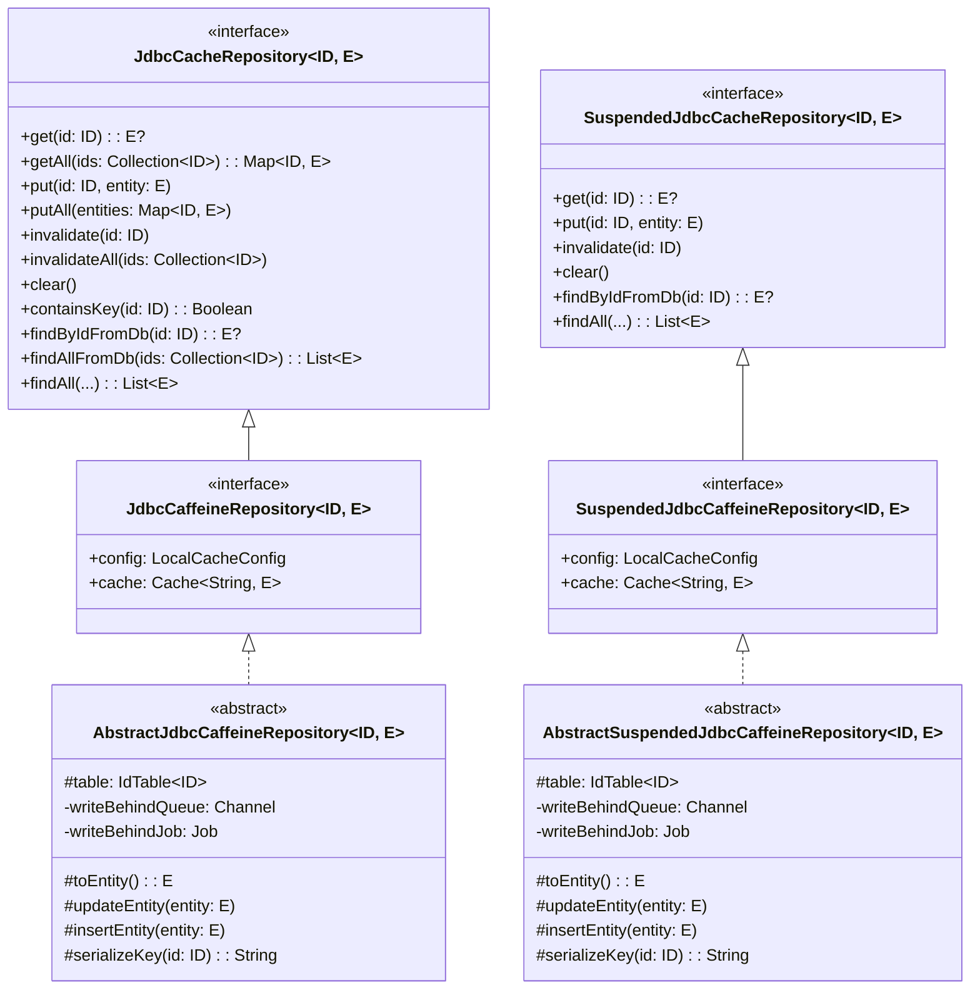
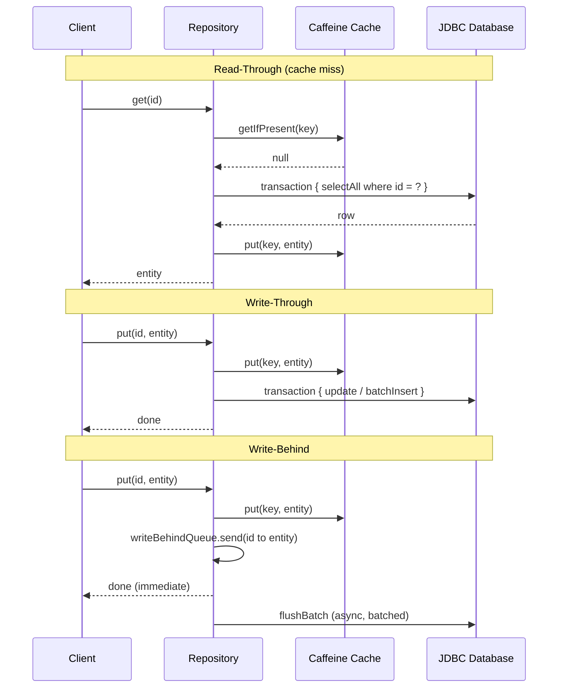

# bluetape4k-exposed-jdbc-caffeine

English | [한국어](./README.ko.md)

[](https://central.sonatype.com/artifact/io.github.bluetape4k/bluetape4k-exposed-jdbc-caffeine)

Exposed JDBC repository with Caffeine local (in-process) cache. No Redis dependency — only `exposed-cache` interfaces are required.

> **See also**: [exposed-cache — Full Module Ecosystem & Interface Hierarchy](../exposed-cache/README.md)

## Architecture



## Write Strategy Flows



## Features

- **Read-Through**: Cache miss triggers DB load via `transaction { selectAll }`, result stored in Caffeine
- **Write-Through**: `put()` updates both Caffeine and DB synchronously in a single JDBC transaction
- **Write-Behind**: `put()` updates Caffeine immediately; DB writes are batched asynchronously via a Kotlin `Channel`
- **Sync repository**: `AbstractJdbcCaffeineRepository` — all methods use blocking `transaction {}`
- **Suspend repository**: `AbstractSuspendedJdbcCaffeineRepository` — all DB calls use `suspendedTransactionAsync`
- **No Redis dependency**: Pure in-process Caffeine; suitable for single-instance deployments
- **AutoIncrement safety**: Write-Through and Write-Behind skip INSERT for AutoInc tables (DB assigns the ID)
- **Graceful shutdown**: `close()` drains the Write-Behind queue before cancelling the coroutine scope

## Usage

### Sync repository (AbstractJdbcCaffeineRepository)

```kotlin
import io.bluetape4k.exposed.cache.LocalCacheConfig
import io.bluetape4k.exposed.jdbc.caffeine.repository.AbstractJdbcCaffeineRepository
import org.jetbrains.exposed.v1.core.ResultRow
import org.jetbrains.exposed.v1.core.statements.BatchInsertStatement
import org.jetbrains.exposed.v1.core.statements.UpdateStatement

data class ActorRecord(val id: Long, val firstName: String, val lastName: String) : java.io.Serializable {
    companion object { private const val serialVersionUID = 1L }
}

class ActorCaffeineRepository(
    config: LocalCacheConfig = LocalCacheConfig.WRITE_THROUGH,
) : AbstractJdbcCaffeineRepository<Long, ActorRecord>(config) {

    override val table = ActorTable

    override fun ResultRow.toEntity() = ActorRecord(
        id = this[ActorTable.id].value,
        firstName = this[ActorTable.firstName],
        lastName = this[ActorTable.lastName],
    )

    override fun UpdateStatement.updateEntity(entity: ActorRecord) {
        this[ActorTable.firstName] = entity.firstName
        this[ActorTable.lastName] = entity.lastName
    }

    override fun BatchInsertStatement.insertEntity(entity: ActorRecord) {
        this[ActorTable.firstName] = entity.firstName
        this[ActorTable.lastName] = entity.lastName
    }

    override fun extractId(entity: ActorRecord) = entity.id
}

// Read-Through (cache miss -> DB load)
val actor = repo.get(1L)

// Write-Through (cache + DB synchronously)
repo.put(1L, ActorRecord(1L, "Hong", "Gildong"))

// Batch write
repo.putAll(mapOf(1L to actor1, 2L to actor2))

// Invalidate cache entry (no DB effect)
repo.invalidate(1L)
```

### Suspend repository (AbstractSuspendedJdbcCaffeineRepository)

```kotlin
import io.bluetape4k.exposed.cache.LocalCacheConfig
import io.bluetape4k.exposed.jdbc.caffeine.repository.AbstractSuspendedJdbcCaffeineRepository

class ActorSuspendedRepository(
    config: LocalCacheConfig = LocalCacheConfig.WRITE_THROUGH,
) : AbstractSuspendedJdbcCaffeineRepository<Long, ActorRecord>(config) {

    override val table = ActorTable

    override fun ResultRow.toEntity() = ActorRecord(
        id = this[ActorTable.id].value,
        firstName = this[ActorTable.firstName],
        lastName = this[ActorTable.lastName],
    )

    override fun UpdateStatement.updateEntity(entity: ActorRecord) {
        this[ActorTable.firstName] = entity.firstName
        this[ActorTable.lastName] = entity.lastName
    }

    override fun BatchInsertStatement.insertEntity(entity: ActorRecord) {
        this[ActorTable.firstName] = entity.firstName
        this[ActorTable.lastName] = entity.lastName
    }

    override fun extractId(entity: ActorRecord) = entity.id
}

// All operations are suspend functions
suspend fun example(repo: ActorSuspendedRepository) {
    val actor = repo.get(1L)                        // Read-Through
    repo.put(1L, ActorRecord(1L, "Hong", "Gil"))    // Write-Through
    repo.invalidate(1L)                             // Cache eviction only
    repo.clear()                                    // Evict all cache entries
}
```

### Write-Behind configuration

```kotlin
val behindConfig = LocalCacheConfig(
    keyPrefix = "actor",
    maximumSize = 5_000L,
    writeMode = CacheWriteMode.WRITE_BEHIND,
    writeBehindBatchSize = 200,
    writeBehindQueueCapacity = 5_000,
)
val repo = ActorCaffeineRepository(behindConfig)

// put() returns immediately; DB flush happens asynchronously in batches
repo.put(1L, actor)
```

## LocalCacheConfig Reference

```kotlin
val config = LocalCacheConfig(
    keyPrefix = "actor",                          // cache key prefix
    maximumSize = 10_000L,                        // max entries in Caffeine
    expireAfterWrite = Duration.ofMinutes(30),    // TTL from last write
    expireAfterAccess = null,                     // TTL from last access (optional)
    writeMode = CacheWriteMode.WRITE_THROUGH,     // READ_ONLY | WRITE_THROUGH | WRITE_BEHIND
    writeBehindBatchSize = 100,                   // flush batch size
    writeBehindQueueCapacity = 10_000,            // queue size (must not be unlimited)
)
```

## Test Databases

Tests run against:

- **H2 (MySQL mode)** — in-memory, default for fast local runs
- **PostgreSQL** — via Testcontainers
- **MySQL 8** — via Testcontainers

## Dependency

```kotlin
dependencies {
    implementation("io.github.bluetape4k:bluetape4k-exposed-jdbc-caffeine:$version")
}
```

## References

- [exposed-cache — Hub module](../exposed-cache/README.md)
- [exposed-jdbc](../exposed-jdbc)
- [Caffeine Cache](https://github.com/ben-manes/caffeine)
