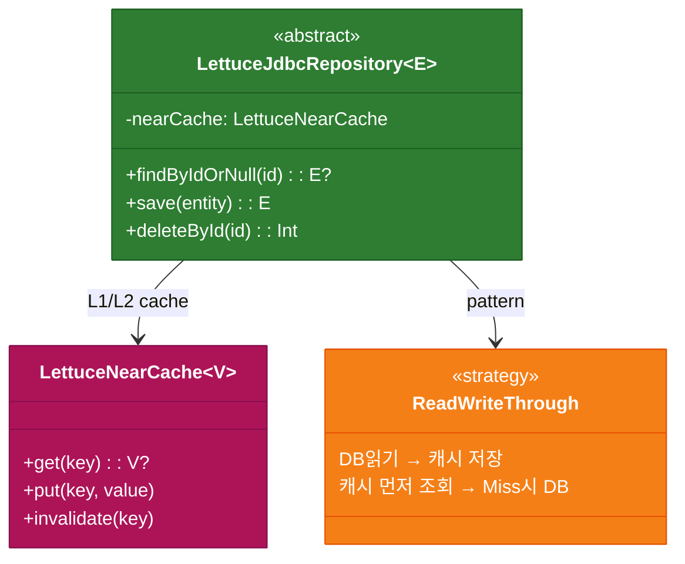
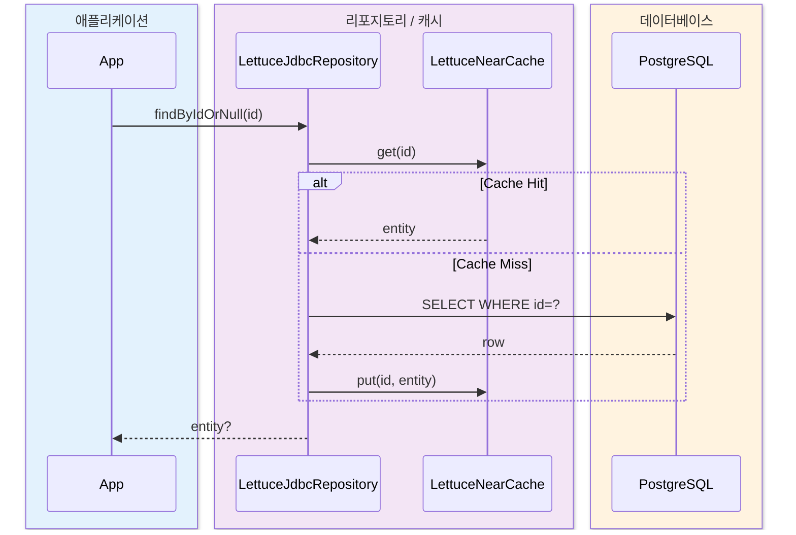

# Module bluetape4k-exposed-jdbc-lettuce

[English](./README.md) | 한국어

Exposed JDBC와 Lettuce Redis 캐시를 결합한 Read-through / Write-through / Write-behind 캐시 레포지토리 모듈입니다. 동기(
`JdbcLettuceRepository`) 버전과 코루틴 네이티브(`SuspendedJdbcLettuceRepository`) 버전을 모두 제공합니다.

## 개요

`bluetape4k-exposed-jdbc-lettuce`는 다음을 제공합니다:

- **Read-through 캐시**: `findById` 시 캐시 미스이면 DB에서 자동 로드 후 Redis에 캐싱
- **Write-through / Write-behind**: `save` 시 Redis와 DB를 동시(또는 비동기)로 반영
- **동기 레포지토리**: `JdbcLettuceRepository` / `AbstractJdbcLettuceRepository`
- **코루틴 레포지토리**: `SuspendedJdbcLettuceRepository` / `AbstractSuspendedJdbcLettuceRepository`
- **MapLoader / MapWriter**: Lettuce `LettuceLoadedMap` 연동을 위한 Exposed 기반 구현체
    - `loadAllKeys()`는 PK 오름차순으로 안정적으로 순회
    - writer의 `chunkSize`/loader의 `batchSize`는 0보다 커야 함

## 의존성 추가

```kotlin
dependencies {
    implementation("io.github.bluetape4k:bluetape4k-exposed-jdbc-lettuce:${version}")
}
```

## 기본 사용법

### 1. 동기 레포지토리 구현 (AbstractJdbcLettuceRepository)

```kotlin
import io.bluetape4k.exposed.lettuce.repository.AbstractJdbcLettuceRepository
import io.bluetape4k.redis.lettuce.map.LettuceCacheConfig
import io.lettuce.core.RedisClient

data class UserRecord(val id: Long, val name: String, val email: String)

class UserLettuceRepository(redisClient: RedisClient):
    AbstractJdbcLettuceRepository<Long, UserRecord>(
        client = redisClient,
        config = LettuceCacheConfig.READ_WRITE_THROUGH,
    ) {
    override val table = UserTable

    override fun ResultRow.toEntity() = UserRecord(
        id = this[UserTable.id].value,
        name = this[UserTable.name],
        email = this[UserTable.email],
    )

    override fun UpdateStatement.updateEntity(entity: UserRecord) {
        this[UserTable.name] = entity.name
        this[UserTable.email] = entity.email
    }

    override fun BatchInsertStatement.insertEntity(entity: UserRecord) {
        this[UserTable.id] = entity.id
        this[UserTable.name] = entity.name
        this[UserTable.email] = entity.email
    }

    override fun extractId(entity: UserRecord) = entity.id
}

// 사용
val repo = UserLettuceRepository(redisClient)
repo.save(1L, UserRecord(1L, "홍길동", "hong@example.com"))
val user = repo.findById(1L)   // 캐시 미스 시 DB 조회 후 캐싱
repo.delete(1L)                // Redis + DB 동시 삭제
```

### 2. 코루틴 레포지토리 구현 (AbstractSuspendedJdbcLettuceRepository)

```kotlin
import io.bluetape4k.exposed.lettuce.repository.AbstractSuspendedJdbcLettuceRepository

class UserSuspendedRepository(redisClient: RedisClient):
    AbstractSuspendedJdbcLettuceRepository<Long, UserRecord>(
        client = redisClient,
        config = LettuceCacheConfig.READ_WRITE_THROUGH,
    ) {
    override val table = UserTable
    override fun ResultRow.toEntity() = /* ... */
        override
    fun UpdateStatement.updateEntity(entity: UserRecord) = /* ... */
        override
    fun BatchInsertStatement.insertEntity(entity: UserRecord) = /* ... */
        override
    fun extractId(entity: UserRecord) = entity.id
}

// suspend 함수로 사용
suspend fun example(repo: UserSuspendedRepository) {
    repo.save(1L, UserRecord(1L, "홍길동", "hong@example.com"))
    val user = repo.findById(1L)     // NearCache → Redis → DB 순으로 조회
    repo.clearCache()                // Redis 캐시 전체 삭제
}
```

## 아키텍처 개요





## JdbcLettuceRepository 주요 메서드

| 메서드                           | 설명                               |
|-------------------------------|----------------------------------|
| `findById(id)`                | 캐시 조회 → 미스 시 DB Read-through     |
| `findAll(ids)`                | 다건 캐시 조회 → 미스 키만 DB Read-through |
| `findAll(limit, offset, ...)` | DB 조회 후 결과를 캐시에 적재               |
| `findByIdFromDb(id)`          | 캐시 우회, DB 직접 조회                  |
| `findAllFromDb(ids)`          | 캐시 우회, DB 직접 다건 조회               |
| `countFromDb()`               | DB 전체 레코드 수                      |
| `save(id, entity)`            | Redis 저장 + WriteMode에 따라 DB 반영   |
| `saveAll(entities)`           | 다건 저장                            |
| `delete(id)`                  | Redis + DB 동시 삭제                 |
| `deleteAll(ids)`              | 다건 삭제                            |
| `clearCache()`                | Redis 키 전체 삭제 (DB 영향 없음)         |

## LettuceCacheConfig — 쓰기 모드

| WriteMode            | 동작                            |
|----------------------|-------------------------------|
| `READ_WRITE_THROUGH` | save 시 Redis + DB 동시 반영 (기본값) |
| `READ_WRITE_BEHIND`  | save 시 Redis 즉시, DB는 비동기 반영   |
| `READ_ONLY`          | Redis에만 저장, DB 쓰기 없음          |

## 주요 파일/클래스 목록

| 파일                                                     | 설명                                                 |
|--------------------------------------------------------|----------------------------------------------------|
| `repository/JdbcLettuceRepository.kt`                  | 동기 캐시 레포지토리 인터페이스                                  |
| `repository/SuspendedJdbcLettuceRepository.kt`         | 코루틴 캐시 레포지토리 인터페이스                                 |
| `repository/AbstractJdbcLettuceRepository.kt`          | 동기 추상 구현체 (LettuceLoadedMap 기반)                    |
| `repository/AbstractSuspendedJdbcLettuceRepository.kt` | 코루틴 추상 구현체 (LettuceSuspendedLoadedMap + NearCache) |
| `map/EntityMapLoader.kt`                               | MapLoader 추상 기반 클래스                                |
| `map/EntityMapWriter.kt`                               | MapWriter 추상 기반 클래스 (Resilience4j Retry 내장)        |
| `map/ExposedEntityMapLoader.kt`                        | Exposed DSL 기반 동기 MapLoader                        |
| `map/ExposedEntityMapWriter.kt`                        | Exposed DSL 기반 동기 MapWriter                        |
| `map/SuspendedEntityMapLoader.kt`                      | suspendedTransactionAsync 기반 MapLoader             |
| `map/SuspendedEntityMapWriter.kt`                      | suspendedTransactionAsync + Retry 기반 MapWriter     |
| `map/SuspendedExposedEntityMapLoader.kt`               | Exposed DSL 기반 코루틴 MapLoader                       |
| `map/SuspendedExposedEntityMapWriter.kt`               | Exposed DSL 기반 코루틴 MapWriter                       |

## 테스트

```bash
./gradlew :bluetape4k-exposed-jdbc-lettuce:test
```

## 참고

- [bluetape4k-exposed-jdbc](../exposed-jdbc)
- [bluetape4k-lettuce](../../infra/lettuce)
- [Lettuce Redis Client](https://lettuce.io)
