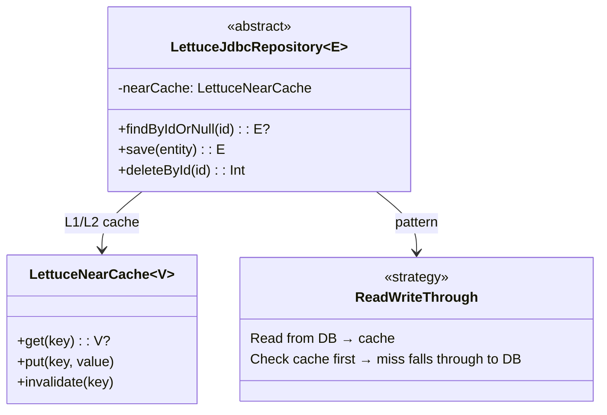
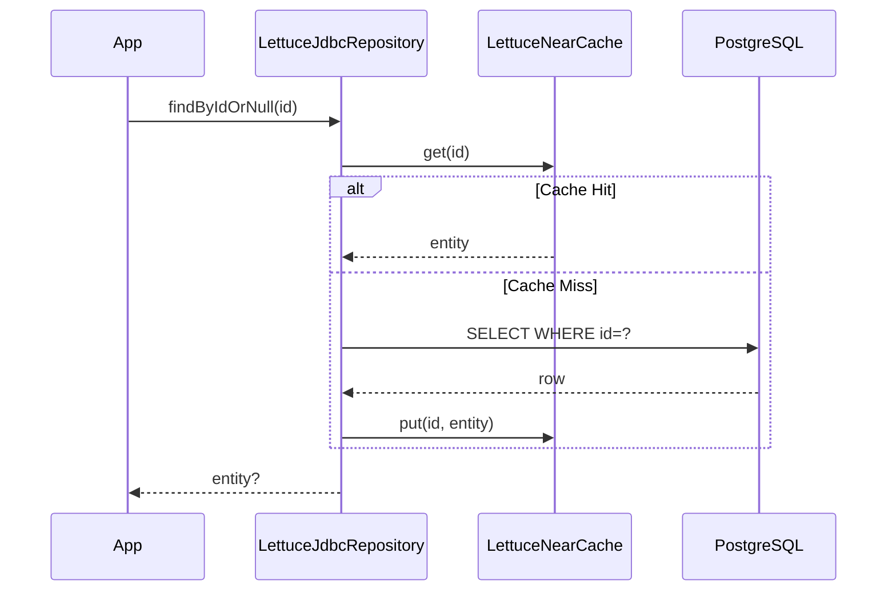

# Module bluetape4k-exposed-jdbc-lettuce

English | [한국어](./README.ko.md)

A Read-through / Write-through / Write-behind cache repository module that combines Exposed JDBC with Lettuce Redis. Provides both a synchronous (
`JdbcLettuceRepository`) and a coroutine-native (`SuspendedJdbcLettuceRepository`) implementation.

## Overview

`bluetape4k-exposed-jdbc-lettuce` provides:

- **Read-through cache**: On `findById` cache miss, automatically loads from DB and caches in Redis
- **Write-through / Write-behind**: On `save`, reflects changes in Redis and DB simultaneously (or asynchronously)
- **Synchronous repository**: `JdbcLettuceRepository` / `AbstractJdbcLettuceRepository`
- **Coroutine repository**: `SuspendedJdbcLettuceRepository` / `AbstractSuspendedJdbcLettuceRepository`
- **MapLoader / MapWriter**: Exposed-based implementations for Lettuce `LettuceLoadedMap` integration
    - `loadAllKeys()` iterates stably in ascending PK order
    - `chunkSize` (writer) and `batchSize` (loader) must be greater than 0

## Dependency

```kotlin
dependencies {
    implementation("io.github.bluetape4k:bluetape4k-exposed-jdbc-lettuce:${version}")
}
```

## Basic Usage

### 1. Synchronous Repository (AbstractJdbcLettuceRepository)

```kotlin
import io.bluetape4k.exposed.lettuce.repository.AbstractJdbcLettuceRepository
import io.bluetape4k.redis.lettuce.map.LettuceCacheConfig
import io.lettuce.core.RedisClient

data class UserRecord(val id: Long, val name: String, val email: String)

class UserLettuceRepository(redisClient: RedisClient):
    AbstractJdbcLettuceRepository<Long, UserRecord>(
        client = redisClient,
        config = LettuceCacheConfig.READ_WRITE_THROUGH,
    ) {
    override val table = UserTable

    override fun ResultRow.toEntity() = UserRecord(
        id = this[UserTable.id].value,
        name = this[UserTable.name],
        email = this[UserTable.email],
    )

    override fun UpdateStatement.updateEntity(entity: UserRecord) {
        this[UserTable.name] = entity.name
        this[UserTable.email] = entity.email
    }

    override fun BatchInsertStatement.insertEntity(entity: UserRecord) {
        this[UserTable.id] = entity.id
        this[UserTable.name] = entity.name
        this[UserTable.email] = entity.email
    }

    override fun extractId(entity: UserRecord) = entity.id
}

// Usage
val repo = UserLettuceRepository(redisClient)
repo.save(1L, UserRecord(1L, "Hong Gildong", "hong@example.com"))
val user = repo.findById(1L)   // On cache miss, loads from DB and caches
repo.delete(1L)                // Deletes from both Redis and DB
```

### 2. Coroutine Repository (AbstractSuspendedJdbcLettuceRepository)

```kotlin
import io.bluetape4k.exposed.lettuce.repository.AbstractSuspendedJdbcLettuceRepository

class UserSuspendedRepository(redisClient: RedisClient):
    AbstractSuspendedJdbcLettuceRepository<Long, UserRecord>(
        client = redisClient,
        config = LettuceCacheConfig.READ_WRITE_THROUGH,
    ) {
    override val table = UserTable
    override fun ResultRow.toEntity() = /* ... */
    override fun UpdateStatement.updateEntity(entity: UserRecord) = /* ... */
    override fun BatchInsertStatement.insertEntity(entity: UserRecord) = /* ... */
    override fun extractId(entity: UserRecord) = entity.id
}

// Use as suspend functions
suspend fun example(repo: UserSuspendedRepository) {
    repo.save(1L, UserRecord(1L, "Hong Gildong", "hong@example.com"))
    val user = repo.findById(1L)     // Checks NearCache → Redis → DB in order
    repo.clearCache()                // Clears all Redis cache keys
}
```

## Architecture Overview





## Key Methods of JdbcLettuceRepository

| Method                        | Description                                               |
|-------------------------------|-----------------------------------------------------------|
| `findById(id)`                | Cache lookup → DB Read-through on miss                    |
| `findAll(ids)`                | Batch cache lookup → DB Read-through for missed keys only |
| `findAll(limit, offset, ...)` | DB query with result loaded into cache                    |
| `findByIdFromDb(id)`          | Bypasses cache, queries DB directly                       |
| `findAllFromDb(ids)`          | Bypasses cache, queries DB directly for multiple IDs      |
| `countFromDb()`               | Total record count from DB                                |
| `save(id, entity)`            | Stores in Redis + reflects in DB according to WriteMode   |
| `saveAll(entities)`           | Batch save                                                |
| `delete(id)`                  | Deletes from both Redis and DB simultaneously             |
| `deleteAll(ids)`              | Batch delete                                              |
| `clearCache()`                | Removes all Redis keys (no effect on DB)                  |

## LettuceCacheConfig — Write Modes

| WriteMode            | Behavior                                                           |
|----------------------|--------------------------------------------------------------------|
| `READ_WRITE_THROUGH` | On save, writes to Redis + DB simultaneously (default)             |
| `READ_WRITE_BEHIND`  | On save, writes to Redis immediately; DB is updated asynchronously |
| `READ_ONLY`          | Stores in Redis only; no DB writes                                 |

## Key Files / Classes

| File                                                   | Description                                                               |
|--------------------------------------------------------|---------------------------------------------------------------------------|
| `repository/JdbcLettuceRepository.kt`                  | Synchronous cache repository interface                                    |
| `repository/SuspendedJdbcLettuceRepository.kt`         | Coroutine cache repository interface                                      |
| `repository/AbstractJdbcLettuceRepository.kt`          | Synchronous abstract implementation (LettuceLoadedMap-based)              |
| `repository/AbstractSuspendedJdbcLettuceRepository.kt` | Coroutine abstract implementation (LettuceSuspendedLoadedMap + NearCache) |
| `map/EntityMapLoader.kt`                               | Abstract base class for MapLoader                                         |
| `map/EntityMapWriter.kt`                               | Abstract base class for MapWriter (with built-in Resilience4j Retry)      |
| `map/ExposedEntityMapLoader.kt`                        | Exposed DSL-based synchronous MapLoader                                   |
| `map/ExposedEntityMapWriter.kt`                        | Exposed DSL-based synchronous MapWriter                                   |
| `map/SuspendedEntityMapLoader.kt`                      | MapLoader based on `suspendedTransactionAsync`                            |
| `map/SuspendedEntityMapWriter.kt`                      | MapWriter based on `suspendedTransactionAsync` + Retry                    |
| `map/SuspendedExposedEntityMapLoader.kt`               | Coroutine MapLoader based on Exposed DSL                                  |
| `map/SuspendedExposedEntityMapWriter.kt`               | Coroutine MapWriter based on Exposed DSL                                  |

## Testing

```bash
./gradlew :bluetape4k-exposed-jdbc-lettuce:test
```

## References

- [bluetape4k-exposed-jdbc](../exposed-jdbc)
- [bluetape4k-lettuce](../../infra/lettuce)
- [Lettuce Redis Client](https://lettuce.io)
