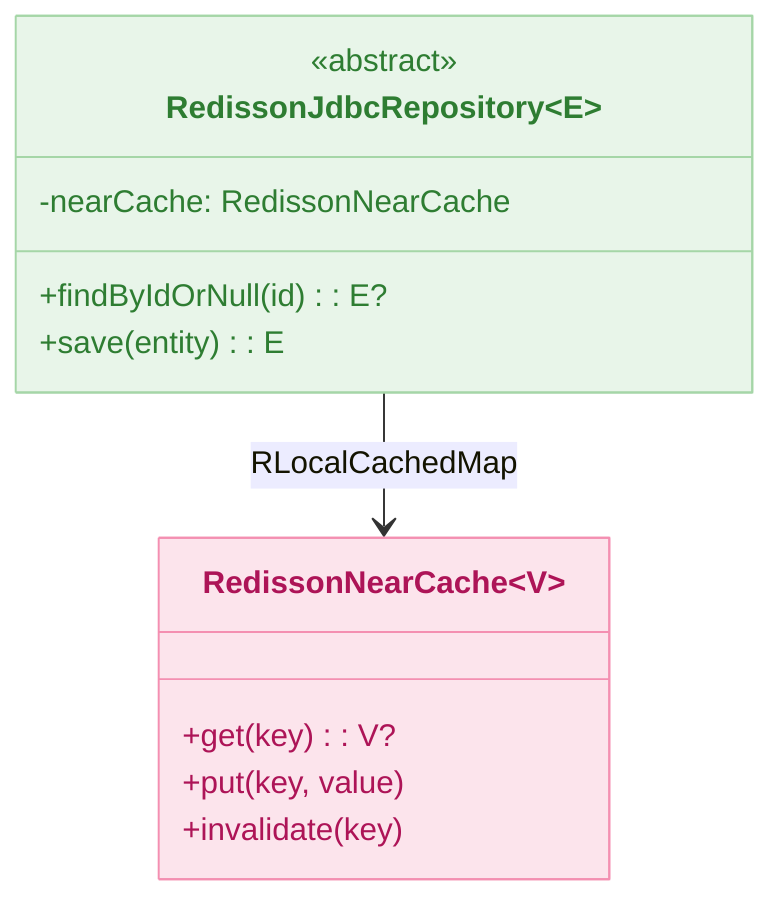
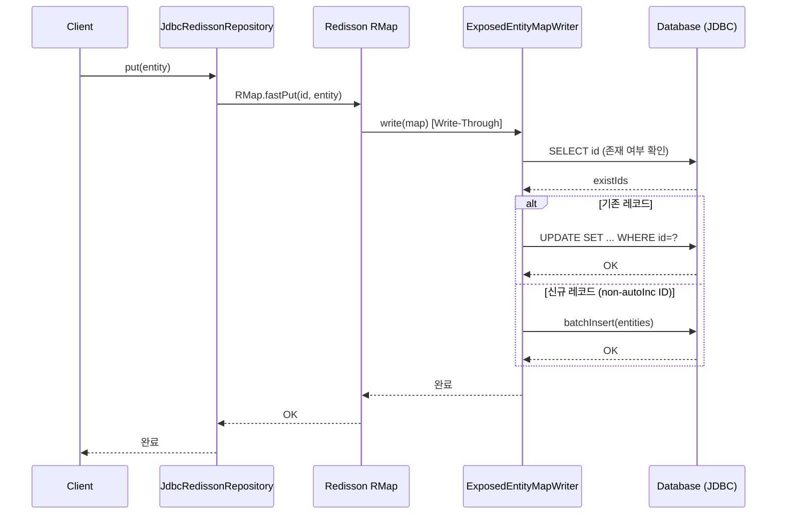
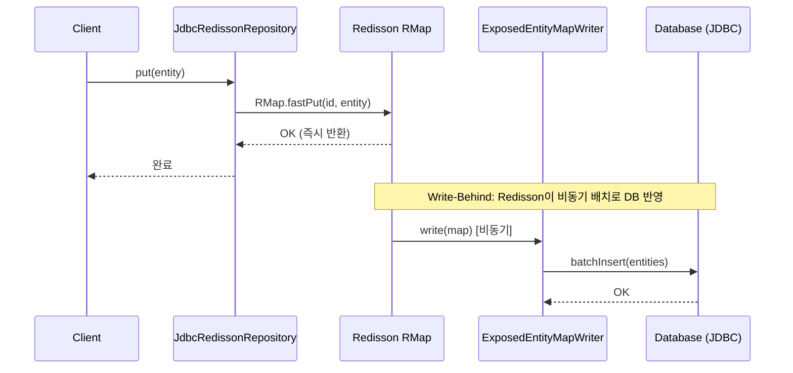
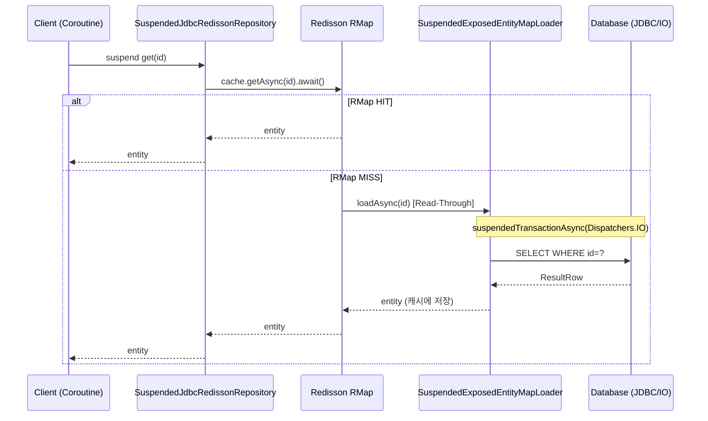
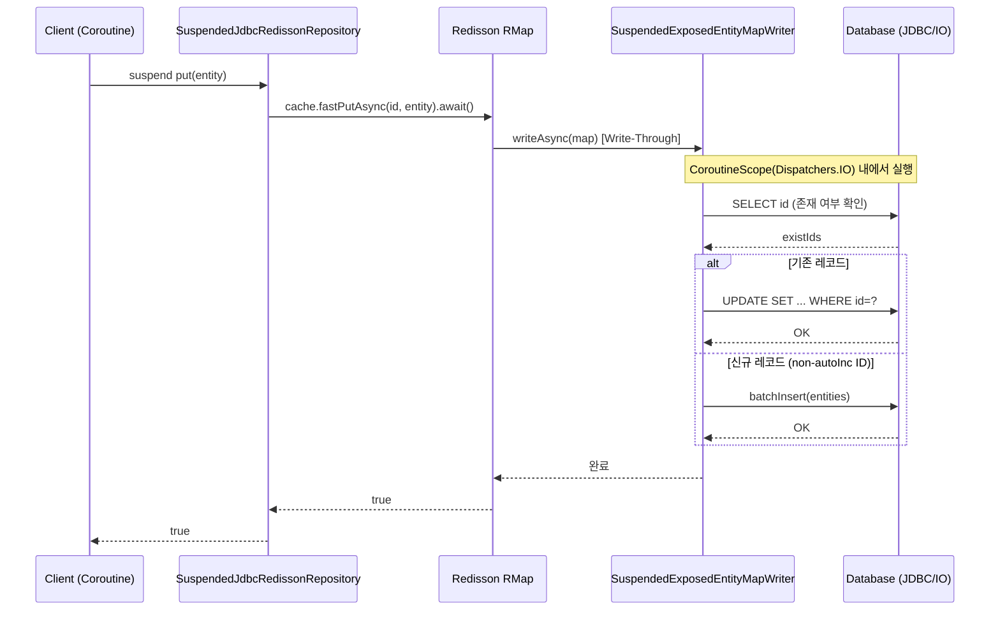
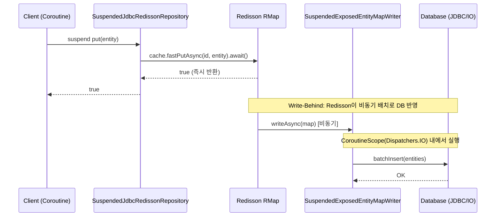

# Module bluetape4k-exposed-jdbc-redisson

[English](./README.md) | 한국어

Exposed JDBC와 Redisson 캐시를 결합해 Read-Through/Write-Through 캐시 패턴을 구성하는 모듈입니다.

## 개요

`bluetape4k-exposed-jdbc-redisson`은 JetBrains Exposed ORM과 [Redisson](https://github.com/redisson/redisson) Redis 클라이언트를 통합하여, 데이터베이스 조회 결과를 Redis에 캐싱하는 패턴을 쉽게 구현할 수 있도록 지원합니다.

### 주요 기능

- **MapLoader/MapWriter 지원**: Redisson Read-Through/Write-Through 캐시 연동
    - `loadAllKeys()`는 PK 오름차순으로 안정적으로 순회
- **Repository 추상화**: 캐시 + DB 접근 공통 패턴 (`JdbcRedissonRepository`, `SuspendedJdbcRedissonRepository`)
- **동기/코루틴 구현 제공**: 운영 환경에 맞는 방식 선택
- **Near Cache 지원**: Local Cache + Redis 2-Tier 캐시
- **Write-Behind 지원**: 비동기 DB 반영 패턴

## 의존성 추가

```kotlin
dependencies {
    implementation("io.github.bluetape4k:bluetape4k-exposed-jdbc-redisson:${version}")
    implementation("org.redisson:redisson:3.37.0")
}
```

## 기본 사용법

### 1. JdbcRedissonRepository (동기) 구현

`AbstractJdbcRedissonRepository`를 상속하여 동기 방식의 캐시 Repository를 구현합니다.

```kotlin
import io.bluetape4k.exposed.core.HasIdentifier
import io.bluetape4k.exposed.redisson.repository.AbstractJdbcRedissonRepository
import io.bluetape4k.redis.redisson.cache.RedisCacheConfig
import org.jetbrains.exposed.v1.core.ResultRow
import org.jetbrains.exposed.v1.core.dao.id.LongIdTable
import org.jetbrains.exposed.v1.core.statements.UpdateStatement
import org.jetbrains.exposed.v1.jdbc.update
import org.redisson.api.RedissonClient

// 엔티티 (java.io.Serializable 필수)
data class UserRecord(
    override val id: Long,
    val name: String,
    val email: String,
): HasIdentifier<Long>, java.io.Serializable

object UserTable: LongIdTable("users") {
    val name = varchar("name", 100)
    val email = varchar("email", 200)
}

class UserRedissonRepository(
    redissonClient: RedissonClient,
    config: RedisCacheConfig,
): AbstractJdbcRedissonRepository<Long, UserTable, UserRecord>(
    redissonClient = redissonClient,
    cacheName = "users",
    config = config,
) {
    override val entityTable = UserTable

    override fun ResultRow.toEntity() = UserRecord(
        id    = this[UserTable.id].value,
        name  = this[UserTable.name],
        email = this[UserTable.email],
    )

    // Write-Through 모드 시 구현 필요
    override fun UpdateStatement.updateEntity(entity: UserRecord) {
        this[UserTable.name]  = entity.name
        this[UserTable.email] = entity.email
    }
}

// 사용 (Read-Through)
val repo = UserRedissonRepository(redissonClient, RedisCacheConfig.READ_ONLY)

// 캐시에서 조회 (미스 시 DB에서 자동 로드)
val user = repo[1L]

// ID 존재 여부 확인 (캐시 미스 시 DB Read-Through)
val exists = repo.exists(1L)

// DB에서 직접 조회 (캐시 우회)
val freshUser = repo.findByIdFromDb(1L)

// 여러 엔티티 일괄 조회
val users = repo.getAll(listOf(1L, 2L, 3L))

// DB 조회 후 캐시에 저장
val allUsers = repo.findAll(limit = 100)

// 캐시 무효화
repo.invalidate(1L)
repo.invalidateAll()
repo.invalidateByPattern("*홍*")  // 패턴으로 무효화
```

### 2. SuspendedJdbcRedissonRepository (코루틴) 구현

`AbstractSuspendedJdbcRedissonRepository`를 상속하여 코루틴 방식의 캐시 Repository를 구현합니다.

```kotlin
import io.bluetape4k.exposed.redisson.repository.AbstractSuspendedJdbcRedissonRepository
import io.bluetape4k.redis.redisson.cache.RedisCacheConfig
import org.redisson.api.RedissonClient

class SuspendedUserRedissonRepository(
    redissonClient: RedissonClient,
    config: RedisCacheConfig,
): AbstractSuspendedJdbcRedissonRepository<Long, UserTable, UserRecord>(
    redissonClient = redissonClient,
    cacheName = "users",
    config = config,
) {
    override val entityTable = UserTable

    override fun ResultRow.toEntity() = UserRecord(
        id    = this[UserTable.id].value,
        name  = this[UserTable.name],
        email = this[UserTable.email],
    )
}

// 사용 (suspend 함수)
val repo = SuspendedUserRedissonRepository(redissonClient, RedisCacheConfig.READ_ONLY)

val user = repo.get(1L)                          // 캐시 조회 (미스 시 DB Read-Through)
val exists = repo.exists(1L)                     // 존재 여부 확인
val fresh = repo.findByIdFromDb(1L)              // DB 직접 조회 (캐시 우회)
val all = repo.findAll(limit = 100)              // DB 조회 후 캐시 저장
val batch = repo.getAll(listOf(1L, 2L, 3L))     // 여러 엔티티 일괄 조회
repo.put(user!!)                                 // 캐시 저장
repo.putAll(batch)                               // 일괄 캐시 저장
repo.invalidate(1L)                              // 캐시 무효화
repo.invalidateAll()                             // 전체 캐시 무효화 (Boolean 반환)
repo.invalidateByPattern("user:*")               // 패턴으로 무효화
```

### 3. 캐시 패턴 설정

```kotlin
import io.bluetape4k.redis.redisson.cache.RedisCacheConfig
import org.redisson.api.map.WriteMode

// Read-Through Only (기본) — 캐시 미스 시 DB에서 자동 로드
val readOnlyConfig = RedisCacheConfig.READ_ONLY

// Read-Through + Near Cache — 로컬 캐시 + Redis 2단계 캐시
val readOnlyNearCacheConfig = RedisCacheConfig.READ_ONLY_WITH_NEAR_CACHE

// Read-Through + Write-Through — 캐시 저장 즉시 DB에도 동기 반영
val writeThroughConfig = RedisCacheConfig.READ_WRITE_THROUGH

// Read-Through + Write-Through + Near Cache
val writeThroughNearCacheConfig = RedisCacheConfig.READ_WRITE_THROUGH_WITH_NEAR_CACHE

// Read-Through + Write-Behind — 캐시 저장 후 비동기로 DB에 반영
val writeBehindConfig = RedisCacheConfig.WRITE_BEHIND

// Read-Through + Write-Behind + Near Cache
val writeBehindNearCacheConfig = RedisCacheConfig.WRITE_BEHIND_WITH_NEAR_CACHE

// invalidate 시 DB에서도 삭제하는 설정 (deleteFromDBOnInvalidate=true)
// ⚠️ 주의: 프로덕션 환경에서 신중하게 사용하세요.
val deleteFromDbConfig = RedisCacheConfig.READ_WRITE_THROUGH.copy(
    deleteFromDBOnInvalidate = true,
)
```

### 4. Write-Through / Write-Behind Repository 구현

Write-Through/Write-Behind 모드에서는 `UpdateStatement.updateEntity`와 `BatchInsertStatement.insertEntity`를 추가로 구현합니다.

```kotlin
class UserWriteThroughRepository(
    redissonClient: RedissonClient,
): AbstractJdbcRedissonRepository<Long, UserTable, UserRecord>(
    redissonClient = redissonClient,
    cacheName = "users:write-through",
    config = RedisCacheConfig.READ_WRITE_THROUGH,
) {
    override val entityTable = UserTable

    override fun ResultRow.toEntity() = UserRecord(
        id    = this[UserTable.id].value,
        name  = this[UserTable.name],
        email = this[UserTable.email],
    )

    // 기존 레코드 UPDATE 시 호출
    override fun UpdateStatement.updateEntity(entity: UserRecord) {
        this[UserTable.name]  = entity.name
        this[UserTable.email] = entity.email
    }

    // 신규 레코드 INSERT 시 호출 (client-side ID인 경우)
    override fun BatchInsertStatement.insertEntity(entity: UserRecord) {
        this[UserTable.id]    = EntityID(entity.id, UserTable)
        this[UserTable.name]  = entity.name
        this[UserTable.email] = entity.email
    }
}

// Write-Through 사용 예
val repo = UserWriteThroughRepository(redissonClient)
transaction {
    val user = UserRecord(id = 0, name = "홍길동", email = "hong@example.com")
    repo.put(user)                   // 캐시 저장 + DB 동기 반영
    repo.putAll(listOf(user))        // 일괄 캐시 저장 + DB 동기 반영
    repo.invalidate(user.id)         // 캐시 제거 (deleteFromDBOnInvalidate=true 면 DB도 삭제)
}
```

## 아키텍처 개요



## 클래스 다이어그램

### 동기 Repository 계층 구조

```mermaid
classDiagram
    class JdbcRedissonRepository~ID_E~ {
        <<interface>>
        +cacheName: String
        +table: IdTable~ID~
        +cache: RMap~ID, E~
        +extractId(entity: E): ID
        +toEntity(ResultRow): E
        +exists(id: ID): Boolean
        +get(id: ID): E?
        +getAll(ids, batchSize): List~E~
        +findByIdFromDb(id: ID): E?
        +findAllFromDb(ids): List~E~
        +findAll(limit, offset, sortBy, where): List~E~
        +put(entity: E)
        +putAll(entities, batchSize)
        +invalidate(vararg ids): Long
        +invalidateAll()
        +invalidateByPattern(patterns, count): Long
    }

    class AbstractJdbcRedissonRepository~ID_E~ {
        <<abstract>>
        +redissonClient: RedissonClient
        +cacheName: String
        #config: RedissonCacheConfig
        #mapLoader: EntityMapLoader~ID, E~
        #mapWriter: EntityMapWriter~ID, E~?
        #createLocalCacheMap(): RLocalCachedMap
        #createMapCache(): RMapCache
        #UpdateStatement.updateEntity(entity)
        #BatchInsertStatement.insertEntity(entity)
        +findAll(...): List~E~
        +getAll(ids, batchSize): List~E~
    }

    class EntityMapLoader~ID_E~ {
        <<abstract>>
        +load(key: ID): E?
        +loadAllKeys(): Iterable~ID~?
    }

    class EntityMapWriter~ID_E~ {
        <<abstract>>
        +write(map: Map~ID, E~)
        +delete(keys: Collection~Any~)
    }

    class ExposedEntityMapLoader~ID_E~ {
        -entityTable: IdTable~ID~
        -batchSize: Int
        -toEntity: ResultRow.() -> E
    }

    class ExposedEntityMapWriter~ID_E~ {
        -entityTable: IdTable~ID~
        -updateBody: (UpdateStatement, E) -> Unit
        -batchInsertBody: BatchInsertStatement.(E) -> Unit
        -deleteFromDBOnInvalidate: Boolean
        -writeMode: WriteMode
    }

    JdbcRedissonRepository~ID_E~ <|.. AbstractJdbcRedissonRepository~ID_E~
    AbstractJdbcRedissonRepository~ID_E~ --> EntityMapLoader~ID_E~ : mapLoader
    AbstractJdbcRedissonRepository~ID_E~ --> EntityMapWriter~ID_E~ : mapWriter (nullable)
    EntityMapLoader~ID_E~ <|-- ExposedEntityMapLoader~ID_E~
    EntityMapWriter~ID_E~ <|-- ExposedEntityMapWriter~ID_E~

    style JdbcRedissonRepository fill:#E3F2FD,stroke:#90CAF9,color:#1565C0
    style AbstractJdbcRedissonRepository fill:#E8F5E9,stroke:#A5D6A7,color:#2E7D32
    style EntityMapLoader fill:#E3F2FD,stroke:#90CAF9,color:#1565C0
    style EntityMapWriter fill:#E3F2FD,stroke:#90CAF9,color:#1565C0
    style ExposedEntityMapLoader fill:#E0F2F1,stroke:#80CBC4,color:#00695C
    style ExposedEntityMapWriter fill:#E0F2F1,stroke:#80CBC4,color:#00695C


### 코루틴(Suspend) Repository 계층 구조

```mermaid
classDiagram
    class SuspendedJdbcRedissonRepository~ID_E~ {
        <<interface>>
        +cacheName: String
        +table: IdTable~ID~
        +cache: RMap~ID, E~
        +extractId(entity: E): ID
        +toEntity(ResultRow): E
        +exists(id: ID): Boolean [suspend]
        +get(id: ID): E? [suspend]
        +getAll(ids, batchSize): List~E~ [suspend]
        +findByIdFromDb(id: ID): E? [suspend]
        +findAllFromDb(ids): List~E~ [suspend]
        +findAll(...): List~E~ [suspend]
        +put(entity: E): Boolean [suspend]
        +putAll(entities, batchSize) [suspend]
        +invalidate(vararg ids): Long [suspend]
        +invalidateAll(): Boolean [suspend]
        +invalidateByPattern(patterns, count): Long [suspend]
    }

    class AbstractSuspendedJdbcRedissonRepository~ID_E~ {
        <<abstract>>
        +redissonClient: RedissonClient
        +cacheName: String
        #config: RedissonCacheConfig
        #scope: CoroutineScope
        #suspendedMapLoader: SuspendedEntityMapLoader~ID, E~
        #suspendedMapWriter: SuspendedEntityMapWriter~ID, E~?
        #createLocalCacheMap(): RLocalCachedMap
        #createMapCache(): RMapCache
        #UpdateStatement.updateEntity(entity)
        #BatchInsertStatement.insertEntity(entity)
        +findAll(...): List~E~ [suspend]
        +getAll(ids, batchSize): List~E~ [suspend]
    }

    class SuspendedEntityMapLoader~ID_E~ {
        <<abstract>>
        +load(key: ID): CompletableFuture~E~
        +loadAllKeys(): AsyncIterator~ID~
    }

    class SuspendedEntityMapWriter~ID_E~ {
        <<abstract>>
        +write(map: Map~ID, E~): CompletableFuture~Void~
        +delete(keys: Collection~Any~): CompletableFuture~Void~
    }

    class SuspendedExposedEntityMapLoader~ID_E~ {
        -entityTable: IdTable~ID~
        -scope: CoroutineScope
        -batchSize: Int
        -toEntity: ResultRow.() -> E
    }

    class SuspendedExposedEntityMapWriter~ID_E~ {
        -entityTable: IdTable~ID~
        -scope: CoroutineScope
        -updateBody: (UpdateStatement, E) -> Unit
        -batchInsertBody: BatchInsertStatement.(E) -> Unit
        -deleteFromDBOnInvalidate: Boolean
        -writeMode: WriteMode
    }

    SuspendedJdbcRedissonRepository~ID_E~ <|.. AbstractSuspendedJdbcRedissonRepository~ID_E~
    AbstractSuspendedJdbcRedissonRepository~ID_E~ --> SuspendedEntityMapLoader~ID_E~ : suspendedMapLoader
    AbstractSuspendedJdbcRedissonRepository~ID_E~ --> SuspendedEntityMapWriter~ID_E~ : suspendedMapWriter (nullable)
    SuspendedEntityMapLoader~ID_E~ <|-- SuspendedExposedEntityMapLoader~ID_E~
    SuspendedEntityMapWriter~ID_E~ <|-- SuspendedExposedEntityMapWriter~ID_E~

    style SuspendedJdbcRedissonRepository fill:#E3F2FD,stroke:#90CAF9,color:#1565C0
    style AbstractSuspendedJdbcRedissonRepository fill:#F3E5F5,stroke:#CE93D8,color:#6A1B9A
    style SuspendedEntityMapLoader fill:#E3F2FD,stroke:#90CAF9,color:#1565C0
    style SuspendedEntityMapWriter fill:#E3F2FD,stroke:#90CAF9,color:#1565C0
    style SuspendedExposedEntityMapLoader fill:#E0F2F1,stroke:#80CBC4,color:#00695C
    style SuspendedExposedEntityMapWriter fill:#E0F2F1,stroke:#80CBC4,color:#00695C


## 캐시 패턴

### Read-Through (동기)

캐시 미스 시 `ExposedEntityMapLoader`가 DB에서 자동 로드합니다.

```mermaid
sequenceDiagram
        participant Client as Client
        participant Repo as JdbcRedissonRepository
        participant RMap as Redisson RMap
        participant Loader as ExposedEntityMapLoader
        participant DB as Database (JDBC)

    Client->>Repo: get(id) / exists(id)
    Repo->>RMap: RMap.get(id)
    alt RMap HIT
        RMap-->>Repo: entity
        Repo-->>Client: entity
    else RMap MISS
        RMap->>Loader: load(id) [Read-Through]
        Loader->>DB: SELECT WHERE id=?
        DB-->>Loader: ResultRow
        Loader-->>RMap: entity (캐시에 저장)
        RMap-->>Repo: entity
        Repo-->>Client: entity
    end
```

### Write-Through (동기)

`put()` 호출 시 `ExposedEntityMapWriter`가 DB에 즉시 동기 반영합니다.



### Write-Behind (동기)

`put()` 호출 즉시 응답하고, 이후 `ExposedEntityMapWriter`가 비동기로 DB에 배치 반영합니다.



### Read-Through (Suspend 코루틴)

`SuspendedJdbcRedissonRepository`는 모든 연산을 `suspend` 함수로 제공합니다.



### Write-Through (Suspend 코루틴)



### Write-Behind (Suspend 코루틴)



## JdbcRedissonRepository / SuspendedJdbcRedissonRepository 주요 메서드

`JdbcRedissonRepository`는 동기 방식, `SuspendedJdbcRedissonRepository`는 동일 API를 `suspend` 함수로 제공합니다.

| 메서드                                     | 설명                                                 |
|-----------------------------------------|----------------------------------------------------|
| `exists(id)`                            | 캐시에 해당 ID 존재 여부 확인 (미스 시 DB Read-Through)          |
| `get(id)` / `cache[id]`                 | 캐시에서 엔티티 조회 (Read-Through)                         |
| `getAll(ids, batchSize)`                | 캐시에서 여러 엔티티 일괄 조회                                  |
| `findByIdFromDb(id)`                    | DB에서 직접 조회 (캐시 우회)                                 |
| `findAllFromDb(ids)`                    | DB에서 여러 엔티티 직접 조회 (캐시 우회)                          |
| `findAll(limit, offset, sortBy, where)` | DB 조회 후 결과를 캐시에 저장하여 반환                            |
| `put(entity)`                           | 캐시에 저장 (Write-Through/Behind 모드 시 DB에도 반영)         |
| `putAll(entities, batchSize)`           | 캐시에 일괄 저장                                          |
| `invalidate(ids)`                       | 캐시에서 제거 (`deleteFromDBOnInvalidate=true` 시 DB도 삭제) |
| `invalidateAll()`                       | 캐시 전체 비우기                                          |
| `invalidateByPattern(pattern, count)`   | 패턴에 맞는 키 캐시 제거                                     |

> **참고**: `SuspendedJdbcRedissonRepository`의 `invalidateAll()`은 `Boolean`을 반환합니다.

## 주요 파일/클래스 목록

### Repository (repository/)

| 파일                                           | 설명                                  |
|----------------------------------------------|-------------------------------------|
| `JdbcRedissonRepository.kt`                  | 동기식 캐시 Repository 인터페이스             |
| `AbstractJdbcRedissonRepository.kt`          | 동기식 캐시 Repository 추상 클래스            |
| `SuspendedJdbcRedissonRepository.kt`         | 코루틴 캐시 Repository 인터페이스             |
| `AbstractSuspendedJdbcRedissonRepository.kt` | 코루틴 캐시 Repository 추상 클래스            |
| `ExposedCacheRepository.kt`                  | (Deprecated) 구 동기식 Repository 인터페이스 |
| `AbstractExposedCacheRepository.kt`          | (Deprecated) 구 동기식 추상 클래스           |
| `SuspendedExposedCacheRepository.kt`         | (Deprecated) 구 코루틴 Repository 인터페이스 |
| `AbstractSuspendedExposedCacheRepository.kt` | (Deprecated) 구 코루틴 추상 클래스           |

### Map (map/)

| 파일                                   | 설명                        |
|--------------------------------------|---------------------------|
| `EntityMapLoader.kt`                 | 동기식 MapLoader 인터페이스       |
| `EntityMapWriter.kt`                 | 동기식 MapWriter 인터페이스       |
| `ExposedEntityMapLoader.kt`          | Exposed JDBC 기반 MapLoader |
| `ExposedEntityMapWriter.kt`          | Exposed JDBC 기반 MapWriter |
| `SuspendedEntityMapLoader.kt`        | 코루틴 MapLoader 인터페이스       |
| `SuspendedEntityMapWriter.kt`        | 코루틴 MapWriter 인터페이스       |
| `SuspendedExposedEntityMapLoader.kt` | 코루틴 MapLoader 구현체         |
| `SuspendedExposedEntityMapWriter.kt` | 코루틴 MapWriter 구현체         |

## 테스트

```bash
./gradlew :bluetape4k-exposed-jdbc-redisson:test
```

## 참고

- [JetBrains Exposed](https://github.com/JetBrains/Exposed)
- [Redisson](https://github.com/redisson/redisson)
- [Redisson RMap](https://www.javadoc.io/doc/org.redisson/redisson/latest/org/redisson/api/RMap.html)
- [bluetape4k-exposed-jdbc](../exposed-jdbc)
