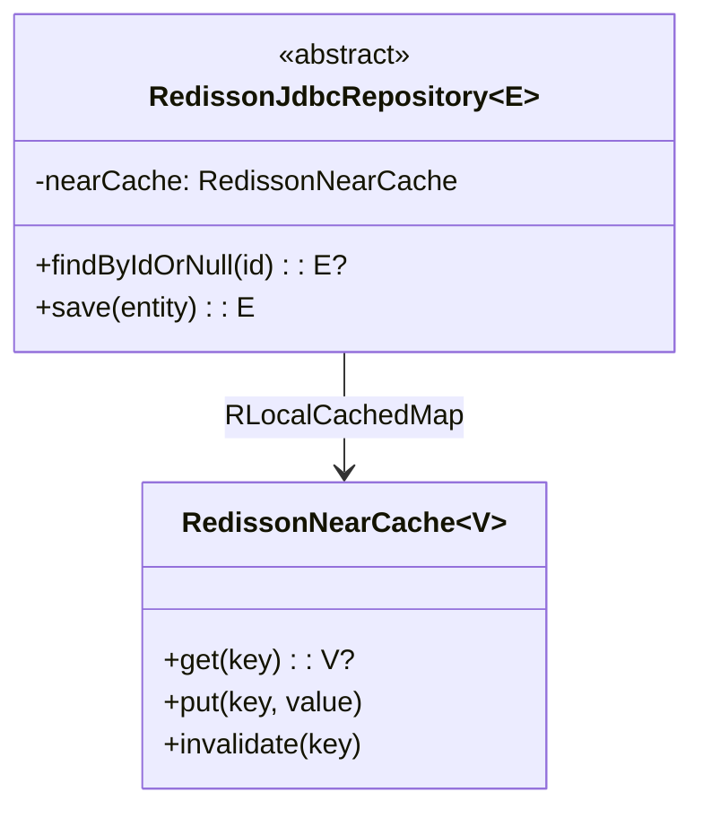
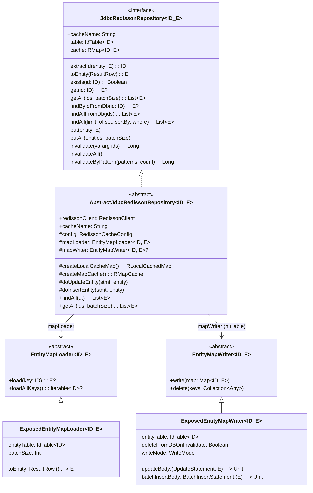
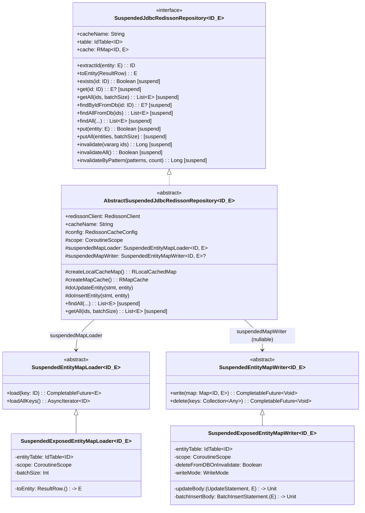
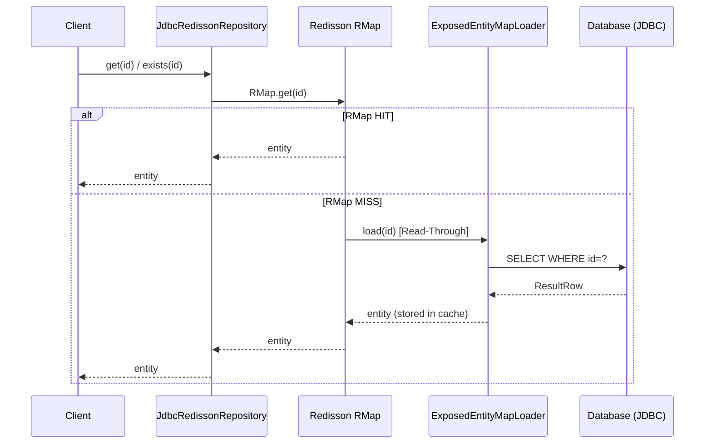
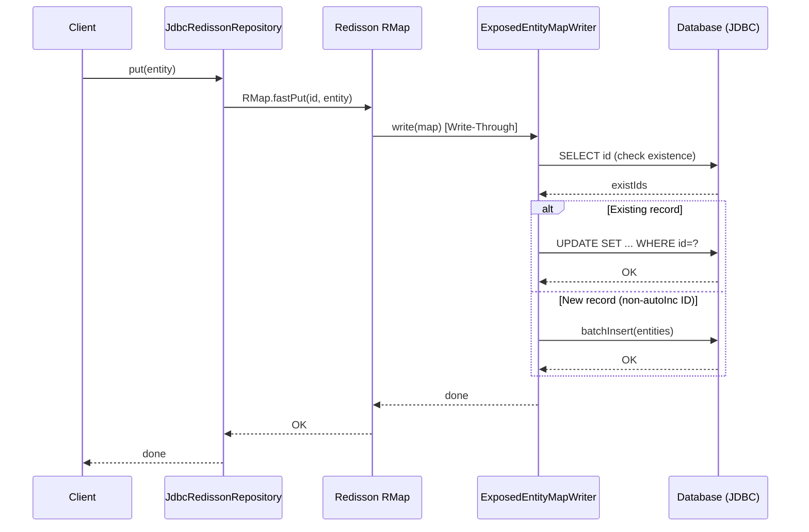
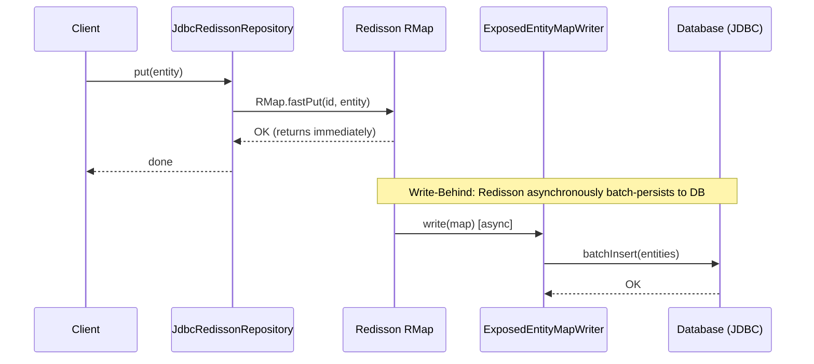
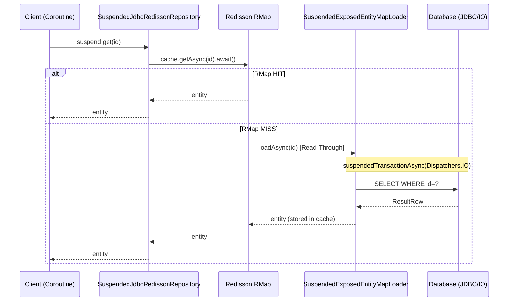
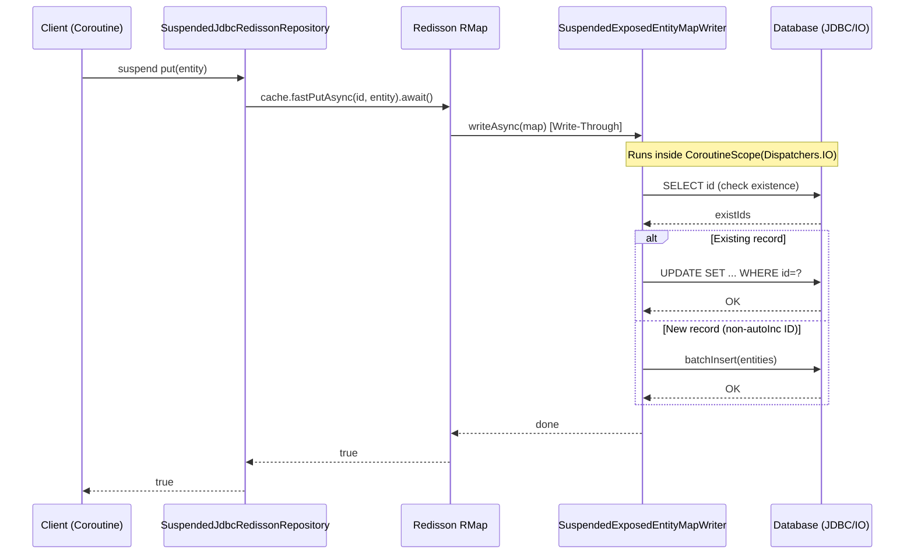
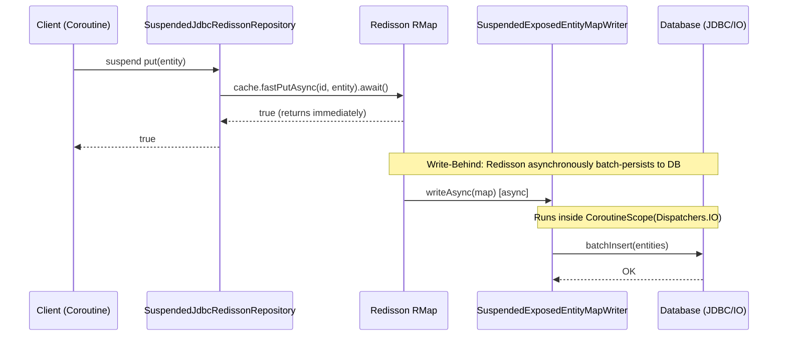

# Module bluetape4k-exposed-jdbc-redisson

English | [한국어](./README.ko.md)

Combines Exposed JDBC with Redisson caching to implement Read-Through/Write-Through cache patterns.

## Overview

`bluetape4k-exposed-jdbc-redisson` integrates JetBrains Exposed ORM with the [Redisson](https://github.com/redisson/redisson) Redis client, making it easy to cache database query results in Redis.

### Key Features

- **MapLoader/MapWriter support**: Integration with Redisson Read-Through/Write-Through caching
  - `loadAllKeys()` iterates reliably in ascending primary key order
- **Repository abstraction**: Common cache + DB access patterns (`JdbcRedissonRepository`, `SuspendedJdbcRedissonRepository`)
- **Sync and Coroutines implementations**: Choose the right approach for your environment
- **Near Cache support**: Two-tier Local Cache + Redis caching
- **Write-Behind support**: Asynchronous DB persistence pattern

## Adding Dependencies

```kotlin
dependencies {
    implementation("io.github.bluetape4k:bluetape4k-exposed-jdbc-redisson:${version}")
    implementation("org.redisson:redisson:3.37.0")
}
```

## Basic Usage

### 1. Implementing JdbcRedissonRepository (synchronous)

Extend `AbstractJdbcRedissonRepository` to implement a synchronous cache Repository.

```kotlin
import io.bluetape4k.exposed.core.HasIdentifier
import io.bluetape4k.exposed.redisson.repository.AbstractJdbcRedissonRepository
import io.bluetape4k.redis.redisson.cache.RedisCacheConfig
import org.jetbrains.exposed.v1.core.ResultRow
import org.jetbrains.exposed.v1.core.dao.id.LongIdTable
import org.jetbrains.exposed.v1.core.statements.UpdateStatement
import org.jetbrains.exposed.v1.jdbc.update
import org.redisson.api.RedissonClient

// Entity (must implement java.io.Serializable)
data class UserRecord(
    override val id: Long,
    val name: String,
    val email: String,
): HasIdentifier<Long>, java.io.Serializable

object UserTable: LongIdTable("users") {
    val name = varchar("name", 100)
    val email = varchar("email", 200)
}

class UserRedissonRepository(
    redissonClient: RedissonClient,
    config: RedisCacheConfig,
): AbstractJdbcRedissonRepository<Long, UserTable, UserRecord>(
    redissonClient = redissonClient,
    cacheName = "users",
    config = config,
) {
    override val entityTable = UserTable

    override fun ResultRow.toEntity() = UserRecord(
        id    = this[UserTable.id].value,
        name  = this[UserTable.name],
        email = this[UserTable.email],
    )

    // Required for Write-Through mode
    override fun doUpdateEntity(statement: UpdateStatement, entity: UserRecord) {
        statement[UserTable.name]  = entity.name
        statement[UserTable.email] = entity.email
    }
}

// Usage (Read-Through)
val repo = UserRedissonRepository(redissonClient, RedisCacheConfig.READ_ONLY)

// Retrieve from cache (auto-loads from DB on miss)
val user = repo[1L]

// Check existence by ID (DB Read-Through on cache miss)
val exists = repo.exists(1L)

// Bypass cache and query DB directly
val freshUser = repo.findByIdFromDb(1L)

// Batch retrieval of multiple entities
val users = repo.getAll(listOf(1L, 2L, 3L))

// Load from DB and store in cache
val allUsers = repo.findAll(limit = 100)

// Invalidate cache
repo.invalidate(1L)
repo.invalidateAll()
repo.invalidateByPattern("*John*")  // Invalidate by pattern
```

### 2. Implementing SuspendedJdbcRedissonRepository (Coroutines)

Extend `AbstractSuspendedJdbcRedissonRepository` to implement a coroutine-based cache Repository.

```kotlin
import io.bluetape4k.exposed.redisson.repository.AbstractSuspendedJdbcRedissonRepository
import io.bluetape4k.redis.redisson.cache.RedisCacheConfig
import org.redisson.api.RedissonClient

class SuspendedUserRedissonRepository(
    redissonClient: RedissonClient,
    config: RedisCacheConfig,
): AbstractSuspendedJdbcRedissonRepository<Long, UserTable, UserRecord>(
    redissonClient = redissonClient,
    cacheName = "users",
    config = config,
) {
    override val entityTable = UserTable

    override fun ResultRow.toEntity() = UserRecord(
        id    = this[UserTable.id].value,
        name  = this[UserTable.name],
        email = this[UserTable.email],
    )
}

// Usage (suspend functions)
val repo = SuspendedUserRedissonRepository(redissonClient, RedisCacheConfig.READ_ONLY)

val user = repo.get(1L)                          // Cache lookup (DB Read-Through on miss)
val exists = repo.exists(1L)                     // Check existence
val fresh = repo.findByIdFromDb(1L)              // Bypass cache, query DB directly
val all = repo.findAll(limit = 100)              // Load from DB, populate cache
val batch = repo.getAll(listOf(1L, 2L, 3L))     // Batch retrieval
repo.put(user!!)                                 // Store in cache
repo.putAll(batch)                               // Batch store in cache
repo.invalidate(1L)                              // Invalidate single entry
repo.invalidateAll()                             // Invalidate all (returns Boolean)
repo.invalidateByPattern("user:*")               // Invalidate by pattern
```

### 3. Cache pattern configuration

```kotlin
import io.bluetape4k.redis.redisson.cache.RedisCacheConfig
import org.redisson.api.map.WriteMode

// Read-Through Only (default) — auto-loads from DB on cache miss
val readOnlyConfig = RedisCacheConfig.READ_ONLY

// Read-Through + Near Cache — two-tier Local Cache + Redis
val readOnlyNearCacheConfig = RedisCacheConfig.READ_ONLY_WITH_NEAR_CACHE

// Read-Through + Write-Through — synchronously persists to DB on cache write
val writeThroughConfig = RedisCacheConfig.READ_WRITE_THROUGH

// Read-Through + Write-Through + Near Cache
val writeThroughNearCacheConfig = RedisCacheConfig.READ_WRITE_THROUGH_WITH_NEAR_CACHE

// Read-Through + Write-Behind — asynchronously persists to DB after cache write
val writeBehindConfig = RedisCacheConfig.WRITE_BEHIND

// Read-Through + Write-Behind + Near Cache
val writeBehindNearCacheConfig = RedisCacheConfig.WRITE_BEHIND_WITH_NEAR_CACHE

// Also delete from DB on invalidate (deleteFromDBOnInvalidate=true)
// ⚠️ Use with caution in production.
val deleteFromDbConfig = RedisCacheConfig.READ_WRITE_THROUGH.copy(
    deleteFromDBOnInvalidate = true,
)
```

### 4. Write-Through / Write-Behind Repository implementation

In Write-Through/Write-Behind mode, also implement `doUpdateEntity` and `doInsertEntity`.

```kotlin
class UserWriteThroughRepository(
    redissonClient: RedissonClient,
): AbstractJdbcRedissonRepository<Long, UserTable, UserRecord>(
    redissonClient = redissonClient,
    cacheName = "users:write-through",
    config = RedisCacheConfig.READ_WRITE_THROUGH,
) {
    override val entityTable = UserTable

    override fun ResultRow.toEntity() = UserRecord(
        id    = this[UserTable.id].value,
        name  = this[UserTable.name],
        email = this[UserTable.email],
    )

    // Called on UPDATE of an existing record
    override fun doUpdateEntity(statement: UpdateStatement, entity: UserRecord) {
        statement[UserTable.name]  = entity.name
        statement[UserTable.email] = entity.email
    }

    // Called on INSERT of a new record (for client-side IDs)
    override fun doInsertEntity(statement: BatchInsertStatement, entity: UserRecord) {
        statement[UserTable.id]    = EntityID(entity.id, UserTable)
        statement[UserTable.name]  = entity.name
        statement[UserTable.email] = entity.email
    }
}

// Write-Through usage
val repo = UserWriteThroughRepository(redissonClient)
transaction {
    val user = UserRecord(id = 0, name = "Hong Gildong", email = "hong@example.com")
    repo.put(user)                   // Write to cache + synchronously persist to DB
    repo.putAll(listOf(user))        // Batch write to cache + DB
    repo.invalidate(user.id)         // Remove from cache (also deletes from DB if deleteFromDBOnInvalidate=true)
}
```

## Architecture Overview



## Class Diagrams

### Synchronous Repository Hierarchy



### Coroutines (Suspend) Repository Hierarchy



## Cache Patterns

### Read-Through (synchronous)

On a cache miss, `ExposedEntityMapLoader` automatically loads from the DB.



### Write-Through (synchronous)

On `put()`, `ExposedEntityMapWriter` immediately and synchronously persists to the DB.



### Write-Behind (synchronous)

On `put()`, immediately returns and then `ExposedEntityMapWriter` asynchronously batch-persists to the DB.



### Read-Through (Suspend Coroutines)

`SuspendedJdbcRedissonRepository` exposes all operations as `suspend` functions.



### Write-Through (Suspend Coroutines)



### Write-Behind (Suspend Coroutines)



## JdbcRedissonRepository / SuspendedJdbcRedissonRepository Key Methods

`JdbcRedissonRepository` uses synchronous calls; `SuspendedJdbcRedissonRepository` exposes the same API as `suspend` functions.

| Method                                    | Description                                                                  |
|-------------------------------------------|------------------------------------------------------------------------------|
| `exists(id)`                              | Check whether the ID exists in cache (DB Read-Through on miss)               |
| `get(id)` / `cache[id]`                  | Retrieve entity from cache (Read-Through)                                    |
| `getAll(ids, batchSize)`                  | Batch retrieve multiple entities from cache                                  |
| `findByIdFromDb(id)`                      | Bypass cache and query DB directly                                           |
| `findAllFromDb(ids)`                      | Bypass cache and batch query DB directly                                     |
| `findAll(limit, offset, sortBy, where)`   | Load from DB and store results in cache                                      |
| `put(entity)`                             | Store in cache (also persists to DB in Write-Through/Behind mode)            |
| `putAll(entities, batchSize)`             | Batch store in cache                                                         |
| `invalidate(ids)`                         | Remove from cache (also deletes from DB if `deleteFromDBOnInvalidate=true`)  |
| `invalidateAll()`                         | Clear all cache entries                                                      |
| `invalidateByPattern(pattern, count)`     | Remove cache entries matching a pattern                                      |

> **Note**: `SuspendedJdbcRedissonRepository.invalidateAll()` returns `Boolean`.

## Key Files and Classes

### Repository (repository/)

| File                                                   | Description                                        |
|--------------------------------------------------------|----------------------------------------------------|
| `JdbcRedissonRepository.kt`                            | Synchronous cache Repository interface             |
| `AbstractJdbcRedissonRepository.kt`                    | Synchronous cache Repository abstract class        |
| `SuspendedJdbcRedissonRepository.kt`                   | Coroutines cache Repository interface              |
| `AbstractSuspendedJdbcRedissonRepository.kt`           | Coroutines cache Repository abstract class         |
| `ExposedCacheRepository.kt`                            | (Deprecated) Legacy synchronous Repository         |
| `AbstractExposedCacheRepository.kt`                    | (Deprecated) Legacy synchronous abstract class     |
| `SuspendedExposedCacheRepository.kt`                   | (Deprecated) Legacy Coroutines Repository          |
| `AbstractSuspendedExposedCacheRepository.kt`           | (Deprecated) Legacy Coroutines abstract class      |

### Map (map/)

| File                                     | Description                              |
|------------------------------------------|------------------------------------------|
| `EntityMapLoader.kt`                     | Synchronous MapLoader interface          |
| `EntityMapWriter.kt`                     | Synchronous MapWriter interface          |
| `ExposedEntityMapLoader.kt`              | Exposed JDBC-based MapLoader             |
| `ExposedEntityMapWriter.kt`              | Exposed JDBC-based MapWriter             |
| `SuspendedEntityMapLoader.kt`            | Coroutines MapLoader interface           |
| `SuspendedEntityMapWriter.kt`            | Coroutines MapWriter interface           |
| `SuspendedExposedEntityMapLoader.kt`     | Coroutines MapLoader implementation      |
| `SuspendedExposedEntityMapWriter.kt`     | Coroutines MapWriter implementation      |

## Testing

```bash
./gradlew :bluetape4k-exposed-jdbc-redisson:test
```

## References

- [JetBrains Exposed](https://github.com/JetBrains/Exposed)
- [Redisson](https://github.com/redisson/redisson)
- [Redisson RMap](https://www.javadoc.io/doc/org.redisson/redisson/latest/org/redisson/api/RMap.html)
- [bluetape4k-exposed-jdbc](../exposed-jdbc)
