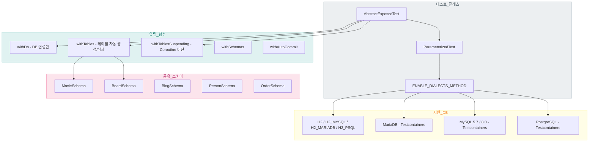
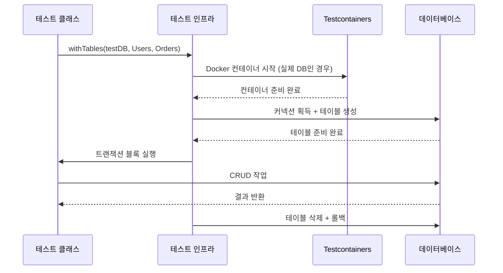

# Module bluetape4k-exposed-tests

[English](./README.md) | 한국어

## 개요

[Exposed](https://github.com/JetBrains/Exposed) 기반 모듈 테스트를 위한 공통 테스트 인프라 모듈입니다. 다양한 데이터베이스(H2, MySQL, MariaDB, PostgreSQL)에 대한 통합 테스트를 쉽게 작성할 수 있도록 도와줍니다.

## 의존성 추가

```kotlin
dependencies {
    testImplementation("io.github.bluetape4k:bluetape4k-exposed-tests:${version}")
}
```

## 주요 기능

- **공통 테스트 베이스**: `AbstractExposedTest`로 DB 테스트 기본 구조 제공
- **다중 DB 지원**: H2, MySQL, MariaDB, PostgreSQL 테스트 지원
- **Testcontainers 통합**: Docker 기반 실제 DB 테스트 지원
- **동기/비동기 테스트**: 일반 JDBC 및 Coroutine 환경 모두 지원
- **테이블/스키마 유틸**: 테스트용 엔티티/테이블 재사용

## 지원 데이터베이스

| 데이터베이스           | TestDB       | Testcontainers |
|------------------|--------------|----------------|
| H2 v2            | `H2`         | ❌              |
| H2 MySQL 모드      | `H2_MYSQL`   | ❌              |
| H2 MariaDB 모드    | `H2_MARIADB` | ❌              |
| H2 PostgreSQL 모드 | `H2_PSQL`    | ❌              |
| MariaDB          | `MARIADB`    | ✅              |
| MySQL 5.7        | `MYSQL_V5`   | ✅              |
| MySQL 8.0        | `MYSQL_V8`   | ✅              |
| PostgreSQL       | `POSTGRESQL` | ✅              |

## 사용 예시

### 기본 테스트 작성

```kotlin
import io.bluetape4k.exposed.tests.AbstractExposedTest
import io.bluetape4k.exposed.tests.TestDB
import io.bluetape4k.exposed.tests.withTables
import org.jetbrains.exposed.v1.core.Table
import org.jetbrains.exposed.v1.core.dao.id.LongIdTable
import org.junit.jupiter.params.ParameterizedTest
import org.junit.jupiter.params.provider.MethodSource

object Users: LongIdTable("users") {
    val name = varchar("name", 50)
    val email = varchar("email", 100)
}

class UserRepositoryTest: AbstractExposedTest() {

    @ParameterizedTest
    @MethodSource(ENABLE_DIALECTS_METHOD)
    fun `should insert and find user`(testDB: TestDB) {
        withTables(testDB, Users) {
            // Insert
            Users.insert {
                it[name] = "John"
                it[email] = "john@example.com"
            }

            // Query
            val user = Users.selectAll().single()

            assertEquals("John", user[Users.name])
            assertEquals("john@example.com", user[Users.email])
        }
    }
}
```

### withDb - 테이블 없이 DB 연결만 필요한 경우

```kotlin
import io.bluetape4k.exposed.tests.TestDB
import io.bluetape4k.exposed.tests.withDb

@ParameterizedTest
@MethodSource(ENABLE_DIALECTS_METHOD)
fun `should connect to database`(testDB: TestDB) {
    withDb(testDB) {
        // 트랜잭션 내에서 실행
        val isConnected = connection.isValid(5)
        assertTrue(isConnected)
    }
}
```

### withTables - 테이블 자동 생성/삭제

```kotlin
import io.bluetape4k.exposed.tests.TestDB
import io.bluetape4k.exposed.tests.withTables

@ParameterizedTest
@MethodSource(ENABLE_DIALECTS_METHOD)
fun `should create and drop tables`(testDB: TestDB) {
    withTables(testDB, Users, Orders) {
        // 테스트 시작 전 테이블 자동 생성
        // 테스트 종료 후 테이블 자동 삭제

        Users.insert { /* ... */ }
        Orders.insert { /* ... */ }

        // 테스트 로직
    }
}
```

### Coroutine 환경 (비동기 테스트)

```kotlin
import io.bluetape4k.exposed.tests.TestDB
import io.bluetape4k.exposed.tests.withTablesSuspending
import kotlinx.coroutines.Dispatchers
import org.junit.jupiter.params.ParameterizedTest
import org.junit.jupiter.params.provider.MethodSource

class AsyncRepositoryTest: AbstractExposedTest() {

    @ParameterizedTest
    @MethodSource(ENABLE_DIALECTS_METHOD)
    fun `should insert user in coroutine`(testDB: TestDB) = runBlocking {
        withTablesSuspending(testDB, Users) {
            // suspend 함수 내에서 실행
            Users.insert {
                it[name] = "John"
                it[email] = "john@example.com"
            }

            val user = Users.selectAll().single()
            assertEquals("John", user[Users.name])
        }
    }
}
```

### 특정 DB만 테스트

```kotlin
import io.bluetape4k.exposed.tests.TestDB

class PostgresOnlyTest: AbstractExposedTest() {

    // PostgreSQL만 테스트
    companion object {
        @JvmStatic
        fun databases() = TestDB.ALL_POSTGRES
    }

    @ParameterizedTest
    @MethodSource("databases")
    fun `postgres specific test`(testDB: TestDB) {
        withTables(testDB, Users) {
            // PostgreSQL 전용 테스트
        }
    }
}
```

### DB 그룹별 테스트

```kotlin
import io.bluetape4k.exposed.tests.TestDB

class MySQLLikeTest: AbstractExposedTest() {

    companion object {
        // MySQL + MariaDB + H2 MySQL 모드
        @JvmStatic
        fun databases() = TestDB.ALL_MYSQL_LIKE

        // PostgreSQL + H2 PostgreSQL 모드
        @JvmStatic
        fun postgresDatabases() = TestDB.ALL_POSTGRES_LIKE
    }

    @ParameterizedTest
    @MethodSource("databases")
    fun `mysql compatible test`(testDB: TestDB) {
        withTables(testDB, Users) {
            // MySQL 호환 DB 테스트
        }
    }
}
```

## TestDB 설정

```kotlin
import io.bluetape4k.exposed.tests.TestDBConfig

// Testcontainers 사용 여부
TestDBConfig.useTestcontainers = true  // 기본값

// 빠른 테스트를 위해 H2만 사용 (기본값: true)
TestDBConfig.useFastDB = true
```

## 테스트용 스키마/데이터

### MovieSchema (DAO 예시)

```kotlin
import io.bluetape4k.exposed.shared.entities.MovieSchema

class MovieTest: AbstractExposedTest() {

    @ParameterizedTest
    @MethodSource(ENABLE_DIALECTS_METHOD)
    fun `should query actors by movie`(testDB: TestDB) {
        withMovieAndActors(testDB) {
            // 샘플 데이터가 미리 로드됨
            val actors = ActorEntity.all()
            assertTrue(actors.isNotEmpty())
        }
    }
}
```

### 공유 테이블 스키마

| 파일                               | 설명                             |
|----------------------------------|--------------------------------|
| `shared/entities/MovieSchema.kt` | Movie, Actor, ActorInMovie 테이블 |
| `shared/entities/BoardSchema.kt` | Board 테이블                      |
| `shared/entities/BlogSchema.kt`  | Blog 테이블                       |
| `shared/mapping/PersonSchema.kt` | Person 매핑 테이블                  |
| `shared/mapping/OrderSchema.kt`  | Order 매핑 테이블                   |

## Testcontainers 구성

```kotlin
import io.bluetape4k.exposed.tests.Containers

// MariaDB 컨테이너
Containers.MariaDB

// MySQL 5.7 컨테이너
Containers.MySQL5

// MySQL 8.0 컨테이너
Containers.MySQL8

// PostgreSQL 컨테이너
Containers.Postgres
```

## 주요 기능 상세

| 파일                            | 설명                                                                                                                      |
|-------------------------------|-------------------------------------------------------------------------------------------------------------------------|
| `AbstractExposedTest.kt`      | 테스트 기본 클래스                                                                                                              |
| `TestDB.kt`                   | 지원 DB 정의 및 연결 정보                                                                                                        |
| `TestDBConfig.kt`             | 테스트 환경 설정 (useTestcontainers, useFastDB)                                                                                |
| `Containers.kt`               | Testcontainers 컨테이너 관리                                                                                                  |
| `WithDB.kt`                   | DB 연결 유틸                                                                                                                |
| `WithTables.kt`               | 테이블 생성/삭제 유틸                                                                                                            |
| `WithSchemas.kt`              | Schema 유틸                                                                                                               |
| `WithAutoCommit.kt`           | AutoCommit 모드 유틸                                                                                                        |
| `WithDBSuspending.kt`         | Coroutine DB 연결 유틸                                                                                                      |
| `WithTablesSuspending.kt`     | Coroutine 테이블 유틸                                                                                                        |
| `WithSchemasSuspending.kt`    | Coroutine Schema 유틸                                                                                                     |
| `WithAutoCommitSuspending.kt` | Coroutine AutoCommit 유틸                                                                                                 |
| `Assertions.kt`               | 테스트 어설션 유틸 (`assertTrue`, `assertFalse`, `assertEquals`, `assertNotEquals`, `assertFailAndRollback`, `expectException`) |
| `TestSupports.kt`             | 테스트 보조 유틸 (`inProperCase`, `currentDialectTest` 등)                                                                      |

## 테스트 실행 옵션

```bash
# 빠른 테스트 (H2만)
./gradlew test -DuseFastDB=true

# 전체 DB 테스트
./gradlew test

# 특정 DB만 테스트
./gradlew test -DtestDB=POSTGRESQL
```

## 테스트 인프라 구조



### 테스트 실행 흐름



## 참고 사항

- `exposed-tests` 모듈은 Detekt 검사가 비활성화되어 있습니다
- Testcontainers 사용 시 Docker가 필요합니다
- 로컬 DB 사용 시 `TestDBConfig.useTestcontainers = false`로 설정
